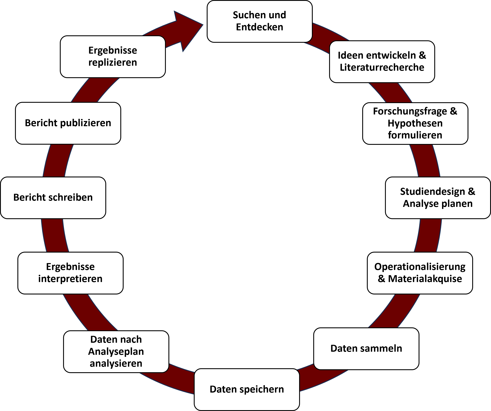
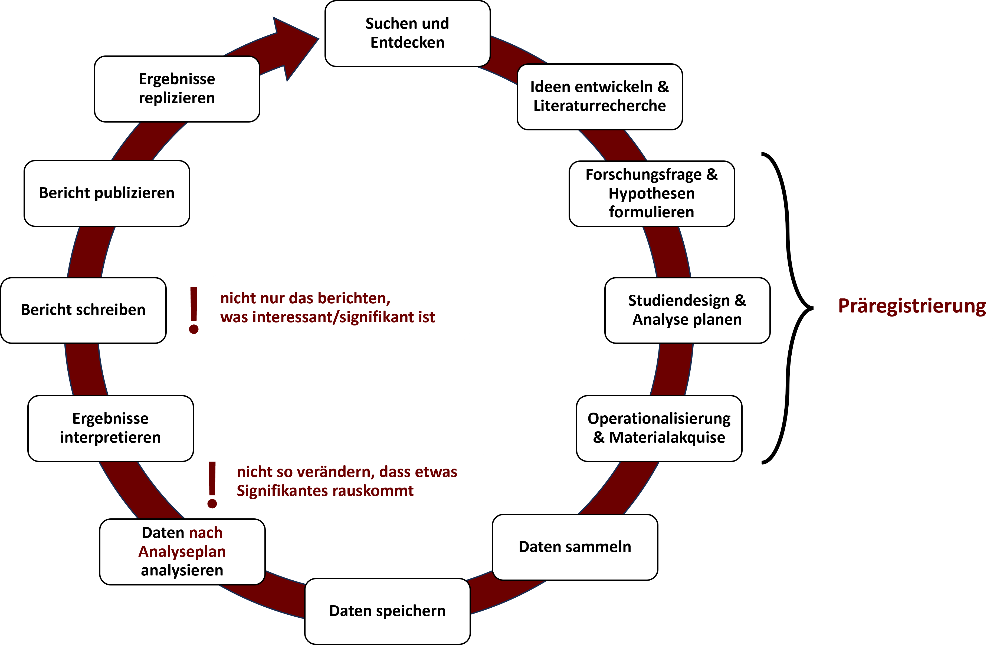
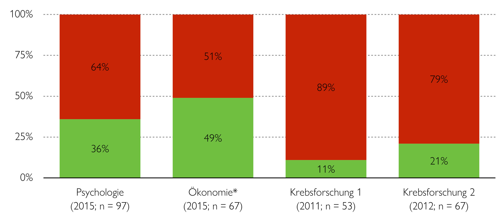
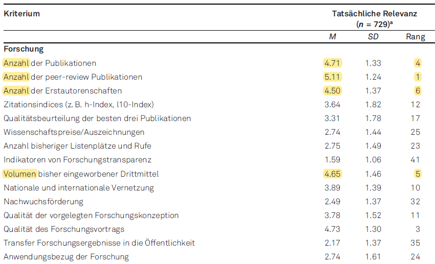
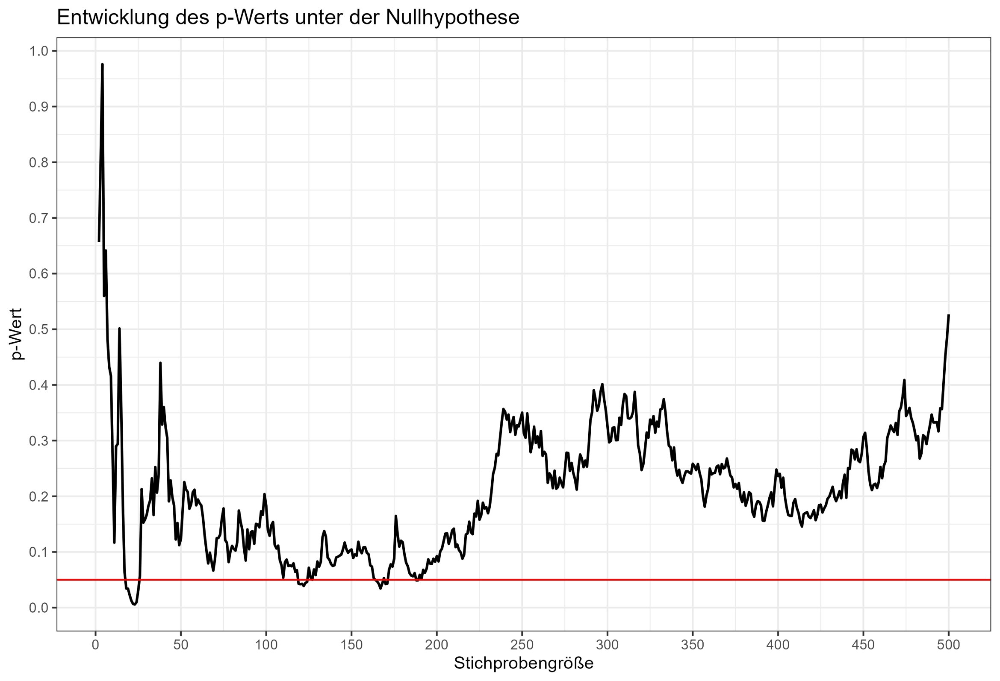
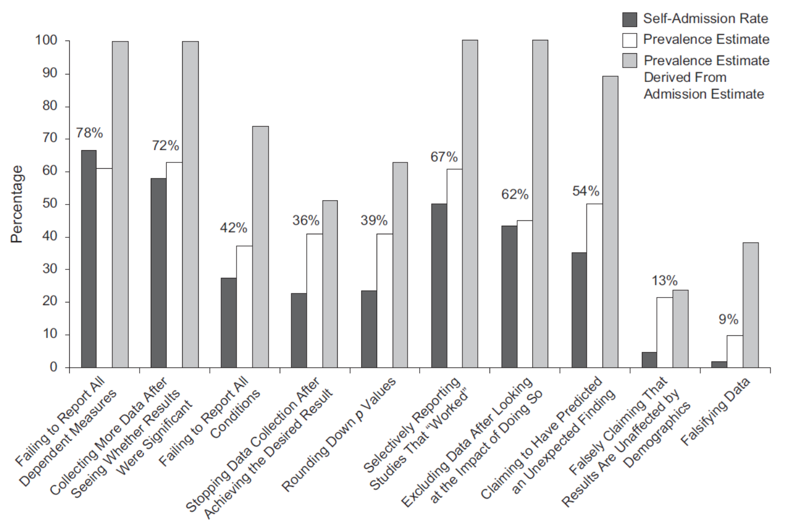
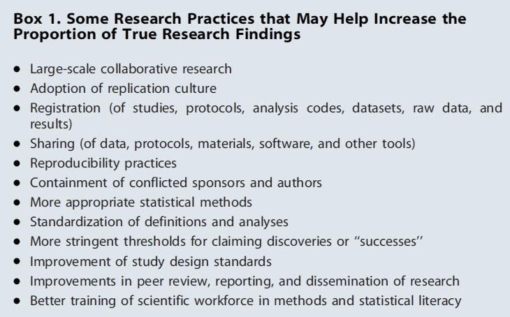
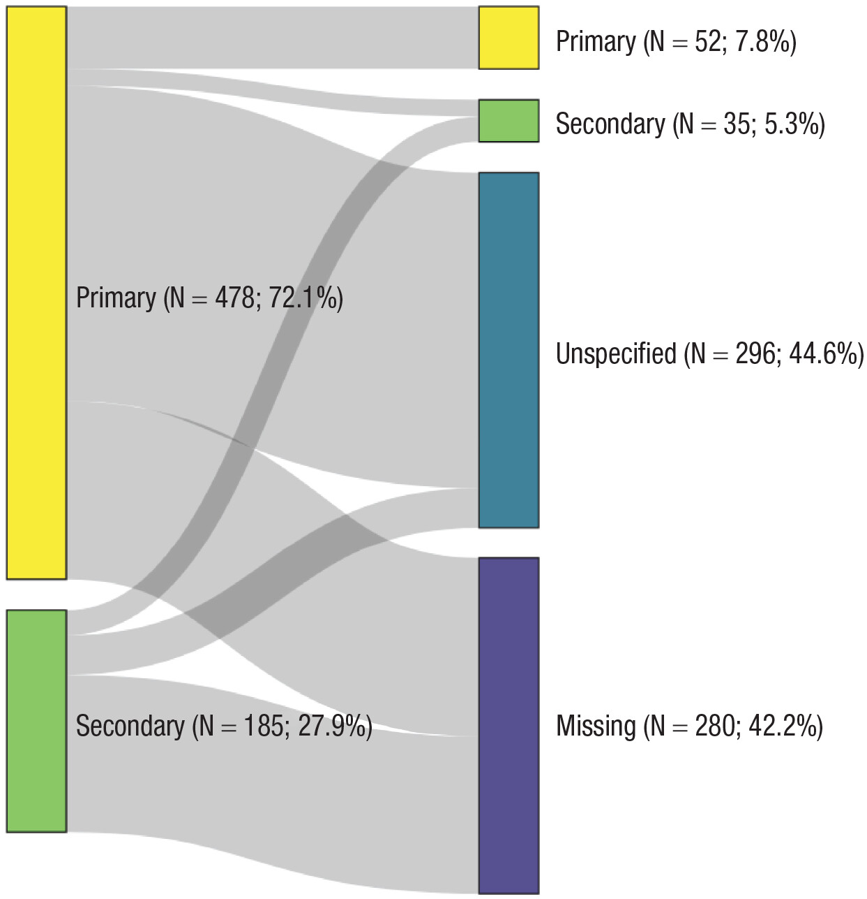

```{r setup, include=FALSE}
options(htmltools.dir.version = FALSE)


library(tidyverse)
library(kableExtra)
library(ggplot2)
library(plotly)
library(htmlwidgets)
library(MASS)
library(ggpubr)
library(xaringanthemer)
library(xaringanExtra)

style_duo_accent(
  primary_color = "#621C37",
  secondary_color = "#EE0071",
  background_image = "blank.png"
)

xaringanExtra::use_xaringan_extra(c("tile_view"))

# use_scribble(
#   pen_color = "#EE0071",
#   pen_size = 4
#   )

knitr::opts_chunk$set(
  fig.retina = TRUE,
  warning = FALSE,
  message = FALSE
)
```

name: Title slide
class: middle, left
<br><br><br><br><br><br><br>
# Wissenschaftliches Arbeiten und Forschungsmethoden

### Einheit 1: Präregistrierung im empirischen Forschungsprozess & Themensuche
##### 12.10.2023 | Dr. Caroline Zygar-Hoffmann

---
class: top, left
name: Contact Slide

### Kontakt

.pull-left[
Dr. Caroline Zygar-Hoffmann

Psychologische Methodenlehre

Infanteriestraße 11a · 80797 München ·

[caroline.zygar-hoffmann@charlotte-fresenius-uni.de](mailto:caroline.zygar-hoffmann@charlotte-fresenius-uni.de)

<br>

Zoom Sprechstunde (bitte per Email anmelden): 

Meeting-ID: 466 759 0713

Kenncode: 254897

<br>

[Publikationen](https://scholar.google.de/citations?user=qH8FVR0AAAAJ&hl=de)

[Commitment to Research Transparency](http://www.researchtransparency.org)
]

.pull-right[
.center[
<br><br><br>
.bottom[]
]
]

---
class: top, left
<div class="footer"><span>https://ichbinhanna.wordpress.com/  https://mittelbau.net/tag/ichbinreyhan/</div>

### Representation matters!

#### Was Sie über mich wissen können (wenn Sie beobachten und recherchieren):

* Promovierte Wissenschaflerin
* Arbeitet in der Psychologischen Methodenlehre
* Forscht zu Partnerschaften und Motiven mit der *Experience Sampling Methode*
* Arbeitet gleichzeitig an LMU und CFH *(d.h. auch: ich bin neu an der CFH und bedanke mich für Geduld & Feedback)*
* Verheiratet (Doppelname!)
* Relativ jung?

#### Was Sie über mich nicht wissen können (bis ich es Ihnen erzähle):

* Mutter eines 1-jährigen Sohns
* "First-Generation-Academic"
* Migrationshintergrund der Eltern

$\rightarrow$ **Wissenschaft ist für alle da. Methodenlehre ist für alle da.** Vereinbarkeit mit Familie ist *prinzipiell* möglich.<br>
$\rightarrow$ **Es ist trotzdem alles andere als einfach. Glück spielt eine große Rolle. Das Wissenschaftssystem gehört reformiert.** Vereinbarkeit könnte noch viel besser sein. #IchBinHanna #IchBinReyhan


---
class: top, left
<div class="footer"><span>Oliver Kepka, https://pixabay.com//?utm_source=link-attribution&utm_medium=referral&utm_campaign=image&utm_content=531071</div>

### Nun zu Ihnen...

.center[
**Wer von Ihnen möchte Psychotherapeut:in werden?**
]

```{r, echo=FALSE,out.width="50%",fig.show='hold',fig.align='center'}

``` 


---
class: top, left
<div class="footer"><span>Fauxels, https://www.pexels.com/photo/photo-of-pen-on-top-of-notebook-3183170/</div>

### Nun zu Ihnen...

.center[
**Wer von Ihnen könnte sich vorstellen beruflich zu forschen?**
]

```{r, echo=FALSE,out.width="60%",fig.show='hold',fig.align='center'}
knitr::include_graphics("bilder/science.jpg")
``` 

---
class: top, left
<div class="footer"><span>Brett Jordan, https://www.flickr.com/photos/x1brett/51277187884/in/photostream/</div>

### Nun zu Ihnen...

.center[
**Wer von Ihnen hat schon etwas von der Replikationskrise der Psychologie gehört?**
]

```{r, echo=FALSE,out.width="40%",fig.show='hold',fig.align='center'}
knitr::include_graphics("bilder/crisis.png")
``` 

---
class: top, left
### Übersicht Lehrveranstaltung 

**Termine**:
* 14 Termine donnerstags 11:35 - 13:05 (Raum: HS P5 105)

**Begleitendes Seminar**:
* 14 Termine Übung zur Computergestützten Datenanalyse mittwochs 10:50 - 12:20 (Raum: HS P3 109)
* Dozent: Prof. Dr. Stephan Goerigk ([stephan.goerigk@charlotte-fresenius-uni.de](mailto:stephan.goerigk@charlotte-fresenius-uni.de))

**Materialien**:
* werden auf [Studynet](https://studynet.hs-fresenius.de/ilias.php?ref_id=15268&cmd=view&cmdClass=ilobjgroupgui&cmdNode=xa:o1&baseClass=ilRepositoryGUI) bereitgestellt
* Vielen Dank an Prof. Dr. Stephan Goerigk, Prof. Dr. Mario Gollwitzer, Prof. Dr. Felix Schönbrodt, M.Sc. Nina-Alisa Maria Kollakowski et al. und das LMU Open Science Center für Bereitstellung der Grundlage für die Materialien

**Prüfungsleistung**:
* Projektbericht (Präregistrierung + empirischer Bericht) in Englisch oder Deutsch als Gruppenarbeit (max. 5 Studierende) mit gemeinsamer Note
* Umfang: 5-7 Seiten p.P.
* Anmeldezeitraum: 23.10. - 13.11.2023; Abgabe: 05.02.2024

---
class: top, left
### Ziele der Veranstaltung

#### Vermittelte Inhalte
*	Methoden und wissenschaftliche Konzepte für die Erforschung menschlichen Verhaltens und Erlebens
*	Planung und Durchführung wissenschaftlicher Studien 
*	Gütekriterien zur Bewertung von Forschungsdesigns
*	Sicherstellung guter wissenschaftlicher Praxis und Open Science
*	Datenerhebung und Datenanalyse unter Nutzung digitaler Technologien

#### Vermittelte Kompetenzen
*	Anwendung von Begriffen, Methoden und Ergebnissen der qualitativen und quantitativen Forschung in der psychologischen Grundlagen- und Anwendungsforschung
*	Beurteilung von Auswirkungen von Forschungsmethoden auf Untersuchungspopulationen und Anwendung deskriptiver und inferenzstatistischer Methoden sowie weitere statistischer Verfahren zur Auswertung von Ergebnissen
* Planung, Durchführung und Auswertung wissenschaftlicher Untersuchungen
* Einfluss von Projekterfahrungen in die Planung und Durchführung von wissenschaftlichen Studien sowie in die Auswertung und Darstellung von eigenen Forschungsergebnissen

---
class: top, left
### Konzept und Aufbau jeder Sitzung

#### Übergeordnetes Konzept

Sie sollen...
* ...Erfahrungen mit Ihrer ersten Mini-Forschungsarbeit sammeln, indem Sie von sich gegenseitig Daten erheben
* ...mit jeder Sitzung ein Schritt des Forschungsprozesses bearbeiten
* ...im Begleitseminar mit eigenen Daten arbeiten können
* ...bewusst "Learning by Doing" praktizieren - Fehler im Prozess helfen zu lernen

Ihre Note hängt am Ende nicht davon ab, wie komplex Ihre Ideen und/oder Analysen waren, oder wie viele Fehler Sie auf dem Weg gemacht haben, sondern von der transparenten und nachvollziehbaren Beschreibung Ihres Forschungsprozesses in der Präregistrierung und im empirischen Bericht, sowie der wissenschaftlichen Argumentation darin $\rightarrow$ [siehe Bewertungsschema auf studynet](https://studynet.hs-fresenius.de/goto_STUDYNETHSF_file_22288_download.html)

#### Aufbau jeder Sitzung

* **Teil 1: Hintergrundwissen, Theoretischer Input**
* **Teil 2: Praxisarbeit in Gruppen**

---
class: top, left
### Termine

```{r echo = F}
df = readxl::read_xlsx("Wissenschaftliches Arbeiten und Forschungsmethoden_Termine.xlsx", sheet = "Tabelle1")[, 1:4]
df$Datum = format(as.Date(df$Datum), "%d.%m.%Y")
df %>%
  kbl() %>%
    kable_styling(font_size = 18) %>%
  kable_classic(full_width = T, position = "left") %>%
   column_spec(column = 3, width = "12cm")
```

---
class: top, left
name: content
### Heutige Themen

#### Präregistierung im empirischen Forschungsprozess
* [Begriffsklärung und Überblick](#forschungsprozess-start)
* [Präregistrierung: Hintergrund](#prereg-hg)
* [Präregistrierung: Wirkung](#prereg-wirkung)
* [Präregistrierung: Vorgehen](#prereg-vorgehen)

#### Themensuche
* [Generelle Hinweise](#themensuche-hinweise)
* [Strategien](#themensuche-strategien)

#### [Take-Aways](#take-away)

#### [Praxis](#praxis)


---
class: top, left
### Literaturempfehlung für die heutige Sitzung

.center[
```{r, echo=FALSE,out.width="42%",fig.cap="Nelson, L. D., Simmons, J., & Simonsohn, U. (2018). Psychology's renaissance. Annual review of psychology, 69, 511-534.",fig.show='hold',fig.align='center'}
knitr::include_graphics("bilder/nelson_et_al_2018.png")
``` 
]

---
class: top, left
name: forschungsprozess-start
<div class="footer"><span>Kapitel 1.1.1 in Döring, N. & Bortz, J. (2016). Forschungsmethoden und Evaluation in den Sozial- und Humanwissenschaften. Pearson. <br> Walach, H. (2009). Psychologie: Wissenschaftstheorie, philosophische Grundlagen
und Geschichte Ein Lehrbuch (2. Auflage). Kohlhammer</span></div>

### Präregistierung im empirischen Forschungsprozess

#### Was bedeutet „empirisch“?

* empirisch (griech.) = auf Erfahrung beruhend

* **Empirische Daten** sind gezielt im Hinblick auf das Forschungsproblem ausgewählte und dokumentierte Informationen über die Erfahrungswirklichkeit (Döring & Bortz, 2016) $\rightarrow$ gewonnen aus z.B. Experiment, Beobachtung oder Befragung 

* **Empirische Forschung** sucht nach Erkenntnissen durch **systematische Sammlung, Aufbereitung und Analyse von empirischen Daten** (Döring & Bortz, 2016)

* Fokus einer empirischen Wissenschaft ist, menschliche Erfahrung zu systematisieren und **methodisch vor Irrtum zu sichern** (Walach, 2009)

* Erkenntnisgewinn entsteht durch **Hypothesenprüfung**

---
class: top, left
### Präregistierung im empirischen Forschungsprozess

#### Schritte im empirischen Forschungsprozess

```{r eval = TRUE, echo = F, out.width="53%", fig.align='center'}

```

---
class: top, left
name: forschungsprozess-prereg

### Präregistierung im empirischen Forschungsprozess

#### Präregistrierung im Forschungsprozess

```{r eval = TRUE, echo = F, out.width="70%", fig.align='center'}

```

---
class: top, left
<div class="footer"><span>https://dorsch.hogrefe.com/stichwort/praeregistrierung <br>https://osf.io/tvyxz/</span></div>

### Präregistierung im empirischen Forschungsprozess

#### Präregistrierung: Definition

<br>

.center[

"*Präregistrierung bezeichnet die* ***Darstellung des forschungsmethodischen Vorgehens*** *(Hypothesen, Forschungsdesign, Stichprobe, Ein- und Ausschlusskriterien, Untersuchungsdurchführung, Auswertungsplan, statistische Datenauswertung) bei der Durchführung und Auswertung einer* ***zukünftig erfolgenden*** *wissenschaftlichen Studie.*"

<br>

```{r eval = TRUE, echo = F, out.width="20%"}
knitr::include_graphics("bilder/preregistered_large_color.png")
```
]

---
class: top, left
name: prereg-hg
<div class="footer"><span>Bem, D. J. (2011). Feeling the future: Experimental evidence for anomalous retroactive influences on cognition and affect. Journal of Personality and Social Psychology, 100(3), 407-425. <br>Pashler, H., & Wagenmakers, E. J. (2012). Editors’ introduction to the special section on replicability in psychological science: A crisis of confidence?. Perspectives on psychological science, 7(6), 528-530.<br>Carpenter, S. (2012). Psychology's bold initiative. Science, 335, 1558-1561. doi:10.1126/science.335.6076.1558</span></div>

### Präregistierung im empirischen Forschungsprozess

#### Präregistrierung: Hintergrund

**Glaubwürdigkeitsprobleme der psychologischen Forschung aufgrund von...**
* ...Betrugsfällen in der Psychologie
* ...Nichtreplizierbarkeit des sogenannten "Psi-Phänomens" (Bem, 2011)
* ...niederschmetternden Ergebnissen von systematischen Replikationsstudien

<br>

.center[
*"Is there currently a crisis of confidence in psychological science reflecting an unprecedented level of doubt among practitioners about the reliability of research findings in the field? It would certainly appear that there is."*

Pashler & Wagenmakers (2012)

<br>

*"According to many psychologists, their field has a credibility problem at the moment, and it affects thousands of studies.*" 

Carpenter (2012)
]

---
class: top, left

### Präregistierung im empirischen Forschungsprozess

#### Präregistrierung: Hintergrund

##### Betrugsfälle in der Psychologie

* **Diederik Stapel** (Tilburg, 2011): Massive Datenfälschung (Fabrikation von Daten), mindestens 55 Publikationen betroffen
* **Dirk Smeesters** (Rotterdam, 2012): "Datenmassage", d.h. Fälle wurden aus der Analyse entfernt, wenn dieser Ausschluss zu einer Erhöhung der statistischen Effekte führte
* **Lawrence Sanna** (Ann Arbor, Michigan, 2012): Zurückziehung von 8 Zeitschriftenartikeln mit dem Hinweis, die Daten seien "invalide"

.pull-left[
```{r, echo=FALSE,out.width="45%",fig.show='hold',fig.align='center'}
knitr::include_graphics(c("bilder/stapel.png"))
``` 
]

.pull-right[
```{r, echo=FALSE,out.width="25%",fig.show='hold'}
knitr::include_graphics(c("bilder/smeesters.jpg", "bilder/sanna.jpg"))
``` 
]
---
class: top, left
<div class="footer"><span>Bem, D. J. (2011). Feeling the future: Experimental evidence for anomalous retroactive influences on cognition and affect. Journal of Personality and Social Psychology, 100(3), 407-425. <br>Wagenmakers, E.-J., Wetzels, R., Borsboom, D., & van der Maas, H. L. J. (2011). Why psychologists must change the way they analyze their data: The case of psi: Comment on Bem (2011). Journal of Personality and Social Psychology, 100, 426-432. <br> Galak, J., LeBoeuf, R. A., Nelson, L. D. & Simmons, J. P. (2012). Correcting the past: Failures to replicate psi. Journal of Personality and Social Psychology, 103, 933-948. <br>Ritchie, S. J., Wiseman, R. & French, C. C. (2012). Failing the future: Three unsuccessful attempts to replicate Bem's ‘Retroactive Facilitation of Recall’ effect. PLoS ONE 7(3), e33423.</span></div>

### Präregistierung im empirischen Forschungsprozess

#### Präregistrierung: Hintergrund

##### Nichtreplizierbarkeit des sogenannten "Psi-Phänomens" (Bem, 2011)

.pull-left[
9 publizierte Experimente, die angeblich "psi" nachweisen (Ereignisse in der Zukunft beeinflussen Verhalten in der Gegenwart) führten zu
* Unmut
* Zweifel an der Fehlerfreiheit von statistischen Methoden
* Infragestellung der Reliabilität der Psychologie
]

.pull-right[
```{r, echo=FALSE, out.width="40%",fig.show='hold',fig.align='center'}
knitr::include_graphics(c("bilder/bem.png"))
``` 
]

**Reaktionen**:

* Andere Ergebnisse bei alternativer Methode der Hypothesentestung (Wagenmakers et al., 2011)
* Gescheiterte Replikationsversuche (Galak et al., 2012; Ritchie et al., 2012)


---
class: top, left
<div class="footer"><span>Open Science Collaboration. (2015). Estimating the reproducibility of psychological science. Science, 349(6251), aac4716. <br>Carney, D. R., Cuddy, A. J., & Yap, A. J. (2010). Power posing: Brief nonverbal displays affect neuroendocrine levels and risk tolerance. Psychological science, 21(10), 1363-1368. <br> Baumeister, R. F., Bratslavsky, E., Muraven, M., & Tice, D. M. (1998). Ego depletion: Is the active self a limited resource?. Journal of personality and social psychology, 74(5), 1252-1265. <br> Strack, F., Martin, L. L., & Stepper, S. (1988). Inhibiting and facilitating conditions of the human smile: a nonobtrusive test of the facial feedback hypothesis. Journal of personality and social psychology, 54(5), 768-777.</span></div>

### Präregistierung im empirischen Forschungsprozess

#### Präregistrierung: Hintergrund

##### Niederschmetterndes Replikationsprojekt: Reproducibility Project: Psychology (Open Science Collaboration, 2015)

* Weltweit 97 Replikationsstudien unter Beteiligung von 270 Forscher:innen
* nur 36% aller Effekte signifikant (in den Originalpublikationen 97%)
* 83% aller Effektstärken kleiner als die original Effektstärken

.pull-left[
* Viele bekannte Effekte nicht replizierbar:
  * EgoDepletion (Baumeister et al., 1998)
  * FacialFeedback (Strack et al., 1988)
  * PowerPosing (Carney et al., 2010)
]

.pull-right[

```{r, echo=FALSE,out.width="30%",fig.show='hold'}
knitr::include_graphics(c("bilder/egodepletion.png", "bilder/facialfeedback.png"))
``` 
]

.pull-left[
* Weitere Replikationsprojekte mit gemischten Ergebnissen, wie "ManyLabs", "ManyBabies", ... 
]

.pull-right[
```{r, echo=FALSE,out.width="20%",fig.show='hold',fig.align='right'}
knitr::include_graphics(c("bilder/powerposing.png"))
``` 
]

---
class: top, left
<div class="footer"><span>Open Science Collaboration. (2015). Estimating the reproducibility of psychological science. Science, 349(6251), aac4716.</span></div>

### Präregistierung im empirischen Forschungsprozess

#### Präregistrierung: Hintergrund

##### Niederschmetterndes Replikationsprojekt: Reproducibility Project: Psychology (Open Science Collaboration, 2015)

.center[
**Vergleich der p-Werte**

```{r eval = TRUE, echo = F, out.width="41%"}
knitr::include_graphics("bilder/replicationproject-pvalues.jpg")
```
]

---
class: top, left
<div class="footer"><span>Open Science Collaboration. (2015). Estimating the reproducibility of psychological science. Science, 349(6251), aac4716.</span></div>

### Präregistierung im empirischen Forschungsprozess

#### Präregistrierung: Hintergrund

##### Niederschmetterndes Replikationsprojekt: Reproducibility Project: Psychology (Open Science Collaboration, 2015)

.center[
**Vergleich der Effektstärken**

```{r eval = TRUE, echo = F, out.width="43%"}
knitr::include_graphics("bilder/replicationproject-effects.jpg")
```
]

---
class: top, left
<div class="footer"><span>Open Science Collaboration. (2015). Estimating the reproducibility of psychological science. Science, 349(6251), aac4716. <br>Chang, A. C., & Li, P. (2015). Is economics research replicable? Sixty published papers from thirteen journals say'usually not'. Finance and Economics Discussion Series 2015-083. Washington: Board of Governors of the Federal Reserve System. <br>Begley, C. G., & Ellis, L. M. (2012). Drug development: Raise standards for preclinical cancer research. Nature, 483(7391), 531-533. <br>Prinz, F., Schlange, T., & Asadullah, K. (2011). Believe it or not: how much can we rely on published data on potential drug targets?. Nature reviews Drug discovery, 10(9), 712-712 <br> Baker, M. (2016). 1,500 scientists lift the lid on reproducibility. Nature, 533(7604), 452-454.</span></div>

### Präregistierung im empirischen Forschungsprozess

#### Präregistrierung: Hintergrund

Nur die Psychologie? Nein:

.pull-left[
*Welcher Teil der publizierten Forschungsergebnisse kann in verschiedenen Disziplinen repliziert werden?*

```{r eval = TRUE, echo = F, fig.align='center'}

```

<font size="1">*Ökonomie: reine Reproduktion, d.h. Versuch anhand der selben Daten zum selben Ergebnis zu kommen.</font>
]

.pull-right[
```{r eval = TRUE, echo = F, out.width="80%", fig.align='center'}
knitr::include_graphics("bilder/baker2016.png")
```
]

---
class: top, left

### Präregistierung im empirischen Forschungsprozess

#### Präregistrierung: Hintergrund

.pull-left[
**Ursachen von Nicht-Replizierbarkeit im Speziellen**
* **False-Positives** (α-Fehler) in den Originalstudien 

$\rightarrow$ der Effekt existiert wirklich nicht

* **False-Negatives** (β-Fehler) in den Replikationsstudien 

$\rightarrow$ der Effekt existiert, es liegt an der Methodik der Replikation, dass er nicht gefunden wurde

* **"Hidden-Moderators"** 

$\rightarrow$ der Effekt existiert, aber die Bedingungen, unter denen er in der Originalstudie gefunden wurde, unterscheiden sich von den Bedingungen in der Replikationsstudie 
]

.pull-right[
```{r eval = TRUE, echo = F, out.width="80%", fig.cap="Beispiel für ein falsch-positives Ergebnis", fig.align='center'}
knitr::include_graphics("bilder/falsepositive.PNG")
```
]

---
class: top, left

### Präregistierung im empirischen Forschungsprozess

#### Präregistrierung: Hintergrund

**Ursachen von diesen Problemen im Generellen**
* Das System an sich
* Die Wissenschaftler
* Journals

$\rightarrow$ Anreize für "False-Positives"

$\rightarrow$ keine Anreize für Replikationen

<br>

.center[
"*Much of the scientific literature, perhaps half, may simple be untrue. <br>Part of the problem is that no one is incentivised to be* ***right.***"

Horton, Editor von "The Lancet"
]

---
class: top, left
<div class="footer"><span>Ioannidis, J. P. A. (2014). How to Make More Published Research True. PLoS Med 11(10): e1001747.doi:10.1371/journal.pmed.1001747 <br> </span></div>

### Präregistierung im empirischen Forschungsprozess

#### Präregistrierung: Hintergrund

##### Ursache "Das System an sich"

* Enorme Konkurrenz zwischen Wissenschaftlern: Um in der Wissenschaft erfolgreich zu sein, muss viel publiziert werden ("**publish or perish**")

* Keine Anreize für Replikationen, denn Replikationsstudien...
    * ...werden oft nicht beachtet
    * ...werden oft nicht publiziert
    * ...bekommen oft negative Reaktionen von Originalautoren
    * ...haben oft keinen Wert für die Karriere

<br>

.center[
*"The current system does not reward replication - it often even penalizes people who want to rigorously replicate previous work, and it pushes investigators to claim that their work is highly novel and significant."*

Ionnidis (2014)
]

---
class: top, left
<div class="footer"><span>Abele-Brehm, A. E., & Bühner, M. (2016). Wer soll die Professur bekommen?. Psychologische Rundschau.<br>https://en.wikipedia.org/wiki/Diederik_Stapel</span></div>

### Präregistierung im empirischen Forschungsprozess

#### Präregistrierung: Hintergrund

##### Ursache "Wissenschaftler"

.pull-left[
Wissenschaftler:innen sind keine Roboter, auch sie haben menschliche Bedürfnisse
* Sicherer Job
* Bekanntheit
* Förderung
* Wirkung auf die Gesellschaft
$\rightarrow$ All dies erfordert viele Publikationen

*"I failed as a scientist, … I did not withstand the pressure to score, to publish, the pressure to get better in time. I wanted too much, too fast. In a system where there are few checks and balances, where people work alone, I took the wrong turn."* - Stapel (2014)
]

.pull-right[
```{r eval = TRUE, echo = F, fig.align='center', fig.cap="Abele-Brehm & Bühner (2016)"}

```
]

---
class: top, left

### Präregistierung im empirischen Forschungsprozess

#### Präregistrierung: Hintergrund

##### Ursache "Journals"

Viele Journals...
* ...akzeptierten (bisher) Replikationsstudien nicht
* ...publizieren nur neue und interessante Effekte
* ...publizieren nur positive Ergebnisse

**File-Drawer Problem** führt zu **Publication Bias**: Nur positive Ergebnisse werden publiziert, während alle negativen Ergebnisse in der Schublade des Wissenschaftlers bleiben

##### Fazit

* Es herrscht ein enormer Druck für Publikationen
* Wissenschaftler müssen viel und schnell publizieren, um überhaupt "überleben" zu können 

$\rightarrow$ das führt meistens zu falsch-positiven Ergebnissen<br>
$\rightarrow$ Meta-Analysen to the rescue? Nein: "Garbage in" -> "Garbage out"

---
class: top, left
name: prereg-wirkung
<div class="footer"><span>Simmons, J. P., Nelson, L. D., & Simonsohn, U. (2011). False-positive psychology: Undisclosed flexibility in data collection and analysis allows presenting anything as significant. Psychological science, 22(11), 1359-1366. <br>Leslie, J., Loewenstein, G., & Prelec, D. (2012). Measuring the Prevalence of Questionable Research Practices With Incentives for Truth Telling. Assossiation for Psychological Science, 23(5), 524-532. <br>Gelman, A., & Loken, E. (2013). The garden of forking paths: Why multiple comparisons can be a problem, even when there is no “fishing expedition” or “p-hacking” and the research hypothesis was posited ahead of time. Department of Statistics, Columbia University, 348, 1-17. <br>https://xkcd.com/1478/</span></div>

### Präregistierung im empirischen Forschungsprozess

#### Präregistrierung: Wirkung

**Einschränkung der Freiheitsgrade der Wissenschaftler ("Researcher degrees of freedom")**

.pull-left[
Simmons, Nelson & Simonsohn (2011): <br>
Forscherinnen und Forscher haben zu viele Möglichkeiten, ihre Daten so zu analysieren, dass sie hinterher ein interpretierbares (und publizierbares) Ergebnis finden

*"Cases of clear scientific misconduct have received significant media attention recently, but less flagrantly questionable research practices may be more prevalent and, ultimately, more damaging to the academic enterprise."* 

Leslie et al. (2012)
]

.pull-right[
```{r eval = TRUE, echo = F, fig.cap="'The garden of forking paths'", fig.align='center'}
knitr::include_graphics("bilder/forkingpaths.PNG")
```
]

---
class: top, left
<div class="footer"><span>Leslie, J., Loewenstein, G., & Prelec, D. (2012). Measuring the Prevalence of Questionable Research Practices With Incentives for Truth Telling. Assossiation for Psychological Science, 23(5), 524-532.</span></div>


### Präregistierung im empirischen Forschungsprozess

#### Präregistrierung: Wirkung

**Verhinderung von sogenannten Questionable-Research-Practices (QRP)**

.pull-left[

<br>
*"QRPs are the steroids of scientific competition, artificially enhancing performance and producing a kind of race in which researchers who strictly play by the rules are at a competitive disadvantage."*

Leslie et al. (2012)
]

.pull-right[
```{r eval = TRUE, echo = F, fig.align='center'}
knitr::include_graphics("bilder/QRPs.PNG")
```
]

---
class: top, left

### Präregistierung im empirischen Forschungsprozess

#### Präregistrierung: Wirkung

**Verhinderung von sogenannten Questionable-Research-Practices (QRP)**

Zu QRPs gehören:
* ***Selective reporting***:
  * Nur ein Teil des Versuchsplans berichten
  * Nur ein Teil der Analysen berichten, z.B. negative (hypothesenkonträre) Ergebnisse ignorieren 
* ***p-hacking***: 
  * jegliche Art von Statistik versuchen, bis p < 0.5
  * Extremwerte selektiv weglassen
  * Subgruppenanalysen
* ***Outcome switching***: 
  * Man erhebt so viele Outcomes wie möglich und berichtet nur diejenigen, die signifikant sind
* ***Optional stopping***: 
  * Daten solange erheben, bis der Effekt signifikant wird\*

<br>
<font size="1">* Es gibt zwar sequentielle Methoden, die das erlauben; mit dem typischerweise angewendeten Nullhypothesentesten mit p-Werten ist ein optionales Erhöhen oder frühzeitiges Abbrechen der Datenerhebung aber nicht erlaubt.</font>

---
class: top, left

### Präregistierung im empirischen Forschungsprozess

```{r eval = TRUE, echo = F, fig.align='center', out.width="70%"}

```

---
class: top, left
<div class="footer"><span>Kerr, N. (1988). HARKing: Hypothesizing after the results are known. Personality and Social Psychology Review, 2, 196–217.</span></div>

### Präregistierung im empirischen Forschungsprozess

#### Präregistrierung: Wirkung

**Verhinderung von sogenannten Questionable-Research-Practices (QRP)**

.pull-left[
Zu QRPs gehört auch HARKing:
* Kerr (1988): HARKing = "Hypothesizing After the Results are Known": Eine post-hoc Hypothese so darstellen, als wäre es eine a-priori Hypothese gewesen
* Dieses Vorgehen ist mit dem deduktiv-nomologischem Modell (aka "Hempel Oppenheim Schema") unvereinbar
* Es bringt viele Probleme mit sich, insbesondere werden "falsch-positive" Forschungsergebnisse als substanzielle Befunde missverstanden
]

.pull-right[
```{r eval = TRUE, echo = F, out.width="80%", fig.align='center'}
knitr::include_graphics("bilder/hark.png")
```
]

$\rightarrow$ Durch Präregistrierung werden **konfirmatorische** von **explorativen** Analysen klar getrennt.

---
class: top, left
<div class="footer"><span>John, L. K., Loewenstein, G., & Prelec, D. (2012). Measuring the prevalence of questionable research practices with incentives for truth telling. Psychological science, 23(5), 524-532.</span></div>

### Präregistierung im empirischen Forschungsprozess

```{r eval = TRUE, echo = F, fig.align='center', out.width="70%"}

```

---
class: top, left
<div class="footer"><span>Ioannidis, J. P. A. (2014). How to Make More Published Research True. PLoS Med 11(10): e1001747.doi:10.1371/journal.pmed.1001747 <br> Simmons, J., Nelson, L., & Simonsohn, U. (2011). False-Positive Psychology: Undisclosed Flexibility in Data Collection and Analysis Allows Presenting Anything as Significant. Association for Psychological Science, 21,1359-1366. doi:10.1177/0956797611417632</span></div>

### Präregistierung im empirischen Forschungsprozess

#### Präregistrierung: Wirkung

**Im Idealfall sorgt eine Präregistrierung dafür, dass unabhängig von den Ergebnissen die Studie publiziert wird**:
* Anreiz für Replikationsversuche
* Lösung des "File Drawer" Problems

.pull-left[
**Präregistrierung ist nur eine von vielen Lösungen:**
* Höhere statistische Power
* Offene Daten
* Offene Materialien
* Registered Reports
* Multiverse Analysen
* Evaluierungskriterien und Anreize verändern
* ...
]

.pull-right[
```{r eval = TRUE, echo = F, out.width="80%", fig.align='center'}

```
]

---
class: top, left
<div class="footer"><span>Kaplan, R. M., & Irvin, V. L. (2015). Likelihood of null effects of large NHLBI clinical trials has increased over time. PloS one, 10(8), e0132382.</span></div>

### Präregistierung im empirischen Forschungsprozess

#### Präregistrierung: Wirkung

.pull-left[
<br>
<br>
<br>
<br>
Nach Einführung einer "Präregistrierungspflicht" in den USA (2000) für pharmakologische und Nahrungsergänzungsmittel-Interventionen bei Herz-Kreislauf-Erkrankungen gibt es mehr "Null-Befunde" als vorher
]

.pull-right[
```{r eval = TRUE, echo = F, fig.align='center', out.width="85%"}
knitr::include_graphics("bilder/kaplanirvin.png")
```
]

---
class: top, left
<div class="footer"><span>Herrmann, S. (2018) Süddeutsche Zeitung, 01./02.12.2018, S.35.</span></div>

### Präregistierung im empirischen Forschungsprozess

#### Präregistrierung: Wirkung

.pull-left[
```{r eval = TRUE, echo = F, fig.align='center'}

```
]

.pull-right[
<br>
"***Es tut sich etwas in der Psychologie,*** *etwas, für das sich auch andere Disziplinen mittlerweile interessieren. Beim Jahreskongress der Deutschen Gesellschaft für Psychologie in Leipzig im Herbst 2016 gelang es Brian Nosek in einem Vortrag jedenfalls, eine Stimmung im Saal zu erzeugen, als sei man gerade Zeuge der Geburt der wahren Wissenschaft geworden.*
]

*Ob dieser Eindruck zutrifft? Sicherlich ist das überzogen, denn Wissenschaft ist ein sehr langsamer, zäher Prozess. Aber das Label von der Krise ist ebenso übertrieben. Die Inventur der Psychologie mag frustrierend viele schmerzhafte Ergebnisse liefern und alte Weissheiten in Frage stellen.* ***Aber sie ist absolut unumgänglich und wertvoll.***

*Leif Nelson kommentiert den Begriff der Replikationskrise im Aufsatz über die* ***Wiedergeburt des Psychologie*** *auf diese Weise: 'Den Regen nach einer langen Dürre würden wir ja auch nicht als Wasserkrise bezeichnen.'* "

.center[
Herrmann (2018)
]

---
class: top, left
name: prereg-vorgehen
<div class="footer"><span>Van't Veer, A. E., & Giner-Sorolla, R. (2016). Pre-registration in social psychology—A discussion and suggested template. Journal of experimental social psychology, 67, 2-12.</span></div>

### Präregistierung im empirischen Forschungsprozess

#### Präregistrierung: Vorgehen

.pull-left[

**Elemente einer Präregistrierung**:

* Hypothesen
* Methoden/Material
* Stichprobe & Ausschlusskriterien
* Analyseplan
* Sonstiges

]

.pull-right[
```{r eval = TRUE, echo = F, fig.align='center', out.width="65%"}
knitr::include_graphics("bilder/prereg-reasons.jpg")
```
]

---
class: top, left
<div class="footer"><span>Van't Veer, A. E., & Giner-Sorolla, R. (2016). Pre-registration in social psychology—A discussion and suggested template. Journal of experimental social psychology, 67, 2-12.</span></div>

### Präregistierung im empirischen Forschungsprozess

#### Präregistrierung: Vorgehen

##### Elemente: Hypothesen

.pull-left[
**Essentiell**:

* Erwartete Beziehung zwischen den Variablen

* Bei Interaktionseffekten: erwartete Form der Interaktion 

* Bei Manipulationen: Vorhersagen für erfolgreiche Manipulationschecks bzw. Rechtfertigung von Verzicht auf Manipulationschecks
]

.pull-right[
**Ergänzend**:

* Bei Originalstudien: Erläuterung der Rationale/des theoretischen Hintergrunds der Hypothesen

* Abbildungen/Tabellen zur Erläuterung komplexer Interaktionen

* Bei multiplen Vorhersagen für Variablen-Kombinationen: Beschreibung welches Outcome von welcher Theorie vorhergesagt wird
]

---
class: top, left
<div class="footer"><span>Van't Veer, A. E., & Giner-Sorolla, R. (2016). Pre-registration in social psychology—A discussion and suggested template. Journal of experimental social psychology, 67, 2-12.</span></div>

### Präregistierung im empirischen Forschungsprozess

#### Präregistrierung: Vorgehen

##### Elemente: Methoden/Material

.pull-left[
**Essentiell**:

Für alle Hypothesen: Beschreibung der Variablen
* Operationalisierung

* Antwortskala, Antwortausprägungen

* Messebene (within-subjects vs. between-subjects)

* Bezug zur Hypothese: Unabhängige Variable, Abhängige Variable, Drittvariable (Kovariate), Moderator/Mediator?
]

.pull-right[
**Ergänzend**:

* Studiendesign (z.B. experimentelle Bedingungen)

]


---
class: top, left
<div class="footer"><span>Van't Veer, A. E., & Giner-Sorolla, R. (2016). Pre-registration in social psychology—A discussion and suggested template. Journal of experimental social psychology, 67, 2-12.</span></div>

### Präregistierung im empirischen Forschungsprozess

#### Präregistrierung: Vorgehen

##### Elemente: Stichprobe & Ausschlusskriterien

.pull-left[
**Essentiell**:

* Falls zutreffend: Beschreibung der Regeln zur Vorauswahl von Teilnehmer:innen

* Beschreibung der Datenerhebung (Wo? Von wem? Wie?)

* Rechtfertigung der geplanten Stichprobengröße

* Beschreibung der Regel zur Beendigung der Datenerhebung

]

.pull-right[
**Ergänzend**:

* Wenn-dann-Regeln zum Umgang mit zu kleiner Stichprobe nach Ausschluss, ungeplanten Ausschlusskriterien,...

* Maßnahmen zur Kontrolle von Störvariablen (Verblindung, Matching,...)

* Zuordnung zu Versuchsbedingungen

]

* Beschreibung der antizipierten Ausschlusskriterien für Daten (z.B. Missings, fehlerhafte / unglaubwürdige Antworten, Ausreißer)

---
class: top, left
<div class="footer"><span>Van't Veer, A. E., & Giner-Sorolla, R. (2016). Pre-registration in social psychology—A discussion and suggested template. Journal of experimental social psychology, 67, 2-12.</span></div>

### Präregistierung im empirischen Forschungsprozess

#### Präregistrierung: Vorgehen

##### Elemente: Analyseplan

.pull-left[
**Essentiell**:

Für jede Hypothese (konfirmatorisch):

* Statistisches Verfahren

* Relevante Variablen, deren Berechnung und Rolle in dem Verfahren (Unabhängige Variable, Abhängige Variable, Drittvariable (Kovariate), Moderator/Mediator?)

* Falls zutreffend: Rationale jeder Kovariate
]

.pull-right[
**Ergänzend**:

* Korrekturmethoden bei multiplen Tests
  
* Umgang mit fehlenden Werten (z.B. paarweiser oder listenweiser Ausschluss)

* Reliabilitätskriterien für Aufnahme eines Items in Skala

* Pläne für alternative Analysen, z.B. wenn Modellannahmen abgelehnt werden
]

* statistischer Ansatz  (z.B. Frequentistische oder bayesianische Statistik, Priors,...)

* Kriterien für aussagekräftige Schlussfolgerung / Inferenz (Alpha-Niveau, Höhe vom Bayes Factor,...)

---
class: top, left
<div class="footer"><span>Lin, W., & Green, D. P. (2016). Standard Operating Procedures: A Safety Net for Pre-Analysis Plans. PS: Political Science & Politics, 49(03), 495–500. http://doi.org/10.1017/S1049096516000810.</span></div>

### Präregistierung im empirischen Forschungsprozess

#### Präregistrierung: Vorgehen

##### Elemente: Sonstiges

* Zusammenfassung / Überblick über die Präregistrierung

* Auch wenn man nur explorative Analysen vor hat: "Wir haben keine spezifischen a-priori-Hypothesen" $\rightarrow$  verhindert HARKing

* Transparenz Statement: Wann, wo und welche Forschungsergebnisse werden veröffentlicht? (z.B. Open Data)

* Wenn-Dann-Fälle / Standard-Operating-Procedures

* Hintergrundinformationen (z.B. Ethikantrag, Pilotdaten,...)

---
class: top, left
<div class="footer"><span>Preregistration Task Force. (2020). Preregistration Standards for Psychology - the Psychological Research Preregistration-Quantitative (aka PRP-QUANT) Template. ZPID (Leibniz Institute for Psychology). http://dx.doi.org/10.23668/psycharchives.4584</span></div>

### Präregistierung im empirischen Forschungsprozess

#### Präregistrierung: Vorgehen

Notwendige Schritte:

**1. Ausfüllen eines Templates**

z.B. https://docs.google.com/document/d/1Rl6SxKvtOF_uIjltAMNaPQBkIepq87_SUSZqJ7EQFJc/edit#heading=h.mhhl15yqt3h4

<br>

**2. "Einfrieren" der Präregistrierung**

zu einem Zeitpunkt vor der Datenerhebung auf einer öffentlichen Plattform, z.B. https://osf.io oder https://pasa.psycharchives.org/


---
class: top, left
<div class="footer"><span>Preregistration Task Force. (2020). Preregistration Standards for Psychology - the Psychological Research Preregistration-Quantitative (aka PRP-QUANT) Template. ZPID (Leibniz Institute for Psychology). http://dx.doi.org/10.23668/psycharchives.4584</span></div>

### Präregistierung im empirischen Forschungsprozess

#### Präregistrierung: FAQs

* **Darf ich trotzdem explorieren?** Unbedingt!

* **Kostet das nicht zu viel Zeit?** Es ist Zeit, die man später spart!

* **Macht dann nicht jemand meine Studie?** Präregistrierung ist persönlich, d.h. zuordnbar zu einer Person.

* **Was ist, wenn ich Unsinn präregistriere?** Dann kann nachträglich erklärt werden, warum es Unsinn war. Außerdem machen wir alle Fehler, und andere können auf Fehler hinweisen.

* **Könnte ich nicht einfach ganz viele parallele Präregistrierungen anlegen, und die "rausziehen", die passt?** Theoretisch, ja. Betrug ist immer möglich.

* **Passt das auch für qualitative Forschung?** Ja! Auch dort hat man Freiheitsgrade, es geht darum, diese zu identifizieren und zu reduzieren.

* **Wenn man auch von der Präregistrierung abweichen kann, was bringt sie dann?** Sie macht post-hoc Abweichungen transparent und lenkt die Aufmerksamkeit auf die inhaltliche Sinnhaftigkeit von alternativen Entscheidungen.

---
class: top, left
<div class="footer"><span>van den Akker, O. R., van Assen, M. A., Enting, M., de Jonge, M., Ong, H. H., Rüffer, F., ... & Bakker, M. (2023). Selective hypothesis reporting in psychology: comparing preregistrations and corresponding publications. Advances in Methods and Practices in Psychological Science, 6(3), 25152459231187988.</span></div>

### Präregistierung im empirischen Forschungsprozess

#### Präregistrierung: Abweichungen bei den Hypothesen

.center[
```{r eval = TRUE, echo = F, out.width = "40%"}

```
]


---
class: top, left
name: themensuche-hinweise
<div class="footer"><span>Kapitel 2.1 in Bortz, J. & Döring, N. (2006). Forschungsmethoden und Evaluation in den Sozial- und Humanwissenschaften (4.Auflage). Pearson. </span></div>

### Themensuche

#### Was beachten bei der Themensuche?

* **Kernkriterium für Qualität einer empirischen Untersuchung**: Muss den Bestand an gesichertem Wissen im jeweiligen Untersuchungsbereich **erweitern**.

* **Schwierigkeiten für Wissenschaftler:innen und Student:innen**: explosionsartige Entwicklung der Anzahl wissenschaftlicher Publikationen

**Zu klärende Fragen:**

* Interessant erscheinende Untersuchungsidee tatsächlich **originell**? 

* Ist das gleiche Thema nicht schon bearbeitet worden (**Wiederholung**)? 

* Verspricht Idee tatsächlich **neue Erkenntnisse** oder sind diese eigentlich trivial?

---
class: top, left
<div class="footer"><span>Kapitel 2.1 in Bortz, J. & Döring, N. (2006). Forschungsmethoden und Evaluation in den Sozial- und Humanwissenschaften (4.Auflage). Pearson. </span></div>

### Themensuche

#### Hürden bei Themenwahl durch die Art der Vermittlung von Forschungsmethoden (McGuire, 1967)

Großteil des Unterrichts in der Ausbildung in den Sozialwissenschaften: 

* Vermittlung präziser **Techniken** zur Prüfung von Hypothesen (**hypothesenprüfender Teil**)

* Augenmerk auf das "wie" $\rightarrow$ Operationalisierung, Auswertung und Interpretation

* wenig Zeit verfällt auf Strategien, **schöpferische Forschungsideen** zu finden (**hypothesenkreierender Teil**)

**Problem:** perfektes Instrumentarium letztlich zur Überprüfung von Banalitäten

---
class: top, left
<div class="footer"><span>Kapitel 2.1 in Bortz, J. & Döring, N. (2006). Forschungsmethoden und Evaluation in den Sozial- und Humanwissenschaften (4.Auflage). Pearson. </span></div>

### Themensuche

#### Motivationale Aspekte bei der Themenwahl

.center[
*"Die Geschichte der Wissenschaften ist voller Belege dafür, wie Wissenschaftler durch bestechende Argumente und phantasiereiche Interpretationen ihre Vorurteile zu bestätigen trachten."*

Shields (1975)
]

$\rightarrow$ Forderung nach einer **wertfreien**, von **neutralen** Personen getragenen Wissenschaft

**ABER:** Vorteile der Themenwahl nach eigenem Interesse/Einstellungen

* Höheres Engagement (empirische Arbeiten sind meistens zeitaufwendig und arbeitsintensiv)

* frühzeitiger Abbruch der Arbeit kann verhindert werden 

$\rightarrow$ Kreative und bahnbrechende Forschung besser möglich, wenn Forschende das Recht haben, sich engagiert für den empirischen Beleg ihrer Ideen einzusetzen

---
class: top, left
name: themensuche-strategien
<div class="footer"><span>Kapitel 2.1 in Bortz, J. & Döring, N. (2006). Forschungsmethoden und Evaluation in den Sozial- und Humanwissenschaften (4.Auflage). Pearson. </span></div>

### Themensuche

#### Anlegen einer Ideensammlung

**Ziel:**

* spontan interessant erscheinende Einfälle nicht in Vergessenheit geraten lassen

**Mögliche Quellen:**

* Lehrveranstaltungen
* Literatur
* Teilnahme an Untersuchungen als »Versuchsperson«
* Gespräche
* eigene Beobachtungen

**Tipps:**
* Datum vermerken $\rightarrow$ Ideengeschichte kann abgebildet werden
* Quelle notieren $\rightarrow$ Vorteil für weiterführende Literaturrecherchen

---
class: top, left
<div class="footer"><span>Kapitel 2.1 in Bortz, J. & Döring, N. (2006). Forschungsmethoden und Evaluation in den Sozial- und Humanwissenschaften (4.Auflage). Pearson. </span></div>

### Themensuche

#### Replikation von Untersuchungen

* Rekonstruktion oder Wiederholung einer bereits durchgeführten Untersuchung

* scheinbar weniger attraktive Alternative 

**ABER:** 

* Zur Festigung und Erweiterung des Kenntnisbestandes einer Wissenschaft sind Replikationen unerlässlich

* Siehe **"Replikationskrise"** der Psychologie
  
* Viele publizierte Studien enthalten im **Diskussionsteil** Anregungen für Anschlussstudien
  
---
class: top, left
<div class="footer"><span>Kapitel 2.1 in Bortz, J. & Döring, N. (2006). Forschungsmethoden und Evaluation in den Sozial- und Humanwissenschaften (4.Auflage). Pearson. </span></div>

### Themensuche

#### Mitarbeit an Forschungsprojekten

**Erhebliche Erleichterung der Themensuche:**

* Mitwirkung an Forschungsprojekten ihres Institutes oder anderer Institutionen

* Häufige Teilfragestellungen für eigenständige Qualifikationsarbeiten (z.B. Bachelorarbeit)

**Vorteile:**

* Einblick in einen komplexeren Forschungsbereich

* Einblick in einschlägige Literatur

* Vorteile der Teamarbeit (z.B. finanzielle Unterstützung und Förderung bei der Anfertigung von Publikationen)

**Tipp:**
* Durchgehen der Forschungsprojekte/Paper der Lehrstühle und Professor:innen am Institut


---
class: top, left
<div class="footer"><span>Kapitel 2.1 in Bortz, J. & Döring, N. (2006). Forschungsmethoden und Evaluation in den Sozial- und Humanwissenschaften (4.Auflage). Pearson. </span></div>

### Themensuche

#### Anregungen zur gezielten Themensuche

**Offensichtliche Strategien:**

* Literaturrecherche (siehe kommende Einheit für ausführlichere Behandlung)

  * insbesondere Review-Artikel (Zusammenfassungen) geben guten Überblick über Thema
  
  * Scoping-Artikel identifizieren "zu erfoschende" blinde Flecken eines Themas (Desiderate)
  
  * Kommentare sind Stellungnahmen von Wissenschaftler zu einem Thema 

**Leitfragen bei der Literaturrecherche:**

* Welche Antworten gibt es zu diesem Thema bereits?
* Welche Fragen sind noch ungeklärt?
* Und wie kann ich Antworten auf diese Fragen finden?

---
class: top, left
<div class="footer"><span>Kapitel 2.1 in Bortz, J. & Döring, N. (2006). Forschungsmethoden und Evaluation in den Sozial- und Humanwissenschaften (4.Auflage). Pearson. </span></div>

### Themensuche

#### Anregungen zur gezielten Themensuche

**Kreative Strategien**

1. Intensive Fallstudien

2. Introspektion

3. Funktionale Analogien

4. Paradoxe Phänomene

5. Analyse von Faustregeln

6. Veränderungen von Alltagsgewohnheiten

7. Gesellschaftliche Probleme

8. Widersprüchliche Theorien

9. ChatGPT

---
class: top, left
<div class="footer"><span>Kapitel 2.1 in Bortz, J. & Döring, N. (2006). Forschungsmethoden und Evaluation in den Sozial- und Humanwissenschaften (4.Auflage). Pearson. </span></div>

### Themensuche

#### Anregungen zur gezielten Themensuche

**Kreative Strategien**

##### Intensive Fallstudien:

* Viele berühmte Studien gehen auf die genaue Beobachtung einzelner Individuen zurück

* Beobachtete Fälle müssen nicht zwangsläufig speziell oder herausragend sein

* Erlaubt genauere Beobachtungen als Großgruppenstudien

* Gibt sogar ein eigenes Forschungsdesign (N-of-1 Trial), in welchem explizit nur 1 Person beobachtet wird (z.B. Astronaut Scott Kelly)

---
class: top, left
<div class="footer"><span>Kapitel 2.1 in Bortz, J. & Döring, N. (2006). Forschungsmethoden und Evaluation in den Sozial- und Humanwissenschaften (4.Auflage). Pearson. </span></div>

### Themensuche

#### Anregungen zur gezielten Themensuche

**Kreative Strategien**

##### Introspektion:

* Introspektion = systematische Selbstbeobachtung

* beinahe unerschöpfliche Quelle für Untersuchungsideen

* kritische Betrachtung von Ungereimtheiten und Widersprüchlichem

* Identifikation "sensibler Bereiche" $\rightarrow$ Verallgemeinerung auf andere per Analogieschluss

---
class: top, left
<div class="footer"><span>Kapitel 2.1 in Bortz, J. & Döring, N. (2006). Forschungsmethoden und Evaluation in den Sozial- und Humanwissenschaften (4.Auflage). Pearson. </span></div>

### Themensuche

#### Anregungen zur gezielten Themensuche

**Kreative Strategien**

##### Funktionale Analogien:

* Übertragung bzw. analoge Anwendung bekannter Prinzipien oder Mechanismen (bzw. Methoden) auf neue Probleme

* muss nicht auf Psychologie begrenzt sein

* interdisziplinäre Forschungsansätze 

* z.B. Inokkulationstheorie - Beeinflussbarkeit von Personen z.B. durch Vorwarnungen (persuasive Kommunikation) $\rightarrow$ Übertragung von Forschung über Impfwirkung (Medizin)

* z.B. gegenseitige Inspiration von Neurowissenschaften und künstlicher Intelligenz

---
class: top, left
<div class="footer"><span>Kapitel 2.1 in Bortz, J. & Döring, N. (2006). Forschungsmethoden und Evaluation in den Sozial- und Humanwissenschaften (4.Auflage). Pearson. </span></div>

### Themensuche

#### Anregungen zur gezielten Themensuche

**Kreative Strategien**

##### Paradoxe Phänomene:

* Beobachtung von unerklärlichen bzw. widersinnigen Phänomenen

* interessante Basis für empirische Untersuchungen

* z.B. Adrenalinschock: Keine Schmerzen in Situationen mit starker Erregung

* z.B. Unfähigkeit zum Schlaf trotz totaler Ermüdung

---
class: top, left
<div class="footer"><span>Kapitel 2.1 in Bortz, J. & Döring, N. (2006). Forschungsmethoden und Evaluation in den Sozial- und Humanwissenschaften (4.Auflage). Pearson. </span></div>

### Themensuche

#### Anregungen zur gezielten Themensuche

**Kreative Strategien**

##### Veränderungen von Alltagsgewohnheiten:

* Beobachtung von Veränderung der gesellschaftlichen Norm

* Erst nach Veränderungen, nehmen wir eigene Einbindung wahr

* z.B. Aufkommen neuer Moden, veränderte Freizeitgewohnheiten, Veränderungen gesellschaftlicher Umgangsformen

* Insbesondere vielversprechend für sozialpsychologische Untersuchungen

---
class: top, left
<div class="footer"><span>Kapitel 2.1 in Bortz, J. & Döring, N. (2006). Forschungsmethoden und Evaluation in den Sozial- und Humanwissenschaften (4.Auflage). Pearson. </span></div>

### Themensuche

#### Anregungen zur gezielten Themensuche

**Kreative Strategien**

##### Gesellschaftliche Themen:

* Themen aus Politik und Zeitgeschehen (Fernsehen, Nachrichten, o.ä.)

* öffentliche Diskussion brisanter Ereignisse, wie Naturkatastrophen, Unfälle, Verbrechen, Skandale

* Teilweise neuer psychologischer Themenbereich durch gesellschaftliche Gegebenheiten

* z.B. Flüchlingswelle 2015:
  * Kultursensitive Psychotherapie
  * Klinische Versorgung mit Dolmetscher

* z.B. Corona Pandemie
  * digitales Psychotherapieformat
  * Fragen zu Einsamkeit bzw. sozialer Isolation

---
class: top, left
<div class="footer"><span>Kapitel 2.1 in Bortz, J. & Döring, N. (2006). Forschungsmethoden und Evaluation in den Sozial- und Humanwissenschaften (4.Auflage). Pearson. </span></div>

### Themensuche

#### Anregungen zur gezielten Themensuche

**Kreative Strategien**

##### Widersprüchliche Theorien:

* eigenständige Prüfmöglichkeiten widersprüchlicher Theorien entwerfen

* allgemeineren theoretischen Ansatz zu entwickeln (Widerspruch auf höherer Ebene auflösen)

* Auflösung durch Verfeinerung des "Wenn-Dann" Gefüges

* Synthese durch "Durchschnittsmodell" zweier entgegengerichteter Theorien


---
class: top, left

### Themensuche

#### Anregungen zur gezielten Themensuche

**Kreative Strategien**

##### ChatGPT:

* https://chat.openai.com/auth/login

* Account benötigt

* Versteht deutsch und englische "Prompts"

* Kann sehr breit und spezifisch befragt werden, z.B. "Welches Thema eignet sich für eine erste kleine Datenerhebung im ersten Semester des Psychologiestudiums?"

* **Vorsicht**: ChatGPT kann ***nicht*** für die Literaturrecherche oder zuverlässige Quellenangaben verwendet werden! 

---
class: top, left

### Themensuche

#### Anregungen zur gezielten Themensuche

**Impact-Strategien**

##### Brainstorming

* Gut geeignet wenn viele Ideen benötigt werden
* Alleine oder mit mehreren Teilnehmern möglich
* Visualisierung
* Quantität geht vor Qualität
* Keine Kritik, keine Bewertung
* Aufgreifen und Weiterentwickeln der Ideen ist erlaubt und Ziel

##### Mindmaps

* „Gedankenlandkarte“
* Beginn mit der Zentralidee in der Mitte des Blattes
* Jeder neue Gedanke eine neue Linie, die vom Zentrum ausgeht oder eine Linie fortführt
* Nur Stichworte, Schlüsselworte – keine Sätze

---
class: top, left

### Themensuche

#### Anregungen zur gezielten Themensuche

**Beispiel Mindmap:**

.center[
```{r eval = TRUE, echo = F, out.width = "650px"}
knitr::include_graphics("bilder/mindmap.png")
```
]

---
class: top, left
name: 

### Themensuche

#### Darstellung von Untersuchungsideen: Das Exposé 

Häufig von Betreuer:innen der Abschlussarbeiten gefordert:

.pull-left[
* Studienthema

* Hintergrund (Relevanz, Problemstellung)
  
* Wissenschaftlicher Hintergrund
  * Definitionen
  * Modelle/Theorien
  * Kernliteratur
  
* Forschungsfrage

* Abgeleitete Hypothesen

* Studientyp (Experiment/Beobachtungsstudie/...)
]

.pull-right[

* Studiendesign 
  * Randomisierung
  * Verblindung
  
* Stichprobe
  * Population
  * Ein-/Ausschlusskriterien
  
* Variablen 
  * Messung/Operationalisierung
  * Rollen (UV, AV, Drittvariablen)
  
* Auswertungsstrategien
]

---
class: top, left
name: take-away

### Take-Aways

.full-width[.content-box-gray[

* **empirische Daten** bezeichnen Informationen über die Erfahrungswirklichkeit (z.B. aus Beobachtung) 

* In einer **Präregistrierung** werden essentielle Informationen über die geplante Durchführung und Auswertung einer zukünftigen Studie festgehalten

* Die **Replikationskrise** hinterlässt Zweifel an der Glaubhaftigkeit/Robustheit publizierter Ergebnisse 

* Zu den sogenannten **Questionable Research Practices** gehören selective reporting, p-hacking, outcome switching, optional stopping und HARKing

* Wahl eines **geeigneten Themas** für eine empirische (Qualifikations-)Arbeit wesentlich für Gesamtergebnis

* **Replikation** von Untersuchungen ist explizit erlaubt unerlässlich für Festigung des Kenntnisstandes

* **Themensuche an Universitäten:** Mitarbeit an Forschungsprojekten + systematische Literaturrecherche
]
]

**[zurück zur heutigen Übersicht der Vorlesung $\rightarrow$](#content)** 

---
class: top, left
name: praxis

### Praxis: Suchen und Entdecken

#### Rahmenbedingungen für unser Praxisprojekt

**1. Wir untersuchen uns gegenseitig (auf freiwilliger Basis)**

$\rightarrow$ Anonymität während der Erhebung wahren (auch durch Auswahl der Forschungsfragen)!

$\rightarrow$ Stichprobengröße ist begrenzt, wenn Effekt nicht riesig, dann vmtl. nicht signifikant (was ok ist! Man kann sich trotzdem die Richtung des geschätzten Effekts ansehen)

**2. Wir üben**

$\rightarrow$ Simple Fragestellungen, simple Hypothesen, simple Designs (Fragebogenstudie stark präferiert), simple Analysen auswählen (tlws. wird eine Auswahl vorgegeben)

$\rightarrow$ Für komplexere Themen, Designs und Analysen haben Sie im Forschungspraktikum und Ihrer Abschlussarbeit Gelegenheit

---
class: top, left

### Praxis: Suchen und Entdecken

#### Beispiele für das Projekt im Rahmen dieser Vorlesung

.pull-left[
**Gut untersuchbare Themen**: 
* Unterschiede zwischen Münchnern und Nicht-Münchnern hinsichtlich Musikpräferenzen
* Zusammenhang zwischen Interessen für Themen und Persönlichkeitseigenschaften
* Effekt der Darbietung einer Information auf Einstellungen oder Zufriedenheit in einem bestimmten Bereich

**Ungünstige Themen**:
* Abfrage sensibler Inhalte nötig, z.B. zur Krankheitsgeschichte, Sexualität, Intelligenz, Untreue,...
* Untersuchung seltener Merkmale, z.B. besondere Lebenserfahrungen oder -umstände
]

.pull-right[
**Angemessen komplexe Analysen**:
* t-test für unabhängige Stichproben für einen Mittelwertsvergleich zwischen zwei Gruppen
* Korrelationsanalyse für den Zusammenhang zwischen zwei Variablen
* Lineare Regression ausschließlich mit Haupteffekten oder maximal einem Interaktionseffekt für die Vorhersage einer numerischen Variable
* t-test für abhängige Stichproben für Mittelwertsunterschiede auf einer Variable in einem Pre-Post-Design
* 2-faktorielle ANOVA für ein Pre-Post-Design mit Experimental- und Kontrollgruppe (generell bei UV: nicht zuviele Stufen!) für eine numerische abhängige Variable
]

---
class: top, left

### Praxis: Suchen und Entdecken

#### Gruppenfindung

* vgl. Seminar bei Prof. Goerigk
* (max.) 5 Personen pro Kleingruppe
* Kurssprecher als Ansprechpartner

---
class: top, left

### Praxis: Suchen und Entdecken

#### Aufgabe: Mit welchem psychologischen Themenbereich möchten wir uns als Kleingruppe in dieser Vorlesung beschäftigen? 

**Schritt 1: Brainstorming in Kleingruppen**
  * Sammeln Sie Ideen und Themenvorschläge mit dem Bezug zur Psychologie. 
  * Finden Sie Beispiele und grenzen Sie die Themen ein.
  * Legen Sie eine Ideensammlung an.

**Schritt 2: Präsentieren Sie Ihr Material** ***kurz***
* Stellen Sie Ihre Brainstorming-Ergebnisse kurz vor. 
  * Wo hatten Sie Schwierigkeiten? 
  * Was war leicht?

<!-- library(renderthis)  -->
<!-- Vorsicht: html sollte nicht parallel offen sein -->
<!-- to_pdf("WissArb_01_Präreg_Forschungsprozess_Themensuche.Rmd", complex_slides = TRUE) -->
