```{r setup, include=FALSE}
options(htmltools.dir.version = FALSE)

library(tidyverse)
library(kableExtra)
library(ggplot2)
library(plotly)
library(htmlwidgets)
library(MASS)
library(ggpubr)
library(xaringanthemer)
library(xaringanExtra)

style_duo_accent(
  primary_color = "#621C37",
  secondary_color = "#EE0071",
  link_color = "#7da5f5",
  background_image = "blank.png"
)

xaringanExtra::use_xaringan_extra(c("tile_view"))

knitr::opts_chunk$set(
  fig.retina = TRUE,
  warning = FALSE,
  message = FALSE
)
```

name: Title slide
class: middle, left
<br><br><br><br><br><br><br>
# Wissenschaftliches Arbeiten und Forschungsmethoden

### Einheit 1: Forschungsthemen & Präregistrierung im Forschungsprozess
##### 10.04.2024 | Dr. Caroline Zygar-Hoffmann

---
class: top, left
name: Contact Slide

### Kontakt

.pull-left[
Dr. Caroline Zygar-Hoffmann

Psychologische Methodenlehre

Infanteriestraße 11a · 80797 München ·

[caroline.zygar-hoffmann@charlotte-fresenius-uni.de](mailto:caroline.zygar-hoffmann@charlotte-fresenius-uni.de)

<br>

[Publikationen](https://scholar.google.de/citations?user=qH8FVR0AAAAJ&hl=de)

[Commitment to Research Transparency](http://www.researchtransparency.org)
]

.pull-right[
.center[
<br><br><br>
.bottom[]
]
]


---
class: top, left
name: content
### Heutige Themen

#### [Organisatorisches, Prüfungsleistung, Vorlesungskonzept](#orga)

#### Forschungsthemen
* [Interventionsthema](#thema1)
* [Eigene Themen](#thema2)
* [Weitere Infos](#weiteres)

#### [Praxisaufgaben](#praxis)

#### Präregistierung im empirischen Forschungsprozess
* [Begriffsklärung und Überblick](#forschungsprozess)
* [Präregistrierung: Hintergrund](#prereg-hg)
* [Präregistrierung: Wirkung](#prereg-wirkung)
* [Präregistrierung: Vorgehen](#prereg-vorgehen)
* [Take-Aways und Literaturempfehlung](#take-away)

#### [Material, Wiederholung Praxisaufgaben und Stellenanzeige](#material)

---
class: top, left
name: orga
### Übersicht Lehrveranstaltung 

**Termine**: 13 Termine mittwochs 14:45 - 16:15 (Raum: Audimax)

**Begleitendes Seminar**: Übung zur Computergestützten Datenanalyse im Block bei Stephan Goerigk ([stephan.goerigk@charlotte-fresenius-uni.de](mailto:stephan.goerigk@charlotte-fresenius-uni.de)) und Janika Saretzki ([janika.saretzki@charlotte-fresenius-uni.de](mailto:janika.saretzki@charlotte-fresenius-uni.de))

**Materialien**: werden auf [studynet](https://studynet.hs-fresenius.de/ilias.php?baseClass=ilrepositorygui&cmdNode=zx:pa:mr&cmdClass=ilNewsStreamGUI&ref_id=26218) bereitgestellt
* Übersicht der Materialsammlung am Ende jeder Einheit $\rightarrow$ **wichtig dieses Material auf dem Schirm zu haben, anzuschauen, und zu nutzen! Auch die Vorlesungsfolien!**
* Vielen Dank an Prof. Dr. Stephan Goerigk, Prof. Dr. Mario Gollwitzer, Prof. Dr. Felix Schönbrodt, M.Sc. Nina-Alisa Maria Kollakowski et al. und das LMU Open Science Center für Bereitstellung der Grundlage für die Materialien
* Fragenforum: https://cfh-waf.forumieren.de/ $\rightarrow$ hier können Sie sich auch gegenseitig Fragen beantworten!

**Prüfungsleistung**:
* Projektbericht (Präregistrierung + empirischer Forschungsbericht) in Englisch oder Deutsch als Gruppenarbeit (5 Studierende)
* Umfang: ab 7 Seiten pro Person (nähere Informationen dazu auf kommenden Folien)
* Anmeldezeitraum: 22.04.24 - 13.05.24; Abgabe: 16.08.2024

---
class: top, left
### Ziele der Veranstaltung

#### Vermittelte Inhalte
*	Methoden und wissenschaftliche Konzepte für die Erforschung menschlichen Verhaltens und Erlebens
*	Planung und Durchführung wissenschaftlicher Studien 
*	Gütekriterien zur Bewertung von Forschungsdesigns
*	Sicherstellung guter wissenschaftlicher Praxis und Open Science
*	Datenerhebung und Datenanalyse unter Nutzung digitaler Technologien

#### Vermittelte Kompetenzen
*	Anwendung von Begriffen, Methoden und Ergebnissen der qualitativen und quantitativen Forschung in der psychologischen Grundlagen- und Anwendungsforschung
*	Beurteilung von Auswirkungen von Forschungsmethoden auf Untersuchungspopulationen und Anwendung deskriptiver und inferenzstatistischer Methoden sowie weitere statistischer Verfahren zur Auswertung von Ergebnissen
* Planung, Durchführung und Auswertung wissenschaftlicher Untersuchungen
* Einfluss von Projekterfahrungen in die Planung und Durchführung von wissenschaftlichen Studien sowie in die Auswertung und Darstellung von eigenen Forschungsergebnissen

---
class: top, left
<div class="footer"><span>https://www.robertoferraro.net/illustrations</span></div>

### Übergeordnetes Konzept

.pull-left[
**Ziel:** Sie sollen...
* ...Erfahrungen mit Ihrer ersten Mini-Forschungsarbeit sammeln, indem Sie von sich gegenseitig Daten erheben
* ...mit jeder Sitzung ein Schritt des Forschungsprozesses bearbeiten
* ...im Begleitseminar mit eigenen Daten arbeiten können
* ...bewusst "Learning by Doing" praktizieren - Fehler im Prozess helfen zu lernen
]

.pull-right[
```{r eval = TRUE, echo = F, fig.align='center', out.width = "60%"}
knitr::include_graphics("bilder/errors.png")
```
]

Ihre Note hängt am Ende nicht davon ab, wie komplex Ihre Ideen und/oder Analysen waren, oder wie viele Fehler Sie *auf dem Weg* gemacht haben, sondern von der transparenten und nachvollziehbaren Beschreibung Ihres Forschungsprozesses in der Präregistrierung und im empirischen Bericht, sowie der wissenschaftlichen Argumentation darin $\rightarrow$ [siehe Bewertungsschema auf studynet](https://studynet.hs-fresenius.de/ilias.php?baseClass=ilrepositorygui&cmd=sendfile&ref_id=27027)

---
class: top, left
### Prüfungsleistung

#### Bewertung

* Projektbericht (Präregistrierung + empirischer Forschungsbericht) in Englisch oder Deutsch als Gruppenarbeit (5 Studierende) $\rightarrow$ Beispiele vom letzten Semester werden noch auf studynet bereitgestellt

.pull-left[
* **Präregistrierung**
  - Heute: Präregistrierung - Was und Warum?
  - Kommende Sitzungen: Präregistrierung - Wie?
  - Präregistrierung wird nicht inhaltlich bewertet, muss aber mit abgegeben werden
  - Mitte des Semesters: Datenerhebung auf Basis von Präregistrierung
]

.pull-right[
* **Empirischer Forschungsbericht**
  - **Gruppenanteil**: Formulierung von Einleitung und Methodenteil ( $\rightarrow$ Vorarbeit in der Präregistrierung) + Open Data und Codebook $\rightarrow$ jedes Gruppenmitglied Beitrag von ca. 2 Seiten 
  - **Einzelanteil**: Formulierung von Ergebnisteil, Diskussion, und Abstract + R-Skripte $\rightarrow$ jedes Gruppenmitglied ab 5 Seiten (wobei mehr für die Diskussion nötig sein wird)
]

* Note setzt sich zusammen aus der Bewertung des Gruppenanteils (einfach gewichtet) und Bewertung des Einzelanteils (doppelt gewichtet) $\rightarrow$ [siehe Bewertungsschema auf studynet](https://studynet.hs-fresenius.de/ilias.php?baseClass=ilrepositorygui&cmd=sendfile&ref_id=27027)


---
class: top, left
### Termine

```{r echo = F}
df = readxl::read_xlsx("WAF_Termine.xlsx", sheet = "Tabelle1")[, 1:4]
df$Datum = format(as.Date(df$Datum), "%d.%m.%Y")
df %>%
  kbl() %>%
    kable_styling(font_size = 18) %>%
  kable_classic(full_width = T, position = "left") %>%
   column_spec(column = 3, width = "12cm") %>% 
    row_spec(c(4,8), background = "lightgrey")
```

---
class: top, left
### Aufbau jeder Sitzung und wichtige Zwischentermine

#### Häufiger Aufbau der Sitzungen

* **Teil 1: Hintergrundwissen, Theoretischer Input**
* **Teil 2: Praxisarbeit in Gruppen (welche in Eigenregie nach der Vorlesung abgeschlossen werden muss!)**

#### Wichtige Zwischentermine

* **Spätestens (!) bis zum 26.04.** (Ende der Woche der 3. Einheit): Abgabe Gruppenname & Thema auf [studynet](https://studynet.hs-fresenius.de/ilias.php?baseClass=ilobjsurveygui&cmd=infoScreen&ref_id=26551)!

* 08.05., 15.05. oder (spätestens) 22.05.: Möglichkeit für kurzes persönliches Feedback von mir/meiner Doktorandin während der Sitzung

* **Bis zum 24.05.** (Ende der Woche der 6. Einheit): Finalisierung Präregistrierung

---
class: top, left

### Forschungsthemen

.center[
```{r eval = TRUE, echo = F, out.width = "70%"}
knitr::include_graphics("bilder/edsheeran.png")
```
<iframe src="ShapeOfYou.mp3" sandbox="" height = "55" width = "760" frameborder="0"</iframe>
]

---
class: top, left
name: thema1

### Forschungsthemen

#### Option 1: Interventionsthema

.pull-left[
**Vorgaben:** 
* **Thema:** Auswirkungen von bewusstem Anhören von Liedern auf psychologische Variablen im Partnerschaftskontext
* **Studiendesign:** Experiment mit Interventions- vs. Kontrollgruppe (between-person Vergleich), ein paar Outcomes (AVs) festgelegt
* **Eigene Forschungsfrage anknüpfen:**
  - zusätzliche Interventionsbedingung (z.B. anderer Song oder Variation (z.B. Ausführlichkeit der Instruktion, nur Text-Lyrics, gar keine Lyrics))
  - Interaktion mit Personenvariablen (z.B. Beziehungsdauer, Persönlichkeit, Bindungsstil)
  - eigene Ideen (im Rahmen) möglich
]

.pull-right[
**Features:**
* weniger Aufwand bei Studienimplementierung in Umfragesoftware durch spezifischeres Template
* Synergien mit anderen Interventions-Gruppen (z.B. in der Studientestung/Datenerhebung)
* ggf. etwas komplexere Analysen (?)
* Datenerhebung auch außerhalb der Kohorte gefordert (Rekrutierung von 5 Versuchspersonen pro Gruppenmitglied), höhere Power möglich
* sogenannte "Pilotstudie" (= Versuchsdurchlauf) für ein tatsächliches Forschungsprojekt
]

---
class: top, left
name: thema2

### Forschungsthemen

#### Option 2: Eigenes Thema im Rahmen von Vorgaben

.pull-left[
**Vorgaben:** 
* **Thema:** Muss mit Variablen/Variablenkategorien auf der folgenden Folie untersuchbar sind

* **Thema/Variablen/Studiendesign:** Ethische Unbedenklichkeit (auch was Sensibilität der erhobenen Daten angeht)
]

.pull-right[
**Features:**
* freiere Interessenswahl
* potentiell einfacheres Studiendesign & Analysen wählbar
* mehr Aufwand bei Studienimplementierung in Umfragesoftware
* mehr Aufwand für Recherche zu eigenen Entscheidungen
* Datenerhebung nur innerhalb der Kohorte, geringere Power
]

---
class: top, left

### Forschungsthemen

#### Eigenes Thema - Vorgaben

Auswahl von Thema, die mit folgenden Variablen/Variablenkategorien untersuchbar sind:

* **Stimmung, Wohlbefinden, Lebenszufriedenheit, Beziehungszufriedenheit** ([zis.gesis.org](zis.gesis.org) -> Individuum & Persönlichkeit -> Stimmung & Emotionen)
* **Persönlichkeit**, z.B. Big 5, Neugier, Leistungsmotivation, Risikobereitschaft, Selbstwirksamkeit, Selbstbewusstsein ([zis.gesis.org](zis.gesis.org) -> Individuum & Persönlichkeit -> Bedürfnisse, Motive & Interessen / Kontrollüberzeugungen / Persönlichkeitsinventare / Selbstwahrnehmen & -erleben)
* **Werte** ([zis.gesis.org](zis.gesis.org) -> Individuum & Persönlichkeit -> Werte & Ziele)
* **Prokrastination** ([zis.gesis.org](zis.gesis.org) -> Bildung -> Erleben & Verhalten)
* **Ungerechtigkeitssensibilität** ([zis.gesis.org](zis.gesis.org) -> Gesellschaft & Soziales -> Soziale Gerechtigkeit)
* **Freizeitinteresse** ([zis.gesis.org](zis.gesis.org) -> Gesellschaft & Soziales -> Wohnen & Leben)
* **Umweltbewusstsein/verhalten** ([zis.gesis.org](zis.gesis.org) -> Umwelt)
* **Gesundes Essverhalten (keine Psychopathologie!)**, z.B. Skala zum Ernährungsverhalten
* **Bindungsstile**
* **Social Media Nutzung**

---
class: top, left

### Forschungsthemen

#### Eigenes Thema - Vorgaben

**Beispiele für gut untersuchbare Themen**: 
* Unterschiede zwischen Münchnern und Nicht-Münchnern hinsichtlich Musikpräferenzen
* Zusammenhang zwischen Interessen für Themen und Persönlichkeitseigenschaften
* Effekt der Darbietung einer Information auf Einstellungen oder Zufriedenheit in einem bestimmten Bereich

**Beispiele für ungünstige Themen**:
* Abfrage sensibler Inhalte nötig, z.B. zur Krankheitsgeschichte, Sexualität, Intelligenz, Untreue,...
* Untersuchung seltener Merkmale, z.B. besondere Lebenserfahrungen oder -umstände

$\rightarrow$ **Es darf kein Ethikantrag nötig sein!**

$\rightarrow$ **siehe Zusatzmaterial ["Ethik Checkliste" auf studynet](https://studynet.hs-fresenius.de/ilias.php?baseClass=ilrepositorygui&cmd=sendfile&ref_id=26580).**

---
class: top, left
name: weiteres

### Forschungsthemen

#### Vorgaben für beide Optionen

**Angemessen komplexe Analysen wählen**:

* t-test für unabhängige Stichproben für einen Mittelwertsvergleich zwischen zwei Gruppen

* Korrelationsanalyse für den Zusammenhang zwischen zwei Variablen

* Lineare Regression ausschließlich mit Haupteffekten oder maximal einem Interaktionseffekt für die Vorhersage einer stetigen/numerischen abhängigen Variable (z.B. Skala aus Likert-Items)

* t-test für abhängige Stichproben für Mittelwertsunterschiede auf einer Variable in einem Pre-Post-Design

* 2-faktorielle ANOVA für ein Pre-Post-Design mit Experimental- und Kontrollgruppe (generell bei UV: nicht zuviele Stufen!) für eine stetige/numerischen abhängige Variable

$\rightarrow$ auch für Gruppen relevant, die sich für das Interventionsthema entscheiden, da die selbst gewählte angeknüpfte Forschungsfrage mit einer bestimmten Analyse einhergeht (aber es gibt eine eingeschränktere Auswahl basierend auf dem vorgegebenen Studiendesign)

---
class: top, left
<div class="footer"><span>https://www.lornecampbell.org/?p=179</span></div>

### Forschungsthemen

#### Vorgaben für beide Optionen

**"Open Notebook Science"**

.pull-left[
.center[
"*...the concept of open notebook also includes sharing the laboratory notebook, something that often contains communications between collaborators, as well as “dear diary” types of entries, that shed light on the decision making process throughout the research process.*" (Lorne Campbell)
]

**Dokumentation an einem zentralen Ort** (z.B. ein gemeinsames GoogleDoc), **welche Ideen verworfen wurden und warum, und welche Entscheidungen aus welchem Grund getroffen wurden** (müssen Sie nicht mit der Prüfungsleistung angeben, können Sie aber in Ihrer Präregistrierung verlinken, *wenn Sie möchten*; primär soll es Ihnen dienen!)
]

.pull-right[
```{r eval = TRUE, echo = F}
knitr::include_graphics("bilder/opennotebook.jpg")
```
]


---
class: top, left

### Forschungsthemen

#### Betreuung der Optionen

* **Beiden Optionen wird in der Vorlesung Zeit eingeräumt**, aber in den Sitzungen am 15.05. und 28.05. gibt es folgende Aufteilung:
  - Gruppen mit eigenem Thema kriegen kurzes Feedback von mir
  - Gruppen mit Interventionsthema kriegen kurzes Feedback von meiner Doktorandin
  
* **Außerhalb der Vorlesung** (d.h. für spezifischere/aufwändigere Fragen, Finalisierung der Präregistrierung, großer Blick auf alles, Formulierung/Passung Hypothesen und Analysen) gilt:
  - Gruppen mit eigenem Thema haben primär ihre Ansprechpersonen in ihren jeweiligen Übungsleitern (Stephan Goerigk und Janika Saretzki)
  - Interventionsgruppen haben primär ihre Ansprechperson in mir
  - Das Fragenforum wird für alle offen sein $\rightarrow$ hier können (und sollen, falls möglich) Sie sich auch gegenseitig Fragen beantworten! $\rightarrow$ viele Fragen sind für alle relevant!
  
* **Pro Kleingruppe ein GoogleDoc als "Open Notebook"** dient zur Dokumentation von Besprechungen/Entscheidungen (auch über Dozierende hinweg) $\rightarrow$ für die Pflege ist jede Kleingruppe selbst zuständig!

---
class: top, left

### Forschungsthemen

#### Rahmenbedingungen

**1. Wir untersuchen uns (auch) gegenseitig (auf freiwilliger Basis)**

$\rightarrow$ Anonymität während der Erhebung wahren (auch durch Auswahl der Forschungsfragen)!

$\rightarrow$ Stichprobengröße für eigenes Thema ist begrenzt, wenn Effekt nicht riesig, dann vmtl. nicht signifikant (was ok ist! Man kann sich trotzdem die Richtung des geschätzten Effekts ansehen)

**2. Wir üben**

$\rightarrow$ Auswahl simpler Fragestellung, simpler Hypothesen, simples Design auf Basis einer Fragebogenstudie (für eigenes Thema), simple Analysen

$\rightarrow$ Für komplexere Fragestellungen, Designs und Analysen haben Sie im Forschungspraktikum und Ihrer Abschlussarbeit Gelegenheit

---
class: top, left
name: praxis

### Praxisaufgaben (nach der Vorlesung): Suchen und Entdecken

#### Aufgabe: Mit welchem Thema möchte ich mich (mit welchen Gruppenmitgliedern) beschäftigen? 

**Schritt 1: Themenwahl**
  * Überlegen Sie sich welche Option (Interventionsthema/eigenes Thema) Sie anspricht.
  * Falls eigenes Thema:
    - Lesen Sie sich das [Zusatzmaterial "Themensuche" auf dem studynet](https://studynet.hs-fresenius.de/ilias.php?baseClass=ilrepositorygui&cmd=sendfile&ref_id=26582) durch.
    - Gehen Sie die Variablen auf Folie 13 durch, und folgen Sie den Links für weitere mögliche untersuchbare Variablen.
    - Sammeln Sie Ideen und Themenvorschläge mit dem Bezug zur Psychologie, die Sie interessieren.

**Schritt 2: Finden Sie Gruppenmitglieder**
  * Zunächst innerhalb Ihrer Semestergruppen (A/B/C)
  * **Nutzen Sie dafür bitte folgendes Google Doc, damit ich eine erste Übersicht über die Verteilung bekomme**: https://docs.google.com/document/d/1XFIOSoInrrcjd92raPK3sA4vSVKepVvznOqkWKRKG9k/edit
  * Bitte von mir an die Semestersprecher die Kommiliton:innen bei der Gruppenfindung zu unterstützen. Im Zweifelsfall möglichst gleichmäßige Aufteilung auf die beiden Optionen (eigenes Thema / Interventionsthema).
  * Weniger als 5 Personen sind nur möglich, wenn es am Ende nicht aufgeht. Das heißt: Ihre Gruppe ist zunächst nicht vollständig, wenn Sie nicht zu 5. sind.

---
class: top, left

### Praxisaufgaben (nach der Vorlesung): Suchen und Entdecken

#### Aufgabe: Mit welchem Thema möchte ich mich (mit welchen Gruppenmitgliedern) beschäftigen? 

**Schritt 3: Legen Sie sich ein neues Google Doc als Open Lab Book an**
  * Geben Sie es für alle Gruppenmitglieder als Bearbeiter frei
  * Stellen Sie ein, dass diejenigen die über den Link verfügen das Dokument betrachten können
  
**Schritt 4: Einigen Sie sich nach der nächsten Vorlesung auf ein Thema und geben Sie Ihrer Gruppe einen Namen**
  * Idealerweise hat Ihr Gruppenname etwas mit Ihrem Thema zu tun
  * Teilen Sie mir Ihren Gruppennamen und Ihr Thema **bis spätestens (!) 26.04.** über die [Umfrage im studynet](https://studynet.hs-fresenius.de/ilias.php?baseClass=ilobjsurveygui&cmd=infoScreen&ref_id=26551) mit (es reicht wenn ein Gruppenmitglied die Umfrage ausfüllt).
  
---
class: top, left
name: forschungsprozess
<div class="footer"><span>Kapitel 1.1.1 in Döring, N. & Bortz, J. (2016). Forschungsmethoden und Evaluation in den Sozial- und Humanwissenschaften. Pearson. <br> Walach, H. (2009). Psychologie: Wissenschaftstheorie, philosophische Grundlagen
und Geschichte Ein Lehrbuch (2. Auflage). Kohlhammer</span></div>

### Präregistierung im empirischen Forschungsprozess

#### Was bedeutet „empirisch“?

* empirisch (griech.) = auf Erfahrung beruhend

* **Empirische Daten** sind gezielt im Hinblick auf das Forschungsproblem ausgewählte und dokumentierte Informationen über die Erfahrungswirklichkeit (Döring & Bortz, 2016) $\rightarrow$ gewonnen aus z.B. Experiment, Beobachtung oder Befragung 

* **Empirische Forschung** sucht nach Erkenntnissen durch **systematische Sammlung, Aufbereitung und Analyse von empirischen Daten** (Döring & Bortz, 2016)

* Fokus einer empirischen Wissenschaft ist, menschliche Erfahrung zu systematisieren und **methodisch vor Irrtum zu sichern** (Walach, 2009)

* Erkenntnisgewinn entsteht durch **Hypothesenprüfung**

---
class: top, left
### Präregistierung im empirischen Forschungsprozess

#### Schritte im empirischen Forschungsprozess

```{r eval = TRUE, echo = F, out.width="53%", fig.align='center'}
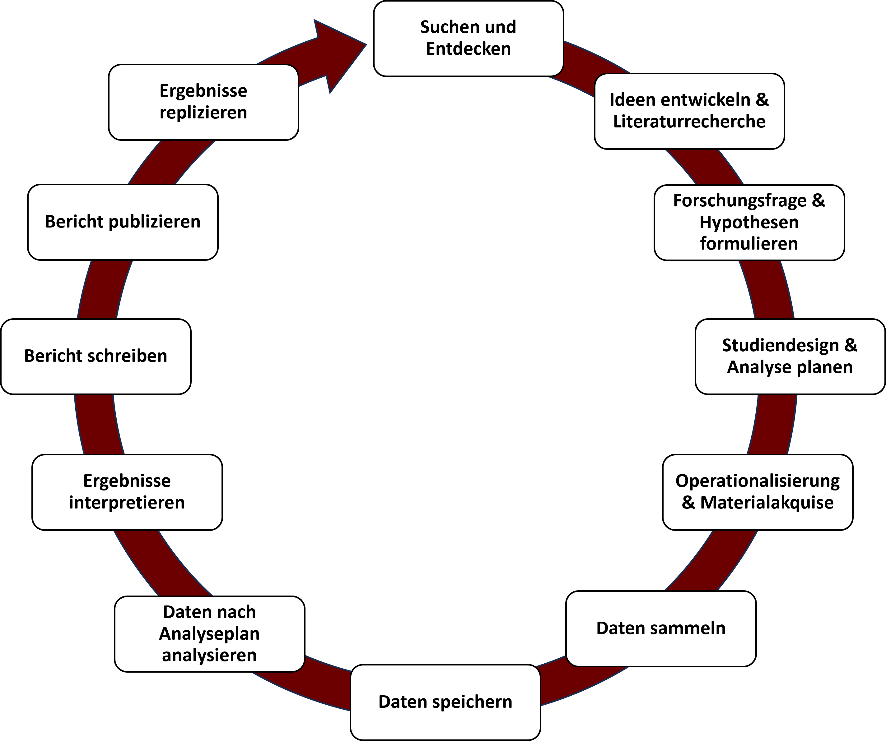
```

---
class: top, left
name: forschungsprozess-prereg

### Präregistierung im empirischen Forschungsprozess

#### Präregistrierung im Forschungsprozess

```{r eval = TRUE, echo = F, out.width="70%", fig.align='center'}
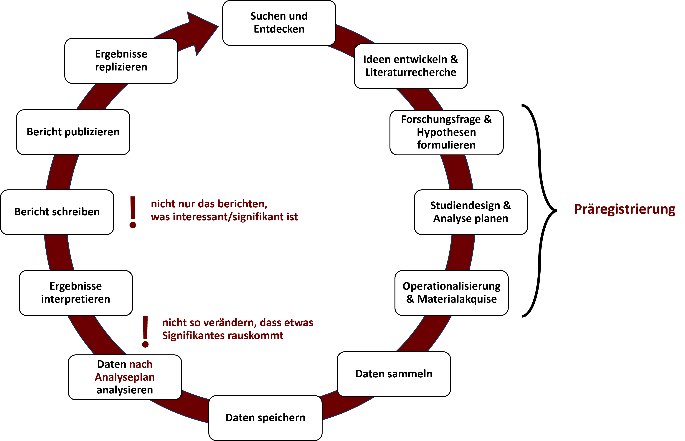
```

---
class: top, left
<div class="footer"><span>https://dorsch.hogrefe.com/stichwort/praeregistrierung <br>https://osf.io/tvyxz/</span></div>

### Präregistierung im empirischen Forschungsprozess

#### Präregistrierung: Definition

<br>

.center[

"*Präregistrierung bezeichnet die* ***Darstellung des forschungsmethodischen Vorgehens*** *(Hypothesen, Forschungsdesign, Stichprobe, Ein- und Ausschlusskriterien, Untersuchungsdurchführung, Auswertungsplan, statistische Datenauswertung) bei der Durchführung und Auswertung einer* ***zukünftig erfolgenden*** *wissenschaftlichen Studie.*"

<br>

```{r eval = TRUE, echo = F, out.width="20%"}

```
]

---
class: top, left
<div class="footer"><span>Brett Jordan, https://www.flickr.com/photos/x1brett/51277187884/in/photostream/</div>

### Präregistierung im empirischen Forschungsprozess

.center[
**Wer von Ihnen hat schon etwas von der Replikationskrise der Psychologie gehört?**
]

```{r, echo=FALSE,out.width="40%",fig.show='hold',fig.align='center'}
knitr::include_graphics("bilder/crisis.png")
``` 


---
class: top, left
name: prereg-hg
<div class="footer"><span>Bem, D. J. (2011). Feeling the future: Experimental evidence for anomalous retroactive influences on cognition and affect. Journal of Personality and Social Psychology, 100(3), 407-425. <br>Pashler, H., & Wagenmakers, E. J. (2012). Editors’ introduction to the special section on replicability in psychological science: A crisis of confidence?. Perspectives on psychological science, 7(6), 528-530.<br>Carpenter, S. (2012). Psychology's bold initiative. Science, 335, 1558-1561. doi:10.1126/science.335.6076.1558</span></div>

### Präregistierung im empirischen Forschungsprozess

#### Präregistrierung: Hintergrund

**Glaubwürdigkeitsprobleme der psychologischen Forschung aufgrund von...**
* ...Betrugsfällen in der Psychologie
* ...Nichtreplizierbarkeit des sogenannten "Psi-Phänomens" (Bem, 2011)
* ...niederschmetternden Ergebnissen von systematischen Replikationsstudien

<br>

.center[
*"Is there currently a crisis of confidence in psychological science reflecting an unprecedented level of doubt among practitioners about the reliability of research findings in the field? It would certainly appear that there is."*

Pashler & Wagenmakers (2012)

<br>

*"According to many psychologists, their field has a credibility problem at the moment, and it affects thousands of studies.*" 

Carpenter (2012)
]

---
class: top, left

### Präregistierung im empirischen Forschungsprozess

#### Präregistrierung: Hintergrund

##### Betrugsfälle in der Psychologie

* **Diederik Stapel** (Tilburg, 2011): Massive Datenfälschung (Fabrikation von Daten), mindestens 55 Publikationen betroffen
* **Dirk Smeesters** (Rotterdam, 2012): "Datenmassage", d.h. Fälle wurden aus der Analyse entfernt, wenn dieser Ausschluss zu einer Erhöhung der statistischen Effekte führte
* **Lawrence Sanna** (Ann Arbor, Michigan, 2012): Zurückziehung von 8 Zeitschriftenartikeln mit dem Hinweis, die Daten seien "invalide"

.pull-left[
```{r, echo=FALSE,out.width="45%",fig.show='hold',fig.align='center'}
knitr::include_graphics(c("bilder/stapel.png"))
``` 
]

.pull-right[
```{r, echo=FALSE,out.width="25%",fig.show='hold'}
knitr::include_graphics(c("bilder/smeesters.jpg", "bilder/sanna.jpg"))
``` 
]
---
class: top, left
<div class="footer"><span>Bem, D. J. (2011). Feeling the future: Experimental evidence for anomalous retroactive influences on cognition and affect. Journal of Personality and Social Psychology, 100(3), 407-425. <br>Wagenmakers, E.-J., Wetzels, R., Borsboom, D., & van der Maas, H. L. J. (2011). Why psychologists must change the way they analyze their data: The case of psi: Comment on Bem (2011). Journal of Personality and Social Psychology, 100, 426-432. <br> Galak, J., LeBoeuf, R. A., Nelson, L. D. & Simmons, J. P. (2012). Correcting the past: Failures to replicate psi. Journal of Personality and Social Psychology, 103, 933-948. <br>Ritchie, S. J., Wiseman, R. & French, C. C. (2012). Failing the future: Three unsuccessful attempts to replicate Bem's ‘Retroactive Facilitation of Recall’ effect. PLoS ONE 7(3), e33423.</span></div>

### Präregistierung im empirischen Forschungsprozess

#### Präregistrierung: Hintergrund

##### Nichtreplizierbarkeit des sogenannten "Psi-Phänomens" (Bem, 2011)

.pull-left[
9 publizierte Experimente, die angeblich "psi" nachweisen (Ereignisse in der Zukunft beeinflussen Verhalten in der Gegenwart) führten zu
* Unmut
* Zweifel an der Fehlerfreiheit von statistischen Methoden
* Infragestellung der Reliabilität der Psychologie
]

.pull-right[
```{r, echo=FALSE, out.width="40%",fig.show='hold',fig.align='center'}
knitr::include_graphics(c("bilder/bem.png"))
``` 
]

**Reaktionen**:

* Andere Ergebnisse bei alternativer Methode der Hypothesentestung (Wagenmakers et al., 2011)
* Gescheiterte Replikationsversuche (Galak et al., 2012; Ritchie et al., 2012)


---
class: top, left
<div class="footer"><span>Open Science Collaboration. (2015). Estimating the reproducibility of psychological science. Science, 349(6251), aac4716. <br>Carney, D. R., Cuddy, A. J., & Yap, A. J. (2010). Power posing: Brief nonverbal displays affect neuroendocrine levels and risk tolerance. Psychological science, 21(10), 1363-1368. <br> Baumeister, R. F., Bratslavsky, E., Muraven, M., & Tice, D. M. (1998). Ego depletion: Is the active self a limited resource?. Journal of personality and social psychology, 74(5), 1252-1265. <br> Strack, F., Martin, L. L., & Stepper, S. (1988). Inhibiting and facilitating conditions of the human smile: a nonobtrusive test of the facial feedback hypothesis. Journal of personality and social psychology, 54(5), 768-777.</span></div>

### Präregistierung im empirischen Forschungsprozess

#### Präregistrierung: Hintergrund

##### Niederschmetterndes Replikationsprojekt: Reproducibility Project: Psychology (Open Science Collaboration, 2015)

* Weltweit 97 Replikationsstudien unter Beteiligung von 270 Forscher:innen
* nur 36% aller Effekte signifikant (in den Originalpublikationen 97%)
* 83% aller Effektstärken kleiner als die original Effektstärken

.pull-left[
* Viele bekannte Effekte nicht replizierbar:
  * EgoDepletion (Baumeister et al., 1998)
  * FacialFeedback (Strack et al., 1988)
  * PowerPosing (Carney et al., 2010)
]

.pull-right[

```{r, echo=FALSE,out.width="30%",fig.show='hold'}
knitr::include_graphics(c("bilder/egodepletion.png", "bilder/facialfeedback.png"))
``` 
]

.pull-left[
* Weitere Replikationsprojekte mit gemischten Ergebnissen, wie "ManyLabs", "ManyBabies", ... 
]

.pull-right[
```{r, echo=FALSE,out.width="20%",fig.show='hold',fig.align='right'}
knitr::include_graphics(c("bilder/powerposing.png"))
``` 
]

---
class: top, left
<div class="footer"><span>Open Science Collaboration. (2015). Estimating the reproducibility of psychological science. Science, 349(6251), aac4716.</span></div>

### Präregistierung im empirischen Forschungsprozess

#### Präregistrierung: Hintergrund

##### Niederschmetterndes Replikationsprojekt: Reproducibility Project: Psychology (Open Science Collaboration, 2015)

.center[
**Vergleich der p-Werte**

```{r eval = TRUE, echo = F, out.width="41%"}
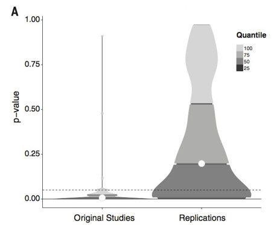
```
]

---
class: top, left
<div class="footer"><span>Open Science Collaboration. (2015). Estimating the reproducibility of psychological science. Science, 349(6251), aac4716.</span></div>

### Präregistierung im empirischen Forschungsprozess

#### Präregistrierung: Hintergrund

##### Niederschmetterndes Replikationsprojekt: Reproducibility Project: Psychology (Open Science Collaboration, 2015)

.center[
**Vergleich der Effektstärken**

```{r eval = TRUE, echo = F, out.width="43%"}
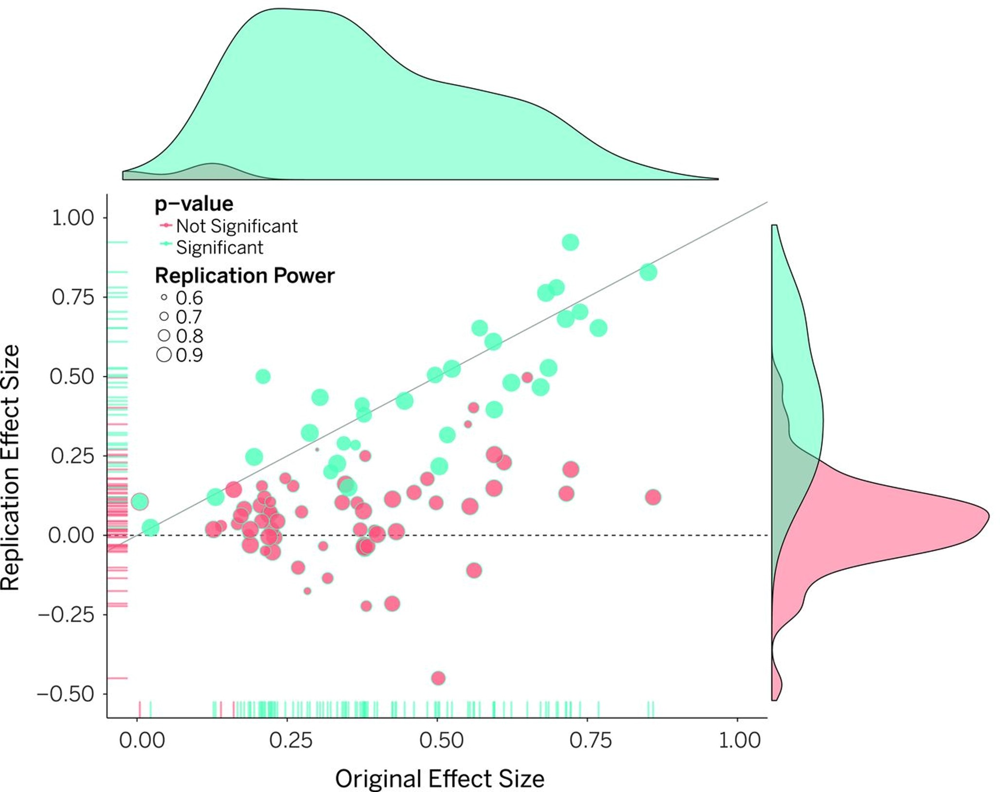
```
]

---
class: top, left
<div class="footer"><span>Open Science Collaboration. (2015). Estimating the reproducibility of psychological science. <i>Science, 349</i>(6251), aac4716. <br>Chang, A. C., & Li, P. (2015). Is economics research replicable? Sixty published papers from thirteen journals say'usually not'. <i>Finance and Economics Discussion Series 2015-083</i>. Washington: Board of Governors of the Federal Reserve System. <br>Begley, C. G., & Ellis, L. M. (2012). Drug development: Raise standards for preclinical cancer research. <i>Nature, 483</i>(7391), 531-533. <br>Prinz, F., Schlange, T., & Asadullah, K. (2011). Believe it or not: how much can we rely on published data on potential drug targets?. <i>Nature reviews Drug discovery, 10</i>(9), 712-712 <br> Baker, M. (2016). 1,500 scientists lift the lid on reproducibility. <i>Nature, 533</i>(7604), 452-454.</span></div>

### Präregistierung im empirischen Forschungsprozess

#### Präregistrierung: Hintergrund

Nur die Psychologie? Nein:

.pull-left[
*Welcher Teil der publizierten Forschungsergebnisse kann in verschiedenen Disziplinen repliziert werden?*

```{r eval = TRUE, echo = F, fig.align='center'}
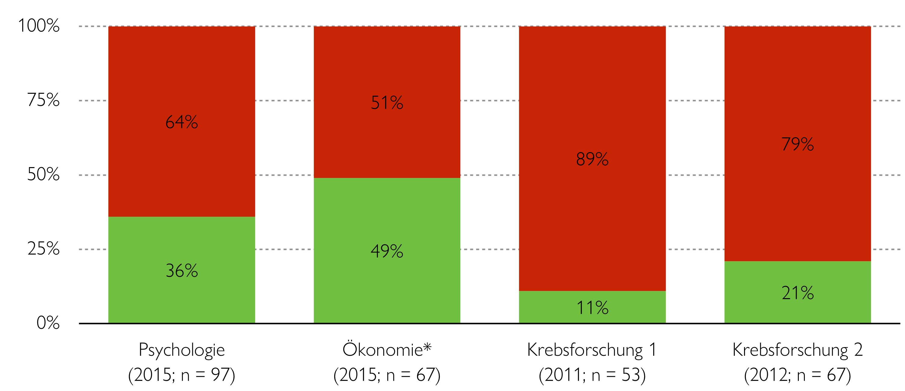
```

<font size="1">*Ökonomie: reine Reproduktion, d.h. Versuch anhand der selben Daten zum selben Ergebnis zu kommen.</font>
]

.pull-right[
```{r eval = TRUE, echo = F, out.width="80%", fig.align='center'}
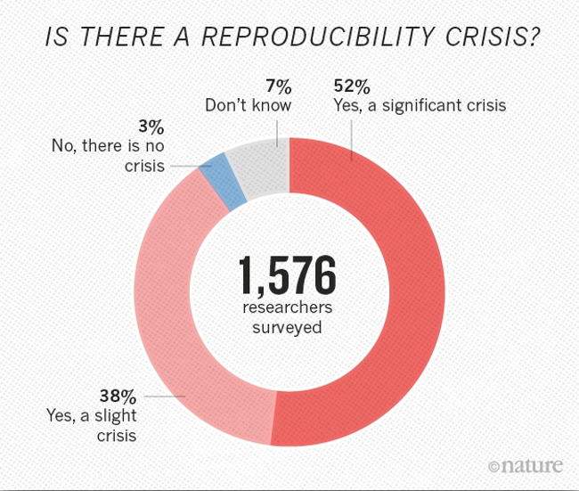
```
]

---
class: top, left

### Präregistierung im empirischen Forschungsprozess

#### Präregistrierung: Hintergrund

.pull-left[
**Ursachen von Nicht-Replizierbarkeit im Speziellen**
* **False-Positives** (α-Fehler) in den Originalstudien 

$\rightarrow$ der Effekt existiert wirklich nicht

* **False-Negatives** (β-Fehler) in den Replikationsstudien 

$\rightarrow$ der Effekt existiert, es liegt an der Methodik der Replikation, dass er nicht gefunden wurde

* **"Hidden-Moderators"** 

$\rightarrow$ der Effekt existiert, aber die Bedingungen, unter denen er in der Originalstudie gefunden wurde, unterscheiden sich von den Bedingungen in der Replikationsstudie 
]

.pull-right[
```{r eval = TRUE, echo = F, out.width="80%", fig.cap="Beispiel für ein falsch-positives Ergebnis", fig.align='center'}

```
]

---
class: top, left

### Präregistierung im empirischen Forschungsprozess

#### Präregistrierung: Hintergrund

**Ursachen von diesen Problemen im Generellen**
* Das System an sich
* Die Wissenschaftler
* Journals

$\rightarrow$ Anreize für "False-Positives"

$\rightarrow$ keine Anreize für Replikationen

<br>

.center[
"*Much of the scientific literature, perhaps half, may simple be untrue. <br>Part of the problem is that no one is incentivised to be* ***right.***"

Horton, Editor von "The Lancet"
]

---
class: top, left
<div class="footer"><span>Clarke, B., Lee, P. Y., Schiavone, S. R., Rhemtulla, M., & Vazire, S. (2023, December 16). The Prevalence of Direct Replication Articles in Top-Ranking Psychology Journals. https://doi.org/10.31234/osf.io/sa6rc / https://twitter.com/bethclarke_/status/1735880436956668367 <br> Ioannidis, J. P. A. (2014). How to Make More Published Research True. <i>PLoS Med 11</i>(10): e1001747.doi:10.1371/journal.pmed.1001747 </span></div>

### Präregistierung im empirischen Forschungsprozess

#### Präregistrierung: Hintergrund

##### Ursache "Das System an sich"

* Enorme Konkurrenz zwischen Wissenschaftlern: Um in der Wissenschaft erfolgreich zu sein, muss viel publiziert werden ("**publish or perish**")

.pull-left[
* Keine Anreize für Replikationen, denn Replikationsstudien...
    * ...werden oft nicht beachtet
    * ...werden oft nicht publiziert
    * ...bekommen oft negative Reaktionen von Originalautoren
    * ...haben oft keinen Wert für die Karriere
]

.pull-right[
```{r eval = TRUE, echo = F, fig.align='center', fig.cap="Prävalenz von Replikationen von 2010-2021", out.width = "50%"}
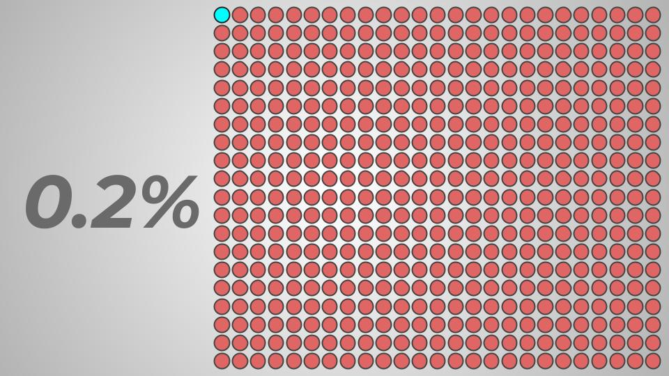
```
]

.center[
*"The current system does not reward replication - it often even penalizes people who want to rigorously replicate previous work, and it pushes investigators to claim that their work is highly novel and significant."*
Ionnidis (2014)
]

---
class: top, left
<div class="footer"><span>Abele-Brehm, A. E., & Bühner, M. (2016). Wer soll die Professur bekommen? <i>Psychologische Rundschau, 67</i>(4), 250-261. https://doi.org/10.1026/0033-3042/a000335<br>https://en.wikipedia.org/wiki/Diederik_Stapel</span></div>

### Präregistierung im empirischen Forschungsprozess

#### Präregistrierung: Hintergrund

##### Ursache "Wissenschaftler"

.pull-left[
Wissenschaftler:innen sind keine Roboter, auch sie haben menschliche Bedürfnisse
* Sicherer Job
* Bekanntheit
* Förderung
* Wirkung auf die Gesellschaft
$\rightarrow$ All dies erfordert viele Publikationen

*"I failed as a scientist, … I did not withstand the pressure to score, to publish, the pressure to get better in time. I wanted too much, too fast. In a system where there are few checks and balances, where people work alone, I took the wrong turn."* - Stapel (2014)
]

.pull-right[
```{r eval = TRUE, echo = F, fig.align='center', fig.cap="Abele-Brehm & Bühner (2016)"}
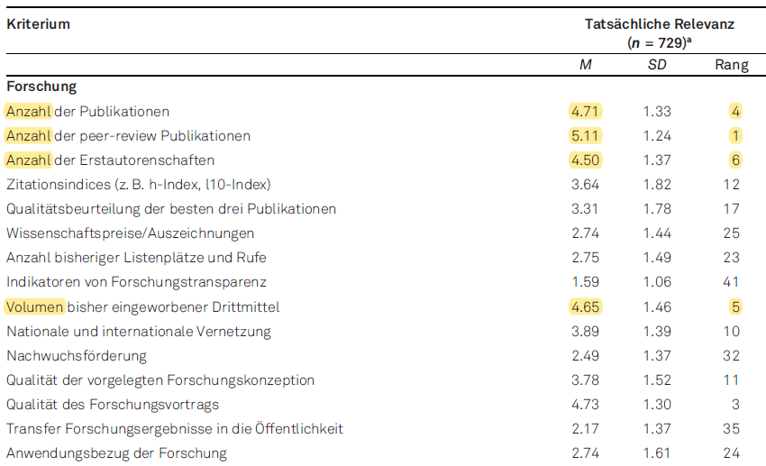
```
]

---
class: top, left

### Präregistierung im empirischen Forschungsprozess

#### Präregistrierung: Hintergrund

##### Ursache "Journals"

Viele Journals...
* ...akzeptierten (bisher) Replikationsstudien nicht
* ...publizieren nur neue und interessante Effekte
* ...publizieren nur positive Ergebnisse

**File-Drawer Problem** führt zu **Publication Bias**: Nur positive Ergebnisse werden publiziert, während alle negativen Ergebnisse in der Schublade des Wissenschaftlers bleiben

##### Fazit

* Es herrscht ein enormer Druck für Publikationen
* Wissenschaftler müssen viel und schnell publizieren, um überhaupt "überleben" zu können 

$\rightarrow$ das führt meistens zu falsch-positiven Ergebnissen<br>
$\rightarrow$ Meta-Analysen (Zusammenfassungen von Studien) "to the rescue"? Nein: "*Garbage in -> Garbage out*"

---
class: top, left
name: prereg-wirkung
<div class="footer"><span>Simmons, J. P., Nelson, L. D., & Simonsohn, U. (2011). False-positive psychology: Undisclosed flexibility in data collection and analysis allows presenting anything as significant. <i>Psychological Science, 22</i>(11), 1359-1366. <br>Leslie, J., Loewenstein, G., & Prelec, D. (2012). Measuring the Prevalence of Questionable Research Practices With Incentives for Truth Telling. <i>Assossiation for Psychological Science, 23</i>(5), 524-532. <br>Gelman, A., & Loken, E. (2014). The statistical crisis in science. <i>American Scientist, 102</i>(6), 460-465. <br>https://xkcd.com/1478/</span></div>

### Präregistierung im empirischen Forschungsprozess

#### Präregistrierung: Wirkung

**Ziel: Einschränkung der Freiheitsgrade der Wissenschaftler ("Researcher degrees of freedom")**

.pull-left[
Simmons, Nelson & Simonsohn (2011): <br>
Forscherinnen und Forscher haben zu viele Möglichkeiten, ihre Daten so zu analysieren, dass sie hinterher ein interpretierbares (und publizierbares) Ergebnis finden

.center[
*"Cases of clear scientific misconduct have received significant media attention recently, but less flagrantly questionable research practices may be more prevalent and, ultimately, more damaging to the academic enterprise."* 

Leslie et al. (2012)
]
]

.pull-right[
```{r eval = TRUE, echo = F, fig.cap="'The garden of forking paths'", fig.align='center'}
knitr::include_graphics("bilder/forkingpaths.PNG")
```
]

---
class: top, left
<div class="footer"><span>Leslie, J., Loewenstein, G., & Prelec, D. (2012). Measuring the Prevalence of Questionable Research Practices With Incentives for Truth Telling. Assossiation for Psychological Science, 23(5), 524-532.</span></div>

### Präregistierung im empirischen Forschungsprozess

#### Präregistrierung: Wirkung

**Verhinderung von sogenannten Questionable-Research-Practices (QRP)**

.pull-left[

<br>
*"QRPs are the steroids of scientific competition, artificially enhancing performance and producing a kind of race in which researchers who strictly play by the rules are at a competitive disadvantage."*

Leslie et al. (2012)
]

.pull-right[
```{r eval = TRUE, echo = F, fig.align='center'}
knitr::include_graphics("bilder/QRPs.PNG")
```
]

---
class: top, left

### Präregistierung im empirischen Forschungsprozess

#### Präregistrierung: Wirkung

**Verhinderung von sogenannten Questionable-Research-Practices (QRP)**

Zu QRPs gehören:
* ***Selective reporting***:
  * Nur ein Teil des Versuchsplans berichten
  * Nur ein Teil der Analysen berichten, z.B. negative (hypothesenkonträre) Ergebnisse ignorieren 
* ***p-hacking***: 
  * jegliche Art von Statistik versuchen, bis p < 0.5
  * Extremwerte selektiv weglassen
  * Subgruppenanalysen
* ***Outcome switching***: 
  * Man erhebt so viele Outcomes wie möglich und berichtet nur diejenigen, die signifikant sind
* ***Optional stopping***: 
  * Daten solange erheben, bis der Effekt signifikant wird\*

<font size="1">* Es gibt zwar sequentielle Methoden, die das erlauben (vgl. https://lakens.github.io/statistical_inferences/10-sequential.html#sample-size-for-sequential-designs); mit dem typischerweise angewendeten einmaligen Nullhypothesentesten mit <i>p</i>-Werten ist ein optionales Erhöhen oder frühzeitiges Abbrechen der Datenerhebung aber nicht erlaubt.</font>

---
class: top, left

### Präregistierung im empirischen Forschungsprozess

```{r eval = TRUE, echo = F, fig.align='center', out.width="70%"}
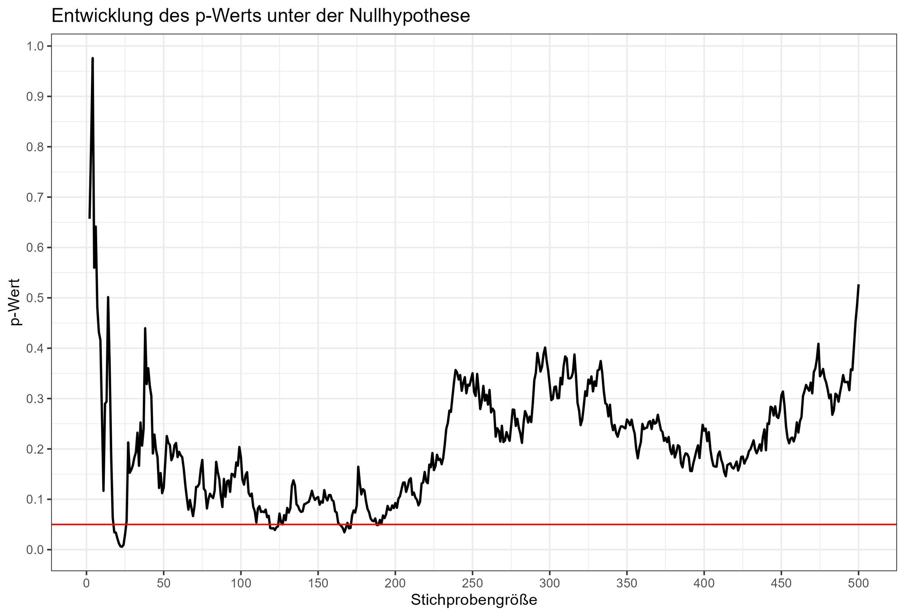
```

---
class: top, left
<div class="footer"><span>Kerr, N. (1988). HARKing: Hypothesizing after the results are known. Personality and Social Psychology Review, 2, 196–217.</span></div>

### Präregistierung im empirischen Forschungsprozess

#### Präregistrierung: Wirkung

**Verhinderung von sogenannten Questionable-Research-Practices (QRP)**

.pull-left[
Zu QRPs gehört auch HARKing:
* Kerr (1988): HARKing = "Hypothesizing After the Results are Known": Eine post-hoc Hypothese so darstellen, als wäre es eine a-priori Hypothese gewesen
* Dieses Vorgehen ist mit dem deduktiv-nomologischem Modell (aka "Hempel Oppenheim Schema") unvereinbar
* Es bringt viele Probleme mit sich, insbesondere werden "falsch-positive" Forschungsergebnisse als substanzielle Befunde missverstanden
]

.pull-right[
```{r eval = TRUE, echo = F, out.width="80%", fig.align='center'}
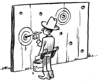
```
]

$\rightarrow$ Durch Präregistrierung werden **konfirmatorische** von **explorativen** Analysen klar getrennt.

---
class: top, left
<div class="footer"><span>John, L. K., Loewenstein, G., & Prelec, D. (2012). Measuring the prevalence of questionable research practices with incentives for truth telling. Psychological science, 23(5), 524-532.</span></div>

### Präregistierung im empirischen Forschungsprozess

```{r eval = TRUE, echo = F, fig.align='center', out.width="70%"}
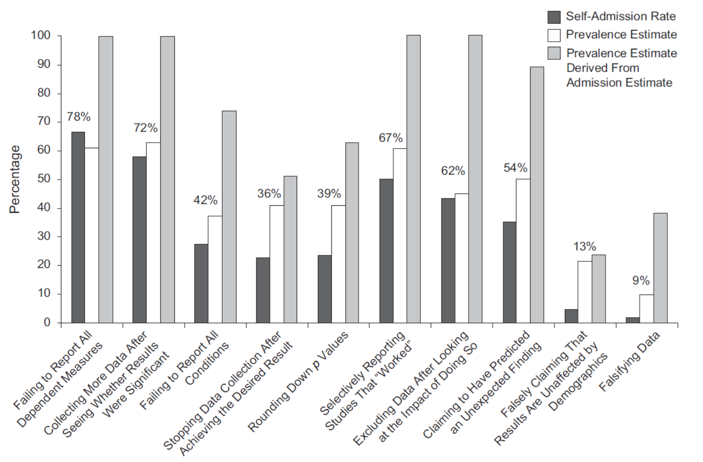
```

---
class: top, left
<div class="footer"><span>Ioannidis, J. P. A. (2014). How to Make More Published Research True. PLoS Med 11(10): e1001747.doi:10.1371/journal.pmed.1001747 <br> Simmons, J., Nelson, L., & Simonsohn, U. (2011). False-Positive Psychology: Undisclosed Flexibility in Data Collection and Analysis Allows Presenting Anything as Significant. Association for Psychological Science, 21,1359-1366. doi:10.1177/0956797611417632</span></div>

### Präregistierung im empirischen Forschungsprozess

#### Präregistrierung: Wirkung

**Im Idealfall sorgt eine Präregistrierung dafür, dass eine Studie unabhängig von den Ergebnissen publiziert wird**:
* Anreiz für Replikationsversuche
* Lösung des "File Drawer" Problems

.pull-left[
**Präregistrierung ist nur eine von vielen Lösungen:**
* Höhere statistische Power
* Offene Daten
* Offene Materialien
* Registered Reports
* Multiverse Analysen
* Evaluierungskriterien und Anreize verändern
* ...
]

.pull-right[
```{r eval = TRUE, echo = F, out.width="80%", fig.align='center'}
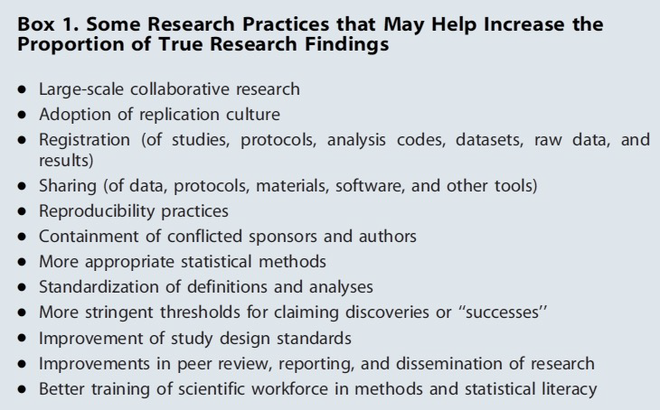
```
]

---
class: top, left
<div class="footer"><span>Kaplan, R. M., & Irvin, V. L. (2015). Likelihood of null effects of large NHLBI clinical trials has increased over time. PloS one, 10(8), e0132382.</span></div>

### Präregistierung im empirischen Forschungsprozess

#### Präregistrierung: Wirkung

.pull-left[
<br>
<br>
<br>
<br>
Nach Einführung einer "Präregistrierungspflicht" in den USA (2000) für pharmakologische und Nahrungsergänzungsmittel-Interventionen bei Herz-Kreislauf-Erkrankungen gibt es mehr "Null-Befunde" als vorher
]

.pull-right[
```{r eval = TRUE, echo = F, fig.align='center', out.width="85%"}
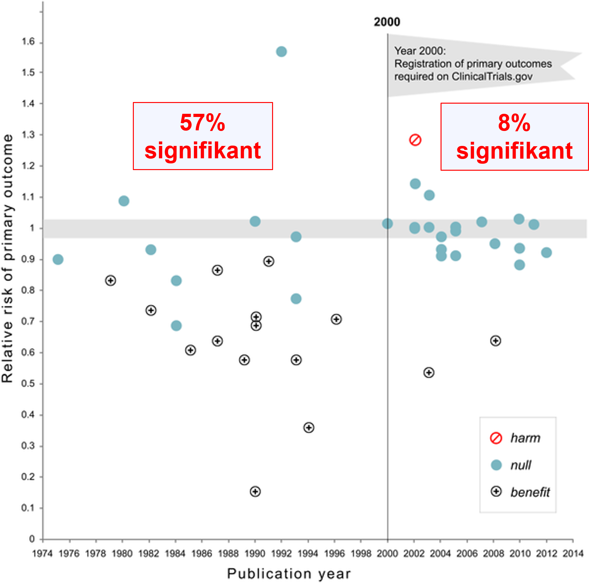
```
]


---
class: top, left
<div class="footer"><span>Lodder, P., Ong, H. H., Grasman, R. P., & Wicherts, J. M. (2019). A comprehensive meta-analysis of money priming. <i>Journal of Experimental Psychology: General, 148</i>(4), 688-712.</span></div>

### Präregistierung im empirischen Forschungsprozess

#### Präregistrierung: Wirkung

.center[
```{r eval = TRUE, echo = F, fig.align='center', out.width = "65%"}
knitr::include_graphics("bilder/Lodder2019.png")
```
]

$\rightarrow$ während publizierte Studien auf einen Priming Effekt von Geld hinweisen (mittlerer Effekt g = 0.42), ist das bei präregistrierten Studien nicht so (mittlerer Effekt g = 0.01)

---
class: top, left
<div class="footer"><span>Protzko, J., Krosnick, J., Nelson, L., Nosek, B. A., Axt, J., Berent, M., ... & Schooler, J. W. (2024). High replicability of newly discovered social-behavioural findings is achievable. <i>Nature Human Behaviour</i>, 1-9. https://doi.org/10.1038/s41562-023-01749-9</span></div>

### Präregistierung im empirischen Forschungsprozess

#### Präregistrierung: Wirkung

.center[
```{r eval = TRUE, echo = F, fig.align='center', out.width = "35%", fig.cap = "https://twitter.com/JProtzko/status/1722648749196165193"}
knitr::include_graphics("bilder/Protzko2023.png")
```
]


---
class: top, left
<div class="footer"><span>Herrmann, S. (2018) Süddeutsche Zeitung, 01./02.12.2018, S.35.</span></div>

### Präregistierung im empirischen Forschungsprozess

#### Präregistrierung: Wirkung

.pull-left[
```{r eval = TRUE, echo = F, fig.align='center'}

```
]

.pull-right[
<br>
"***Es tut sich etwas in der Psychologie,*** *etwas, für das sich auch andere Disziplinen mittlerweile interessieren. Beim Jahreskongress der Deutschen Gesellschaft für Psychologie in Leipzig im Herbst 2016 gelang es Brian Nosek in einem Vortrag jedenfalls, eine Stimmung im Saal zu erzeugen, als sei man gerade Zeuge der Geburt der wahren Wissenschaft geworden.*
]

*Ob dieser Eindruck zutrifft? Sicherlich ist das überzogen, denn Wissenschaft ist ein sehr langsamer, zäher Prozess. Aber das Label von der Krise ist ebenso übertrieben. Die Inventur der Psychologie mag frustrierend viele schmerzhafte Ergebnisse liefern und alte Weissheiten in Frage stellen.* ***Aber sie ist absolut unumgänglich und wertvoll.***

*Leif Nelson kommentiert den Begriff der Replikationskrise im Aufsatz über die* ***Wiedergeburt des Psychologie*** *auf diese Weise: 'Den Regen nach einer langen Dürre würden wir ja auch nicht als Wasserkrise bezeichnen.'* "

.center[
Herrmann (2018)
]
---
class: top, left
name: prereg-vorgehen
<div class="footer"><span>Preregistration Task Force. (2020). Preregistration Standards for Psychology - the Psychological Research Preregistration-Quantitative (aka PRP-QUANT) Template. ZPID (Leibniz Institute for Psychology). http://dx.doi.org/10.23668/psycharchives.4584</span></div>

### Präregistierung im empirischen Forschungsprozess

#### Präregistrierung: Vorgehen

.pull-left[
Notwendige Schritte:

**1. Ausfüllen eines Templates**

z.B. https://tinyurl.com/4vbf4w3b

$\rightarrow$ im Rahmen der Vorlesung wird Ihnen ein Template zur Verfügung gestellt (siehe nächste Einheit)

**2. "Einfrieren" der Präregistrierung**

zu einem Zeitpunkt vor der Datenerhebung auf einer öffentlichen Plattform, z.B. https://osf.io oder https://pasa.psycharchives.org/

$\rightarrow$ im Rahmen der Vorlesung wird das OSF genutzt werden

]

.pull-right[
```{r eval = TRUE, echo = F, fig.align='center', out.width="65%"}
knitr::include_graphics("bilder/prereg-reasons.jpg")
```
]

---
class: top, left

### Präregistierung im empirischen Forschungsprozess

#### Präregistrierung: Vorgehen

**Elemente einer Präregistrierung**

|Abschnitt           |Inhalt                                                                                         |Template-Felder |
|--------------------|---------------------------------------------------------------------------------------    |----------------|
|Meta-Informationen  |z.B. Titel, Autor, Datum                                                                            | T              |
|Einleitung          |Forschungsfrage, Hypothesen, theoretischer Hintergrund                                              | I              |
|Stichprobe          |Sampling Plan, Poweranalyse, Umgang mit drop-out und fehlenden Werten, Qualitätskontrolle der Daten | M3-M9           |
|Methoden/Material   |Studiendesign, Operationalisierung                                                                  | M1-M2, M10-M15 |
|Analyseplan         |Datenvorverarbeitung, Ausschluss- und Inferenzkriterien                                             | AP             |
|Sonstiges           |z.B. Zusammenfassung, Hinweis auf Ethikantrag, Pilotstudien                                         | variiert       |


---
class: top, left
<div class="footer"><span>Karhulahti, V. M. (2022). Registered reports for qualitative research. <i>Nature Human Behaviour, 6</i>(1), 4-5. https://doi.org/10.1038/s41562-021-01265-8 <br> Willroth, E. C., & Atherton, O. E. (2024). Best laid plans: A guide to reporting preregistration deviations. <i>Advances in Methods and Practices in Psychological Science, 7</i>(1), 25152459231213802. https://doi.org/10.1177/25152459231213802</span></div>

### Präregistierung im empirischen Forschungsprozess

#### Präregistrierung: FAQs

* **Darf ich trotzdem explorative (nicht geplante) Analysen machen?** Unbedingt!

* **Kostet das nicht zu viel Zeit?** Es ist Zeit, die man später spart!

* **Macht dann nicht jemand meine Studie?** Präregistrierung ist persönlich, d.h. zuordnbar zu einer Person.

* **Was ist, wenn ich Unsinn präregistriere?** Dann kann nachträglich erklärt werden, warum es Unsinn war. Außerdem machen wir alle Fehler, und andere können uns so frühzeitiger auf Fehler hinweisen (vgl. auch Willroth & Atherton, 2024).

* **Könnte ich nicht einfach ganz viele parallele Präregistrierungen anlegen, und die "rausziehen", die passt?** Theoretisch, ja. Betrug ist immer möglich.

* **Passt das auch für qualitative Forschung?** Ja! Auch dort hat man Freiheitsgrade, es geht darum, diese zu identifizieren und zu reduzieren (vgl. auch Karhulahti, 2024).

* **Wenn man auch von der Präregistrierung abweichen kann, was bringt sie dann?** Sie macht post-hoc Abweichungen transparent und lenkt die Aufmerksamkeit auf die inhaltliche Sinnhaftigkeit von Alternativen.

---
class: top, left
<div class="footer"><span>van den Akker, O. R., van Assen, M. A., Enting, M., de Jonge, M., Ong, H. H., Rüffer, F., ... & Bakker, M. (2023). Selective hypothesis reporting in psychology: comparing preregistrations and corresponding publications. Advances in Methods and Practices in Psychological Science, 6(3), 25152459231187988.</span></div>

### Präregistierung im empirischen Forschungsprozess

#### Präregistrierung: Abweichungen bei den Hypothesen

.center[
```{r eval = TRUE, echo = F, out.width = "40%"}
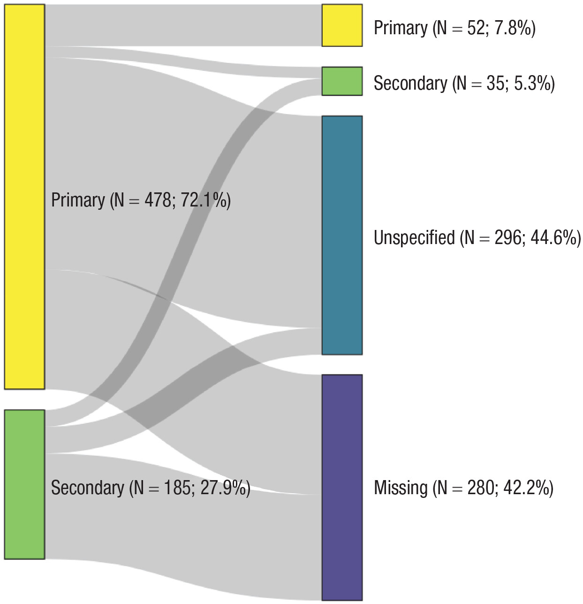
```
]


---
class: top, left

### Präregistierung im empirischen Forschungsprozess

#### Ausblick: Darstellung von Untersuchungsideen im Exposé 

Häufig von Betreuer:innen der Abschlussarbeiten gefordert:

.pull-left[
* Studienthema

* Hintergrund (Relevanz, Problemstellung)
  
* Wissenschaftlicher Hintergrund
  * Definitionen
  * Modelle/Theorien
  * Kernliteratur
  
* Forschungsfrage

* Abgeleitete Hypothesen

* Studientyp (Experiment/Beobachtungsstudie/...)
]

.pull-right[

* Studiendesign 
  * u.a. Randomisierung
  * u.a. Verblindung
  
* Stichprobe
  * Population
  * Ein-/Ausschlusskriterien
  
* Variablen 
  * Messung/Operationalisierung
  * Rollen (UV, AV, Drittvariablen)
  
* Auswertungsstrategien
]

---
class: top, left
name: take-away

### Take-Aways

.full-width[.content-box-gray[

* **empirische Daten** bezeichnen Informationen über die Erfahrungswirklichkeit (z.B. aus Beobachtung) 

* In einer **Präregistrierung** werden essentielle Informationen über die geplante Durchführung und Auswertung einer zukünftigen Studie festgehalten

* Die **Replikationskrise** hinterlässt Zweifel an der Glaubhaftigkeit/Robustheit publizierter Ergebnisse 

* Zu den sogenannten **Questionable Research Practices** gehören selective reporting, p-hacking, outcome switching, optional stopping und HARKing
]
]

**[zurück zur heutigen Übersicht der Vorlesung $\rightarrow$](#content)** 

---
class: top, left
### Literaturempfehlung für die heutige Sitzung

.pull-left[
```{r, echo=FALSE,fig.cap="Nelson, L. D., Simmons, J., & Simonsohn, U. (2018). Psychology's renaissance. <i>Annual Review of Psychology, 69</i>, 511-534. https://doi.org/10.1146/annurev-psych-122216-011836",fig.show='hold',fig.align='center', out.width = "65%"}
knitr::include_graphics("bilder/nelson_et_al_2018.png")
``` 
]

.pull-right[

.pull-left[
```{r, echo=FALSE,fig.cap="Kapitel 20 und 21 in Sedlmeier, P. & Renkewitz, F. (2018). Forschungsmethoden und Statistik für Psychologen und Sozialwissenschaftler (3.Auflage). Pearson.",fig.show='hold',fig.align='center', out.width = "85%"}
knitr::include_graphics("bilder/sedlmeier.png")
``` 
]

.pull-right[
```{r, echo=FALSE,fig.cap="Pennington, C. (2023). A student's guide to open science: Using the replication crisis to reform psychology. McGraw-Hill Education (UK).",fig.show='hold',fig.align='center', out.width = "82%"}
knitr::include_graphics("bilder/pennington.png")
``` 
]
]

---
class: top, left
name: material

### Material

* **Bewertungsschema**: [https://studynet.hs-fresenius.de/ilias.php?baseClass=ilrepositorygui&cmd=sendfile&ref_id=27027](https://studynet.hs-fresenius.de/ilias.php?baseClass=ilrepositorygui&cmd=sendfile&ref_id=27027)

*	**Strategien Themensuche**: [https://studynet.hs-fresenius.de/ilias.php?baseClass=ilrepositorygui&cmd=sendfile&ref_id=26582](https://studynet.hs-fresenius.de/ilias.php?baseClass=ilrepositorygui&cmd=sendfile&ref_id=26582)

*	**Checkliste Ethik**: [https://studynet.hs-fresenius.de/ilias.php?baseClass=ilrepositorygui&cmd=sendfile&ref_id=26580](https://studynet.hs-fresenius.de/ilias.php?baseClass=ilrepositorygui&cmd=sendfile&ref_id=26580)

*	**Google Doc Gruppenfindung**: [https://docs.google.com/document/d/1XFIOSoInrrcjd92raPK3sA4vSVKepVvznOqkWKRKG9k/edit](https://docs.google.com/document/d/1XFIOSoInrrcjd92raPK3sA4vSVKepVvznOqkWKRKG9k/edit)

* **Umfrage zur Einreichung Gruppenname und Thema**: [https://studynet.hs-fresenius.de/ilias.php?baseClass=ilobjsurveygui&cmd=infoScreen&ref_id=26551](https://studynet.hs-fresenius.de/ilias.php?baseClass=ilobjsurveygui&cmd=infoScreen&ref_id=26551)

*	**Fragenforum**: [https://cfh-waf.forumieren.de/](https://cfh-waf.forumieren.de/)


---
class: top, left

### Praxisaufgaben (nach der Vorlesung): Suchen und Entdecken

#### Aufgabe: Mit welchem Thema möchte ich mich (mit welchen Gruppenmitgliedern) beschäftigen? 

**Schritt 1: Themenwahl**
  * Überlegen Sie sich welche Option (Interventionsthema/eigenes Thema) Sie anspricht.
  * Falls eigenes Thema:
    - Lesen Sie sich das [Zusatzmaterial "Themensuche" auf dem studynet](https://studynet.hs-fresenius.de/ilias.php?baseClass=ilrepositorygui&cmd=sendfile&ref_id=26582) durch.
    - Gehen Sie die Variablen auf Folie 13 durch, und folgen Sie den Links für weitere mögliche untersuchbare Variablen.
    - Sammeln Sie Ideen und Themenvorschläge mit dem Bezug zur Psychologie, die Sie interessieren.

**Schritt 2: Finden Sie Gruppenmitglieder**
  * Zunächst innerhalb Ihrer Semestergruppen (A/B/C)
  * **Nutzen Sie dafür bitte folgendes Google Doc, damit ich eine erste Übersicht über die Verteilung bekomme:** https://docs.google.com/document/d/1XFIOSoInrrcjd92raPK3sA4vSVKepVvznOqkWKRKG9k/edit
  * Bitte von mir an die Semestersprecher die Kommiliton:innen bei der Gruppenfindung zu unterstützen. Im Zweifelsfall möglichst gleichmäßige Aufteilung auf die beiden Optionen (eigenes Thema / Interventionsthema).
  * Weniger als 5 Personen sind nur möglich, wenn es am Ende nicht aufgeht. Das heißt: Ihre Gruppe ist zunächst nicht vollständig, wenn Sie nicht zu 5. sind.

---
class: top, left

### Praxisaufgaben (nach der Vorlesung): Suchen und Entdecken

#### Aufgabe: Mit welchem Thema möchte ich mich (mit welchen Gruppenmitgliedern) beschäftigen? 

**Schritt 3: Legen Sie sich ein Google Doc als Open Lab Book an**
  * Geben Sie es für alle Gruppenmitglieder als Bearbeiter frei
  * Stellen Sie ein, dass diejenigen die über den Link verfügen das Dokument betrachten können
  
**Schritt 4: Einigen Sie sich nach der nächsten Vorlesung auf ein Thema und geben Sie Ihrer Gruppe einen Namen**
  * Idealerweise hat Ihr Gruppenname etwas mit Ihrem Thema zu tun
  * Teilen Sie mir Ihren Gruppennamen und Ihr Thema **bis spätestens (!) 26.04.** über die [Umfrage im studynet](https://studynet.hs-fresenius.de/ilias.php?baseClass=ilobjsurveygui&cmd=infoScreen&ref_id=26551) mit (eine Umfrage pro Gruppenmitglied).
  
  
---
class: top, left
name: stelle

### Stellenanzeige: Testleitung

```{r, echo=FALSE, fig.show='hold',fig.align='center', out.width = "36%"}
knitr::include_graphics("bilder/Testleitung.png")
``` 
  
<!-- library(renderthis)  -->
<!-- library(jquerylib) -->
<!-- Vorsicht: html sollte nicht parallel offen sein -->
<!-- to_pdf("WissArb_01_Themen_Präreg_Forschungsprozess.Rmd", complex_slides = TRUE) -->
