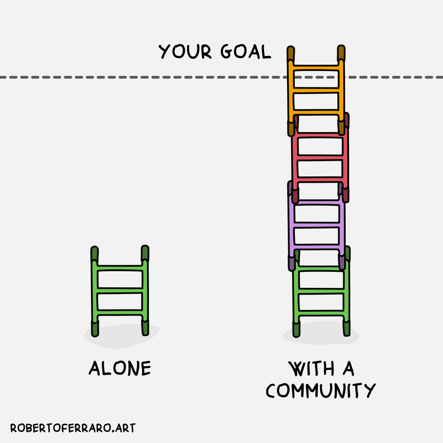

```{r setup, include=FALSE}
options(htmltools.dir.version = FALSE)

library(tidyverse)
library(kableExtra)
library(ggplot2)
library(plotly)
library(htmlwidgets)
library(MASS)
library(ggpubr)
library(xaringanthemer)
library(xaringanExtra)

style_duo_accent(
  primary_color = "#621C37",
  secondary_color = "#EE0071",
  link_color = "#7da5f5",
  background_image = "blank.png"
)

xaringanExtra::use_xaringan_extra(c("tile_view"))

# use_scribble(
#   pen_color = "#EE0071",
#   pen_size = 4
#   )

knitr::opts_chunk$set(
  fig.retina = TRUE,
  warning = FALSE,
  message = FALSE
)
```

name: Title slide
class: middle, left
<br><br><br><br><br><br><br>
# Wissenschaftliches Arbeiten und Forschungsmethoden

### Einheit 2: Forschungsfrage, Literatur und Studienorganisation
##### 17.04.2024 | Dr. Caroline Zygar-Hoffmann

---
class: top, left
name: content

### Heutige Themen

#### [Entwicklung einer Fragestellung](#fragestellung)

#### [Literaturrecherche](#lit-start)

#### [Praxisaufgaben](#praxis)

#### [Zitation](#zit-start)

#### [Studienorganisation](#orga)

#### [Take-Aways und Literaturempfehlung](#take-away)

#### [Material und Wiederholung Praxisaufgaben](#material)

---
class: top, left
name: fragestellung
<div class="footer"><span>Kapitel 5.1 in Döring, N. & Bortz, J. (2016). Forschungsmethoden und Evaluation in den Sozial- und Humanwissenschaften. Pearson. </span></div>

### Entwicklung einer Fragestellung

#### Recap von letzter Sitzung

Ihre Praxisaufgabe war folgende Frage zu beantworten: 

*Mit welchem Thema möchte ich mich (mit welchen Gruppenmitgliedern) beschäftigen? *

**Und nun?**

.center[
"*Nach der Wahl des Themas ist es zwingend notwendig, das zu untersuchende Forschungsproblem zu formulieren bzw. – im Deutschen ist diese Bezeichnung geläufiger – die* ***zentrale Fragestellung der Studie*** *zuzuspitzen.*

*Dies sollte üblicherweise* ***theorie- und empiriegeleitet*** *geschehen, d. h., auf der Basis vorliegender Theorien und empirischer Befunde.*

*Doch auch erste Methodenentscheidungen tragen zur Transformation eines allgemeinen Forschungsthemas (z.B. "Computerspiele") in ein untersuchbares Forschungsproblem bei.*"

(Döring & Bortz, 2016)
]

---
class: top, left
name: forschungsprozess-prereg

### Entwicklung einer Fragestellung

#### Fragestellung im Forschungsprozess

.pull-left[
**Was gehört zur Studienplanung?**

1. Theoriearbeit und Literaturrecherche $\rightarrow$ heutige und nächste Sitzung

2. Hypothesenformulierung $\rightarrow$ nächste Sitzung

3. Design Plan $\rightarrow$ nächste Sitzung

4. Variablen (Auswahl Messinstrumente und Variablenrollen)  $\rightarrow$ übernächste Sitzung, Einheit 4

5. Statistischer Analyseplan  $\rightarrow$ Einheit 5

6. Sampling plan (Rekrutierungsplan) $\rightarrow$ Einheit 6

$\rightarrow$ Studienplanung in **Präregistrierung** festhalten
]

.pull-right[
```{r eval = TRUE, echo = F, fig.align='center'}
knitr::include_graphics("bilder/Forschungsprozess_Prereg.png")
```
]

---
class: top, left
<div class="footer"><span>Kapitel 5.1 in Döring, N. & Bortz, J. (2016). Forschungsmethoden und Evaluation in den Sozial- und Humanwissenschaften. Pearson. </span></div>

### Entwicklung einer Fragestellung

#### Wichtige Aspekte

* **Inhaltliche Eingrenzung des Gegenstands**: Welche Aspekte des Themas sollen untersucht werden (Eingrenzung von Zielgruppen, Zeiträumen, Effekten etc.)?

* **Bezug zum empirischen Forschungsstand**: Blick auf frühere Studien und vorliegende oder fehlende Befunde zu Einzelaspekten $\rightarrow$ empirische Forschungslücke

* **Wahl der Theorie(n)**: Welches sind die zentralen Theorien des eigenen Faches (und ggf. auch von Nachbardisziplinen), die auf das Thema anwendbar sind? $\rightarrow$ Berücksichtigung oder Vernachlässigung bestimmter Teilaspekte des Themas

* **Wahl der Methode(n)**: Mit welchem Untersuchungsdesign und mit welchen Datenerhebungs- und Datenauswertungsmethoden soll das Thema untersucht werden?

**Vorsicht: Forschungsfrage nicht zu allgemein formulieren!**

$\rightarrow$ siehe den Abschnitt "Bewertung von Forschungsfragen" im [Zusatzmaterial Z2 auf studynet](https://studynet.hs-fresenius.de/ilias.php?baseClass=ilrepositorygui&cmd=sendfile&ref_id=27540) 

---
class: top, left
<div class="footer"><span>Kapitel 5.1 in Döring, N. & Bortz, J. (2016). Forschungsmethoden und Evaluation in den Sozial- und Humanwissenschaften. Pearson. </span></div>

### Entwicklung einer Fragestellung

#### Beispiel (hier "Forschungsproblem" statt "Fragestellung"):

```{r eval = TRUE, echo = F, fig.align='center'}
knitr::include_graphics("bilder/forschungsfrage.png")
```

---
class: top, left

### Entwicklung einer Fragestellung

#### Beispiel Interventionsthema

* **Inhaltliche Eingrenzung des Gegenstands**: Zielgruppe steht zwar fest (Personen in Partnerschaften), aber weitere Effekte (ggf. Zeiträume) für eigene Forschungsfrage noch zu klären

* **Bezug zum empirischen Forschungsstand**: Empirischer Forschungsstand zum Anhören von Musik muss recherchiert werden (z.B. mit den Suchbegriffen "effect of songs on psychological outcomes", "music interventions", "song lyrics psychological outcomes", "music song ecological momentary intervention") und Identifikation einer Forschungslücke oder Replikation

* **Wahl der Theorie(n)**: Von mir wird es eine kurze Info zu einer Theorie geben, warum wir davon ausgehen, dass Musik unseren gewünschten Effekt haben könnte. Darüber hinaus kann man recherchieren: Gibt es Theorien wie das Anhören von Musik grundsätzlich wirkt? 

* **Wahl der Methode(n)**: Design weitestgehend festgelegt: Experiment mit Interventions- vs. Kontrollgruppe (between-person Vergleich); Datenauswertung hängt von der eigenen Forschungsfrage + Hypothese ab 

---
class: top, left
name: lit-start

### Literaturrecherche

#### Warum Literaturrecherche?

* Suche und Entwicklung eines geeigneten Themas und einer geeigneten Fragestellung

* Erste Orientierung über aktuellen Forschungsstand

* Theoretische Einbettung der Fragestellung (also: Wie kommt diese Fragestellung zustande, z.B. welche Konstrukte hängen theoretisch wie zusammen? Warum ist sie relevant?)

* **Im Bericht**: Jede Behauptung muss mit einer entsprechenden Quelle belegt werden. 
  * Wichtig: Verschiedene Quellen und damit verschiedene Ansichten einbeziehen. 
  * Grober Richtwerk: Pro Absatz mindestens eine Quelle (je nachdem was Sie schreiben, kann das aber auch zu wenig sein)

* Formulierung konkreter Hypothesen anhand der Recherche (siehe Einheit 3)

* **Im Bericht**: Diskussion der Befunde (Stimmen meine Befunde mit der Theorie/ vorherige Befunde überein? Gab es Ergebnisse, mit denen ich nicht gerechnet habe? Warum könnte das so sein?)

---
class: top, left

### Literaturrecherche

#### Warum Literaturrecherche?
 
[https://matt.might.net/articles/phd-school-in-pictures/#print](https://matt.might.net/articles/phd-school-in-pictures/#print)

---
class: top, left

### Literaturrecherche

#### Warum Literaturrecherche?

* Überblick verschaffen über derzeitigen Wissensstand im Feld

* Informationen über gesellschaftliche Relevanz der Fragestellung

* Relevante Theorien und Modelle recherchieren

* Kernaspekte eigener Fragestellung theoretisch unterfüttern (Warum liegt die Fragestellung nahe?)

Digitale Literaturrecherche:
  * Google Scholar
  * Datenbankrecherche: https://dbis.ur.de/dbinfo/dbliste.php?bib_id=eff&colors=7&ocolors=40&lett=f&gebiete=22
  * ...
  
---
class: top, left
<div class="footer"><span>Kapitel 1.2 und 16 in Döring, N. & Bortz, J. (2016). Forschungsmethoden und Evaluation in den Sozial- und Humanwissenschaften. Pearson. </span></div>

### Literaturrecherche

#### Informationssuche planen

**Wie/wo fange ich an?**

* Literaturhinweise des Dozenten/ des Betreuers

* Fachbücher und Paper/ Artikel/ Aufsätze (z.B. Review, Meta-Analysen), die viele Informationen bzw. Ergebnisse zu Ihrem Thema zusammenfassen (Stand der Forschung erarbeiten)

* **Review**: fasst den aktuellen Forschungsstand in einem Gebiet zusammen, indem die einschlägige Literatur recherchiert, strukturiert vorstellt und bewertet wird

* **Meta-Analyse**: aggregiert Ergebnisse mehrerer früherer quantitativer Studien statistisch zu einem Gesamteffekt

---
class: top, left
name: lit-arten

### Literaturrecherche

#### Literaturarten und Umgang mit ihnen 

**Warum muss ich Literaturarten unterscheiden können?**

* Bestimmte Literaturarten finden man an bestimmten Stellen

* Nicht jede Art von Literatur ist es „würdig“ in Ihrer Arbeit aufgenommen zu werden

* Zudem wird manche Literaturgattung „lieber“ in Arbeiten gesehen als andere

**Gestaltungsmerkmale von wissenschaftlichen Texten**
* **Nachvollziehbarkeit:** die Vorgangsweise ist detailliert dokumentiert (Wiederholbarkeit, damit eine Überprüfung möglich ist)
* **Argumentation:** Es wird auf der Grundlage von Fakten/empirischen Daten argumentiert
* **Quellenangaben:** Für Theorien und Fakten sind deren (wissenschaftliche) Quellen aim Text und Literaturverzeichnis angegeben
* **Sprache:** Verwendung von Fachbegriffen, wissenschaftssprachliche Formulierung und „unpersönlicher“ Schreibstil

---
class: top, left
<div class="footer"><span>Kapitel 1.2 in Döring, N. & Bortz, J. (2016). Forschungsmethoden und Evaluation in den Sozial- und Humanwissenschaften. Pearson. </span></div>

### Literaturrecherche

#### Literaturarten und Umgang mit ihnen 

**Zitierwürdigkeit (aus wissenschaftlicher Sicht, d.h. zum Belegen von Aussagen; bitte beachten Sie unbedingt auch das Alter der Quellen!)**

.pull-left[
**Zitierwürdig:**
* **Primärliteratur**: begutachtete (*peer-reviewed*) Artikel in Fachzeitschriften (Journals; gedruckt oder digital)
* **Wissenschaftliche Fachbücher** (aber nicht ausschließlich)
  - Monographien: Ein Autor
  - Herausgeberwerker: Mehrere Autoren
  - Fachlexika
  
**Bedingt zitierwürdig (vereinzelt in Ordnung):** graue Literatur (Dissertationen, Abschlussarbeiten, Firmenschriften) und  Internetseiten (sparsam dosieren!)
  
]

.pull-right[

**Nicht zitierwürdig:**
  * Praktikerbücher
  * Allgemeine Lexika (Brockhaus)
  * Vorlesungsskripte (weder CFH, noch andere Unis), Schulbücher, PowerPoint-Präsentationen
  * Artikel in Boulevardzeitungen / nicht peer-reviewte Zeitschriften (auch falls zu wissenschaftlichen Themen, z.B. Psychologie Heute)
  * „Abendblatt“ o.ä. (nur in Ausnahmefällen, z.B. mal um die gesellschaftliche Relevanz eines Themas aufzuzeigen)
  * Wiki-Quellen (für einen Überblick völlig in Ordnung, aber bitte Primärquellen nachgehen)
]


---
class: top, left

### Literaturrecherche

#### Literaturarten und Umgang mit ihnen 

.pull-left[
**Woran erkenne ich einen wissenschaftlichen Artikel / eine Meta-Analyse / ein Review?**

* In einer Fachzeitschrift ("Journal") publiziert (ob die Zeitschrift peer-reviewed ist muss eigentlich separat geprüft werden)

* Fast immer: Summary / Zusammenfassung / Abstract

* In der Psychologie: Struktur folgt Einleitung, Methode, Ergebnisse, Diskussion

* Oft: doi (digital object identifier)

* Meta-Analysen und Reviews kennzeichnen dies fast immer im Titel

* Literaturverzeichnis
]

.pull-right[
```{r eval = TRUE, echo = F, out.width="70%", fig.align='center'}
knitr::include_graphics("bilder/meta-analysis.png")
```
]

---
class: top, left
### Literaturrecherche

#### Recherchesysteme

.pull-left[
**Google Scholar**: https://scholar.google.de/

```{r, echo=FALSE,fig.show='hold',fig.align='center'}
knitr::include_graphics("bilder/scholar.png")
``` 
]

.pull-right[

**Bei zentralen Artikeln:** Klick auf Zitieren --> BibTex --> rauskopieren (spart Ihnen später Arbeit)

[**Sci-Hub**](https://sci-hub.hkvisa.net/): https://de.wikipedia.org/wiki/Sci-Hub

[**Anna's Archive**](https://annas-archive.org): https://annas-archive.org

$\rightarrow$ siehe den Abschnitt "Literaturrecherche" im [Zusatzmaterial Z2 auf studynet](https://studynet.hs-fresenius.de/ilias.php?baseClass=ilrepositorygui&cmd=sendfile&ref_id=27540)  für weitere Informationen, vor allem auch Recherche in wissenschaftlichen Datenbanken!!

**Sie müssen für die Literaturrecherche kein Geld ausgeben!**

]

---
class: top, left
### Literaturrecherche

#### Bewertungsschema

.center[
```{r eval = TRUE, echo = F}
knitr::include_graphics("bilder/bewertung_forschungsfrage_lit.png")
```
]


---
class: top, left
### Literaturrecherche

#### Präregistrierung

.center[
```{r eval = TRUE, echo = F, out.width = "40%"}
knitr::include_graphics("bilder/prereg_template_forschungsfrage.png")
```
]

$\rightarrow$ I1 weniger wichtig als I2: Literatur kann später nach der Präregistrierung noch ergänzt werden (Literaturrecherche beginnt jetzt und wird erst zum Ende der Vorlesung beendet werden, wenn die Präregistrierung schon längst fertig abgeschickt ist)

---
class: top, left
name: praxis

### Praxis: Idee entwickeln & Literaturrecherche

**Schritt 1: Führen Sie eine kurze Literaturrecherche durch.** 
* Gibt es Reviews oder Meta-Analysen zu Ihren Untersuchungsideen? Gibt es aktuelle empirische Studien (d.h. von 2020 oder neuer), die dazu passen?
  * Lesen Sie die Abstracts.
  * Schreiben Sie sich interessante Methoden und Ergebnisse raus.

* Strukturieren/Kommentieren Sie die gefundene Literatur, z.B. in einem Literaturverwaltungsprogramm

* **Leitfragen bei der Literaturrecherche:**
  * Welche Antworten gibt es zu diesem Thema bereits?
  * Welche Fragen sind noch ungeklärt? Und wie kann ich Antworten auf diese Fragen finden?

---
class: top, left

### Praxis: Idee entwickeln & Literaturrecherche

**Schritt 2: Einigen Sie sich auf ein Thema und geben Sie Ihrer Gruppe einen Namen**
  * Bewerten Sie dafür Ihre Ideen hinsichtlich der gefundenen Literatur und nach den Anforderungen aus Einheit 1 und einigen Sie sich auf ein Thema.
  * Idealerweise hat Ihr Gruppenname etwas mit Ihrem Thema zu tun
  * Teilen Sie mir Ihren Gruppennamen und Ihr Thema **bis spätestens (!) 26.04.** über die [Umfrage im studynet](https://studynet.hs-fresenius.de/ilias.php?baseClass=ilobjsurveygui&cmd=infoScreen&ref_id=26551) mit (eine Umfrage pro Gruppenmitglied).
  
**Schritt 3 (kann auch parallel mit Schritt 2 passieren): Strukturieren Sie Ihre Themenidee zu einer Forschungsfrage (kann auch eine Replikation sein).** 
  * Bewerten Sie  Ihre Forschungsfrage nach wissenschaftlichen und ethischen Kriterien (siehe "Bewertung von Forschungsfragen" im [Zusatzmaterial Z2 auf studynet](https://studynet.hs-fresenius.de/ilias.php?baseClass=ilrepositorygui&cmd=sendfile&ref_id=27540)).
  * Beginnen Sie damit, das [Präregistrierungstemplate auf studynet](https://studynet.hs-fresenius.de/goto_STUDYNETHSF_file_27541_download.html) (Abschnitt I1 und I2) mit den Inhalten zu füllen, die zu der Auswahl ihrer Forschungsfrage geführt haben.
  * Mittelfristig: Intensivieren Sie die Literaturrecherche, um die Forschungsfrage zu schärfen (vgl. auch nächste Sitzung)
---
class: top, left
name: zit-start

### Quellen & Referenzen

#### Zitieren

**Was ist Zitieren?**

* Sinngemäße oder wörtliche Wiedergabe von sachlicher Information oder Meinung eines anderen.

**Ziele und Funktionen vom Zitieren**
* Beweisfunktion (wissenschaftliche Belegung Ihrer Behauptungen)
* Abgrenzung von eigenen Gedankengängen, Überlegungen und Annahmen
* Gibt Ihren Aussagen mehr Gewicht
* Sicherung geistigen Eigentums

**Ziele und Funktionen von Quellenangaben**
* Eindeutige Identifikation der zitierten Werke gewährt Auffindbarkeit
* Lückenlose Auflistung aller verwendeten Quellen
* 1:1 Verhältnis zwischen zitierten Quellen und Literaturverzeichnis!

---
class: top, left

### Quellen & Referenzen

#### Plagiat

**Was ist ein Plagiat?**
* die bewusste Aneignung fremden Geistesgutes ohne dies kenntlich zu machen

**Arten von Plagiaten**

* Übernehmen von Informationen ohne Nennung der Quelle
* Ein direktes Zitat wird (leicht verändert) als indirektes ausgegeben
* Verschleierungstaktiken (z.B. Paraphrasieren ohne Quellenangabe)
* Übersetzung fremdsprachlicher Arbeiten, die als eigene ausgegeben werden

Wichtig!
Zitate (direkte und indirekte), die in einer Arbeit nicht oder falsch gekennzeichnet werden, gelten als Plagiat! Die Arbeit wird als „nicht bestanden“ (5,0) gewertet!

---
class: top, left

### Quellen & Referenzen

#### Zitationssysteme

In unserem Studium ist die in der Psychologie übliche Zitierweise der Deutschen Gesellschaft für Psychologie (DGPs) und der American Psychological Association (APA) verpflichtend:


.center[
```{r eval = TRUE, echo = F, out.width="20%"}

```
]

[Link zum vollständigen APA-Style guide](https://apastyle.apa.org)

[Link zum kostenfreien Nachlesen vom APA-Style guide der Purdue University](https://owl.purdue.edu/owl/research_and_citation/apa_style/apa_formatting_and_style_guide/in_text_citations_author_authors.html)

$\rightarrow$ siehe den Abschnitt "Quellen & Referenzen" im [Zusatzmaterial Z2 auf studynet](https://studynet.hs-fresenius.de/ilias.php?baseClass=ilrepositorygui&cmd=sendfile&ref_id=27540) für Zitationsregeln!

---
class: top, left
### Quellen & Referenzen

#### Bewertungsschema

.center[
```{r eval = TRUE, echo = F}
knitr::include_graphics("bilder/bewertung_zitate.png")
```
]

$\rightarrow$ wird 2x bewertet: bei Gruppenarbeit und bei Einzelleistung!

$\rightarrow$ letztes Jahr nur sehr wenige Gruppen mit voller Punktzahl -- das ist schade, denn das sind klassische "Fleißpunkte", wo man nur nachschauen muss, wie es geht

$\rightarrow$ daher unbedingt den Abschnitt "Quellen & Referenzen" im [Zusatzmaterial Z2 auf studynet](https://studynet.hs-fresenius.de/ilias.php?baseClass=ilrepositorygui&cmd=sendfile&ref_id=27540) anschauen!!


---
class: top, left
name: orga

### Studienorganisation

####  Ordnerstruktur

.pull-left[
**Ziel einer guten Ordnerstruktur**: Sie können den Ordner mit allen Unterordnern kopieren, jemandem zukommen lassen, und diese Person versteht was gemacht wurde und wie die Analysen wiederholt werden können

**Englische Ordnernamen bevorzugt**, um breitere Verständlichkeit zu gewährleisten

**Readme-Textdatei** auf dem obersten Level empfohlen, um alles Nicht-Selbsterklärendes zu erklären

$\rightarrow$ Aktuell ist nur der Ordner "literature" relevant. Wir werden später wenn es um die Auswertung geht Sinn & Zweck der anderen Ordner besprechen

]

.pull-right[
```{r eval = TRUE, echo = F, fig.cap = "Vorschlag für eine gute Ordnerstruktur"}
knitr::include_graphics("bilder/ordnerstruktur.png")
```
]

---
class: top, left

### Studienorganisation

####  Ordnerstruktur

* Es wäre praktisch, wenn Sie sich in der Kleingruppe nicht ständig Ordner oder Dateien hin und her schicken müssen, daher macht es Sinn, die Ordnerstruktur in einer geteilten Umgebung ("Cloud") anzulegen, in der alle Personen der Kleingruppe Zugriff haben und immer die neueste Version der Dateien liegt (**aber Achtung: Rohdaten sollten nicht einfach irgendwo im Internet hochgeladen werden, sondern erst wenn Sie gemäß der Datenschutzrichtlinien bearbeitet worden sind (z.B. bei uns: Pseudonym gelöscht)**)

* Idealerweise gibt es eine automatische Synchronisation zwischen der Cloud und lokalen Ordnern (dann muss man nichts manuell hochladen/runterladen), aber Lösungen die sowas anbieten sind meist entweder kostenpflichtig oder benötigen das Know-How um einen eigenen Server zu hosten (z.B. Nextcloud)


---
class: top, left
<div class="footer"><span>https://www.robertoferraro.net/illustrations</span></div>

### Studienorganisation

#### Zusammenarbeit in Gruppen

.center[
```{r eval = TRUE, echo = F, out.width = "40%"}

```
]

---
class: top, left

### Studienorganisation

#### Zusammenarbeit in Gruppen

Neben den Vorteilen, gibt es aber auch häufige Probleme:

* **Kommunikationsprobleme und Missverständnisse** $\rightarrow$ klare Kommunikationskanäle und Erwartungen diesbezüglich festlegen

* **Ungleichgewicht der Arbeitslast** $\rightarrow$ klare Rollenverteilung, gemeinsame Zielsetzung, verbindliche Deadlines

* **Mangelnde/Ineffektive Zusammenarbeit und Koordination** $\rightarrow$ regelmäßige Treffen/Austausch, regelmäßige Fortschrittsabfrage (Praxisaufgaben sind so angelegt, dass sie bis zur nächsten Vorlesung bearbeitet werden!), gemeinsame Arbeitsplattform (z.B. gemeinsame Ordner)

* **Qualitätsunterschiede bei der Beitragserstellung** $\rightarrow$ konstruktives Feedback, bei Unstimmigkeiten eine dritte Person konsultieren (z.B. weitere Gruppenmitglieder, einen Dozenten) 

$\rightarrow$ ich kann bei Gruppenproblemen konsultiert werden

$\rightarrow$ nicht erst eine Woche vor Abgabe bemängeln, dass es nicht läuft


---
class: top, left
name: take-away

### Take-Aways

.full-width[.content-box-gray[

* Die Entwicklung einer Forschungsfrage ist ein wichtiger Schritt im Forschungsprozess

* wissenschaftlich relevante Literatur ist in der Regel *peer-reviewed*

* Konsequentes Zitieren ist essentiell und folgt bestimmten Formatierungsregeln

* Alle im Haupttext genannten Quellen müssen im Literaturverzeichnis vorkommen

]
]

**[zurück zur heutigen Übersicht der Vorlesung $\rightarrow$](#content)** 

---
class: top, left
### Literaturempfehlung für die heutige Sitzung

.center[
```{r, echo=FALSE,out.width="30%",fig.cap="Kapitel 1.2, 5 und 6 in Döring, N. & Bortz, J. (2016). Forschungsmethoden und Evaluation in den Sozial- und Humanwissenschaften. Pearson.",fig.show='hold',fig.align='center'}
knitr::include_graphics("bilder/doering.png")
``` 
]

---
class: top, left
name: material

### Material

* **Bewertungsschema**: [https://studynet.hs-fresenius.de/ilias.php?baseClass=ilrepositorygui&cmd=sendfile&ref_id=27027](https://studynet.hs-fresenius.de/ilias.php?baseClass=ilrepositorygui&cmd=sendfile&ref_id=27027)

*	**Strategien Themensuche**: [https://studynet.hs-fresenius.de/ilias.php?baseClass=ilrepositorygui&cmd=sendfile&ref_id=26582](https://studynet.hs-fresenius.de/ilias.php?baseClass=ilrepositorygui&cmd=sendfile&ref_id=26582)

*	**Checkliste Ethik**: [https://studynet.hs-fresenius.de/ilias.php?baseClass=ilrepositorygui&cmd=sendfile&ref_id=26580](https://studynet.hs-fresenius.de/ilias.php?baseClass=ilrepositorygui&cmd=sendfile&ref_id=26580)

*	**Google Doc Gruppenfindung**: [https://docs.google.com/document/d/1XFIOSoInrrcjd92raPK3sA4vSVKepVvznOqkWKRKG9k/edit](https://docs.google.com/document/d/1XFIOSoInrrcjd92raPK3sA4vSVKepVvznOqkWKRKG9k/edit)

* **Umfrage zur Einreichung Gruppenname und Thema**: [https://studynet.hs-fresenius.de/ilias.php?baseClass=ilobjsurveygui&cmd=infoScreen&ref_id=26551](https://studynet.hs-fresenius.de/ilias.php?baseClass=ilobjsurveygui&cmd=infoScreen&ref_id=26551)

* **Zusatzmaterial Z2 Literaturrecherche, Bewertung von Forschungsfragen & Referenzen**: [https://studynet.hs-fresenius.de/ilias.php?baseClass=ilrepositorygui&cmd=sendfile&ref_id=27540](https://studynet.hs-fresenius.de/ilias.php?baseClass=ilrepositorygui&cmd=sendfile&ref_id=27540)

* **Template Präregistrierung**: [https://studynet.hs-fresenius.de/goto_STUDYNETHSF_file_27541_download.html](https://studynet.hs-fresenius.de/goto_STUDYNETHSF_file_27541_download.html)

*	**Fragenforum**: [https://cfh-waf.forumieren.de/](https://cfh-waf.forumieren.de/)

---
class: top, left

### Praxis: Idee entwickeln & Literaturrecherche

**Schritt 1: Führen Sie eine kurze Literaturrecherche durch.** 
* Gibt es Reviews oder Meta-Analysen zu Ihren Untersuchungsideen? Gibt es aktuelle empirische Studien (d.h. von 2020 oder neuer), die dazu passen?
  * Lesen Sie die Abstracts.
  * Schreiben Sie sich interessante Methoden und Ergebnisse raus.

* Strukturieren/Kommentieren Sie die gefundene Literatur, z.B. in einem Literaturverwaltungsprogramm

* **Leitfragen bei der Literaturrecherche:**
  * Welche Antworten gibt es zu diesem Thema bereits?
  * Welche Fragen sind noch ungeklärt? Und wie kann ich Antworten auf diese Fragen finden?

---
class: top, left

### Praxis: Idee entwickeln & Literaturrecherche

**Schritt 2: Einigen Sie sich auf ein Thema und geben Sie Ihrer Gruppe einen Namen**
  * Bewerten Sie dafür Ihre Ideen hinsichtlich der gefundenen Literatur und nach den Anforderungen aus Einheit 1 und einigen Sie sich auf ein Thema.
  * Idealerweise hat Ihr Gruppenname etwas mit Ihrem Thema zu tun
  * Teilen Sie mir Ihren Gruppennamen und Ihr Thema **bis spätestens (!) 26.04.** über die [Umfrage im studynet](https://studynet.hs-fresenius.de/ilias.php?baseClass=ilobjsurveygui&cmd=infoScreen&ref_id=26551) mit (eine Umfrage pro Gruppenmitglied).
  
**Schritt 3 (kann auch parallel mit Schritt 2 passieren): Strukturieren Sie Ihre Themenidee zu einer Forschungsfrage (kann auch eine Replikation sein).** 
  * Bewerten Sie  Ihre Forschungsfrage nach wissenschaftlichen und ethischen Kriterien (siehe "Bewertung von Forschungsfragen" im [Zusatzmaterial Z2 auf studynet](https://studynet.hs-fresenius.de/ilias.php?baseClass=ilrepositorygui&cmd=sendfile&ref_id=27540)).
  * Beginnen Sie damit, das [Präregistrierungstemplate auf studynet](https://studynet.hs-fresenius.de/goto_STUDYNETHSF_file_27541_download.html) (Abschnitt I1 und I2) mit den Inhalten zu füllen, die zu der Auswahl ihrer Forschungsfrage geführt haben.
  * Mittelfristig: Intensivieren Sie die Literaturrecherche, um die Forschungsfrage zu schärfen (vgl. auch nächste Sitzung)

<!-- * Kristallisieren Sie einen konkreten Untersuchungsvorschlag heraus  -->
<!--   * Was wäre die Fragestellung?  -->
<!--   * Was wäre Ihre abhängige, was Ihre unabhängige Variable?  -->
<!--   * Wen würden Sie untersuchen (Ein- und Ausschlusskriterien)?  -->
<!--   * Mit welchen Mitteln? -->
<!--   * In welchem Untersuchungsdesign? -->

<!-- library(renderthis) -->
<!-- to_pdf("WissArb_02_Forschungsfrage_Literatur.Rmd", complex_slides = TRUE) -->
