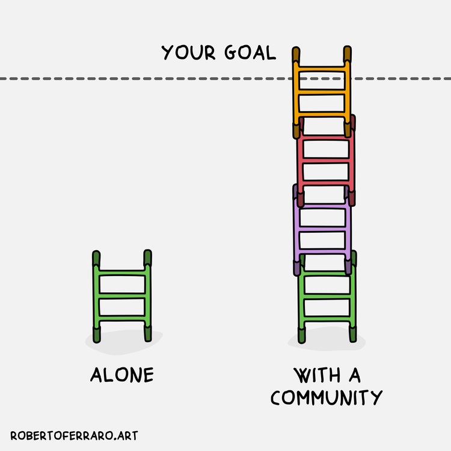

```{r setup, include=FALSE}
options(htmltools.dir.version = FALSE)

library(tidyverse)
library(kableExtra)
library(ggplot2)
library(plotly)
library(htmlwidgets)
library(MASS)
library(ggpubr)
library(xaringanthemer)
library(xaringanExtra)

style_duo_accent(
  primary_color = "#621C37",
  secondary_color = "#EE0071",
  link_color = "#7da5f5",
  background_image = "blank.png"
)

xaringanExtra::use_xaringan_extra(c("tile_view"))

# use_scribble(
#   pen_color = "#EE0071",
#   pen_size = 4
#   )

knitr::opts_chunk$set(
  fig.retina = TRUE,
  warning = FALSE,
  message = FALSE
)
```

name: Title slide
class: middle, left
<br><br><br><br><br><br><br>
# Wissenschaftliches Arbeiten und Forschungsmethoden

### Einheit 2: Forschungsfrage, Literatur, formr Einstieg und Studienorganisation
##### 15.04.2025 | Prof. Dr. Caroline Zygar-Hoffmann

---
class: top, left
name: content

### Heutige Themen

#### [Entwicklung einer Forschungsfrage](#fragestellung)

#### [Literaturrecherche](#lit-start)

#### [formr als Umfragetool](#formr)

#### [Studienorganisation](#orga)

#### [Take-Aways und Literaturempfehlung](#take-away)

#### [Material und Praxisaufgaben](#material)

---
class: top, left
name: fragestellung
<div class="footer"><span>Kapitel 5.1 in Döring, N. & Bortz, J. (2016). Forschungsmethoden und Evaluation in den Sozial- und Humanwissenschaften. Pearson. </span></div>

### Entwicklung einer Forschungsfrage

#### Recap von letzter Sitzung

Ihre Praxisaufgabe war folgende Frage zu beantworten: 

*Mit welchem Thema möchte ich mich (mit welchen Gruppenmitgliedern) beschäftigen? *

**Und nun?**

.center[
"*Nach der Wahl des Themas ist es zwingend notwendig, das zu untersuchende Forschungsproblem zu formulieren bzw. – im Deutschen ist diese Bezeichnung geläufiger – die* ***zentrale Fragestellung der Studie*** *zuzuspitzen.*

*Dies sollte üblicherweise* ***theorie- und empiriegeleitet*** *geschehen, d. h., auf der Basis vorliegender Theorien und empirischer Befunde.*

*Doch auch erste Methodenentscheidungen tragen zur Transformation eines allgemeinen Forschungsthemas (z.B. "Computerspiele") in ein untersuchbares Forschungsproblem bei.*"

(Döring & Bortz, 2016)
]

---
class: top, left
name: forschungsprozess-prereg

### Entwicklung einer Forschungsfrage

#### Forschungsfrage im Forschungsprozess

.pull-left[
**Was gehört zur Studienplanung?**

1. Theoriearbeit und Forschungsfrage $\rightarrow$ heutige und nächste Sitzung, I1 & I2 in Präregistrierung

2. Hypothesen $\rightarrow$ nächste Sitzung, I3 & I4

3. Studiendesign $\rightarrow$ nächste Sitzung, M6, M10, M11, M14 & M15 

4. Operationalisierung (Auswahl Messinstrumente)  $\rightarrow$ Einheit 4, M12, M13, AP3 & AP4

5. Statistischer Analyseplan  $\rightarrow$ Einheit 5, AP1-AP3, AP5-AP9, M7 & M8

6. Samplingplan (Rekrutierungsplan, Poweranalyse), Infos & Sonstiges $\rightarrow$ Einheit 6, M1-M5, M9, T1-T12
]

.pull-right[
```{r eval = TRUE, echo = F, fig.align='center'}
knitr::include_graphics("bilder/Forschungsprozess_Prereg.png")
```

$\rightarrow$ Wir werfen jetzt mal einen kurzen Blick in die [Präregistrierungsvorlage](https://docs.google.com/document/d/1iPSaC8tiMIYVvnC9EeM1gUMgA1AWOaQ0tHBuoPn8h3c)
]

---
class: top, left
<div class="footer"><span>Kapitel 5.1 in Döring, N. & Bortz, J. (2016). Forschungsmethoden und Evaluation in den Sozial- und Humanwissenschaften. Pearson. </span></div>

### Entwicklung einer Forschungsfrage

#### Wichtige Aspekte

* **Inhaltliche Eingrenzung des Gegenstands**: Welche Aspekte des Themas sollen untersucht werden (Eingrenzung von Zielgruppen, Zeiträumen, Effekten etc.)?

* **Bezug zum empirischen Forschungsstand**: Blick auf frühere Studien und vorliegende oder fehlende Befunde zu Einzelaspekten $\rightarrow$ **empirische Forschungslücke herausarbeiten!**

* **Wahl der Theorie(n)**: Welches sind die zentralen Theorien des eigenen Faches (und ggf. auch von Nachbardisziplinen), die auf das Thema anwendbar sind? $\rightarrow$ Berücksichtigung oder Vernachlässigung bestimmter Teilaspekte des Themas

* **Wahl der Methode(n)**: Mit welchem Untersuchungsdesign und mit welchen Datenerhebungs- und Datenauswertungsmethoden soll das Thema untersucht werden? $\rightarrow$ ggf. geht eine Forschungslücke auch durch die Wahl des Designs/der Methoden einher!

**Vorsicht: Forschungsfrage nicht zu allgemein formulieren!**

$\rightarrow$ siehe den Abschnitt "Bewertung von Forschungsfragen" im [Zusatzmaterial Z2 auf studynet](https://studynet.hs-fresenius.de/goto_STUDYNETHSF_file_40717_download.html) 

---
class: top, left
<div class="footer"><span>Kapitel 5.1 in Döring, N. & Bortz, J. (2016). Forschungsmethoden und Evaluation in den Sozial- und Humanwissenschaften. Pearson. </span></div>

### Entwicklung einer Forschungsfrage

#### Beispiel (hier "Forschungsproblem" statt "Forschungsfrage" genannt):

```{r eval = TRUE, echo = F, fig.align='center'}
knitr::include_graphics("bilder/forschungsfrage.png")
```

---
class: top, left

### Entwicklung einer Forschungsfrage

#### Beispiel Interventionsthema

* **Inhaltliche Eingrenzung des Gegenstands**: Zielgruppe steht zwar fest (Personen in Partnerschaften), aber weitere Effekte (ggf. Zeiträume) sind für eigene Forschungsfrage noch zu klären

* **Bezug zum empirischen Forschungsstand**: Empirischer Forschungsstand z.B. zu Interventionen in Beziehungen oder zu möglichen abhängigen Variablen muss recherchiert werden (z.B. mit den Suchbegriffen "psychological effects of reflection", "disclosure effects", "communication effects couples", "relationship interventions", "couples ecological momentary intervention", "[AV] intervention", "[AV] psychological effects", ...) $\rightarrow$ Identifikation einer Forschungslücke oder Replikation

* **Wahl der Theorie(n)**: Von mir gibt es nach Anmeldung des Themas ein Informations-PDF für die Interventionsgruppen mit einer kurzen Info zu einer Theorie. Darüber hinaus kann man recherchieren: Gibt es Theorien wie die Variable für die man sich interessiert in Partnerschaften entsteht, oder wie die eingesetzten Interventionen grundsätzlich wirken? 

* **Wahl der Methode(n)**: Design weitestgehend festgelegt: Experiment mit Interventions- vs. Kontrollgruppe (between-person Vergleich), wenn sich die Forschungsfrage auf diesen Aspekt des Interventionsthemas bezieht, dann grenzt sich das Design von korrelativen Studien ab

---
class: top, left
name: lit-start

### Literaturrecherche

#### Warum Literaturrecherche?

* Suche und Entwicklung eines geeigneten Themas und einer geeigneten Fragestellung

* Erste Orientierung über aktuellen Forschungsstand (auch über relevante Theorien und Modelle)

* **Im Bericht: Kernaspekte eigener Forschungsfrage theoretisch unterfüttern** (also: Wie kommt diese Fragestellung zustande, z.B. welche Konstrukte hängen theoretisch wie zusammen? Warum liegt die Fragestellung nahe, warum ist sie relevant?)

* **Im Bericht: Jede Behauptung muss mit einer entsprechenden Quelle belegt werden.**
  * Wichtig: Verschiedene Quellen und damit verschiedene Ansichten einbeziehen. 
  * Grober Richtwerk: Pro Absatz mindestens eine Quelle (je nachdem was Sie schreiben, kann das aber auch zu wenig sein)

* Formulierung konkreter Hypothesen anhand der Recherche (siehe nächste Einheit)

* **Im Bericht**: Diskussion der Befunde (Stimmen meine Befunde mit der Theorie/ vorherigen Befunde überein? Gab es Ergebnisse, mit denen ich nicht gerechnet habe? Warum könnte das so sein?)

---
class: top, left

### Literaturrecherche

#### Warum Literaturrecherche?
 
https://matt.might.net/articles/phd-school-in-pictures/#print

---
class: top, left
<div class="footer"><span>Kapitel 1.2 und 16 in Döring, N. & Bortz, J. (2016). Forschungsmethoden und Evaluation in den Sozial- und Humanwissenschaften. Pearson. </span></div>

### Literaturrecherche

#### Informationssuche planen

**Wie/wo fange ich an?**

* Literaturhinweise des Dozenten/ des Betreuers

* Fachbücher und Paper/ Artikel/ Aufsätze (z.B. Review, Meta-Analysen), die viele Informationen bzw. Ergebnisse zu Ihrem Thema zusammenfassen (Stand der Forschung erarbeiten)

* **Review**: fasst den aktuellen Forschungsstand in einem Gebiet zusammen, indem die einschlägige Literatur recherchiert, strukturiert vorstellt und bewertet wird

* **Meta-Analyse**: aggregiert Ergebnisse mehrerer früherer quantitativer Studien statistisch zu einem Gesamteffekt

**Wichtig:** Es muss keine Literatur geben, die genau dieselbe Forschungsfrage untersucht hat wie die die Sie untersuchen wollen $\rightarrow$ es ist sogar gut, wenn es die nicht gibt, denn dann hat man eine echte Forschungslücke!

---
class: top, left
name: lit-arten

### Literaturrecherche

#### Literaturarten und Umgang mit ihnen 

**Warum muss ich Literaturarten unterscheiden können?**

* Bestimmte Literaturarten finden man an bestimmten Stellen

* Nicht jede Art von Literatur ist es „würdig“ in Ihrer Arbeit aufgenommen zu werden

* Zudem wird manche Literaturgattung „lieber“ in Arbeiten gesehen als andere

**Gestaltungsmerkmale von wissenschaftlichen Texten**
* **Nachvollziehbarkeit:** die Vorgangsweise ist detailliert dokumentiert (Wiederholbarkeit, damit eine Überprüfung möglich ist)
* **Argumentation:** Es wird auf der Grundlage von Fakten/empirischen Daten argumentiert
* **Quellenangaben:** Für Theorien und Fakten sind deren (wissenschaftliche) Quellen aim Text und Literaturverzeichnis angegeben
* **Sprache:** Verwendung von Fachbegriffen, wissenschaftssprachliche Formulierung und „unpersönlicher“ Schreibstil

---
class: top, left
<div class="footer"><span>Kapitel 1.2 in Döring, N. & Bortz, J. (2016). Forschungsmethoden und Evaluation in den Sozial- und Humanwissenschaften. Pearson. </span></div>

### Literaturrecherche

#### Literaturarten und Umgang mit ihnen 

**Zitierwürdigkeit (aus wissenschaftlicher Sicht, d.h. zum Belegen von Aussagen)**

.pull-left[
**Zitierwürdig:**
* **Primärliteratur**: begutachtete (*peer-reviewed*) Artikel in Fachzeitschriften (Journals; gedruckt oder digital; möglichst nicht zu alt)
* **Wissenschaftliche Fachbücher** (aber nicht ausschließlich)
  - Monographien: Ein Autor
  - Herausgeberwerker: Mehrere Autoren
  - Fachlexika
  
**Bedingt zitierwürdig (vereinzelt in Ordnung):** graue Literatur (Dissertationen, Abschlussarbeiten, Firmenschriften) und  Internetseiten (sparsam dosieren!)
  
]

.pull-right[

**Nicht zitierwürdig:**
  * Praktikerbücher
  * Allgemeine Lexika (Brockhaus)
  * Vorlesungsskripte (weder CFH, noch andere Unis), Schulbücher, PowerPoint-Präsentationen
  * Artikel in Boulevardzeitungen / nicht peer-reviewte Zeitschriften (auch falls zu wissenschaftlichen Themen, z.B. Psychologie Heute)
  * „Abendblatt“ o.ä. (nur in Ausnahmefällen, z.B. mal um die gesellschaftliche Relevanz eines Themas aufzuzeigen)
  * Wiki-Quellen (für einen Überblick völlig in Ordnung, aber bitte Primärquellen nachgehen)
]


---
class: top, left

### Literaturrecherche

#### Literaturarten und Umgang mit ihnen 

**Woran erkenne ich einen wissenschaftlichen Artikel / eine Meta-Analyse / ein Review?**

* In einer Fachzeitschrift ("Journal") publiziert (ob die Zeitschrift peer-reviewed ist muss eigentlich separat geprüft werden)

* Fast immer: Summary / Zusammenfassung / Abstract

* In der Psychologie: Struktur folgt Einleitung, Methode, Ergebnisse, Diskussion

* Oft: doi (digital object identifier)

* Meta-Analysen und Reviews kennzeichnen dies fast immer im Titel

* Literaturverzeichnis


---
class: top, left

### Literaturrecherche

#### Literaturarten und Umgang mit ihnen 

.pull-left[
```{r eval = TRUE, echo = F, out.width="65%", fig.align='center'}
knitr::include_graphics("bilder/psychosoph-paper.png")
```
]

.pull-right[
```{r eval = TRUE, echo = F, out.width="70%", fig.align='center'}
knitr::include_graphics("bilder/meta-analysis.png")
```
]

---
class: top, left
### Literaturrecherche

#### Recherchesysteme

.pull-left[
**Google Scholar**: https://scholar.google.de/

```{r, echo=FALSE,fig.show='hold',fig.align='center'}
knitr::include_graphics("bilder/scholar.png")
``` 
]

.pull-right[

**Bei zentralen Artikeln:** Klick auf Zitieren --> BibTex --> rauskopieren (spart Ihnen später Arbeit)

[**Sci-Hub**](https://sci-hub.hkvisa.net/): https://de.wikipedia.org/wiki/Sci-Hub

[**Anna's Archive**](https://annas-archive.org): https://annas-archive.org

$\rightarrow$ siehe den Abschnitt "Literaturrecherche" im [Zusatzmaterial Z2 auf studynet](https://studynet.hs-fresenius.de/goto_STUDYNETHSF_file_40717_download.html)  für weitere Informationen, vor allem auch Recherche in wissenschaftlichen Datenbanken!!

**Sie müssen für die Literaturrecherche kein Geld ausgeben!**

]

---
class: top, left
### Literaturrecherche

#### Recherchesysteme

Links zu weiteren Möglichkeiten:

  * Lokale Bibliotheksrecherche: https://library.hs-fresenius.de/discovery/search?vid=49FHF_INST:49FHF
  
  * Datenbankrecherche: https://dbis.ur.de/dbinfo/dbliste.php?bib_id=eff&colors=7&ocolors=40&lett=f&gebiete=22

  * LibKey Nomad: von der CFH bis Ende Mai zur Verfügung gestellte Browsererweiterung für Chrome, Microsoft Edge, Safari und Firefox, die Sie direkt mit den Volltexten von beliebten Verlags- und wissenschaftlichen Webseiten im offenen Web verbinden kann. Mit der Installation und Aktivierung dieses AddOn in Ihrem Browser wird Ihnen ein einfacher Download von lizenzierten eRessourcen ermöglicht. $\rightarrow$ siehe Zusatzmaterial ["Anleitung Libkey" auf studynet](https://studynet.hs-fresenius.de/goto_STUDYNETHSF_file_41552_download.html)
  
Auf studynet finden Sie auch eine kurze Einführung in das Universum Bibliothek, siehe Zusatzmaterial ["Einführung Bibliothek" auf studynet](https://studynet.hs-fresenius.de/ilias.php?baseClass=ilrepositorygui&cmd=sendfile&ref_id=41555).
  
---
class: top, left
### Literaturrecherche

#### Bewertungsschema

.center[
```{r eval = TRUE, echo = F}
knitr::include_graphics("bilder/bewertung_forschungsfrage_lit.png")
```
]


---
class: top, left
### Literaturrecherche

#### Präregistrierung

.center[
```{r eval = TRUE, echo = F, out.width = "40%"}
knitr::include_graphics("bilder/prereg_template_forschungsfrage.png")
```
]

$\rightarrow$ I1 weniger wichtig als I2: **Literatur kann später nach der Präregistrierung noch ergänzt werden** (Literaturrecherche beginnt jetzt und wird erst zum Ende der Vorlesung beendet werden, wenn die Präregistrierung schon längst fertig abgeschickt ist)

$\rightarrow$ Ausblick für das Ende der heutigen Sitzung: Das ist eine Praxisaufgabe zur Bearbeitung bis nächste Woche!

---
class: top, left
name: formr 

### formr als Umfragetool

#### Überblick

* Warum benutzen wir es? Mächtig, flexibel und kostenlos

* Grundidee: Studie ist ein "Run", der aus verschiedenen Teilen, z.B. "Surveys" (=Fragebögenteilen) besteht

* Beispiel für einen Run:
  * Survey 1: Einleitende Fragen
  * Survey 2: Pro Bedingung eine andere Aufgabe
  * Survey 3: Abschließende Fragebögen

$\rightarrow$ **Es ist ok, wenn der Run auch nur aus einem Survey besteht! Je nach Komplexität Ihrer Studie völlig ausreichend. Es braucht aber immer einen Run.**

* Anlegen von Surveys in Excel-Dokumenten mit zwei "Mappen":
  * Fragen ("Survey Spreadsheet")
  * Antwortskalen ("Choices Spreadsheet")
$\rightarrow$ Darauf gehen wir heute nicht weiter ein, aber das wird noch Thema werden.

* Vorlage für ein Survey auf Studynet (inkl. Einwilligungserklärung)

---
class: top, left

### formr als Umfragetool

#### Einstieg

Wir konzentrieren uns heute auf den grundlegenden Umgang mit formr.

Aufgabe/Frage                                                                           | Antwort
--------------------------------------------------------------------------------------- | -------- 
Wie lege ich den Namen eines Surveys fest?                                              | Die Exceldatei umbenennen
Wie logge ich mich bei der formr Testumgebung ein?                                      | Folgenden Link im Browser aufrufen: https://workshops.formr.org/  <br> **Logindaten**: Email: cfhwaf2@gmail.com PW: 7g6z5mRq! <br><br> Falls ein Fehler kommt: <br> 1) Prüfen, ob man wirklich auf *workshops*.formr.org ist (und nicht etwa auf formr.org) <br> 2) Prüfen, ob man sich bei den Logindaten nicht vertippt hat <br> 3) Mit dem Browser in den Inkognito-Modus gehen: z.B. bei Chrome "Neues Inkognito-Fenster", bei Safari "Neues privates Fenster"


---
class: top, left

### formr als Umfragetool

#### Einstieg

Aufgabe/Frage                                                                           | Antwort
--------------------------------------------------------------------------------------- | -------- 
Wie lade ich ein Survey auf formr hoch?                                                 | **Nach dem Einloggen**: *Surveys (oben) -> Create new survey -> links: Upload an item table -> Choose file (Excel-Datei) -> Upload*
Wie schaue ich mir an, wie das Survey später im Browser aussieht? ("das Survey testen") | **Grundsätzlich**: *Surveys (oben) -> View all -> eigenes Survey aus der Liste raussuchen und anklicken (dafür muss man den Namen des eigenen Surveys kennen!) -> "Test survey" (links)*  <br> <br> **Fortgeschrittener Modus**: Wenn man im Test der Umfrage ist und unten auf "Monkey Mode" klickt, füllt formr die Antworten auf einer Seite testhalber für einen aus, und man gelangt automatisch zur nächsten Seite (spart einem das Anklicken aller Antworten um weiter zu kommen)


---
class: top, left
name: orga

### Studienorganisation

####  Ordnerstruktur

.pull-left[
**Ziel einer guten Ordnerstruktur**: Sie können den Ordner mit allen Unterordnern kopieren, jemandem zukommen lassen, und diese Person versteht was gemacht wurde und wie die Analysen wiederholt werden können

**Englische Ordnernamen bevorzugt**, um breitere Verständlichkeit zu gewährleisten

**Readme-Textdatei** auf dem obersten Level empfohlen, um alles Nicht-Selbsterklärendes zu erklären

$\rightarrow$ Aktuell ist nur der Ordner "literature" relevant. Wir werden später wenn es um die Auswertung geht Sinn & Zweck der anderen Ordner besprechen

]

.pull-right[
```{r eval = TRUE, echo = F, fig.cap = "Vorschlag für eine gute Ordnerstruktur"}
knitr::include_graphics("bilder/ordnerstruktur.png")
```
]

---
class: top, left

### Studienorganisation

####  Ordnerstruktur

* Es wäre praktisch, wenn Sie sich in der Kleingruppe nicht ständig Ordner oder Dateien hin und her schicken müssen, daher macht es Sinn, die Ordnerstruktur in einer geteilten Umgebung ("Cloud") anzulegen, in der alle Personen der Kleingruppe Zugriff haben und immer die neueste Version der Dateien liegt 

* **aber Achtung: Rohdaten sollten nicht einfach irgendwo im Internet hochgeladen werden, sondern erst wenn Sie gemäß der Datenschutzrichtlinien bearbeitet worden sind (z.B. bei uns: Pseudonym gelöscht)**

* Idealerweise gibt es eine automatische Synchronisation zwischen der Cloud und lokalen Ordnern (dann muss man nichts manuell hochladen/runterladen), z.B. mit OneDrive


---
class: top, left
<div class="footer"><span>https://www.robertoferraro.net/illustrations</span></div>

### Studienorganisation

#### Zusammenarbeit in Gruppen

.center[
```{r eval = TRUE, echo = F, out.width = "40%"}

```
]

---
class: top, left

### Studienorganisation

#### Zusammenarbeit in Gruppen

Neben den Vorteilen, gibt es aber auch häufige Probleme:

| Problem                                         | Generelle Lösung                                                                                                                              | Beispiel für spezifische Lösung                                                                                                                                                                                                                                                                                            |
|-------------------------------------------------|------------------------------------------------------------------------------------------------------------------------------------------------|-----------------------------------------------------------------------------------------------------------------------------------------------------------------------------------------------------------------------------------------------------------------------------------------------------------------------------|
| **Kommunikationsprobleme und Missverständnisse** | Klare Kommunikationskanäle und Erwartungen festlegen                                                                                          | Gruppe in einem Messenger anlegen, den alle nutzen <br>  Gemeinsame E-Mailadresse, die immer in cc ist? Wird in der Gruppenanmeldung als optional erfragt.                                                                                                                                                                                                                            |
| **Ungleichgewicht der Arbeitslast**             | Klare Rollenverteilung, gemeinsame Zielsetzung, verbindliche Deadlines                                                                        | Option: Erstellen Sie einen gemeinsam aufgesetzten (nicht-juristischen) "Gruppenarbeits-Vertrag", unterschreiben Sie ihn alle, und nach Wunsch können Sie diesen auch bei mir persönlich oder [digital im studynet abgeben](https://studynet.hs-fresenius.de/ilias.php?baseClass=ilrepositorygui&cmdNode=zx:tb&cmdClass=ilObjTestGUI&cmd=infoScreen&ref_id=40710&ref_id=40710). |

---
class: top, left

### Studienorganisation

#### Zusammenarbeit in Gruppen

Neben den Vorteilen, gibt es aber auch häufige Probleme:

| Problem                                                    | Generelle Lösung                                                                                      | Beispiel für spezifische Lösung                                                                                                                                                           |
|------------------------------------------------------------|--------------------------------------------------------------------------------------------------------|--------------------------------------------------------------------------------------------------------------------------------------------------------------------------------------------|
| **Mangelnde/Ineffektive Zusammenarbeit und Koordination**  | Regelmäßige Treffen/Austausch, regelmäßige Fortschrittsabfrage, gemeinsame Arbeitsplattform            | Praxisaufgaben sind so angelegt, dass sie bis zur nächsten Vorlesung bearbeitet werden: Wer hat in welcher Woche den Hut auf für die Koordination der Praxisaufgabe? <br> Nutzung von OneDrive zur Synchronisation von Dateien. |
| **Qualitätsunterschiede bei der Beitragserstellung**       | Konstruktives Feedback, bei Unstimmigkeiten eine dritte Person konsultieren                             | Andere Gruppenmitglieder oder einen Dozent zur Vermittlung hinzuziehen                                                                                          

$\rightarrow$ Ich kann bei Gruppenproblemen konsultiert werden; aber bitte nicht erst eine Woche vor Abgabe bemängeln, dass es nicht läuft

---
class: top, left
name: take-away

### Take-Aways

.full-width[.content-box-gray[
* Die Entwicklung einer Forschungs**frage** ist der wichtige erste Schritt im Forschungsprozess, und unterscheidet sich von konkreten spezifischen Hypothesen. Sie dreht sich um eine **Forschungslücke** oder eine **Replikation**. 

* Wissenschaftlich relevante Literatur ist in der Regel **peer-reviewed**

* Im Bericht müssen alle Behauptungen konsequent **durch Quellen belegt** werden

* **formr** ist ein Umfragetool bei dem es zwingend immer einen sognannten **Run** gibt, und bei dem die Umfragen-Details über eine **Excel-Datei** bestimmt werden (= ein Survey). Man kann mehrere Surveys zu einem Run zusammenstellen, ein Run kann aber auch nur aus einem Survey bestehen.

* Absprachen und Schaffen von gemeinsam akzeptierten Verbindlichkeiten ist wichtig für eine **effektive und zufriedenstellende Gruppenarbeit**
]
]
**[zurück zur heutigen Übersicht der Vorlesung $\rightarrow$](#content)** 

---
class: top, left
### Literaturempfehlung für die heutige Sitzung

.center[
```{r, echo=FALSE,out.width="30%",fig.cap="Kapitel 1.2, 5 und 6 in Döring, N. & Bortz, J. (2016). Forschungsmethoden und Evaluation in den Sozial- und Humanwissenschaften. Pearson.",fig.show='hold',fig.align='center'}
knitr::include_graphics("bilder/doering.png")
``` 
]

---
class: top, left
name: material

### Material

.small[

* **Bewertungsschema**: https://studynet.hs-fresenius.de/ilias.php?baseClass=ilrepositorygui&cmd=sendfile&ref_id=40709

*	**Strategien Themensuche**: https://studynet.hs-fresenius.de/ilias.php?baseClass=ilrepositorygui&cmd=sendfile&ref_id=40717

*	**Checkliste Ethik**: https://studynet.hs-fresenius.de/ilias.php?baseClass=ilrepositorygui&cmd=sendfile&ref_id=40715

*	**Google Doc Gruppenfindung**: https://docs.google.com/document/d/1XFIOSoInrrcjd92raPK3sA4vSVKepVvznOqkWKRKG9k/edit

* **Umfrage zur Einreichung Gruppenname und Thema**: https://studynet.hs-fresenius.de/ilias.php?baseClass=ilobjsurveygui&cmd=infoScreen&ref_id=40711

* **Bewertung von Forschungsfragen & Literaturrecherche**: https://studynet.hs-fresenius.de/ilias.php?baseClass=ilrepositorygui&cmd=sendfile&ref_id=41560

* **Einführung Bib**: https://studynet.hs-fresenius.de/goto_STUDYNETHSF_file_41555_download.html

* **Anleitung LibKey**: https://studynet.hs-fresenius.de/goto_STUDYNETHSF_file_41552_download.html

* **Template Präregistrierung**: https://docs.google.com/document/d/1iPSaC8tiMIYVvnC9EeM1gUMgA1AWOaQ0tHBuoPn8h3c/

* **Template formr eigenes Thema**: https://studynet.hs-fresenius.de/goto_STUDYNETHSF_file_41556_download.html
]

---
class: top, left

### Praxis: Idee entwickeln & Literaturrecherche & formr Einstieg & Gruppenorganisation 

**Schritt 1: Führen Sie eine kurze Literaturrecherche durch.** 
* Gibt es Reviews oder Meta-Analysen zu Ihren Untersuchungsideen? Gibt es aktuelle empirische Studien (d.h. von 2020 oder neuer), die dazu passen?
  * Lesen Sie die Abstracts.
  * Schreiben Sie sich interessante Methoden und Ergebnisse raus.

* Strukturieren/Kommentieren Sie die gefundene Literatur, z.B. in einem Literaturverwaltungsprogramm

* **Leitfragen bei der Literaturrecherche:**
  * Welche Antworten gibt es zu diesem Thema bereits?
  * Welche Fragen sind noch ungeklärt? Und wie kann ich Antworten auf diese Fragen finden?

---
class: top, left

### Praxis: Idee entwickeln & Literaturrecherche & formr Einstieg & Gruppenorganisation 

.pull-left[
**Schritt 2a: Einigen Sie sich auf Thema + Gruppennamen und legen Sie das GoogleDoc mit der Präregistrierung an**
  * Bewerten Sie dafür Ihre Ideen hinsichtlich der gefundenen Literatur und nach den Anforderungen aus Einheit 1.
  * Idealerweise hat Ihr Gruppenname etwas mit Ihrem Thema zu tun.
  * Eine/r macht eine Kopie der [Präregistrierungsvorlage](https://docs.google.com/document/d/1iPSaC8tiMIYVvnC9EeM1gUMgA1AWOaQ0tHBuoPn8h3c/edit?tab=t.0#heading=h.3vcu1lp9loam) über Datei -> Kopie erstellen (nicht strg+c und strg+v, da sonst die Kommentare verloren gehen!), gibt diese für alle Gruppenmitglieder als Bearbeiter frei und stellt ein, dass diejenigen die über den Link verfügen das Dokument betrachten können $\rightarrow$ das ist Ihr Open Lab Book
]

.pull-right[
```{r eval = TRUE, echo = F, fig.align='center'}
knitr::include_graphics("bilder/copy-prereg-template.png")
```
]

---
class: top, left

### Praxis: Idee entwickeln & Literaturrecherche & formr Einstieg & Gruppenorganisation 

**Schritt 2b: Melden Sie Ihre Gruppe an**
  * Teilen Sie mir Ihren Gruppennamen, Ihr Thema und Ihr GoogleDoc **bis spätestens (!) 20.04.** über die [Umfrage im studynet](https://studynet.hs-fresenius.de/ilias.php?baseClass=ilobjsurveygui&cmd=infoScreen&ref_id=40711) mit (es reicht wenn eine Person aus der Gruppe die Anmeldung für alle ausfüllt).
  
**Schritt 3 (kann auch parallel mit Schritt 2 passieren): Strukturieren Sie Ihre Themenidee zu einer Forschungsfrage (kann auch eine Replikation sein).** 
  * Bewerten Sie  Ihre Forschungsfrage nach wissenschaftlichen und ethischen Kriterien (siehe "Bewertung von Forschungsfragen" im [Zusatzmaterial Z2 auf studynet](https://studynet.hs-fresenius.de/goto_STUDYNETHSF_file_40717_download.html)).
  * Beginnen Sie damit, Abschnitt I1 und I2 der Präregistrierung mit den Inhalten zu füllen, die zu der Auswahl ihrer Forschungsfrage geführt haben.
  * Mittelfristig: Intensivieren Sie die Literaturrecherche, um die Forschungsfrage zu schärfen (vgl. auch nächste Sitzung)

  
---
class: top, left

### Praxis: Idee entwickeln & Literaturrecherche & formr Einstieg & Gruppenorganisation 

**Schritt 4: formr Einstieg (jeder, d.h. jedes Gruppenmitglied!)**
  * Laden Sie sich die [formr Vorlage für eigene Themen](https://studynet.hs-fresenius.de/goto_STUDYNETHSF_file_41556_download.html) von studynet herunter (auch wenn Sie das Interventionsthema gewählt haben, es geht erstmal nur ums Testen)
  * Benennen Sie die Datei um, so dass der Dateiname nicht mehr "formr_template_eigenesThema" ist, sondern aus Ihrem Vornamen und dem ersten Buchstaben von Ihrem Nachnamen besteht, z.B. "CarolineZ"
  * Laden Sie das nach Ihnen benannte Survey in https://workshops.formr.org hoch
  * Testen Sie das Survey, d.h. schauen Sie es sich im Browser an
  
**Schritt 5: Besprechen Sie zentrale Rahmenbedingungen (vgl. Folie 25f) zur Gruppenarbeit**
  * Empfehlung: Erstellen Sie einen gemeinsam aufgesetzten (nicht-juristischen) "Gruppenarbeits-Vertrag", unterschreiben Sie ihn alle, und optional können Sie diesen auch bei mir persönlich oder digital im studynet abgeben, um Verbindlichkeit zu schaffen
  * Legen Sie sich eine gemeinsame Ordnerstruktur an (z.B. wie auf Folie 22), die innerhalb der Gruppe synchronisiert ist (z.B. über OneDrive), und legen Sie dort relevante Literatur für Ihr gesammeltes Thema ab

  
  
<!-- * Kristallisieren Sie einen konkreten Untersuchungsvorschlag heraus  -->
<!--   * Was wäre die Fragestellung?  -->
<!--   * Was wäre Ihre abhängige, was Ihre unabhängige Variable?  -->
<!--   * Wen würden Sie untersuchen (Ein- und Ausschlusskriterien)?  -->
<!--   * Mit welchen Mitteln? -->
<!--   * In welchem Untersuchungsdesign? -->

<!-- library(renderthis) -->
<!-- to_pdf("WissArb_02_Forschungsfrage_Literatur.Rmd", complex_slides = TRUE) -->
