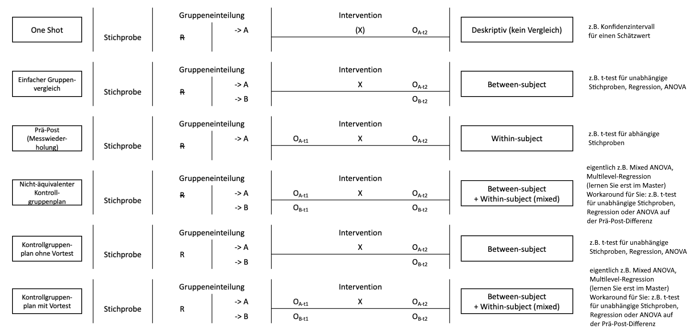

```{r setup, include=FALSE}
options(htmltools.dir.version = FALSE)

library(tidyverse)
library(kableExtra)
library(ggplot2)
library(plotly)
library(htmlwidgets)
library(MASS)
library(ggpubr)
library(xaringanthemer)
library(xaringanExtra)

style_duo_accent(
  primary_color = "#621C37",
  secondary_color = "#EE0071",
  link_color = "#7da5f5",
  background_image = "blank.png"
)

xaringanExtra::use_xaringan_extra(c("tile_view"))

# use_scribble(
#   pen_color = "#EE0071",
#   pen_size = 4
#   )

knitr::opts_chunk$set(
  fig.retina = TRUE,
  warning = FALSE,
  message = FALSE
)
```

name: Title slide
class: middle, left
<br><br><br><br><br><br><br>
# Wissenschaftliches Arbeiten und Forschungsmethoden

### Einheit 3: Theoriearbeit und Studiendesign
##### 24.04.2024 | Dr. Caroline Zygar-Hoffmann

---
class: top, left

### Exkurs: Metapsy

.center[
https://www.metapsy.org/

```{r eval = TRUE, echo = F, out.width="40%"}
knitr::include_graphics("bilder/metapsy.png")
```
]

$\rightarrow$ Website, welche Evaluationsforschung von psychotherapeutischen Interventionen zugänglich macht

$\rightarrow$ https://twitter.com/EikoFried/status/1746873387727659138: "In the video I'll show researchers (part I) and clients (part II) how to run a systematic meta-analysis looking into the effect of CBT on depression in older adults within 1 minute."

---
class: top, left
name: content

### Heutige Themen

#### [Theoriearbeit und Hypothesenformulierung](#hypothesen)

#### [Studiendesign](#studiendesign)

#### [Material und Praxisaufgaben](#praxis)

#### [Literaturempfehlung](#literatur)

---
class: top, left
name: hypothesen

### Theoriearbeit und Hypothesenformulierung

#### Hypothesen im Forschungsprozess

.pull-left[
**Was gehört zur Studienplanung?**

1. Theoriearbeit und Literaturrecherche $\rightarrow$ letzte und heutige Sitzung

2. Hypothesenformulierung $\rightarrow$ heutige Sitzung

3. Design Plan $\rightarrow$ heutige Sitzung

4. Variablen (Auswahl Messinstrumente und Variablenrollen)  $\rightarrow$ nächste Sitzung, Einheit 4

5. Statistischer Analyseplan  $\rightarrow$ Einheit 5

6. Sampling plan (Rekrutierungsplan) $\rightarrow$ Einheit 6

$\rightarrow$ Studienplanung in **Präregistrierung** festhalten
]

.pull-right[
```{r eval = TRUE, echo = F, fig.align='center'}
knitr::include_graphics("bilder/Forschungsprozess_Prereg.png")
```
]

---
class: top, left

### Theoriearbeit und Hypothesenformulierung

#### Hypothesen in der Präregistrierung

* Das klare Benennen der konfirmatorischen Hypothesen ist eine der zentralsten Aufgaben der Präregistrierung

* Hypothese meint die verbale Erklärung der erwarteten Beziehung zwischen den Variablen

* Meist nur Angabe der Alternativhypothese

* Bei Interaktionseffekten: erwartete Form der Interaktion (z.B. graphisch veranschaulicht, oder konkrete Vorhersagen für Haupt- und Interaktionseffekte)
  
* Auch wenn man nur explorative Analysen vor hat: "Wir haben keine spezifischen a-priori-Hypothesen" $\rightarrow$  verhindert HARKing

---
class: top, left
### Theoriearbeit und Hypothesenformulierung

#### Hypothesenformulierung

* Führen Sie **spezifische, prägnante und überprüfbare** Hypothesen auf

* Benutzen Sie möglichst **eindeutige Begriffe** (aus der Literatur) für in der Hypothese vorkommende/relevante Variablen

* Überlegen Sie, ob es sich um **gerichtete oder ungerichtete** Hypothesen handelt und formulieren Sie Ihre Hypothesen entsprechend 

* Hypothesen können in **Primär- und Sekundärhypothesen** unterteilt werden (z.B. Primärhypothese: "Je mehr Bestätigung ein Kind von seinen Eltern erfährt, desto höher ist der spätere Selbstwert.", Sekundärhypothese: "Dieser Zusammenhang ist besonders stark für Einzelkinder im Vergleich zu Kindern mit einem oder mehr Geschwistern.")

* Konfirmatorische Hypothesen sind von explorativen Fragestellungen zu trennen (d.h. davon, was man sich sonst noch so anschauen möchte, ohne konkrete Annahme oder Spezifikation der konkreten Analyse)

* Achten Sie bereits in Ihren Hypothesen darauf kausale Sprache zu vermeiden ("X beeinflusst Y"), wenn Sie kein Studiendesign planen, welches kausale Schlüsse zulässt (stattdessen z.B. "X hängt zusammen mit Y" oder "Je mehr X, desto mehr Y")

---
class: top, left
### Theoriearbeit und Hypothesenformulierung

#### Bewertungsschema und Präregistrierung

.center[
```{r eval = TRUE, echo = F}
knitr::include_graphics("bilder/bewertung_hypothesen.png")
```

```{r eval = TRUE, echo = F}
knitr::include_graphics("bilder/bewertung_trennunghypothesen.png")
```
]

---
class: top, left
### Theoriearbeit und Hypothesenformulierung

#### Bewertungsschema und Präregistrierung

.center[
```{r eval = TRUE, echo = F, out.width = "60%"}
knitr::include_graphics("bilder/prereg_template_hypothesen.png")
```
]

---
class: top, left
name: studiendesign

### Studiendesign

#### Forschungsstrategien: Wie untersucht man eine Hypothese?

* Qualitative vs. quantitative Herangehensweise

* Experimenteller vs. Assoziativer/korrelativer Ansatz 

* Quasi-experimenteller Ansatz

* Laborstudie vs. Feldstudie (Unterscheidung oft nur bei (quasi-)experimentellen Ansätzen)

* Längsschnittlicher vs. Querschnittlicher Ansatz

* Sekundär- und Metaanalysen

$\rightarrow$ **Für unser Praxisprojekt kommen rein qualitative Studien und Sekundär- und Metaanalysen nicht in Frage (und Länggschnittstudien nur in sehr begrenztem Umfang, bitte absprechen)**


---
class: top, left
### Studiendesign

#### Experimenteller vs. Assoziativer Ansatz

Beispiel: Koffein und Intelligenz

.pull-left[
**Experimenteller Ansatz:**

1. Intelligenzmessung (AV = Leistung)

2. Zufällige Gruppenzuweisung

3. Intervention (UV = Gruppe)

  * Experimentalgruppe: Kaffee 
  * Kontrollgruppe: Placebo koffeinfreier Kaffee 

4. Intelligenzmessung

]
.pull-right[
**Assoziativer Ansatz**

1. Erfragen des täglichen Koffeeinkonsums (UV)

2. Intelligenztest durchführen (AV = Leistung)

3. Prüfen gemeinsamen variierens (Korrelation)

* Gefahr von Scheinzusammenhängen
]


---
class: top, left
### Studiendesign

#### Präregistrierung

.center[
```{r eval = TRUE, echo = F, out.width = "60%"}
knitr::include_graphics("bilder/prereg_template_design1.png")
```
]

---
class: top, left
### Studiendesign

#### Präregistrierung

.center[
```{r eval = TRUE, echo = F, out.width = "60%"}
knitr::include_graphics("bilder/prereg_template_design2.png")
```
]

---
class: top, left
### Studiendesign

#### Bewertungsschema

.center[
```{r eval = TRUE, echo = F}
knitr::include_graphics("bilder/bewertung_prozedur.png")
```
]

---
class: top, left
<div class="footer"><span>Icons designed by Freepik: https://de.freepik.com/icon/haekchen_5290058 and https://de.freepik.com/icon/stornieren_5290141</span></div>

### Studiendesign

#### Übersicht über verschiedene Möglichkeiten

.center[
```{r eval = TRUE, echo = F, out.width = "780px"}

```
]

**In der Übersicht fehlen reine Korrelations- und Regressionsanalysen ohne Gruppenzuteilung, welche auch in Ordnung für das eigene Thema sind!**

---
class: top, left
### Studiendesign

#### Übersicht über verschiedene Möglichkeiten

Verbalisierte Beispiele: Koffeinkonsum und Wachheit

**One-Shot: **Wie wach sind die Kaffetrinker in der Stichprobe?

**Einfacher Gruppenvergleich: **Wie wach sind die weiblichen vs. männlichen Kaffetrinker in der Stichprobe?

**Prä-Post Vergleich: **Wie hoch ist der Unterschied in der Wachheit bevor und nach dem Konsum von Kaffee?

**Nicht-äquivalenter Kontrollgruppenplan (Quasi-Experiment):** Wie hoch ist der Unterschied in der Prä-Post Messung von Leuten die morgens Kaffee trinken im Vergleich zu denen, die morgens entkaffenierten Kaffee trinken.

**Kontrollgruppenplan ohne Vortest: **Wie hoch ist der Unterschied in der Wachheit zwischen denen die zufällig einer Kaffee Bedingung zugeteilt wurden vs. denen die zufällig einer entkaffenierten Kaffee Bedingung zugeteilt wurden.

**Kontrollgruppenplan mit Vortest: **Wie hoch ist der Prä-Post Unterschied in der Wachheit zwischen denen die zufällig einer Kaffee Bedingung zugeteilt wurden vs. denen die zufällig einer entkaffenierten Kaffee Bedingung zugeteilt wurden.

---
class: top, left
### Studiendesign

#### "The Replication Recipe"

.center[
```{r eval = TRUE, echo = F, out.width = "600px"}
knitr::include_graphics("bilder/Brandt2014.png")
```
]

$\rightarrow$ Für diejenigen spannende Literatur, die eine direkte Replikation planen
---
class: top, left

### Praxis: Idee & Studiendesign entwickeln

#### Angemessen komplexe Analysen im Rahmen dieser Vorlesung

* t-test für unabhängige Stichproben für einen Mittelwertsvergleich zwischen zwei Gruppen

* Korrelationsanalyse für den Zusammenhang zwischen zwei Variablen

* Lineare Regression ausschließlich mit Haupteffekten oder maximal einem Interaktionseffekt für die Vorhersage einer numerischen Variable

* t-test für abhängige Stichproben für Mittelwertsunterschiede auf einer Variable in einem Pre-Post-Design

* 1- oder 2-faktorielle ANOVA (generell bei UV: nicht zuviele Stufen!) für eine numerische abhängige Variable

---
class: top, left
name: praxis

### Praxis: Idee & Studiendesign entwickeln

**Schritt 0 (falls noch nicht geschehen): Einigen Sie sich auf ein Thema und geben Sie Ihrer Gruppe einen Namen**
  * Bewerten Sie dafür Ihre Ideen hinsichtlich der gefundenen Literatur und nach den Anforderungen aus Einheit 1 und einigen Sie sich auf ein Thema.
  * Idealerweise hat Ihr Gruppenname etwas mit Ihrem Thema zu tun
  * Teilen Sie mir Ihren Gruppennamen und Ihr Thema **bis spätestens (!) 26.04.** über die [Umfrage im studynet](https://studynet.hs-fresenius.de/ilias.php?baseClass=ilobjsurveygui&cmd=infoScreen&ref_id=26551) mit (eine Umfrage pro Gruppenmitglied). 

**Schritt 1: Erweiterte Literaturrecherche, Hypothesenformulierung und Schärfung der Forschungsfrage**
* Was sind Ihre Hypothesen? (**maximal 2 Primärhypothesen mit maximal einer Sekundärhypothese!** Explorieren können Sie immer.)
  * Sagen Sie eine numerische Variable vorher (keine dichotome ja/nein-Variable und keine kategoriale Variable)?
  * Können Sie diese Hypothese mit den vorgegebenen statistischen Analysen untersuchen?
* Wie sieht ein Studiendesign aus, das sich gut eignet um Ihre Hypothesen zu prüfen?
  * Hinweis: Bleiben Sie im Rahmen Ihres Projekts bei einfachen Designs
* Konkretisieren Sie Ihre Forschungsfrage, falls nötig

---
class: top, left

### Praxis: Idee & Studiendesign entwickeln

**Schritt 2: Dokumentation und ggf. Feedback zu Ihren Entscheidungen**
* Dokumentieren Sie Entscheidungen in Ihrem Open-Notebook-GoogleDoc
* Erweitern Sie das [Präregistrierungstemplate auf studynet](https://studynet.hs-fresenius.de/goto_STUDYNETHSF_file_27541_download.html) mit Ihrer neuen Literatur/geschärften Forschungsfrage/den Hypothesen (Abschnitte I1 bis I4) und dem Studiendesign (Abschnitte M6, M10, M11, M14)
* Bereiten Sie ggf. offene Fragen für die nächste bzw. übernächste Sitzung vor ([siehe PDF auf studynet zur Zuordnung welche Gruppe an welchem Termin Feedback bekommt](https://studynet.hs-fresenius.de/goto_STUDYNETHSF_file_28341_download.html))

---
class: top, left
name: material

### Material

* **Bewertungsschema**: [https://studynet.hs-fresenius.de/ilias.php?baseClass=ilrepositorygui&cmd=sendfile&ref_id=27027](https://studynet.hs-fresenius.de/ilias.php?baseClass=ilrepositorygui&cmd=sendfile&ref_id=27027)

*	**Strategien Themensuche**: [https://studynet.hs-fresenius.de/ilias.php?baseClass=ilrepositorygui&cmd=sendfile&ref_id=26582](https://studynet.hs-fresenius.de/ilias.php?baseClass=ilrepositorygui&cmd=sendfile&ref_id=26582)

*	**Checkliste Ethik**: [https://studynet.hs-fresenius.de/ilias.php?baseClass=ilrepositorygui&cmd=sendfile&ref_id=26580](https://studynet.hs-fresenius.de/ilias.php?baseClass=ilrepositorygui&cmd=sendfile&ref_id=26580)

* **Umfrage zur Einreichung Gruppenname und Thema**: [https://studynet.hs-fresenius.de/ilias.php?baseClass=ilobjsurveygui&cmd=infoScreen&ref_id=26551](https://studynet.hs-fresenius.de/ilias.php?baseClass=ilobjsurveygui&cmd=infoScreen&ref_id=26551)

* **Zusatzmaterial Z2 Literaturrecherche, Bewertung von Forschungsfragen & Referenzen**: [https://studynet.hs-fresenius.de/ilias.php?baseClass=ilrepositorygui&cmd=sendfile&ref_id=27540](https://studynet.hs-fresenius.de/ilias.php?baseClass=ilrepositorygui&cmd=sendfile&ref_id=27540)

* **Template Präregistrierung**: [https://studynet.hs-fresenius.de/goto_STUDYNETHSF_file_27541_download.html](https://studynet.hs-fresenius.de/goto_STUDYNETHSF_file_27541_download.html)

*	**Fragenforum**: [https://cfh-waf.forumieren.de/](https://cfh-waf.forumieren.de/)

* **Zuordnung Gruppe zu Ansprechpartner und Feedbacktermin**: https://studynet.hs-fresenius.de/goto_STUDYNETHSF_file_28341_download.html


---
class: top, left
name: literatur
### Literaturempfehlung für die heutige Sitzung

.center[
```{r, echo=FALSE,out.width="30%",fig.cap="Kapitel 6 und 7 in Döring, N. & Bortz, J. (2016). Forschungsmethoden und Evaluation in den Sozial- und Humanwissenschaften. Pearson.",fig.show='hold',fig.align='center'}
knitr::include_graphics("bilder/doering.png")
``` 
]

<!-- library(renderthis) -->
<!-- to_pdf("WissArb_03_Theoriearbeit_Studiendesign.Rmd", complex_slides = TRUE) -->
