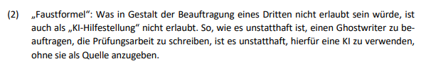
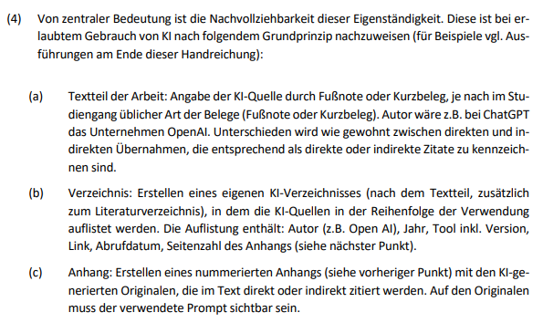
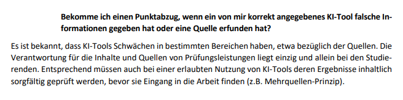
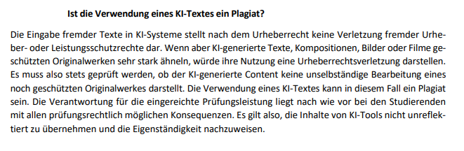
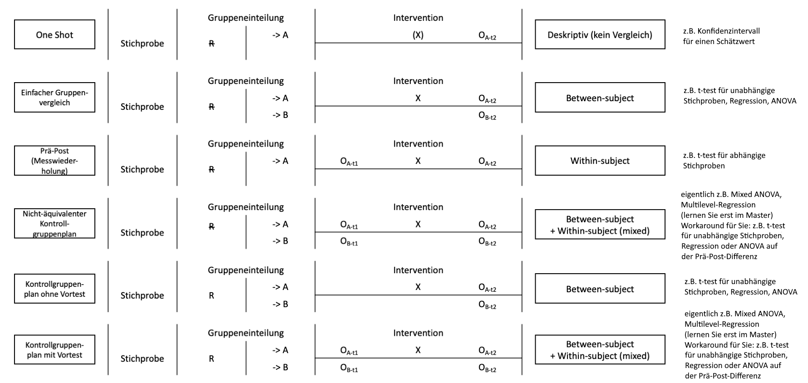

```{r setup, include=FALSE}
options(htmltools.dir.version = FALSE)

library(tidyverse)
library(kableExtra)
library(ggplot2)
library(plotly)
library(htmlwidgets)
library(MASS)
library(ggpubr)
library(xaringanthemer)
library(xaringanExtra)

style_duo_accent(
  primary_color = "#621C37",
  secondary_color = "#EE0071",
  link_color = "#7da5f5",
  background_image = "blank.png"
)

xaringanExtra::use_xaringan_extra(c("tile_view"))

# use_scribble(
#   pen_color = "#EE0071",
#   pen_size = 4
#   )

knitr::opts_chunk$set(
  fig.retina = TRUE,
  warning = FALSE,
  message = FALSE
)
```

name: Title slide
class: middle, left
<br><br><br><br><br><br><br>
# Wissenschaftliches Arbeiten und Forschungsmethoden

### Einheit 3: Theoriearbeit und Studiendesign
##### 22.04.2025 | Prof. Dr. Caroline Zygar-Hoffmann

---
class: top, left
name: content

### Heutige Themen

#### Theoriearbeit
* [Quellen & Referenzen](#zit-start)
* [Hypothesenformulierung](#hypothesen)

#### [Studiendesign](#studiendesign)

#### [formr als Umfragetool](#formr)

#### [Material und Praxisaufgaben](#praxis)

#### [Literaturempfehlung](#literatur)

---
class: top, left
name: hypothesen

### Theoriearbeit und Studiendesign

#### Hypothesen und Studiendesign im Forschungsprozess

.pull-left[
**Was gehört zur Studienplanung?**

1. Theoriearbeit und Forschungsfrage $\rightarrow$ letzte und heutige Sitzung, I1 & I2 in Präregistrierung

2. Hypothesen $\rightarrow$ heutige Sitzung, I3 & I4

3. Studiendesign $\rightarrow$ heutige Sitzung, M6, M10, M11, M14 & M15 

4. Operationalisierung (Auswahl Messinstrumente)  $\rightarrow$ nächste Sitzung, M12, M13, AP3 & AP4

5. Statistischer Analyseplan  $\rightarrow$ Einheit 5, AP1-AP3, AP5-AP9, M7 & M8

6. Samplingplan (Rekrutierungsplan, Poweranalyse), Infos & Sonstiges $\rightarrow$ Einheit 6, M1-M5, M9, T1-T12
]

.pull-right[
```{r eval = TRUE, echo = F, fig.align='center'}
knitr::include_graphics("bilder/Forschungsprozess_Prereg.png")
```
]

---
class: top, left
name: zit-start

### Theoriearbeit: Quellen & Referenzen

#### Zitieren

**Was ist Zitieren?**

* Sinngemäße oder wörtliche Wiedergabe von sachlicher Information oder Meinung eines anderen.

**Ziele und Funktionen vom Zitieren**
* Beweisfunktion (wissenschaftliche Belegung Ihrer Behauptungen)
* Abgrenzung von eigenen Gedankengängen, Überlegungen und Annahmen
* Gibt Ihren Aussagen mehr Gewicht
* Sicherung geistigen Eigentums

**Ziele und Funktionen von Quellenangaben**
* Eindeutige Identifikation der zitierten Werke gewährt Auffindbarkeit
* Lückenlose Auflistung aller verwendeten Quellen
* 1:1 Verhältnis zwischen zitierten Quellen und Literaturverzeichnis!

---
class: top, left

### Theoriearbeit: Quellen & Referenzen

#### Plagiat

**Was ist ein Plagiat?**
* die bewusste Aneignung fremden Geistesgutes ohne dies kenntlich zu machen

**Arten von Plagiaten**

* Übernehmen von Informationen ohne Nennung der Quelle
* Ein direktes Zitat wird (leicht verändert) als indirektes ausgegeben
* Verschleierungstaktiken (z.B. Paraphrasieren ohne Quellenangabe)
* Übersetzung fremdsprachlicher Arbeiten, die als eigene ausgegeben werden

Wichtig!
Zitate (direkte und indirekte), die in einer Arbeit nicht oder falsch gekennzeichnet werden, gelten als Plagiat! Die Arbeit wird als „nicht bestanden“ (5,0) gewertet!

---
class: top, left

### Theoriearbeit: Quellen & Referenzen

#### Verwendung von KI / ChatGPT

.pull-left[
**... im Bericht:**

siehe Handreichung der CFH:

```{r eval = TRUE, echo = F}

```

]

.pull-right[
**... für die Analysen:**

Zur **Hilfe** bei der Erstellung von R-Code können Sie ChatGPT gerne einsetzen (und das im R-Code entsprechend kennzeichnen). Wichtig ist, dass der Code auch wirklich tut was er soll, und dafür müssen Sie den Code verstehen. Auch den grundsätzlichen Umgang mit R kann Ihnen ChatGPT nicht abnehmen, d.h. verlassen Sie sich nicht drauf, dass es "notfalls ChatGPT macht". Es ist NUR eine Hilfestellung! 

Sie werden im Studium immer wieder mit R arbeiten, d.h. es ist wirklich wichtig, dass Sie sich R als Kompetenz aneignen. Und es ist vermutlich einfacher sich den Umgang von einem Menschen (Stephan Goerigk oder mir) erklären zu lassen als von ChatGPT, also nutzen Sie es, dass Sie es bei/mit uns lernen können.
]

---
class: top, left

### Theoriearbeit: Quellen & Referenzen

#### Verwendung von KI / ChatGPT

.center[

```{r eval = TRUE, echo = F}

```
]

---
class: top, left

### Theoriearbeit: Quellen & Referenzen

#### Verwendung von KI / ChatGPT

.center[
```{r eval = TRUE, echo = F}


```
]

---
class: top, left

### Theoriearbeit: Quellen & Referenzen

#### Zitationssysteme

In Ihrem Studium ist die in der Psychologie übliche Zitierweise der Deutschen Gesellschaft für Psychologie (DGPs) und der American Psychological Association (APA) verpflichtend:

.center[
```{r eval = TRUE, echo = F, out.width = "15%"}
knitr::include_graphics("bilder/apa7.jpg")
```
]

.small[
Zum vollständigen APA-Style guide: https://apastyle.apa.org

Zum kostenfreien Nachlesen vom APA-Style guide der Purdue University: https://owl.purdue.edu/owl/research_and_citation/apa_style/apa_formatting_and_style_guide/in_text_citations_author_authors.html

$\rightarrow$ siehe [Zusatzmaterial Z3 auf studynet](https://studynet.hs-fresenius.de/ilias.php?baseClass=ilrepositorygui&cmd=sendfile&ref_id=41902) für Zitationsregeln!
]

---
class: top, left
### Theoriearbeit: Quellen & Referenzen

#### Beispiel für indirekte Zitate

**Textausschnitt:**

Im Alltag müssen wir oft überprüfen, ob beispielsweise ein bestimmtes Objekt einer bestimmten Gruppe zugeordnet werden kann **(Daschmann, 2001)**. Um dieses Urteil fällen zu können, vergleichen wir das Objekt mit dem Prototyp einer Kategorie, mit welchem es die meiste Ähnlichkeit aufweist. Andere validere Informationen werden dabei vernachlässigt **(Werth & Mayer, 2008)**. Dadurch kann es zu Fehlurteilen kommen. Hierzu gehören, dass die summarische Realitätsbeschreibung ignoriert wird, Stichprobengrößen nicht zur Kenntnis genommen und Zufallsverteilungen falsch eingeschätzt werden **(Daschmann, 2001)**. **Kahneman und Tversky (1973)** konnten diese Phänomene nachweisen, während die Studie von **Müller et al. (1980)** gegenteilige Ergebnisse zeigte.

<br>

Beachten Sie, wie sich die Zitationsweise je nach Kontext im Detail unterscheidet! 

Um zu verstehen wieso $\rightarrow$  [Zusatzmaterial Z3 auf studynet](https://studynet.hs-fresenius.de/ilias.php?baseClass=ilrepositorygui&cmd=sendfile&ref_id=41902)  anschauen.

---
class: top, left
### Theoriearbeit: Quellen & Referenzen

#### Beispiel für Eintrag im Literaturverzeichnis

.center[
```{r eval = TRUE, echo = F, out.width = "800px"}
knitr::include_graphics("bilder/lit4.png")
```
]

---
class: top, left
### Theoriearbeit: Quellen & Referenzen

#### Bewertungsschema

.center[
```{r eval = TRUE, echo = F}
knitr::include_graphics("bilder/bewertung_zitate.png")
```
]

$\rightarrow$ wird 2x bewertet: bei Gruppenarbeit und bei Einzelleistung!

$\rightarrow$ hier keine volle Punktzahl zu erhalten ist sehr schade, denn das sind klassische "Fleißpunkte", wo man nur nachschauen muss, wie es geht

$\rightarrow$ daher unbedingt das [Zusatzmaterial Z3 auf studynet](https://studynet.hs-fresenius.de/ilias.php?baseClass=ilrepositorygui&cmd=sendfile&ref_id=41902) anschauen!!

---
class: top, left

### Theoriearbeit: Hypothesenformulierung

#### Hypothesen in der Präregistrierung

* Das klare Benennen der konfirmatorischen Hypothesen ist eine der zentralsten Aufgaben der Präregistrierung

* *Konfirmatorisch* heißt, dass man eine Vorhersage überprüfen möchte, die man vor Kenntnis der Daten vorgenommen hat $\rightarrow$ Unterschied zu explorativen Analysen, die datengeleitet sind

* *Hypothese* meint die verbale Erklärung der erwarteten Beziehung zwischen den Variablen

* Angabe der Alternativhypothese (also der Erwartung), die Nullhypothese schreibt man i.d.R. nicht extra auf

* Bei Interaktionseffekten macht es Sinn, die erwartete Form der Interaktion zu spezifizieren (z.B. graphisch veranschaulicht, oder konkrete Vorhersagen für Haupt- und Interaktionseffekte)
  
* Auch wenn man nur explorative Analysen vor hat kann man in der Präregistrierung schreiben: "Wir haben keine spezifischen a-priori-Hypothesen" $\rightarrow$  verhindert HARKing

---
class: top, left
### Theoriearbeit: Hypothesenformulierung

#### Hypothesenformulierung

* Führen Sie **spezifische, prägnante und überprüfbare** Hypothesen auf
  * Falls Sie einen Gruppenvergleich machen, dann nennen Sie beide Gruppen, z.B. "Personen, die Aufgabe X machen, haben höhere Werte auf der Variable Y als Personen, die Aufgabe Y machen." 
  * Benutzen Sie möglichst **eindeutige Begriffe** (aus der Literatur) für in der Hypothese vorkommende/relevante Variablen.
  * Pro abhängige Variable eine eigene Hypothese formulieren.

* Überlegen Sie, ob es sich um **gerichtete oder ungerichtete** Hypothesen handelt und formulieren Sie Ihre Hypothesen entsprechend 

* Hypothesen können in **Primär- und Sekundärhypothesen** unterteilt werden (z.B. Primärhypothese: "Je mehr Bestätigung ein Kind von seinen Eltern erfährt, desto höher ist der spätere Selbstwert.", Sekundärhypothese: "Dieser Zusammenhang ist besonders stark für Einzelkinder im Vergleich zu Kindern mit einem oder mehr Geschwistern.")

* Konfirmatorische Hypothesen sind von explorativen Fragestellungen zu trennen (d.h. davon, was man sich sonst noch so anschauen möchte, ohne konkrete Herleitung, Annahme oder Spezifikation der konkreten Analyse)

* Achten Sie bereits in Ihren Hypothesen darauf kausale Sprache zu vermeiden ("X beeinflusst Y"), wenn Sie kein Studiendesign planen, welches kausale Schlüsse zulässt (stattdessen z.B. "X hängt zusammen mit Y" oder "Je mehr X, desto mehr Y")

---
class: top, left

### Theoriearbeit: Hypothesenformulierung

#### Angemessen komplexe Analysen im Rahmen dieser Vorlesung

* t-test für unabhängige Stichproben für einen Mittelwertsvergleich zwischen zwei Gruppen

* Korrelationsanalyse für den Zusammenhang zwischen zwei Variablen

* Lineare Regression ausschließlich mit Haupteffekten oder maximal einem Interaktionseffekt für die Vorhersage einer metrischen abhängigen Variable (z.B. Skala aus Likert-Items)

* t-test für abhängige Stichproben für Mittelwertsunterschiede auf einer Variable in einem Pre-Post-Design

* 2-faktorielle ANOVA (generell bei UV: nicht zuviele Stufen!) für die Vorhersage einer metrischen abhängigen Variable

---
class: top, left
### Theoriearbeit: Hypothesenformulierung

#### Bewertungsschema und Präregistrierung

.center[
```{r eval = TRUE, echo = F}
knitr::include_graphics("bilder/bewertung_hypothesen.png")
```

```{r eval = TRUE, echo = F}
knitr::include_graphics("bilder/bewertung_trennunghypothesen.png")
```
]

---
class: top, left
### Theoriearbeit: Hypothesenformulierung

#### Bewertungsschema und Präregistrierung

.center[
```{r eval = TRUE, echo = F, out.width = "60%"}
knitr::include_graphics("bilder/prereg_template_hypothesen.png")
```
]

---
class: top, left
name: studiendesign

### Studiendesign

#### "The Replication Recipe"

.center[
```{r eval = TRUE, echo = F, out.width = "500px"}
knitr::include_graphics("bilder/Brandt2014.png")
```
]

$\rightarrow$ Für diejenigen spannende Literatur, die eine direkte Replikation planen

---
class: top, left

### Studiendesign

#### Forschungsstrategien: Wie untersucht man eine Hypothese?

* Qualitative vs. quantitative Herangehensweise

* Experimenteller vs. Assoziativer/korrelativer Ansatz 

* Quasi-experimenteller Ansatz

* Laborstudie vs. Feldstudie (wobei diese Unterscheidung oft nur bei (quasi-)experimentellen Ansätzen getroffen wird)

* Längsschnittlicher vs. Querschnittlicher Ansatz

* Sekundär- und Metaanalysen

$\rightarrow$ **Für Ihr Projekt kommen rein qualitative Studien und Sekundär- und Metaanalysen nicht in Frage (und Länggschnittstudien nur in sehr begrenztem Umfang, bitte absprechen)**

---
class: top, left
### Studiendesign

#### Experimenteller vs. Assoziativer Ansatz

Beispiel: Koffein und Intelligenz

.pull-left[
**Experimenteller Ansatz:**
Ein Forscher weist den Studienteilnehmern nach dem Zufallsprinzip Bedingungen zu.

1. Intelligenzmessung (Baseline)

2. Zufällige Gruppenzuweisung (verschiedene Möglichkeiten; bei Ihnen i.d.R. durch formr eine normale Randomisierung)

3. Intervention (UV = Gruppe)

  * Experimentalgruppe: Kaffee 
  * Kontrollgruppe: Placebo koffeinfreier Kaffee 

4. Intelligenzmessung (AV = Veränderung in der Leistung im Vergleich zur Baseline)

]
.pull-right[
**Assoziativer Ansatz:**
Es werden Daten von Versuchspersonen gesammelt, die nicht zufällig einer Behandlung zugewiesen werden (z.B. Umfrage). 

1. Erfragen des täglichen Koffeeinkonsums (UV)

2. Intelligenztest durchführen (AV = Leistung)

3. Prüfen gemeinsamen variierens (Korrelation)

* Gefahr von Scheinzusammenhängen
]


---
class: top, left

### Studiendesign

#### Übersicht über verschiedene Möglichkeiten

.center[
```{r eval = TRUE, echo = F, out.width = "780px"}

```
]

**In der Übersicht fehlen Designs für reine Korrelations- und Regressionsanalysen ohne Gruppenzuteilung, welche auch in Ordnung sind!**

---
class: top, left
### Studiendesign

#### Übersicht über verschiedene Möglichkeiten

Verbalisierte Beispiele: Koffeinkonsum und Wachheit

**One-Shot: **Wie wach sind die Kaffetrinker in der Stichprobe?

**Einfacher Gruppenvergleich: **Wie wach sind die weiblichen vs. männlichen Kaffetrinker in der Stichprobe?

**Prä-Post Vergleich: **Wie hoch ist der Unterschied in der Wachheit vor und nach dem Konsum von Kaffee?

**Nicht-äquivalenter Kontrollgruppenplan (Quasi-Experiment):** Wie hoch ist der Unterschied in der Prä-Post Messung von Leuten die morgens Kaffee trinken (wenn man sie Kaffee trinken lässt) im Vergleich zu denen, die morgens entkaffenierten Kaffee trinken (wenn man sie entkaffenierten Kaffe trinken lässt).

**Kontrollgruppenplan ohne Vortest: **Wie hoch ist der Unterschied in der Wachheit zwischen denen die zufällig einer Kaffee Bedingung zugeteilt wurden vs. denen die zufällig einer entkaffenierten Kaffee Bedingung zugeteilt wurden.

**Kontrollgruppenplan mit Vortest: **Wie hoch ist der Prä-Post Unterschied in der Wachheit zwischen denen die zufällig einer Kaffee Bedingung zugeteilt wurden vs. denen die zufällig einer entkaffenierten Kaffee Bedingung zugeteilt wurden.

---
class: top, left
### Studiendesign

#### Präregistrierung

.center[
```{r eval = TRUE, echo = F, out.width = "60%"}
knitr::include_graphics("bilder/prereg_template_design2.png")
```
]

---
class: top, left
### Studiendesign

#### Täuschung / Masking

* Bei allen Studiendesigns kann man sich die Frage stellen, wie sehr die Versuchspersonen über die Studie informiert werden (vgl. Reaktivität aus Vorlesung letztes Semester). 

* Täuschung im engeren Sinne kommt bei uns nicht in Frage, aber man muss auch nicht im Detail über die Hypothesen aufklären, sofern genügend Information da ist, um Zweck & Ablauf der Studie zu verstehen. 

* Wir werden nächste Woche die Einverständniserklärung dazu besprechen, aber Sie können diese Woche im Rahmen des Studiendesigns schon überlegen, inwiefern "masking" bei Ihrer Studie relevant ist.

* Wenn man im Labor erhebt macht es auch Sinn (sofern möglich) im Sinne einer doppelten Verblindung die Testleiter in Unkenntnis darüber zu lassen, welcher Bedingung eine Versuchsperson zugewiesen wurde (für Ihre Studie nicht relevant, da wir nicht im Labor erheben).

---
class: top, left
### Studiendesign

#### Präregistrierung

.center[
```{r eval = TRUE, echo = F, out.width = "60%"}
knitr::include_graphics("bilder/prereg_template_design1.png")
```
]

---
class: top, left
### Studiendesign

#### Bewertungsschema

.center[
```{r eval = TRUE, echo = F}
knitr::include_graphics("bilder/bewertung_prozedur.png")
```
]

---
class: top, left
name: formr 

### formr als Umfragetool

#### Überblick

* Warum benutzen wir es? Mächtig, flexibel und kostenlos

* Grundidee: Studie ist ein "Run", der aus verschiedenen Teilen, z.B. "Surveys" (=Fragebögenteilen) besteht

* Beispiel für einen Run:
  * Survey 1: Einleitende Fragen
  * Survey 2: Pro Bedingung ein anderes Video
  * Survey 3: Abschließende Fragebögen

$\rightarrow$ **Es ist ok, wenn der Run auch nur aus einem Survey besteht! Je nach Komplexität Ihrer Studie völlig ausreichend. Es braucht aber immer einen Run.**

* Anlegen von Surveys in Excel-Dokumenten mit zwei "Mappen":
  * Fragen ("Survey Spreadsheet")
  * Antwortskalen ("Choices Spreadsheet")
$\rightarrow$ Darauf gehen wir heute nicht weiter ein, aber das wird noch Thema werden.

* Vorlage für ein Survey auf Studynet (inkl. Einwilligungserklärung)

---
class: top, left

### formr als Umfragetool

#### Spalten im "Survey Spreadsheet" des Surveys

* Spalte *note*: für eigene Notizen, wird nicht ausgewertet

* Spalte *class*: zum Formatieren des Items, damit es schön aussieht $\rightarrow$ siehe  https://formr.org/documentation#sample_survey_sheet "Optional classes for visual styling"

* Spalte *type*: legt fest was angezeigt werden soll, z.B. *note* (einfach nur Text), *mc* (Multiple-Choice-Frage), *submit* ("Weiter"-Button -> trennt zwei Umfrageseiten) $\rightarrow$ siehe Dokumentation der Itemtypen unter https://formr.org/documentation#available_items

* Spalte *optional*: Legt fest, ob Frage beantwortet werden muss (mit einem "!") oder nicht (mit einem "*")

* **Spalte *name*: eindeutige Variablennamen vergeben (so heißen Ihre Variablen später im Datensatz!)**

* Spalte *showif*: nur relevant falls etwas nur dann angezeigt werden soll, wenn bei einer vorherigen Frage etwas bestimmtes angegeben wurde

* Spalte *label*: Text der angezeigt werden soll, in markdown-Syntax (oder mit html) formatiert

* Spalte *choice1*/*choice2*/*choice3* usw.: schnelle Möglichkeit Antwortmöglichkeiten einzugeben $\rightarrow$ teilweise eine Alternative zum "Choices Spreadsheet"

---
class: top, left

### formr als Umfragetool

#### Sich mit formr vertraut machen

Wir fangen an die Umfrage zu bearbeiten.

Aufgabe/Frage                                                                           | Antwort
--------------------------------------------------------------------------------------- | -------- 
Wie logge ich mich bei der formr Testumgebung ein?                                      | Folgenden Link im Browser aufrufen: https://workshops.formr.org/  <br> **Logindaten**: Email: cfhwaf2@gmail.com PW: 7g6z5mRq! <br><br> Falls ein Fehler kommt: <br> 1) Prüfen, ob man wirklich auf *workshops*.formr.org ist (und nicht etwa auf formr.org) <br> 2) Prüfen, ob man sich bei den Logindaten nicht vertippt hat <br> 3) Mit dem Browser in den Inkognito-Modus gehen: z.B. bei Chrome "Neues Inkognito-Fenster", bei Safari "Neues privates Fenster"
Wie ändere ich den Namen einer Frage/Variable?                                          | Excel-Datei öffnen und die Zeile mit der Frage suchen, deren Namen man ändern möchte. In der Spalte "name" in der entsprechenden Zeile den neuen Namen eintragen (keine Leerzeichen, keine Sonderzeichen).

---
class: top, left

### formr als Umfragetool

#### Sich mit formr vertraut machen

Wir fangen an die Umfrage zu bearbeiten.

Aufgabe/Frage                                                                           | Antwort
--------------------------------------------------------------------------------------- | -------- 
Was ist eine integrierte Antwortskala?                                                  | Die Antwortmöglichkeiten werden direkt im "survey spreadsheet" festgelegt (in den "choices" Spalten), dafür aber nur links und rechts von der Antwortskala angezeigt.
```{r, echo=FALSE}
knitr::include_graphics("bilder/integrierteAntwortskala.png")
```

Aufgabe/Frage                                                                           | Antwort
--------------------------------------------------------------------------------------- | -------- 
Wie verändere ich die Anzahl der Antwortmöglichkeiten einer integrierten Antwortskala?  | Excel-Datei öffnen und die Zeile mit der Frage suchen, deren Antwortskala man ändern möchte. In der Spalte "type" `rating_button 1,X,1` eintragen wobei `X` durch die Anzahl der Antwortmöglichkeiten ersetzt werden muss.

---
class: top, left

### formr als Umfragetool

#### Sich mit formr vertraut machen

Wir fangen an die Umfrage zu bearbeiten.

Aufgabe/Frage                                                                           | Antwort
--------------------------------------------------------------------------------------- | -------- 
Wie füge ich einen Seitenwechsel hinzu?                                                 | Indem man einen "Weiter"-Button erstellt: Excel-Datei öffnen und eine neue Zeile nach der Frage einfügen, nach der der Seitenwechsel kommen soll. In der neuen Zeile in der Spalte "type" `submit` reinschreiben, in der Spalte "name" einen Namen vergeben, den es noch nicht gibt (z.B. `submit3x`, keine Leerzeichen, keine Sonderzeichen), und in der Spalte "label" den Text eingeben, der auf dem Button stehen soll (z.B. `Weiter`).
Wie aktualisiere ich ein Survey?                                                        | In formr einloggen -> Surveys -> View all -> eigenes Survey auswählen -> Import Items -> Choose File -> Aktualisierte Excel-Datei auswählen (muss denselben Namen haben, wie vorher! d.h. überspeichert worden sein) -> Upload New Items -> Test Survey um zu sehen, ob es geklappt hat

---
class: top, left
name: praxis

### Praxis: Hypothesen & Studiendesign entwickeln

**Schritt 0: Melden Sie Ihre Gruppe in der Umfrage im studynet an, falls noch nicht geschehen.**

**Schritt 1: Erweiterte Literaturrecherche, Hypothesenformulierung,  Studiendesign und Schärfung der Forschungsfrage**
* Was sind Ihre Hypothesen? (**maximal 2 Primärhypothesen mit maximal einer Sekundärhypothese!** Explorieren können Sie immer.)
  * Sagen Sie eine metrische Variable vorher (keine dichotome ja/nein-Variable und keine kategoriale Variable)?
  * Können Sie diese Hypothese mit den vorgegebenen statistischen Analysen untersuchen?

* Wie sieht ein Studiendesign aus, das sich gut eignet um Ihre Hypothesen zu prüfen?
  * Hinweis: Bleiben Sie im Rahmen Ihres Projekts bei einfachen Designs

* Konkretisieren Sie Ihre Forschungsfrage, falls nötig

---
class: top, left

### Praxis: Hypothesen & Studiendesign entwickeln

**Schritt 2: Dokumentation, Erweiterung der Präregistrierung, Vorbereitung offener Fragen**
* Dokumentieren Sie Entscheidungen in Ihrem Open Notebook (GoogleDoc)
* Erweitern Sie das Präregistrierungstemplate mit Ihrer neuen Literatur/geschärften Forschungsfrage/den Hypothesen (Abschnitte I1 bis I4) und dem Studiendesign (Abschnitte M6, M10, M11, M14)
* Bereiten Sie ggf. offene Fragen für die nächste bzw. übernächste Sitzung vor ([siehe PDF auf studynet zur Zuordnung welche Gruppe an welchem Termin Feedback bekommt](https://studynet.hs-fresenius.de/ilias.php?baseClass=ilrepositorygui&cmd=sendfile&ref_id=34159))

**Schritt 3: Sich weiter mit formr vertraut machen**
* Ändern Sie in der Datei von der Übung letzter Woche (die Sie nach Ihrem Namen benannt haben) den Namen von der Frage "item1_BeispielSkala" zu "StatistikZufriedenheit"
* Ändern Sie die Anzahl der Antwortoptionen von dieser Frage von 5 zu 4
* Fügen Sie einen Seitenwechsel zwischen Frage `item1_AutonomieSkala` und `item2_AutonomieSkala` ein
* Aktualisieren Sie Ihr Survey auf der formr Testumgebung, schauen Sie ob kein Fehler gemeldet wird (Warnungen sind ok), und prüfen Sie durch "test survey" ob alle Änderungen so wie erwartet passiert sind

---
class: top, left
name: material

### Material

.small[
* **Bewertungsschema**: https://studynet.hs-fresenius.de/ilias.php?baseClass=ilrepositorygui&cmd=sendfile&ref_id=40709

*	**Strategien Themensuche**: https://studynet.hs-fresenius.de/ilias.php?baseClass=ilrepositorygui&cmd=sendfile&ref_id=40717

*	**Checkliste Ethik**: https://studynet.hs-fresenius.de/ilias.php?baseClass=ilrepositorygui&cmd=sendfile&ref_id=40715

* **Umfrage zur Einreichung Gruppenname und Thema**: https://studynet.hs-fresenius.de/ilias.php?baseClass=ilobjsurveygui&cmd=infoScreen&ref_id=40711

* **Bewertung von Forschungsfragen & Literaturrecherche**: https://studynet.hs-fresenius.de/ilias.php?baseClass=ilrepositorygui&cmd=sendfile&ref_id=41560

* **Einführung Bib**: https://studynet.hs-fresenius.de/goto_STUDYNETHSF_file_41555_download.html

* **Anleitung LibKey**: https://studynet.hs-fresenius.de/goto_STUDYNETHSF_file_41552_download.html

* **Zitieren**: https://studynet.hs-fresenius.de/ilias.php?baseClass=ilrepositorygui&cmd=sendfile&ref_id=41902

* **Zuordnung Gruppe zu Ansprechpartner und Feedbacktermin**: https://studynet.hs-fresenius.de/ilias.php?baseClass=ilrepositorygui&cmd=sendfile&ref_id=42312
]

---
class: top, left
name: literatur
### Literaturempfehlung für die heutige Sitzung

.center[
```{r, echo=FALSE,out.width="30%",fig.cap="Kapitel 6 und 7 in Döring, N. & Bortz, J. (2016). Forschungsmethoden und Evaluation in den Sozial- und Humanwissenschaften. Pearson.",fig.show='hold',fig.align='center'}
knitr::include_graphics("bilder/doering.png")
``` 
]

<!-- library(renderthis) -->
<!-- to_pdf("WissArb_03_Theoriearbeit_Studiendesign.Rmd", complex_slides = TRUE) -->
