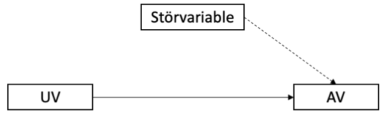
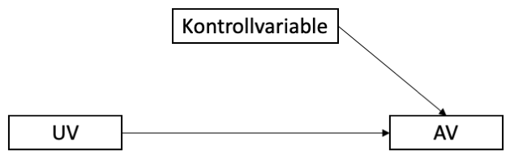

```{r setup, include=FALSE}
options(htmltools.dir.version = FALSE)

library(tidyverse)
library(kableExtra)
library(ggplot2)
library(plotly)
library(htmlwidgets)
library(MASS)
library(ggpubr)
library(xaringanthemer)
library(xaringanExtra)

style_duo_accent(
  primary_color = "#621C37",
  secondary_color = "#EE0071",
  background_image = "blank.png"
)

xaringanExtra::use_xaringan_extra(c("tile_view"))

# use_scribble(
#   pen_color = "#EE0071",
#   pen_size = 4
#   )

knitr::opts_chunk$set(
  fig.retina = TRUE,
  warning = FALSE,
  message = FALSE
)
```

name: Title slide
class: middle, left
<br><br><br><br><br><br><br>
# Wissenschaftliches Arbeiten und Forschungsmethoden

### Einheit 4: Sampling- und Analyseplan
##### 02.11.2023 | Dr. Caroline Zygar-Hoffmann


---
class: top, left
name: content

### Heutige Themen

#### [Planung von Studien und Studiendesign](#planung)

#### [Statistischer Analyseplan und Variablen](#analyse)

#### [Sampling Plan (Rekrutierungsplanung)](#sampling)

#### [Praxis](#praxis)

---
class: top, left
### Literaturempfehlung für die heutige Sitzung

.center[
```{r, echo=FALSE,out.width="30%",fig.cap="Kapitel 14 und 15 in Döring, N. & Bortz, J. (2016). Forschungsmethoden und Evaluation in den Sozial- und Humanwissenschaften. Pearson.",fig.show='hold',fig.align='center'}
knitr::include_graphics("bilder/doering.png")
``` 
]

---
class: top, left
name: planung

### Planung von Studien

####  Was gehört zur Studienplanung?

1. Theoriearbeit und Literaturrecherche $\rightarrow$ letzte Sitzungen

2. Hypothesenformulierung $\rightarrow$ letzte Sitzung

3. Design Plan $\rightarrow$ letzte Sitzung

4. Statistischer Analyseplan  $\rightarrow$ heutige Sitzung

5. Sampling Plan (Rekrutierungsplanung) $\rightarrow$ heutige Sitzung

6. Variablen-Operationalisierung (Auswahl Messinstrumente)  $\rightarrow$ nächste Sitzung

$\rightarrow$ Studienplanung in **Präregistrierung** festhalten


---
class: top, left
### Studiendesign

#### Präregistrierung

.center[
```{r eval = TRUE, echo = F, out.width = "60%"}
knitr::include_graphics("bilder/prereg_template_design1.png")
```
]

---
class: top, left
### Studiendesign

#### Präregistrierung

.center[
```{r eval = TRUE, echo = F, out.width = "60%"}
knitr::include_graphics("bilder/prereg_template_design2.png")
```
]


---
class: top, left
### Studiendesign

#### Bewertungsschema

.center[
```{r eval = TRUE, echo = F}
knitr::include_graphics("bilder/bewertung_prozedur.png")
```
]


---
class: top, left
name: analyse

### Statistischer Analyseplan

#### Leitfragen

* In welcher Weise sollen die elektronisch erfassten Daten vorbereitet und bereinigt werden?

* Welche statistischen Verfahren (z.B. t-Test, Regressionsanalyse, Varianzanalyse) sollen eingesetzt werden? 

* Welche Statistiksoftware ist für die geplanten Analysen geeignet und zugänglich (R ist für viele Analysen ausreichend, aber für tlws. komplexe Analysen (siehe Master) weitere Software nötig, z.B. MPlus)

* Optional: Mit welchen Programmbefehlen/-paketen können die gewünschten Analysen ausgeführt werden, welche Zusatzoptionen sind wichtig (nur grob darstellen)?

Formale Voraussetzungen:
* Testauswahl nach Operationalisierung, Skalenniveau, Anzahl der Variablen und Faktorstufen
* Festlegung geplanter Kontrollvariablen
* Festlegung des Signifikanzniveaus (α-Fehler-Niveaus)
* Umgang mit fehlenden Werten und ggf. Ausreißern
* Umgang mit multiplem Testen (alpha-Fehler Kumulierung)
* ggf. präzise Angaben über praktisch bedeutsame Mindestgrößen (falls bekannt)
* Festlegung von zu berechnenden Effektstärken

---
class: top, left
### Variablen

**Ziel empirischer Forschung:**

Registrierte Merkmalsunterschiede (= **Variabilität**) zu analysieren und zu erklären.

* **Variable** = Interessierendes Merkmal, das unterschiedliche Ausprägungen annehmen kann

* Beispiele für Variablen: 
  * Geschlecht
  * Lieblingsfarbe
  * Länge

* **Merkmalsausprägung** = konkrete Erscheinungsform einer Variable

* Beispiele für Merkmalsausprägungen: 
  * Geschlecht [männlich, weiblich, divers]
  * Lieblingsfarbe [rot, gelb, grün, blau]
  * Länge [1 cm, 1.5 cm, 3 cm,...]

---
class: top, left
### Variablen

#### Arten von Variablen

Variablen können anhand unterschiedlicher Eingeschaften unterteilt werden:

* nach Art der Merkmalsausprägungen

* nach empirischer Zugänglichkeit

* nach Stellenwert in der Untersuchung

---
class: top, left
### Variablen

Arten von Variablen – **nach Art der Merkmalsausprägungen**

* **stetig** (kontinuierlich): jedes Intervall besitzt unendlich viele Merkmalsausprägungen (z.B. Länge, Zeit, Masse)
  
* **diskret** (diskontinuierlich): Intervall mit endlich vielen Ausprägungen z.B. Geschlecht, Lieblingsfarbe

  * **dichotom** (binär) = 2 Abstufungen (0, 1) 
  * **polytom** = mehrfach gestuft
  * **konstant** = nur 1 Merkmalsausprägung
  
$\rightarrow$ Art der Variable bestimmt das statistische Verfahren (z.B. stetiges Outcome $\rightarrow$ Regression, binäres Outcome $\rightarrow$ logistische Regression)

.center[
```{r echo = F, fig.height=2,  fig.width=6, out.width = "700px"}
set.seed(123)
d = data.frame(x = rnorm(1:100000))
e = data.frame(x = rep(c(-1, 1), each = 12000)) 
f = data.frame(x = rep(c(0), each = 12000)) 

cowplot::plot_grid(
  ggplot(d, aes(x)) +
    geom_density() +
    labs(y = "", x = "stetig") +
    scale_x_continuous(limits = c(-3, 3), breaks = c(-3,-2,-1, 0, 1, 2 ,3)) +
    theme_classic() +
  theme(axis.text = element_blank(), axis.ticks = element_blank()),
  ggplot(d, aes(x)) +
    geom_histogram(fill = "black") +
    labs(y = "", x = "diskret (polytom)") +
    scale_x_continuous(limits = c(-3, 3), breaks = c(-3,-2,-1, 0, 1, 2 ,3)) +
    theme_classic() +
  theme(axis.text = element_blank(), axis.ticks = element_blank()),
   ggplot(e, aes(x)) +
    geom_histogram(fill = "black") +
    labs(y = "", x = "binär") +
    scale_x_continuous(limits = c(-3, 3), breaks = c(-3,-2,-1, 0, 1, 2 ,3)) +
    theme_classic() +
  theme(axis.text = element_blank(), axis.ticks = element_blank()),
  ggplot(f, aes(x)) +
    geom_histogram(fill = "black") +
    labs(y = "", x = "konstant") +
    scale_x_continuous(limits = c(-3, 3), breaks = c(-3,-2,-1, 0, 1, 2 ,3)) +
    theme_classic() +
  theme(axis.text = element_blank(), axis.ticks = element_blank()), ncol = 4)
```
]
---
class: top, left
### Variablen

Arten von Variablen – **nach empirischer Zugänglichkeit**

* **manifest** = direkt beobachtbar (Bsp. Raucher sein, Alter)

* **latent** = nicht unmittelbar beobachtbar; hypothetisches Konstrukt (Bsp. Intelligenz)

---
class: top, left
### Variablen

Arten von Variablen – **nach Stellenwert in der Untersuchung**

Variablen haben im empirischen Forschungskontext unterschiedliche funktionale Bedeutungen:

* abhängige Variable (Outcome)

* unabhängige Variable (Prädiktor) *Bei manipulierten Variablen spricht man häufiger von "unabhängiger Variable", bei rein gemessenen Variablen eher von "Prädiktoren"*

* Störvariable

* Kontrollvariable / Kovariate

* Moderatorvariable

* Mediatorvariable


---
class: top, left
### Variablen

#### Abhängige & unabhängige Variable (AV & UV)

Die Veränderung einer AV soll durch den Einfluss der UV erklärt werden.

**Beispiel:**

.center[

Dosis des Schlafmittel (**UV**) $\rightarrow$ Schlafdauer (**AV**) 

$\downarrow$

**UV** gehört zum „Wenn-Teil“ bzw. dem „Je-Teil“ einer Hypothese

**AV** gehört zum „Dann-Teil“ bzw. „Desto-Teil“

$\downarrow$

Wenn man mehr Schlafmittel nimmt, schläft man länger.
]

.center[
```{r eval = TRUE, echo = F, out.width = "500px"}
knitr::include_graphics("bilder/UVAV.png")
```
]

---
class: top, left
### Variablen

#### Störvariable

* alle Einflussgrößen auf die AV, die in einer Untersuchung nicht erfasst werden 

* egal ob nicht bekannt oder vergessen

.center[
```{r eval = TRUE, echo = F, out.width = "500px"}

```
]
---
class: top, left
### Variablen

#### Kontrollvariable / Kovariate

* Störvariable deren Ausprägungen erhoben (gemessen) wurde 

* Einfluss kann kontrolliert wird (z.B. mittels statistischer Methoden) 

* Inhaltliche Begründung (Literatur!) zur Aufnahme einer Kovariate

* Im Regressionsmodell mit inhaltlichem Prädiktor X1 und Kontrollvariable X2: Schätzung des Effekts von X1 auf Y bei Konstanthaltung des Effekts von X2 ("Kontrolle für den Einfluss von X2")

.center[
```{r eval = TRUE, echo = F, out.width = "500px"}

```
]
---
class: top, left
### Variablen

#### Moderatorvariable

* **Moderator** verändert den Einfluss der UV auf die AV

* Moderationsanalyse prüft Interaktionen

* Frage: Variiert der Effekt von UV auf AV in Abhängigkeit einer weiteren Variable

**Beispiel:**

Schlafmitteldosis (**UV**) erhöht die Schlafdauer (**AV**); Straßenlärm (**Moderator**) verringert den Effekt der Dosis auf die **AV**

.center[
```{r eval = TRUE, echo = F, out.width = "500px"}
knitr::include_graphics("bilder/Moderation.png")
```
]
---
class: top, left
### Variablen

#### Mediatorvariable

* **Mediator** vermittelt (**mediiert**) den Einfluss der **UV** auf die **AV**
* **Indirekter Effekt:**  **UV ** beeinflusst  **Mediator**, dies führt zur einem Effekt des  **Mediators ** auf **AV **
* **Direkter Effekt:** Effekt von **UV** auf **AV** (in Anwesenheit des Mediators)
* **Keine Mediation:** indirekter Effekt nicht signifikant
* **Partielle Mediation:** indirekter Effekt signifikant und direkter Effekt auch signifikant
* **Totale Mediation:** indirekter Effekt signifikant und direkter Effekt nicht mehr signifikant.

**Beispiel:**

Schulnote (**UV**) beeinflusst Selbstwertgefühl (**Mediator**); Selbstwertgefühl (**Mediator**) beeinflusst Lebenszufriedenheit **AV**

.center[
```{r eval = TRUE, echo = F, out.width = "500px"}
knitr::include_graphics("bilder/Mediation.png")
```
]

---
class: top, left
### Variablen

#### Beschreibung in Präregistrierung

* Kurze Beschreibung aller gemessenen Variablen
  * abhängige Variablen (Outcomes)
  * unabhängige Variablen bzw. Prädiktoren (falls zutreffend: Moderatoren, Mediatoren)
  * Kovariate (Kontrollvariablen, die mitgemessen werden)
  
* Bei einem experimentellen Design alle geplanten Manipulationen sowie deren Stufen beschreiben

* Operationalisierung und Verechnungsregeln definieren (vgl. nächste Einheit)

* Abklärung der Güte von Messinstrumenten (Reliabilität, Validität, Normierung) (vgl. nächste Einheit)

* Wo zutreffend, Variablen den Hypothesen zuordnen

---
class: top, left
### Analyseplan

#### Präregistrierung

.center[
```{r eval = TRUE, echo = F, out.width = "60%"}
knitr::include_graphics("bilder/prereg_template_analyse1a.png")
```
]

Punkt c) kann noch bis nächste Woche warten! 

---
class: top, left
### Analyseplan

#### Präregistrierung

.center[
```{r eval = TRUE, echo = F, out.width = "60%"}
knitr::include_graphics("bilder/prereg_template_analyse1b.png")
```
]

<!-- das hier zur Operationalisierung (Umgang mit missing data) schieben -->

---
class: top, left
### Analyseplan

#### Präregistrierung

.center[
```{r eval = TRUE, echo = F, out.width = "60%"}
knitr::include_graphics("bilder/prereg_template_analyse2.png")
```
]


---
class: top, left
### Analyseplan

#### Präregistrierung

.center[
```{r eval = TRUE, echo = F, out.width = "60%"}
knitr::include_graphics("bilder/prereg_template_analyse3a.png")
```
]

---
class: top, left
### Analyseplan

#### Präregistrierung

.center[
```{r eval = TRUE, echo = F, out.width = "60%"}
knitr::include_graphics("bilder/prereg_template_analyse3b.png")
```
]


---
class: top, left
### Analyseplan

#### Präregistrierung

.center[
```{r eval = TRUE, echo = F, out.width = "60%"}
knitr::include_graphics("bilder/prereg_template_analyse3c.png")
```
]
---
class: top, left
### Analyseplan

#### Bewertungsschema

.center[
```{r eval = TRUE, echo = F}
knitr::include_graphics("bilder/bewertung_methoden.png")
```
]

---
class: top, left
name: sampling

### Sampling Plan (Rekrutierungsplanung)

#### Auswahl der Untersuchungsobjekte 

* Frage: an welchen bzw. an wie vielen Untersuchungsobjekten werden die Variablen erhoben?

* Untersuchungsteilnehmer, deren Beobachtung oder Beschreibung interessante Hypothesen versprechen

**Wichtigstes Kriterium: Repräsentativität der Stichprobe**

* Repräsentativität = Stichprobe muss in ihrer Zusammensetzung der Population möglichst stark ähneln

* Stichprobe ist (merkmals)spezifisch repräsentativ, wenn ihre Zusammensetzung hinsichtlich relevanter Merkmale der Populationszusammensetzung entspricht

* Stichprobe  ist global repräsentativ, wenn ihre Zusammensetzung in nahezu allen Merkmalen der Populationszusammensetzung entspricht

* große Stichprobe garantiert nicht Repräsentativität (gilt nur bei unverzerrter Auswahl)

* beste Gewähr für größtmögliche globale Repräsentativität bietet die Zufallsstichprobe

---
class: top, left
### Sampling Plan (Rekrutierungsplanung)

#### Auswahl der Untersuchungsobjekte 

**Einschlusskriterien:**

* globale Population aller Menschen ist nicht für jede Fragestellung geeignet

* Selektion zur Erhöhung der Auftretenswahrscheinlichkeit relevanter Merkmale (z.B. bestimmte Diagnose, bestimmte Altersklasse...)

**Ausschlusskriterien:**

* Manche Charakteristika machen Untersuchung einzelner Personen inhaltlich/ethisch unmöglich

* Ausschlusskriterien müssen gut überlegt und genau dokumentiert werden

$\rightarrow$ **Für unser Praxisprojekt gibt es nur ein Einschlusskriterium, welches nicht inhaltlich begründet ist: Studierender dieser Vorlesung sein. Fehlende Repräsentativität ist dann Teil der Diskussion.**

---
class: top, left
### Sampling Plan (Rekrutierungsplanung)

#### Größe der Stichprobe

* Die Festlegung des Stichprobenumfanges sollte ebenfalls in der Planungsphase erfolgen

* Verbindliche Angaben zum nötigen Stichprobenumfang für eine bestimmte Analyse nur möglich, wenn eine hypothesenprüfende Untersuchung mit vorgegebener Effektgröße geplant wird $\rightarrow$ **a priori Poweranalyse** 

* Durchführung z.B. in R oder freies Programm GPower; [Link zu Erklärvideo für G*Power](https://www.youtube.com/watch?v=7J7ZLp5Q2H8)

* Für die Größe von Stichproben, mit denen keine spezifischen Hypothesen geprüft werden oder keine Effektgröße schätzbar ist, gibt es keine genauen Richtlinien ("more is better, but be mindful of resources")

* Falls die Stichprobengröße aus anderen Gründen festgelegt ist (wie bei uns), kann man eine "**(post hoc) Sensitivitäts-Poweranalyse**" machen, um abzuschätzen wie hoch die statistische Power für die Aufdeckung eines Effekts mit dieser Stichprobengröße ist (wichtig: eine post hoc Analyse auf dem *gefundenen* Effekt aus der eigenen Studie macht keinen Sinn, nur eine auf dem erwarteten Effekt)

---
class: top, left
### Sampling Plan (Rekrutierungsplanung)

#### Größe der Stichprobe

* Ziel der a priori Poweranalyse: Bestimmung einer Stichprobengröße, die bei angenommender Effektgröße eine statistisch-signifikantes Ergebnis ermöglicht 

* Zusammenspiel aus Signifikanzniveau (Wahrscheinlichkeit für Fehler 1. Art) und Power (1 - Wahrscheinlichkeit für Fehler 2. Art)

* Poweranalyse richtet sich nach der Hauptfragestellung (primärer zu überprüfender Hypothese); bei mehreren Primärhypothesen, die Poweranalyse für den kleinsten erwarteten Effekt

Relevante Parameter:
  * Effektstärke (aus Vorstudien/Literatur oder basierend auf Plausibilitätsannahme) $\rightarrow$ je größer, desto kleineres N benötigt
  * Signifikanzniveau (i.d.R. alpha = .05) $\rightarrow$ je kleiner, desto kleineres N benötigt
  * Power (i.d.R. mindestens 0.8) $\rightarrow$ je größer, desto kleineres N benötigt

---
class: top, left
### Sampling Plan (Rekrutierungsplanung)

#### Poweranalyse in R

Poweranalyse für einen unabhängigen t-Test (auch für andere Hypothesentests möglich):

.pull-left[
.center[
```{r eval = TRUE, echo = F}
knitr::include_graphics("bilder/power-ttest.png")
```
]
]
.pull-right[
* Bei a priori Annahme einer Effektstärke von Cohen's d = 0.5 für den Mittelwertsunterschied (mittlerer Effekt)

* und einem Signifikanzniveau von alpha = .05

* und einer Power von 0.8 (Chance auf positives Ergebnis)

benötigt man N = 102 Personen (51 pro Gruppe), um in einem einseitigen *(alternative = "greater")* unabhängigen t-Test *(type = "two.sample")* einen signifikanten Gruppenunterschied nachzuweisen
]

---
class: top, left
### Sampling Plan (Rekrutierungsplanung)

#### Sensitivitäts-Poweranalyse in R

Sensitivitäts-Poweranalyse für einen unabhängigen t-Test (auch für andere Hypothesentests möglich):

.pull-left[
.center[
```{r eval = TRUE, echo = F}
knitr::include_graphics("bilder/sensitivity-power-ttest.png")
```
]
]
.pull-right[
* Bei a priori Annahme einer Effektstärke von Cohen's d = 0.5 für den Mittelwertsunterschied (mittlerer Effekt)

* und einem Signifikanzniveau von alpha = .05

* und N = 34 Personen (17 Personen pro Gruppe) (*Hinweis: Wir sind insgesamt 37 Studierende + 1 Dozentin. Wenn die eigene Gruppe = 3-5 Personen nicht an der Studie teilnehmen, aber sonst alle, kommen wir auf 33-35 Versuchspersonen.*)

erreicht man eine Power von 41% für einen einseitigen, unabhängigen t-Test; d.h. die Wahrscheinlichkeit einen Effekt zu finden, wenn er da ist, beträgt 41%. 
]

---
class: top, left
### Sampling Plan (Rekrutierungsplanung)

#### Poweranalyse in R: Befehle

* **pwr.t.test()** für Einstichproben-t-test, sowie unabhängige und abhängige Zweistichproben-t-tests mit gleicher Gruppengröße; Angabe von Effektstärke d (s.o.)

* **pwr.anova.test()** für einfaktorielle ANOVA; Angabe von Effektstärke f
  * f = $\sqrt{(\omega² / 1 - \omega²)}$
  * Angabe von k = Stufen des Faktors
  
* **pwr.f2.test()** für Regression und mehrfaktorielle ANOVA; Angabe von Effektstärke f²
  * f² = $R² / (1 – R²)$ bzw. $\omega² / 1 - \omega²$ für aufgeklärte Varianz des Gesamtmodells
  * f² = $(R²_{AB} -  R²_A) / (1 – R²_{AB})$ bzw. $\omega²_{partial_B} / 1 - \omega²_{partial_B}$ für aufgeklärte Varianz des Prädiktors B
  * Angabe von u = Anzahl der Prädiktoren/Faktoren ohne Intercept
  * Rückgabewert v + u + 1 ergibt Stichprobengröße n
  
* **pwr.r.test()** für Korrelation


---
class: top, left

### Sampling Plan (Rekrutierungsplanung)

#### Poweranalyse: Woher weiß ich die Effektstärke?

.pull-left[
* **Recherche in bestehender Literatur! Diese dann herunterkorrigieren** (wegen Publication Bias), d.h. erwarteten Effekt für die Poweranalyse kleiner angeben, als das was in der Literatur gefunden wurde.
* Falls nötig, **Transformation der Effektstärke** aus der Literatur in die Effektstärke, die für die Poweranalyse gebraucht wird (z.B. r in d): https://www.psychometrica.de/effect_size.html
* Alternativen: **Pilotstudien** (aber auch nicht zuverlässig) oder **praktisch bedeutsame Mindestgrößen**
* Bei unklarer zu erwartender Effektstärke: Mehrere Poweranalysen rechnen, visualisieren wie sich die nötige Stichprobenzahl abhängig von der Effektstärke verändert ("**Power curves**")
]

.pull-right[
```{r eval = TRUE, echo = F}
knitr::include_graphics("bilder/effectsize_transformation.png")
```
]

---
class: top, left
<div class="footer"><span>Funder, D. C., & Ozer, D. J. (2019). Evaluating Effect Size in Psychological Research: Sense and Nonsense. Advances in Methods and Practices in Psychological Science, 2, 156–168. doi:10.1177/2515245919847202 <br>
Bosco, F. A., Aguinis, H., Singh, K., Field, J. G., & Pierce, C. A. (2015). Correlational effect size benchmarks. Journal of Applied Psychology, 100(2), 431–449. http://doi.org/10.1037/a0038047 <br> Hróbjartsson, A., & Gøtzsche, P. C. (2004). Is the placebo powerless? Update of a systematic review with 52 new randomized trials comparing placebo
with no treatment. Journal of internal medicine, 256(2), 91-100. <br> Luhmann, M., Hofmann, W., Eid, M., & Lucas, R. E. (2012). Subjective well-being and adaptation to life events: a meta-analysis. Journal of Personality and Social Psychology, 102(3), 592–615. http://doi.org/10.1037/a0025948 <br> Hill, C. J., Bloom, H. S., Black, A. R., & Lipsey, M. W. (2008). Empirical Benchmarks for Interpreting Effect Sizes in Research. Child Development Perspectives, 2, 172–177. doi:10.1111/j.1750-8606.2008.00061.x</span></div>

### Sampling Plan (Rekrutierungsplanung)

#### Poweranalyse: Woher weiß ich die Effektstärke?

.pull-left[
* Durchschnittlicher Effekt in der Psychologie:      r ~ .20 (d ~ .40) mit einer Standardabweichung von r ~ .10-.15

* Das ist kleiner als die Einordnung, die Cohen vorgeschlagen hat

* Vergleich mit gut vorstellbaren Effekten, z.B. 
  * mittlerer Placebo-Effekt: d = 0.24
  * Veränderung der Lebenszufriedenheit direkt nach Hochzeit: d = 0.26 und direkt nach einem Trauerfall: d = -0.48
  * mittlerer Effekt des Schulbesuchs in der ersten Klasse auf die Mathefähigkeit: d = 1.1
]

.pull-right[
```{r eval = TRUE, echo = F, out.width = "450px"}
knitr::include_graphics("bilder/funder2019.jpg")
```

Cohen's Einordnung:
```{r eval = TRUE, echo = F, out.width = "450px"}
knitr::include_graphics("bilder/cohen_effsize.png")
```
]

---
class: top, left
<div class="footer"><span>Benjamin, D. J., Berger, J. O., Johannesson, M., Nosek, B. A., Wagenmakers, E. J., Berk, R., ... & Johnson, V. E. (2018). Redefine statistical significance. Nature human behaviour, 2(1), 6-10. <br>
Lakens, D., Adolfi, F. G., Albers, C. J., Anvari, F., Apps, M. A., Argamon, S. E., ... & Zwaan, R. A. (2018). Justify your alpha. Nature human behaviour, 2(3), 168-171. <br> Lakens, D. (2022). Sample size justification. Collabra: Psychology, 8(1), 33267.</span></div>

### Sampling Plan (Rekrutierungsplanung)

#### Poweranalyse: Wie wähle ich mein Alpha-Niveau?

* Standard in der Psychologie: $\alpha$ = 0.05

* Benjamin et al. (2018): Vorschlag, das $\alpha$-Niveau weiter auf 0.005 zu senken, um Replizierbarkeit der Effekte zu erhöhen

* Lakens et al. (2018): Justify your $\alpha$!
  * Für das Praxisprojekt könnte das bedeuten mal in der Sensitivitätspower-Analyse verschiedene Werte von Alpha auszuprobieren, um zu sehen wie sich die Power dadurch erhöht
  * Meine Empfehlung: Für dieses Ausprobieren $\alpha$ maximal so weit erhöhen wie es nicht den $\beta$-Fehler (1-Power) übersteigt
  * Begründung: Im Rahmen dieses Praxisprojekts, in dem wir nur üben, ist es genauso "schlimm" zu behaupten es gäbe einen Effekt, wenn es keinen gibt, als zu behaupten es gäbe keinen Effekt, wenn es einen gibt.
  * In der Forschung wird der Fehler 1.Art ( $\alpha$-Fehler) zumindest formal konstant niedrig gehalten, während die Höhe des Fehlers 2.Art ( $\beta$-Fehler) maßgeblich von der Größe der Stichprobe abhängt (welche variabel ist)

---
class: top, left
### Sampling Plan (Rekrutierungsplanung)

#### Anwerbung von Untersuchungsteilnehmern:

* Wo soll rekrutiert werden?

* Mit welchen Mitteln?

* Wird es eine Vergütung geben?
  * Bei uns: Rückmeldung über eigene Antworten; bitte mitdenken und bestenfalls umsetzen! Es wird sowieso eine Übung dazu geben (d.h. machen werden Sie es sowieso), aber ob Sie es letztendlich in Ihren Fragebogen übernehmen, oder nicht, ist Ihre Sache.

* Ist die Teilnahme Teil eines erweiterten (Forschungs-/Behandlungs-)Programms

---
class: top, left
### Sampling Plan (Rekrutierungsplanung)

####  Determinanten der freiwilligen Untersuchungsteilnahme (Bortz und Döring, 2012)

Freiwillige Untersuchungsteilnehmer ...
* ...verfügen über eine bessere schulische Ausbildung als Verweigerer (bessere Notendurchschnitte). 
* ...schätzen ihren eigenen sozialen Status höher ein als Verweigerer.
* ...benötigen mehr soziale Anerkennung als Verweigerer.
* ...sind geselliger als Verweigerer.
* ...sind weniger autoritär als Verweigerer.
* ...haben eine geringere Tendenz zu konformem Verhalten als Verweigerer.
* ...geben sich in Untersuchungen über geschlechtsspezifisches Verhalten unkonventioneller.
* ...verfügen auf Basis der meisten Untersuchungsergebnisse über eine höhere Intelligenz.

Im Allgemeinen sind weibliche Personen eher zur freiwilligen Untersuchungsteilnahme bereit als männliche Personen.

Siehe auch Rezeption einer aktuelleren Studie: https://twitter.com/rubenarslan/status/1700049223889101230: Freiwillige gehen eher wählen und antworten eher "Ja" auf Fragen

---
class: top, left
<div class="footer"><span>Van den Akker, O., Weston, S., Campbell, L., Chopik, B., Damian, R., Davis-Kean, P., ... & Bakker, M. (2021). Preregistration of secondary data analysis: A template and tutorial. Meta-psychology, 5, 2625.</span></div>

### Sampling Plan (Rekrutierungsplanung)

#### Vorab-existierende Daten

Wenn für eine Studie auf einem bereits bestehenden Datensatz Berechnungen durchgeführt werden, muss dies auch durchdacht und dokumentiert werden.

In Hinblick auf eine Präregistrierung wird i.d.R. auch der Zugriff konkret dokumentiert:

* **Registrierung vor der Sammlung der Daten**: Daten noch nicht erhoben, erstellt oder realisiert worden
* **Registrierung vor jeglicher menschlicher Beobachtung der Daten**: Daten vorhanden, wurden aber noch von niemandem quantifiziert, erstellt, beobachtet oder gemeldet
* **Registrierung vor dem Zugriff auf die Daten**: Daten vorhanden, aber Sie oder Ihre Mitarbeiter haben noch keinen Zugriff darauf
* **Registrierung vor der Analyse der Daten**: Daten vorhanden und Sie haben darauf zugegriffen, aber es wurde noch keine Analyse im Zusammenhang mit dem Forschungsplan durchgeführt 
* **Registrierung nach der Analyse der Daten**: Sie haben auf einen Teil der für den Forschungsplan relevanten Daten zugegriffen und diese analysiert

siehe "Preregistration of secondary data analysis: A template and tutorial": https://research.tilburguniversity.edu/en/publications/preregistration-of-secondary-data-analysis-a-template-and-tutoria

---
class: top, left
### Sampling Plan (Rekrutierungsplanung)

#### Bewertungsschema

.center[
```{r eval = TRUE, echo = F}
knitr::include_graphics("bilder/bewertung_power.png")
```
]

---
class: top, left
### Sampling Plan (Rekrutierungsplanung)

#### Präregistrierung

.center[
```{r eval = TRUE, echo = F, out.width = "35%"}
knitr::include_graphics("bilder/prereg_template_power.png")
```
]

---
class: top, left
name: praxis

### Praxis: Studiendesign & Analyseplan entwickeln

**Schritt 1:** Wie sieht Ihr Analyseplan für Ihre Hypothese(n) aus?
  * **Welches Testverfahren nutzen Sie?** Welche Rolle spielt die Überprüfung von Annahmen für dieses Testverfahren (*hier z.B. aufnehmen, was Sie in Quantitative Methoden 1/2 für dieses Verfahren gelernt haben*)?
  * Was ist/sind Ihre **UV(s)/Prädiktor(en)**? 
    * Auf welche dieser Variablen bezieht sich die Hypothese? 
    * Sind es spezielle Prädiktoren (z.B. Moderatoren? Kontrollvariablen?)
    * Falls zutreffend: Was ist die Begründung für die Aufnahme von Kontrollvariablen?
  * Was ist Ihre **AV** bzw. Ihr **Outcome**?
  * **Auf Basis welches Ergebnisses würden Sie die H0 verwerfen und die H1 annehmen** (z.B. welcher Posthoc-Test, welcher Prädiktor muss mit welchem Vorzeichen auf welchem Alpha-Niveau signifikant sein)?
  * **Abgleich mit der Hypothese:** Prüft das statistische Verfahren die aufgestellte Hypothese? Muss ggf. noch etwas präzisiert werden (z.B. Form der Interaktion, ggf. (auch händische) Visualisierung der Interaktion)? 
  * Welche **Effekstärke** ist für Ihre geplante Analyse interessant?
  * Ist ein **Manipulationscheck** geplant und wenn ja, wie wird er ausgewertet?
  * Müssen Sie für **multiples Testen** korrigieren, z.B. auch weil Sie die gleiche Hypothese für verschiedene Outcomes überprüfen?

---
class: top, left

### Praxis: Studiendesign & Analyseplan entwickeln

**Schritt 2:** Wie sieht Ihre Power bei dem vorgegebenen Samplingplan aus?
  * Welche Effektstärke erwarten Sie?
  * Welches Alpha-Niveau nutzen Sie? Testen Sie einseitig oder zweiseitig (gerichtete vs. ungerichtete Hypothese)?

**Schritt 3:** Erweitern Sie das [Präregistrierungstemplate auf studynet](https://studynet.hs-fresenius.de/goto_STUDYNETHSF_file_22808_download.html)
  * Studiendesign: M6, M10, M11, M14
  * Samplingplan: M3-M5 (Für M4 und M5 siehe Vorschlag von Folien)
  * Analyseplan: M7-M8 (siehe Folien), M12, AP1-AP2 (siehe Folien), AP6-AP8 (AP8 optional, nur wenn Sie was exploratives unter I4 angegeben haben)
  
Beschreibung der konkreten Operationalisierung von Konstrukten z.B. über Fragebögen oder in Tests (Aspekt c von M12, M13, AP3) erst nächste Woche!

<!-- library(renderthis) -->
<!-- to_pdf("WissArb_04_Sampling_Analyseplan.Rmd", complex_slides = TRUE) -->
