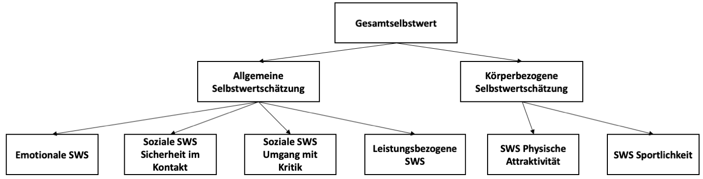
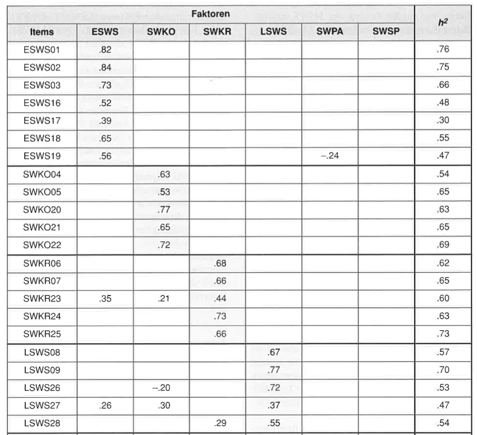

```{r setup, include=FALSE}
options(htmltools.dir.version = FALSE)

library(tidyverse)
library(kableExtra)
library(ggplot2)
library(plotly)
library(htmlwidgets)
library(MASS)
library(ggpubr)
library(xaringanthemer)
library(xaringanExtra)

style_duo_accent(
  primary_color = "#621C37",
  secondary_color = "#EE0071",
  background_image = "blank.png"
)

xaringanExtra::use_xaringan_extra(c("tile_view"))

# use_scribble(
#   pen_color = "#EE0071",
#   pen_size = 4
#   )

knitr::opts_chunk$set(
  fig.retina = TRUE,
  warning = FALSE,
  message = FALSE
)
```

name: Title slide
class: middle, left
<br><br><br><br><br><br><br>
# Wissenschaftliches Arbeiten und Forschungsmethoden

### Einheit 5: Operationalisierung
##### 09.11.2023 | Dr. Caroline Zygar-Hoffmann

---
class: top, left

### Fragen von den letzten zwei Einheiten

* **Kann ich auch SPSS nutzen?** Offensichtlichster Nachteil: Kein Support durch mich (bzw. Stephan Goerigk)

* **Gibt es einen Beispielbericht?** 
  * Ich habe zwei Berichte aus meiner eigenen Studienzeit hochgeladen, ***die nicht optimal sind***, aber einen Eindruck geben, wie ein Forschungsbericht prinzipiell aussehen kann. 
  * Diese Forschungsberichte wurden auch nicht in Gruppen geschrieben und sind daher auch etwas kürzer. 
  * Auf der folgenden Folie und auch auf studynet befinden sich ein paar ***unsystematische*** Hinweise zu den hochgeladenen Berichten
  * **Orientieren Sie sich bitte für Ihre eigenen Arbeiten primär am Bewertungsbogen und nicht primär an den Empraberichten! Im Zweifelsfall können Sie immer auf mich zukommen und nachfragen. **

---
class: top, left

### Beispielberichte

.center[
```{r eval = TRUE, echo = F, out.width = "42%"}
knitr::include_graphics("bilder/studynet_beispielberichte.png")
```
]


---
class: top, left
name: content

### Heutige Themen

#### Operationalisierung
* [Variablen und Konstrukte](#konstrukte)
* [Quellen und Beurteilung](#quellen)
* [Vorgehen](#vorgehen)

#### [Informationspflicht](#infopflicht)

#### [Formr als Umfragetool](#formr)

#### [Praxis](#praxis)

---
class: top, left
name: konstrukte

### Operationalisierung

#### Variablen und Konstrukte

Human- und Sozialwissenschaften untersuchen häufig Konstrukte (= latente Variablen):

* Muss aus (manifesten) **Indikatoren** erschlossen werden (z.B. Gesichtsausdruck – Emotion)

* Operationalisierung = das „messbar Machen“ von Merkmalen

* Operationalisierung muss auf Basis theoretischer Überlegungen (Theorien, Modellen) erfolgen

**Was heißt dann „Messen“ in der Psychologie?**

* Zuordnung von Zahlen zu Objekten nach festen Regeln 

* In der Relation der Messwerte muss sich die Relation der gemessenen Objekte widerspiegeln

---
class: top, left
name: beispiele

### Operationalisierung

#### Variablen und Konstrukte

Beispiel: „Messung“ von Intelligenz

* Intelligenz nicht direkt beobachtbar (latente Variable, Konstrukt)

* Intelligenz wird über Ergebnis in Leistungstests operationalisiert (Indikatoren)

$\rightarrow$ von Anzahl gelöster Aufgaben wird auf die „dahinter liegende“ Intelligenz geschlossen

* Unterschiedlichen Ausprägungen von Intelligenz werden unterschiedliche Zahlen zugeordnet 

* Differenzen zwischen Zahlen sollen Unterschieden zwischen Personen entsprechen

---
class: top, left
### Operationalisierung

#### Variablen und Konstrukte

Beispiel: „Messung“ von Angst

* Angst nicht direkt beobachtbar (latente Variable, Konstrukt)

* Verschiedene Theorien zu Bestandteilen der Angst

* Angst wird z.B. erhoben mittels Fragebogen, in dem eine Person sich bzgl. der Prüfungsangst einschätzt. -> Anzahl an Fragen, denen Person zustimmt (JA/ NEIN) oder Ausmaß der Zustimmung

* ODER: man lässt offen erzählen, im Interview

* ODER: man misst in Prüfungssituation physiologische Parameter

Konkrete Operationalisierung hängt immer vom Kontext, den Ressourcen und der zugrundeliegenden Theorie ab

---
class: top, left

### Operationalisierung

#### Variablen und Konstrukte

Beispiel: Selbstwert, Messung über **Multidimensionale Selbstwertskala (MSWS)**

* Selbstbeschreibungsfragebogen

* Erfassung der Selbstwertschätzung von Erwachsenen

* Mehr-Facettenmodell: es werden verschiedene Bereiche der Selbstwertschätzung unterschieden

* 32 Items, 6 Subskalen, 1 Gesamtwert, Durchführungsdauer ca. 15 min, Auswertungsdauer ca. 10 min

.center[
```{r eval = TRUE, echo = F, out.width = "950px"}

```
]

---
class: top, left

### Operationalisierung

#### Variablen und Konstrukte

Beispiel: Selbstwert, Messung über **Multidimensionale Selbstwertskala (MSWS)**

```{r echo=F}

df = data.frame(Abkürzung = c("ESWS",
                              "SWKO",
                              "SWKR",
                              "LSWS",
                              "SWPA",
                              "SWSP",
                              "ASW",
                              "KSW",
                              "GSW"),
                Bezeichnung = c("Emotionale Selbstwertschätzung",
                                "Soziale Selbstwertschätzung - Sicherheit im Kontakt",
                                "Soziale Selbstwertschätzung - Umgang mit Kritik",
                                "Leistungsbezogene Selbstwertschätzung",
                                "Selbstwertschätzung Physische Attraktivität",
                                "Selbstwertschätzung Sportlichkeit",
                                "Allgemeine Selbstwertschätzung",
                                "Körperbezogene Selbstwertschätzung",
                                "Gesamtselbstwert"),
                Zusammensetzung = c("1-, 2-, 3, 16-, 17-, 18-, 19",
                                    "4-, 5-, 20-, 21-, 22-",
                                    "6-, 7-, 23-, 24-, 25-",
                                    "8, 9-, 26, 27, 28-",
                                    "10-, 11, 29-, 30-, 31",
                                    "12-, 13, 14-, 15, 32-",
                                    "ESWS, SWKO, SWKR, LSWS",
                                    "SWPA, SWSP",
                                    "ASW, KSW"),
                Beispielitems = c("Zweifeln Sie an sich selbst?",
                                  "Wie häufig fühlen Sie sich gehemmt?",
                                  "Wie sehr machen Sie sich Gedanken darüber, ob andere Leute Sie als Versager sehen?",
                                  "Zweifeln Sie an Ihren fachlichen Fähigkeiten?",
                                  "Wie sicher sind Sie, dass Sie für gutaussehend gehalten werden?",
                                  "Wie häufig haben Sie schon das Gefühl gehabt, dass anderen Ihnen sportlich überlegen sind?",
                                  "",
                                  "",
                                  "")
                )
df %>%
  kbl() %>%
    kable_styling(font_size = 18) %>%
  kable_classic(full_width = T, position = "left")
```

---
class: top, left
name: quellen

### Operationalisierung

#### Quellen und Beurteilung

* Bestehende Literatur: Welche Fragebögen haben andere Studien verwendet?

* Literaturrecherche mit den Schlagwörtern "questionnaire", "scale" oder "test"

* Halten Sie Ausschau nach Angaben zur **Reliabilität**: Zuverlässigkeit/Messfehlerfreiheit der Messung $\rightarrow$ im Bericht erwähnen! (am besten wäre sie auf den eigenen Daten auszurechnen, aber das haben Sie noch nicht gelernt)

* Adaptationen und Übersetzungen sind möglich, aber bitte zuerst recherchieren, ob es nicht schon eine Übersezung gibt und darauf hinweisen, falls Sie selbst eine Übersetzung anfertigen! Im Bericht sowohl das Original als auch die Übersetzung (falls es eine gibt) zitieren.

* Nutzen einzelner Items bestehender Fragebögen ist möglich, wenn es sich um **Subskalen** oder von den Autor:innen des Fragebogens definierte **Kurzskalen** handelt; einfach nur einzelne Items "herauspicken" ist keine gute Praxis (würde eine eigene psychometrische Evaluation benötigen)

* Eigene Entwicklungen nur, falls unbedingt nötig

---
class: top, left
### Operationalisierung

#### Bewertungsschema

.center[
```{r eval = TRUE, echo = F}
knitr::include_graphics("bilder/bewertung_materialien.png")
```
]

---
class: top, left
name: vorgehen

### Operationalisierung

#### Vorgehen bei Tests und Fragebögen

1) Items beantworten lassen

2) Items umpolen

3) Skalenwerte für Subskalen und Gesamtwerte bilden


**Für Einzelfalldiagnostik zusätzlich (siehe vmtl. Einheit 8 und Rückmeldung)**:

4) Normwerte und/oder Prozentränge aus Normtabellen ablesen (Vorsicht bei ggf. relevanten Subgruppen, z.B. Männer vs. Frauen)

5) Normwerte und/oder Prozentränge in Profilbogen eintragen (inkl. Konfidenzintervalle)

6) Interpretation (durchschnittlich, unterdurchschnittlich, überdurchschnittlich)

7) Inhaltliche Interpretation und ggf. Vergleiche mittels kritischer Werte

---
class: top, left

### Operationalisierung

#### Vorgehen bei Tests und Fragebögen

Umpolen von Items:

* Manchmal werden Items entgegengesetzt des Konstrukts formuliert

* Führt zu treffenderen Aussagen und aufmerksamerer Ausfüllung (automatisches Maximalkreuzen funktioniert nicht)

* Müssen vor der Aggregierung zu einem Summenwert/Durchschnittswert "umgedreht" werden

Beispiel Extraversion:

*Aussage: Ich bleibe am Wochenende lieber Zuhause*

$\rightarrow$ Misst Ausprägung von Extraversion (nur umgekehrt)

---
class: top, left

### Operationalisierung

#### Vorgehen bei Tests und Fragebögen

Umpolen beim MSWS, 7-stufige Antwortskala:

* 1 $\rightarrow$ 7
* 2 $\rightarrow$ 6
* 3 $\rightarrow$ 5
* 4 = 4
* 5 $\rightarrow$ 3
* 6 $\rightarrow$ 2
* 7 $\rightarrow$ 1

---
class: top, left

### Operationalisierung

#### Vorgehen bei Tests und Fragebögen

**Skalenbildung:**

* **Items** geben uns genaue Informationen/Beobachtungen

* Wir wollen aber Aussagen über das dahinterliegende **Konstrukt** machen (Selbstwert)

* Zu der selben Kategorie gehörige Items werden zu **Subskalen** zusammengerechnet

* Subskalen zusammenrechnen zu **Gesamtwerten** (z.B. globaler Selbstwert)

* meist gewichtete oder ungewichtete Summenwerte oder Mittelwerte

**Beispiel ungewichtete Summenbildung:**

Emotionale Selbstwertschätzung (ESWS) = Item 1 + Item 2 + Item 3 + Item 16 + Item 17 + Item 18 + Item 19


---
class: top, left

### Operationalisierung

#### Vorgehen bei Tests und Fragebögen

**Skalenbildung:**

* **Frage:** Wie haben die Autor:innen entschieden, dass gerade diese Fragen sich zur Messung der 6 Subskalen eigenen? Es könnte ja auch sein, dass Item 1 eigentlich Soziale Selbstwertschätzung misst...
* **Antwort:** Statistisches Verfahren der **Faktorenanalyse**
  * Prüft **Ladungen** der Einzelitems auf einen **latenten Faktor**
  * Ladungen funktionieren wie Korrelationen (Werte nahe 1 bedeuten das Item hängt stark mit einem Faktor zusammen)
  * So können einzelne Fragen in unterschiedliche Subskalen **sortiert** werden
  * Anzahl und Zusammensetzung der Subskalen nennt man **Faktorstruktur** eines Fragebogens
  * Fragebogen ohne Subskalen nennt man **eindimensional** mit mehrere Subskalen **mehrdimensional**
  * Inhaltliche Bezeichnung der Subskalen/Faktoren nehmen die Autoren anhand der Items vor, die auf sie laden (z.B. Frage zu Aussehen und Frage zu Attraktivität laden auf selben Faktor --- Also nennen wir ihn "Selbstwertschätzung Physische Attraktivität")

---
class: top, left

### Operationalisierung

#### Vorgehen bei Tests und Fragebögen

Faktorenanalyse beim MSWS - Ladung der Items auf Subskalen/Faktoren:

.center[
```{r eval = TRUE, echo = F, out.width = "450px"}

```
]

---
class: top, left

### Operationalisierung

#### Präregistrierung

.center[
```{r eval = TRUE, echo = F, out.width = "60%"}
knitr::include_graphics("bilder/prereg_template_methoden1.png")
```
]

---
class: top, left

### Operationalisierung

#### Präregistrierung

.center[
```{r eval = TRUE, echo = F, out.width = "50%"}
knitr::include_graphics("bilder/prereg_template_methoden2.png")
```
]


<!-- class: top, left -->
<!-- ### Operationalisierung -->

<!-- ####  Missing-Data (unvollständige Datensätze) -->
<!-- <small> -->

<!-- **Umgang mit fehlenden Werten:** -->

<!-- 1. Ignorieren -->
<!--   * Manche statistischen Tests können gut mit fehlenden Werten umgehen (z.B. einige Regressionsmodelle) -->
<!--   * Sollte immer berichtet und bei der Interpretation berücksichtigt werden -->

<!-- 2. Complete-Case Analyse -->
<!--   * Nur auf Basis vollständiger Datensätze rechnen -->
<!--   * ok, wenn man ausreichend große Stichprobe hat -->
<!--   * Vorsicht: wenn UV zu Dropout führt können Verzerrungen resultieren -->

<!-- 3. Imputation -->
<!--   * Schätzung und Ersetzen der fehlenden Werte anhand eines statistischen Modells -->
<!--   * gut unter der MCAR oder MAR Annahme -->
<!--   * Unterschiedliche Komplexität der Schätzer -->
<!--     * leicht: gruppenspez. Mittelwert oder Median -->
<!--     * komplex: z.B. Random Forest Imputation -->
<!--   * State of the Art: Multiple Imputation (mehrfaches Ersetzen und Hypothesentest auf Durchschnitt der Ersetzungen berechnen) -->

<!-- * Einen ausführlichen Überblick von Missing-Data-Techniken findet man bei Schafer und Graham (2002) bzw. West (2001) -->

<!-- </small> -->

---
class: top, left
name: infopflicht

### Informationspflicht

* Es müssen vor der Teilnahme an einer Studie alle Informationen geteilt werden, welche die Entscheidung, an der Untersuchung teilzunehmen, potenziell beeinflussen könnte

* **Informed Consent**: Einwilligung zur Teilnahme nach Kenntnisnahme aller relevanten Informationen 

* Bei geäußertem Interesse an Untersuchungsergebnissen sind diese mitzuteilen
  
* Täuschung (gelegentlich ist es für das Gelingen einer Untersuchung unvermeidlich)
  * Pflicht zur Aufklärung über die wahren Zusammenhänge (**Debriefing**)
  * nach Debriefing: Möglichkeit Auswertung der Daten zu verwähren
  * Wichtig: Vermeidung der Täuschung prüfen
  
---
class: top, left

### Informationspflicht

#### Freiwillige Untersuchungsteilnahme

* Niemand darf zu einer Untersuchung gezwungen werden

* Abbruch auch während der Teilnahme immer möglich

* Untersuchung so anlegen, dass die freiwillige Teilnahme nicht zu einem Problem wird

* Untersuchungsteilnehmer $\neq$ austauschbare Versuchspersonen sondern Individuen

* Thema Honorierung (zweischneidig)
  * finanziell schlechter gestellte Personen könnten auf Entlohnung angewiesen sein 
  * "erkaufen" der Freiwilligkeit
  * Darstellung bezahlter Teilnehmer als "gute Versuchsperson" $\rightarrow$ Verfälschung
  * gerechtfertigt bei sehr aufwenigen Untersuchungen (sonst nur schwer Teilnehmer zu finden)  
  
---
class: top, left

### Informationspflicht

#### Anonymität der Ergebnisse

* Persönlichen Daten nur zu wissenschaftlichen Zwecken verwenden

* Anonymität der persönlichen Angaben muss gewährleistet werden (Datenschutz)

* Wirkt auch gegen sozial erwünschtes Antworten

* Ggf. Pseudonymisierung nutzen (Verwendung eines arbiträren Studiencodes) $\rightarrow$ werden wir für die Rückmeldungen nutzen! Dran denken!

* **Sie sind als Verantwortliche der Studien auch für die Einhaltung des Datenschutzes verantwortlich!**

* Im Zweifelsfall Beratung durch Datenschutzbeauftragten

* Das nachfolgende Template stellt eine gute Grundlage dar für künftige Studien von Ihnen, z.B. für Abschlussarbeiten - **sollte aber in jedem Fall angepasst, ggf. spezifiziert und mit einer fachkundigen Person abgesprochen werden!**

* Bei Zusammenarbeit mit Softwareanbietern ist oftmal ein Datenverarbeitungsvertrag nötig 

---
class: top, left

### Informationspflicht

#### Aufklärung

**Erklärung zur Studie:** Es freut uns sehr, dass Sie sich dafür interessieren an unserer Studie "**[Name einfügen]**" teilzunehmen. Ziel dieser Studie ist **[Ziel einfügen]**. Die jeweilige Aufgabe wird Ihnen zuvor genau beschrieben und erklärt. Ihnen werden Fragen zu **[Themen einfügen]** gestellt. Von der Studie sind keine besonderen Belastungen oder gar Schäden zu erwarten.

**Freiwilligkeit:** Die Teilnahme an der Studie ist freiwillig. Sie können jederzeit und ohne Angabe von Gründen Ihre Einwilligung zur Teilnahme an dieser Studie widerrufen, ohne dass Ihnen daraus Nachteile entstehen. Durch den Widerruf der Einwilligung wird die Rechtmäßigkeit der aufgrund der Einwilligung bis zum Widerruf erfolgten Verarbeitung nicht berührt (Widerruf mit Wirkung für die Zukunft).

---
class: top, left

### Informationspflicht

#### Datenschutz

**Datenschutz:**
Es werden keine direkten personenbezogenen Daten wie Namen oder Emailadressen erhoben, aber [**Hier ggf. personenbeziehbare Daten, wie Geschlecht einfügen**], welche bei zu kleiner Stichprobengröße und gleichzeitiger Kenntniss der Studienteilnehmer/innen personenbezogen werden können. Zusätzlich können Sie freiwillig eine Rückmeldung zu Ihren eigenen Antworten erhalten, in dem Sie ein freigewähltes Pseudonym während der Befragung angeben (von dem nur Sie wissen, dass es Ihres ist), welches Sie im Nachgang nutzen können, um eigenständig an Ihre Rückmeldung zu gelangen.

Da keine direkten personenbezogenen Daten erhoben werden (neben dem freiwillig anzugebenden Pseudonym), ist keine eindeutige Zuordnung zwischen den Daten im Datensatz und Ihrer Person möglich. Entsprechend ist keine gezielte Löschung Ihrer Daten aus dem Datensatz möglich, außer durch eine Erklärung per Email unter der Angabe ihres Pseudonyms an die verantwortlichen Studierenden der Kleingruppe. Eine solche beantragte Löschung kann jederzeit erfolgen, längstens jedoch bis zur Löschung des Pseudonyms (siehe *Verwendung und Speicherung der Daten*). Sie erfolgt unverzüglich und kann nicht rückgängig gemacht werden.

Die Verarbeitung der Umfragedaten erfolgt mit Hilfe der von der Software *formr* (https://formr.org/about) zur Verfügung gestellten Infrastruktur. Zugriff auf die Daten wird zunächst eine Kleingruppe von Studierenden und Dozierende des Kurses "Wissenschaftliches Arbeiten" an der Charlotte-Fresenius-Universität München haben (siehe *Verwendung und Speicherung der Daten* für eine weitere Nachnutzung).

---
class: top, left

### Informationspflicht

#### Datenschutz

**Verwendung und Speicherung der Daten:** 
Die in der Studie entstandenen Primärdaten werden an der Charlotte-Fresenius-Universität München ausschließlich zu wissenschaftlichen Zwecken erhoben und verarbeitet. Die auf Basis der Primärdaten erzielten Ergebnisse werden in zusammengefasster Form als wissenschaftliche Publikation veröffentlicht. 

Das Pseudonym wird zur Erstellung einer Rückmeldung zu den eigenen Antworten verwendet, und anschließend gelöscht.
Die Primärdaten werden (ohne Pseudonym) aus wissenschaftlichen Gründen ohne festgesetzten Termin zur Löschung als "open data" in einem internetbasierten Repositorium namens Open Science Framework (osf.io) zugänglich gemacht. Zweck, Art und Umfang potentieller Nachnutzungen können zum jetzigen Zeitpunkt noch nicht abgesehen werden. Damit folgt diese Studie den Empfehlungen der Deutschen Forschungsgemeinschaft (DFG) zur Qualitätssicherung in Bezug auf Nachprüfbarkeit und Reproduzierbarkeit wissenschaftlicher Ergebnisse, sowie der optimalen Datennachnutzung.

**Verantwortliche und Ansprechpartner:** Verantwortlich für die Studie und Ansprechpartner bei Fragen sind [**Namen der Kleingruppe einfügen inkl. einer Emailadresse**].

**Rechtsgrundlagen:** Die Rechtsgrundlage zur Verarbeitung der genannten Daten bildet die Einwilligung dieses Dokumentes. Ihre Daten werden auf folgender Grundlage verarbeitet: Art. 6 Abs. 1 Buchst. a), Art. 7, Art. 9 Abs. 2 Buchst. a), Art. 9 Abs. 2 Buchst. j), Art. 25 BayDSG i.V.m. Art. 89 DSGVO, Erwägungsgründe 33, 156, 159 DSGVO.

---
class: top, left

### Informationspflicht

#### Einverständnis

**Einwilligungserklärung:**

* Hiermit willige ich freiwillig in die Teilnahme an der Studie "**[Name einfügen]**" ein. Ich kann die Teilnahme jederzeit ohne Angabe von Gründen und ohne Folgen beenden (Widerruf mit Wirkung für die Zukunft). 

* Hiermit willige ich freiwillig in die Verarbeitung meiner Studiendaten durch die Umfragesoftware *formr* und die verantwortlichen Studierenden der Kleingrupe zum Zweck der Durchführung des Studie "**[Name einfügen]**" ein. Sofern bzw. soweit die erhobenen Daten unter die besondere Kategorie personenbezogener Daten fallen, erstreckt sich meine Einwilligung auch ausdrücklich hierauf. Die schriftliche Aufklärung, Datenschutzinformation und Einwilligungserklärung habe ich zur Kenntnis genommen und erhalten.

* Hiermit willige ich freiwillig ein, dass meine Daten zur weiteren Nutzung als "open data" veröffentlicht werden.

**Hinweis: Die Teilnahme ist nur möglich, wenn Sie in alle o.g. Punkte einwilligen.**

**Hinweis: Speichern Sie sich diese Seite ab, damit Sie bei Bedarf später darauf zugreifen können (per Screenshot oder indem Sie sie auf Papier oder in ein PDF drucken).**

---
class: top, left
name: formr 

### formr als Umfragetool

* Grundidee: Studie ist ein "Run", der aus verschiedenen Teilen, z.B. "Surveys" (=Fragebögenteilen) besteht

* Beispiel für einen Run:
  * Survey 1: Einleitende Fragen
  * Survey 2: Pro Bedingung ein anderer Fragebogenteil
  * Externes Video für alle
  * Survey 3: Abschließende Fragebögen

* Anlegen von Surveys in Excel-Dokumenten mit zwei "Mappen":
  * Fragen ("Survey Spreadsheet")
  * Antwortskalen ("Choices Spreadsheet")

* Itemtypen: 
  * https://formr.org/documentation#available_items
  * https://widgets.formr.org/ mit dazugehörigem Excel-Sheet https://docs.google.com/spreadsheets/d/1vXJ8sbkh0p4pM5xNqOelRUmslcq2IHnY9o52RmQLKFw/edit#gid=1611481919

* Vorlage auf Studynet (inkl. Einwilligungserklärung)


---
class: top, left
name: formr 

### formr als Umfragetool

**Live-Demo**

1. Create Run
2. Create Survey and Upload an Item Table (Excel-Datei)
3. Add Survey to Run
4. Add Stop Point (letzte Seite der Befragung)
5. Test the Study

$\rightarrow$ Es ist ok, wenn der Run auch nur aus einem Survey besteht! Je nach Komplexität Ihrer Studie völlig ausreichend.

---
class: top, left
name: praxis

### Praxis

**Schritt 1: Operationalisierung festlegen**
* Suchen Sie nach Fragebögen und Tests für Ihre zentralen Variablen (Thema + "questionnaire", "scale" oder "test").
* Überlegen Sie sich ggf. genaue Formulierungen und konkretes Material (z.B. Videos) für Ihre Bedingungen.
* Ergänzen Sie ggf. weitere Operationalisierungen für interessante Variablen im Rahmen möglicher explorativer Fragestellungen.

**Schritt 2: Präregistrierung befüllen**
* Erweitern Sie das [Präregistrierungstemplate auf studynet](https://studynet.hs-fresenius.de/goto_STUDYNETHSF_file_22808_download.html) (AP3, AP4, M12, M13)

**Schritt 3: Studie in formr implementieren**
* Nutzen Sie das [formr-Template auf studynet](https://studynet.hs-fresenius.de/goto_STUDYNETHSF_file_23558_download.html).
* Denken Sie daran die Platzhalter im Intro und in der Einverständniserklärung zu befüllen.
* Denken Sie daran im Sinne einer Rückmeldung für die Teilnehmer anzugeben, zu welcher Variable eine Rückmeldung erfolgen kann. Falls sich keine Variable direkt anbietet, überlegen Sie sich ein spannendes Konstrukt (z.B. eine Persönlichkeitseigenschaft), das Sie in einer Kurzform miterheben.
* Testen Sie die Studie gründlich!

---
class: top, left

### Praxis

**Nächste Woche wollen wir die Implementierung der Studie und die Präregistrierung finalisieren, damit danach Daten gesammelt werden können. Bis nächste Woche also alle Fragen und offenen Punkte sammeln! Ich werde die offenen Felder der Präregistrierung durchgehen.**

**Login bei formr:**

* https://workshops.formr.org/

* Email: cfhwaf@gmail.com

* PW: NtL2BhPG!

**Alle Kleingruppen arbeiten parallel in der gleichen Umfrageumgebung! Achten Sie bitte auf Übersichtlichkeit (geben Sie Ihren Runs und Surveys (Name der Exceldatei) sprechende Namen die Ihrem Studienthema zuordenbar sind) und nehmen Sie ausschließlich in Ihren eigenen Studien Änderungen vor!**

$\rightarrow$ Sobald alles in formr fertig ist, werde ich das Passwort ändern, so dass während der Datenerhebung niemand außer mir Zugriff auf die Daten hat (zur Wahrung des Datenschutzes und damit niemand versehentlich Daten löscht). Dann stelle ich jeder Kleingruppe ihren Datensatz bereit.

<!-- library(renderthis) -->
<!-- to_pdf("WissArb_05_Operationalisierung.Rmd", complex_slides = TRUE) -->
