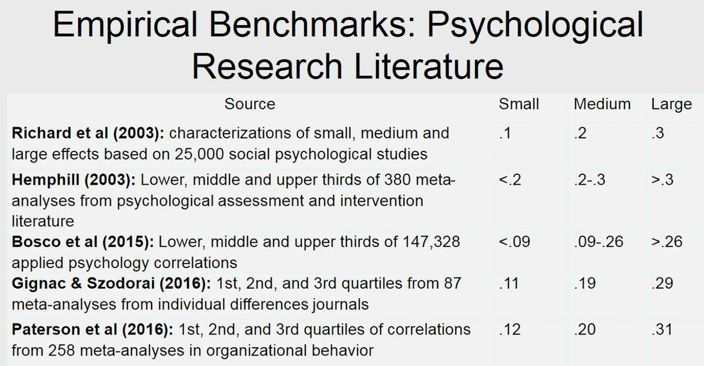
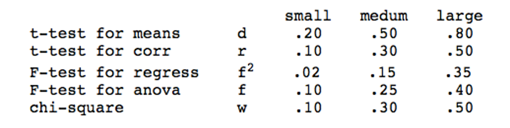

```{r setup, include=FALSE}
options(htmltools.dir.version = FALSE)

library(tidyverse)
library(kableExtra)
library(ggplot2)
library(plotly)
library(htmlwidgets)
library(MASS)
library(ggpubr)
library(xaringanthemer)
library(xaringanExtra)

style_duo_accent(
  primary_color = "#621C37",
  link_color = "#7da5f5",
  secondary_color = "#EE0071",
  background_image = "blank.png"
)

xaringanExtra::use_xaringan_extra(c("tile_view"))

# use_scribble(
#   pen_color = "#EE0071",
#   pen_size = 4
#   )

knitr::opts_chunk$set(
  fig.retina = TRUE,
  warning = FALSE,
  message = FALSE
)
```

name: Title slide
class: middle, left
<br><br><br><br><br><br><br>
# Wissenschaftliches Arbeiten und Forschungsmethoden

### Einheit 6: Samplingplan und Finalisierung Präregistrierung
##### 22.05.2024 | Dr. Caroline Zygar-Hoffmann


---
class: top, left
name: content

### Heutige Themen

#### [Sampling Plan (Rekrutierungsplanung)](#sampling)

#### [Praxisaufgabe Teil 1](#praxis1)

#### [Finalisierung Präregistrierung](#prereg)

#### [Praxisaufgabe Teil 2](#praxis2)

#### [Weitere Zeitplanung](#deadlines)

#### [Material](#material)

---
class: top, left
name: sampling

### Sampling Plan (Rekrutierungsplanung)

#### Sampling Plan im Forschungsprozess

.pull-left[
**Was gehört zur Studienplanung?**

1. Theoriearbeit und Literaturrecherche $\rightarrow$ Einheit 2 und 3

2. Hypothesenformulierung $\rightarrow$ Einheit 3

3. Design Plan $\rightarrow$ Einheit 3

4. Variablen (Auswahl Messinstrumente und Variablenrollen)  $\rightarrow$ Einheit 4

5. Statistischer Analyseplan  $\rightarrow$ letzte Sitzung

6. Sampling plan (Rekrutierungsplan) $\rightarrow$ heutige Sitzung

$\rightarrow$ Studienplanung in **Präregistrierung** festhalten
]

.pull-right[
```{r eval = TRUE, echo = F, fig.align='center'}
knitr::include_graphics("bilder/Forschungsprozess_Prereg.png")
```
]

---
class: top, left
<div class="footer"><span>Van't Veer, A. E., & Giner-Sorolla, R. (2016). Pre-registration in social psychology—A discussion and suggested template. Journal of experimental social psychology, 67, 2-12.</span></div>

### Sampling Plan (Rekrutierungsplanung)

#### Elemente

* Falls zutreffend: Beschreibung der Regeln zur Vorauswahl von Teilnehmer:innen

* Beschreibung der Datenerhebung (Wo? Von wem? Wie? Wann?)

* Rechtfertigung der geplanten Stichprobengröße ( $\rightarrow$ Poweranalyse)

* Beschreibung der Regel zur Beendigung der Datenerhebung

* ggf. Umgang mit Personen, die die Studie abbrechen ("drop out")

* ggf. Wenn-dann-Regeln zum Umgang mit zu kleiner Stichprobe nach Ausschluss


---
class: top, left

### Sampling Plan (Rekrutierungsplanung)

#### Auswahl der Untersuchungsobjekte 

* Frage: an welchen bzw. an wie vielen Untersuchungsobjekten werden die Variablen erhoben? $\rightarrow$ Untersuchungsteilnehmer, deren Beobachtung oder Beschreibung interessante Hypothesen versprechen

**Wichtigstes Kriterium: Repräsentativität der Stichprobe**

* Repräsentativität = Stichprobe muss in ihrer Zusammensetzung der Population möglichst stark ähneln

* Stichprobe ist (merkmals)spezifisch repräsentativ, wenn ihre Zusammensetzung hinsichtlich relevanter Merkmale der Populationszusammensetzung entspricht

* Stichprobe  ist global repräsentativ, wenn ihre Zusammensetzung in nahezu allen Merkmalen der Populationszusammensetzung entspricht

* große Stichprobe garantiert nicht Repräsentativität (gilt nur bei unverzerrter Auswahl)

* beste Gewähr für größtmögliche globale Repräsentativität bietet die Zufallsstichprobe

---
class: top, left
### Sampling Plan (Rekrutierungsplanung)

#### Auswahl der Untersuchungsobjekte 

**Einschlusskriterien:**

* globale Population aller Menschen ist nicht für jede Fragestellung geeignet

* Selektion zur Erhöhung der Auftretenswahrscheinlichkeit relevanter Merkmale (z.B. bestimmte Diagnose, bestimmte Altersklasse...)

**Ausschlusskriterien:**

* Manche Charakteristika machen Untersuchung einzelner Personen inhaltlich/ethisch unmöglich

* Ausschlusskriterien müssen gut überlegt und genau dokumentiert werden

$\rightarrow$ **Für Gruppen mit eigenem Thema gibt es ein Einschlusskriterium, welches nicht inhaltlich begründet ist: Studierender dieser Vorlesung sein. Fehlende Repräsentativität ist dann Teil der Diskussion.**

$\rightarrow$ **Für Gruppen mit Interventionsthema gibt es als Einschlusskriterium, dass die Versuchspersonen in einer festen, monogamen Partnerschaft sein sollen.**

---
class: top, left
### Sampling Plan (Rekrutierungsplanung)

#### Anwerbung von Untersuchungsteilnehmern:

* Wo soll rekrutiert werden?

* Mit welchen Mitteln?

* Wird es eine Vergütung geben?
  * Bei uns: Rückmeldung über eigene Antworten

* Ist die Teilnahme Teil eines erweiterten (Forschungs-/Behandlungs-)Programms?

---
class: top, left
### Sampling Plan (Rekrutierungsplanung)

####  Determinanten der freiwilligen Untersuchungsteilnahme (Bortz und Döring, 2012)

Freiwillige Untersuchungsteilnehmer ...
* ...verfügen über eine bessere schulische Ausbildung als Verweigerer (bessere Notendurchschnitte). 
* ...schätzen ihren eigenen sozialen Status höher ein als Verweigerer.
* ...benötigen mehr soziale Anerkennung als Verweigerer.
* ...sind geselliger als Verweigerer.
* ...sind weniger autoritär als Verweigerer.
* ...haben eine geringere Tendenz zu konformem Verhalten als Verweigerer.
* ...geben sich in Untersuchungen über geschlechtsspezifisches Verhalten unkonventioneller.
* ...verfügen auf Basis der meisten Untersuchungsergebnisse über eine höhere Intelligenz.

Im Allgemeinen sind weibliche Personen eher zur freiwilligen Untersuchungsteilnahme bereit als männliche Personen.

Siehe auch Rezeption einer aktuelleren Studie: https://twitter.com/rubenarslan/status/1700049223889101230: Freiwillige gehen eher wählen und antworten eher "Ja" auf Fragen

---
class: top, left
### Sampling Plan (Rekrutierungsplanung)

#### Präregistrierung

.center[
```{r eval = TRUE, echo = F, out.width = "45%"}
knitr::include_graphics("bilder/prereg_template_sampling.png")
```
]

---
class: top, left
<div class="footer"><span>Van den Akker, O., Weston, S., Campbell, L., Chopik, B., Damian, R., Davis-Kean, P., ... & Bakker, M. (2021). Preregistration of secondary data analysis: A template and tutorial. Meta-psychology, 5, 2625.</span></div>

### Sampling Plan (Rekrutierungsplanung)

#### Zeitpunkt der Registrierung

In einer Präregistrierung wird der Zeitpunkt der Registrierung konkret dokumentiert:

* **Registrierung vor der Sammlung der Daten**: Daten noch nicht erhoben, erstellt oder realisiert worden
* **Registrierung vor jeglicher menschlicher Beobachtung der Daten**: Daten vorhanden, wurden aber noch von niemandem quantifiziert, erstellt, beobachtet oder gemeldet
* **Registrierung vor dem Zugriff auf die Daten**: Daten vorhanden, aber Sie oder Ihre Mitarbeiter haben noch keinen Zugriff darauf
* **Registrierung vor der Analyse der Daten**: Daten vorhanden und Sie haben darauf zugegriffen, aber es wurde noch keine Analyse im Zusammenhang mit dem Forschungsplan durchgeführt 
* **Registrierung nach der Analyse der Daten**: Sie haben auf einen Teil der für den Forschungsplan relevanten Daten zugegriffen und diese analysiert

Wenn für eine Studie auf einem bereits bestehenden Datensatz Berechnungen durchgeführt werden (Analysen auf vorab-existierenden Daten), muss dies auch durchdacht und dokumentiert werden $\rightarrow$ 
siehe "Preregistration of secondary data analysis: A template and tutorial": https://research.tilburguniversity.edu/en/publications/preregistration-of-secondary-data-analysis-a-template-and-tutoria

---
class: top, left

### Sampling Plan (Rekrutierungsplanung)

#### Präregistrierung

.center[
```{r eval = TRUE, echo = F, out.width = "50%"}
knitr::include_graphics("bilder/prereg_template_m1-m2.png")
```
]

---
class: top, left
### Sampling Plan (Rekrutierungsplanung)

#### Größe der Stichprobe

* Die Festlegung des Stichprobenumfanges sollte ebenfalls in der Planungsphase erfolgen

* Verbindliche Angaben zum nötigen Stichprobenumfang für eine bestimmte Analyse nur möglich, wenn eine hypothesenprüfende Untersuchung mit vorgegebener Effektgröße geplant wird $\rightarrow$ **a priori Poweranalyse** 

* Durchführung z.B. in R oder freies Programm GPower ([Link zu Erklärvideo für G*Power](https://www.youtube.com/watch?v=7J7ZLp5Q2H8))

* Für die Größe von Stichproben, mit denen keine spezifischen Hypothesen geprüft werden oder keine Effektgröße schätzbar ist, gibt es keine genauen Richtlinien ("more is better, but be mindful of resources")

* Falls die Stichprobengröße aus anderen Gründen festgelegt ist (wie bei den Gruppen mit eigenem Thema), kann man eine "**(post hoc) Sensitivitäts-Poweranalyse**" machen, um abzuschätzen wie hoch die statistische Power für die Aufdeckung eines Effekts mit dieser Stichprobengröße ist (wichtig: eine post hoc Analyse auf dem *gefundenen* Effekt aus der eigenen Studie macht keinen Sinn, nur eine auf dem erwarteten Effekt)

---
class: top, left
### Sampling Plan (Rekrutierungsplanung)

#### Größe der Stichprobe

* Ziel der a priori Poweranalyse: Bestimmung einer Stichprobengröße, die bei angenommender Effektgröße eine statistisch-signifikantes Ergebnis ermöglicht 

* Zusammenspiel aus Signifikanzniveau (Wahrscheinlichkeit für Fehler 1. Art) und Power (1 - Wahrscheinlichkeit für Fehler 2. Art)

* Poweranalyse richtet sich nach der Hauptfragestellung (primärer zu überprüfender Hypothese); bei mehreren Primärhypothesen nach dem kleinsten erwarteten Effekt

Relevante Parameter:
  * **Effektstärke** (aus Vorstudien/Literatur oder basierend auf Plausibilitätsannahme) $\rightarrow$ je größer, desto kleineres N benötigt
  * **Signifikanznivea**u (i.d.R. alpha = .05) $\rightarrow$ je kleiner, desto kleineres N benötigt
  * **Power** (i.d.R. mindestens 0.8) $\rightarrow$ je größer, desto kleineres N benötigt

---
class: top, left
### Sampling Plan (Rekrutierungsplanung)

#### Poweranalyse in R

Poweranalyse für einen unabhängigen t-Test (auch für andere Hypothesentests möglich):

.pull-left[
.center[
```{r eval = TRUE, echo = F}
knitr::include_graphics("bilder/power-ttest.png")
```
]
]
.pull-right[
* Bei a priori Annahme einer Effektstärke von Cohen's d = 0.5 für den Mittelwertsunterschied (mittlerer bis großer Effekt)

* und einem Signifikanzniveau von alpha = .05

* und einer Power von 0.8 (Chance auf positives Ergebnis)

benötigt man N = 102 Personen (51 pro Gruppe), um in einem einseitigen *(alternative = "greater")* unabhängigen t-Test *(type = "two.sample")* einen signifikanten Gruppenunterschied nachzuweisen
]

---
class: top, left
### Sampling Plan (Rekrutierungsplanung)

#### Sensitivitäts-Poweranalyse in R

Sensitivitäts-Poweranalyse für einen unabhängigen t-Test (auch für andere Hypothesentests möglich):

.pull-left[
.center[
```{r eval = TRUE, echo = F}
knitr::include_graphics("bilder/sensitivity-power-ttest.png")
```
]
]
.pull-right[
* Bei a priori Annahme einer Effektstärke von Cohen's d = 0.5 für den Mittelwertsunterschied (mittlerer Effekt)

* und einem Signifikanzniveau von alpha = .05

* und N = 78 Personen (39 Personen pro Gruppe) (*Hinweis: An der Vorlesung nehmen insgesamt 82 Studierende teil. Wenn die eigene Gruppe = 3-5 Personen nicht an der Studie teilnehmen, aber sonst alle, kommen Sie auf 77-79 Versuchspersonen.*)

erreicht man eine Power von 71% für einen einseitigen, unabhängigen t-Test; d.h. die Wahrscheinlichkeit einen Effekt zu finden, wenn er da ist, beträgt 71%. 
]

---
class: top, left
### Sampling Plan (Rekrutierungsplanung)

#### Poweranalyse in R: Befehle

* **pwr.t.test()** für Einstichproben-t-test, sowie unabhängige und abhängige Zweistichproben-t-tests mit gleicher Gruppengröße; Angabe von Effektstärke d (s.o.)

* **pwr.anova.test()** für einfaktorielle ANOVA; Angabe von Effektstärke f
  * f = $\sqrt{(\omega² / 1 - \omega²)}$
  * Angabe von k = Stufen des Faktors
  
* **pwr.f2.test()** für Regression und mehrfaktorielle ANOVA; Angabe von Effektstärke f²
  * f² = $R² / (1 – R²)$ bzw. $\omega² / 1 - \omega²$ für aufgeklärte Varianz des Gesamtmodells
  * f² = $(R²_{AB} -  R²_A) / (1 – R²_{AB})$ bzw. $\omega²_{partial_B} / 1 - \omega²_{partial_B}$ für aufgeklärte Varianz des Prädiktors B
  * Angabe von u = Anzahl der Prädiktoren/Faktoren ohne Intercept
  * Rückgabewerte v + u + 1 ergibt Stichprobengröße n
  
* **pwr.r.test()** für Korrelation


---
class: top, left

### Sampling Plan (Rekrutierungsplanung)

#### Poweranalyse: Woher weiß ich die Effektstärke?

.pull-left[
* **Recherche in bestehender Literatur! Diese dann herunterkorrigieren** (wegen Publication Bias), d.h. erwarteten Effekt für die Poweranalyse kleiner angeben, als das was in der Literatur gefunden wurde.
* Falls nötig, **Transformation der Effektstärke** aus der Literatur in die Effektstärke, die für die Poweranalyse gebraucht wird (z.B. r in d): https://www.psychometrica.de/effect_size.html
* Alternativen: **Pilotstudien** (aber auch nicht zuverlässig) oder **praktisch bedeutsame Mindestgrößen**
* Bei unklarer zu erwartender Effektstärke: Mehrere Poweranalysen rechnen, visualisieren wie sich die nötige Stichprobenzahl abhängig von der Effektstärke verändert ("**Power curves**")
]

.pull-right[
```{r eval = TRUE, echo = F}
knitr::include_graphics("bilder/effectsize_transformation.png")
```
]


---
class: top, left
<div class="footer"><span>Funder, D. C., & Ozer, D. J. (2019). Evaluating Effect Size in Psychological Research: Sense and Nonsense. Advances in Methods and Practices in Psychological Science, 2, 156–168. doi:10.1177/2515245919847202 <br>
Bosco, F. A., Aguinis, H., Singh, K., Field, J. G., & Pierce, C. A. (2015). Correlational effect size benchmarks. Journal of Applied Psychology, 100(2), 431–449. http://doi.org/10.1037/a0038047 <br> Hill, C. J., Bloom, H. S., Black, A. R., & Lipsey, M. W. (2008). Empirical Benchmarks for Interpreting Effect Sizes in Research. Child Development Perspectives, 2, 172–177. doi:10.1111/j.1750-8606.2008.00061.x</span></div>

### Sampling Plan (Rekrutierungsplanung)

#### Poweranalyse: Woher weiß ich die Effektstärke?

* Durchschnittlicher Effekt in der Psychologie: r ~ .20 (d ~ .40) mit einer Standardabweichung von r ~ .10-.15

* Das ist kleiner als die Einordnung, die Cohen vorgeschlagen hat

.pull-left[
```{r eval = TRUE, echo = F, out.width = "450px", fig.cap="Bei den Werten in der Tabelle handelt es sich um Korrelationen."}

```
]

.pull-right[
Cohen's Einordnung:
```{r eval = TRUE, echo = F, out.width = "450px"}

```
]

---
class: top, left
<div class="footer"><span>Hróbjartsson, A., & Gøtzsche, P. C. (2004). Is the placebo powerless? Update of a systematic review with 52 new randomized trials comparing placebo
with no treatment. Journal of internal medicine, 256(2), 91-100. <br> Luhmann, M., Hofmann, W., Eid, M., & Lucas, R. E. (2012). Subjective well-being and adaptation to life events: a meta-analysis. Journal of Personality and Social Psychology, 102(3), 592–615. http://doi.org/10.1037/a0025948 <br> https://www.wikidoc.org/index.php/Effect_size</span></div>

### Sampling Plan (Rekrutierungsplanung)

#### Poweranalyse: Woher weiß ich die Effektstärke?

Vergleich mit gut vorstellbaren Effekten, z.B. 
  
* mittlerer Größenunterschied zwischen Männern und Frauen: d = 1.72
  
* mittlerer Placebo-Effekt: d = 0.24
  
* mittlere Veränderung der Lebenszufriedenheit direkt nach Hochzeit: d = 0.26

* mittlere Veränderung der Lebenszufriedenheit direkt nach einem Trauerfall: d = -0.48
  
* mittlerer Effekt des Schulbesuchs in der ersten Klasse auf die Mathefähigkeit: d = 1.1

---
class: top, left
<div class="footer"><span>Greitemeyer, T. (2009). Effects of songs with prosocial lyrics on prosocial thoughts, affect, and behavior. Journal of experimental social psychology, 45(1), 186-190.</span></div>

### Sampling Plan (Rekrutierungsplanung)

#### Poweranalyse: Woher weiß ich die Effektstärke?

Beispiel Literatur für Poweranalyse von Interventionsthema: 

.pull-left[
```{r eval = TRUE, echo = F, out.width = "300px"}
knitr::include_graphics("bilder/effectsize_lit_bsp0.png")
``` 
]

.pull-right[
```{r eval = TRUE, echo = F, out.width = "450px"}
knitr::include_graphics("bilder/effectsize_lit_bsp.png")
``` 
]

* d.h. Effekt von Liedern mit bestimmten Lyric-Inhalt auf dazu passende Gedanken: d = 0.73 $\rightarrow$ Wegen Publication Bias und etwas anderer AV bei uns korrigieren wir den Effekt herunter auf z.B. d = 0.4

* Für Moderationshypothesen nach entsprechenden Angaben in der Literatur suchen, und in pwr.f2.test eingeben (u = 1 Prädiktor der uns interessiert = die Interaktion) $\rightarrow$ im Zweifelsfall von einem kleinen Effekt ausgehen (f2 = 0.01-0.02)!

* Hinweis: Wie viele Personen für das Interventionsthema pro Student rekrutiert werden sollen entscheiden wir in der nächsten Sitzung (für die Präregistrierung reicht eine Angabe wie viele man rekrutieren müsste um eine Power von 80% zu erreichen)

---
class: top, left
<div class="footer"><span>Benjamin, D. J., Berger, J. O., Johannesson, M., Nosek, B. A., Wagenmakers, E. J., Berk, R., ... & Johnson, V. E. (2018). Redefine statistical significance. Nature human behaviour, 2(1), 6-10. <br>
Lakens, D., Adolfi, F. G., Albers, C. J., Anvari, F., Apps, M. A., Argamon, S. E., ... & Zwaan, R. A. (2018). Justify your alpha. Nature human behaviour, 2(3), 168-171. <br> Lakens, D. (2022). Sample size justification. Collabra: Psychology, 8(1), 33267.</span></div>

### Sampling Plan (Rekrutierungsplanung)

#### Poweranalyse: Wie wähle ich mein Alpha-Niveau?

* Standard in der Psychologie: $\alpha$ = 0.05

* Benjamin et al. (2018): Vorschlag, das $\alpha$-Niveau weiter auf 0.005 zu senken, um Replizierbarkeit der Effekte zu erhöhen

* Lakens et al. (2018): Justify your $\alpha$!
  * Für Ihre Arbeit könnte das bedeuten mal in der Sensitivitätspower-Analyse verschiedene Werte von Alpha auszuprobieren, um zu sehen wie sich die Power dadurch erhöht
  * Meine Empfehlung: Für dieses Ausprobieren $\alpha$ maximal so weit erhöhen wie es nicht den $\beta$-Fehler (1-Power) übersteigt
  * Begründung: Im Rahmen dieses Lehrprojekts ist es genauso "schlimm" zu behaupten es gäbe einen Effekt, wenn es keinen gibt, als zu behaupten es gäbe keinen Effekt, wenn es einen gibt.
  * In der Forschung wird der Fehler 1.Art ( $\alpha$-Fehler) zumindest formal konstant niedrig gehalten, während die Höhe des Fehlers 2.Art ( $\beta$-Fehler) maßgeblich von der Größe der Stichprobe abhängt (welche variabel ist)

---
class: top, left
### Sampling Plan (Rekrutierungsplanung)

#### Bewertungsschema

.center[
```{r eval = TRUE, echo = F}
knitr::include_graphics("bilder/bewertung_power.png")
```
]

---
class: top, left
### Sampling Plan (Rekrutierungsplanung)

#### Präregistrierung

Beispiel 1 aus letztem Semester:

.center[
```{r eval = TRUE, echo = F, out.width = "45%"}
knitr::include_graphics("bilder/prereg_template_power0.png")
```
]


---
class: top, left
### Sampling Plan (Rekrutierungsplanung)

#### Präregistrierung

Beispiel 2 aus letztem Semester:

.center[
```{r eval = TRUE, echo = F, out.width = "45%"}
knitr::include_graphics("bilder/prereg_template_power1.png")
```
]


---
class: top, left
name: praxis1

### Praxis Teil 1: Samplingplan entwickeln

**Schritt 1:** [Präregistrierungstemplate auf studynet](https://studynet.hs-fresenius.de/goto_STUDYNETHSF_file_27541_download.html) um Sampling-Plan erweitern
  * M1 und M5: ggf. übersetzen
  * M4: ggf. übersetzen und ergänzen (Welche Ein- und Ausschlusskriterien sind bei Ihnen relevant?)
  
**Schritt 2:** Poweranalyse
  * Welche Effektstärke erwarten Sie?
  * Welches Alpha-Niveau nutzen Sie? Testen Sie einseitig oder zweiseitig (gerichtete vs. ungerichtete Hypothese)?
  * Eigenes Thema: Wie sieht Ihre Power bei dem vorgegebenen Samplingplan aus (d.h. bei gesamt maximal 77-79 Versuchspersonen)?
  * Interventionsthema: Wie viele Personen brauchen Sie für Ihre Hypothesen für eine Power von 80%?
  * Erweitern Sie das [Präregistrierungstemplate auf studynet](https://studynet.hs-fresenius.de/goto_STUDYNETHSF_file_27541_download.html) $\rightarrow$ Durchgeführte Poweranalyse in M3 berichten
  
---
class: top, left
name: prereg

### Finalisierung Präregistrierung

#### Offene Felder

* den Abschnitt "Abstract" können Sie ausfüllen wenn Sie möchten (d.h. zu jedem Bereich einen Satz Zusammenfassung schreiben), aber es ist völlig in Ordnung ihn aus dem Template zu entfernen

* den Abschnitt "AP5 Descriptive statistics" können Sie einfach frei lassen oder mit einem "-" bzw. "No prior specification" ausfüllen (wir werden in den kommenden Sitzungen besprechen, welche deskriptiven Statistiken üblich sind, aber das ist nichts was man präregistrieren muss)

* Unter References können Sie Quellenangaben einfügen, z.B. wenn Sie sich in der Einleitung auf bestimmte Theorien oder Studien beziehen (Angaben im APA-Format, siehe Zusatzmaterial Z2 Literaturrecherche, Bewertung von Forschungsfragen & Referenzen: https://studynet.hs-fresenius.de/ilias.php?baseClass=ilrepositorygui&cmd=sendfile&ref_id=27540)

---
class: top, left

### Finalisierung Präregistrierung

#### Offene Felder

.center[
```{r eval = TRUE, echo = F, out.width = "50%"}
knitr::include_graphics("bilder/prereg_template_t1-t2.png")
knitr::include_graphics("bilder/prereg_template_t3-t4.png")
```
]

---
class: top, left

### Finalisierung Präregistrierung

#### Offene Felder

.center[
```{r eval = TRUE, echo = F, out.width = "45%"}
knitr::include_graphics("bilder/prereg_template_t5-t6.png")
knitr::include_graphics("bilder/prereg_template_t7-t8.png")
```
]

* Hinweis: Conflict of Interest = Interessenskonflikt (z.B. finanzielle Interessen an den Forschungsergebnissen)

---
class: top, left

### Finalisierung Präregistrierung

#### Offene Felder

.center[
```{r eval = TRUE, echo = F, out.width = "50%"}
knitr::include_graphics("bilder/prereg_template_t9-t10.png")
knitr::include_graphics("bilder/prereg_template_t11-t12.png")
```
]

---
class: top, left

### Finalisierung Präregistrierung

#### Präregistrierungsplattformen

* Präregistrierung ist fertig, und jetzt? $\rightarrow$ **als PDF abspeichern und "Einfrieren" der Präregistrierung**

* Beispiele für Plattformen (unterscheiden sich nur in Details):
  * Open Science Framework: https://osf.io
  * PsychArchives: https://pasa.psycharchives.org/
  * As predicted: https://aspredicted.org/ (hier werden Präregistrierungen nicht zwangsläufig irgendwann öffentlich -> Nachteil für Transparenz)
  
$\rightarrow$ Wir nutzen das Open Science Framework

---
class: top, left
name: praxis2

### Praxis Teil 2: Finalisierung Präregistrierung und formr

**Schritt 0: Nicht vergessen, dass es einen Praxis Teil 1 gibt**

**Schritt 1: T-Felder ausfüllen**

**Schritt 2: OSF Projekt anlegen**

* Jeder (!) aus der Kleingruppe erstellt sich ein (kostenloses) Konto auf [www.osf.io](www.osf.io)

* Einer (!) aus der Kleingruppe erstellt über "Create new project" ein Projekt (Name des Projekts = Titel der Präregistrierung)

* Unter dem Reiter "Contributors" und dem Button "Add" fügt die Person, die das Projekt erstellt hat, alle anderen Mitglieder der Kleingruppe und mich hinzu (+ ggf. Ihren weiteren Ansprechpartner, d.h. falls ich das nicht bin, dann Stephan Goerigk oder Janika Saretzki)

* In der Startseite des Projekts können Sie unter "Files" -> "OSF-Storage" -> "Upload" die PDF-Datei Ihrer Präregistrierung hochladen


---
class: top, left

### Praxis Teil 2: Finalisierung Präregistrierung und formr

**Schritt 3: Präregistrierung einfrieren**

* Über "Registrations" -> "New Registration" -> "Open Ended Registration" -> "Create Draft" können Sie das Einfrieren der Präregistrierung vorbereiten:
  * Unter "Description" können Sie schreiben: "*Preregistration of a study conducted in the context of the lecture "Empirisch wissenschaftliches Arbeiten" at the Charlotte Fresenius Hochschule München*"
  * Unter "License" können Sie "*CC-By Attribution-ShareAlike 4.0. International*" auswählen
  * Unter "Subjects" können Sie "*Social and Behavioral Sciences*" auswählen
  * Auf der nächsten Seite unter "Summary" können Sie schreiben: "*Please see attached file.*" Auf dieser Seite müssen Sie nun das hochgeladene PDF auswählen (in dem Sie in der Liste der Dateien draufklicken)
  
* Wenn Sie fertig sind, können Sie oben rechts auf den Button "Register" klicken

$\rightarrow$ Entweder alle aus der Kleingruppe bestätigen die Registrierung (falls Sie Administratoren sind), oder automatische Bestätigung nach 48h

**Schritt 4: Implementierung des Fragebogens in formr finalisieren**

---
class: top, left
name: deadlines

### Weitere Zeitplanung

* **Präregistrierung** sollte idealerweise bis **diesen Freitag 24.05.** eingefroren sein ( $\rightarrow$ falls Sie noch Fragen an Ihre Ansprechpartner haben klären Sie diese bald!)

* Damit Probleme in formr rechtzeitig gelöst werden können melden Sie sich **ebenfalls bis diesen Freitag 24.05. bei mir, wenn Sie konkrete Probleme oder Fragen zu formr haben**

* **Zum Start der Datenerhebung:**
 - Gruppen mit eigenem Thema: Wenn Sie mir den formr-Run schon diese Woche schicken, können Sie schon diese Woche mit der Datenerhebung starten (sobald Ihre Präregistrierung eingefroren ist). 
 - Da nächste Woche keine Vorlesung stattfindet, können alle anderen die Datenerhebung erst in der übernächsten Woche starten, da ich den formr-Run voraussichtlich nächste Woche nicht prüfen kann.  
 - Alle Datenerhebungen sollten spätestens (!) am 07.06. starten (nachdem die Präregistrierung eingefroren wurde)!

$\rightarrow$ **Damit das klappt, schicken Sie mir Ihren formr run bitte bis Dienstag, 04.06. zu.** Besonders bei den Gruppen mit Interventionsthema ist ein frühzeitiges Zuschicken hilfreich, da wir alle gemeinsam mit der Datenerhebung starten müssen und ich daher Ihre runs noch zusammenfügen muss.

Hinweis: Zum Verschicken müssen Sie folgendes in formr auswählen: Run -> Export -> "include survey details" anklicken -> Export. Die exportierte Datei dann an mich schicken.

---
class: top, left
name: material

### Material

* **Bewertungsschema**: https://studynet.hs-fresenius.de/ilias.php?baseClass=ilrepositorygui&cmd=sendfile&ref_id=27027

* **Template Präregistrierung**: https://studynet.hs-fresenius.de/goto_STUDYNETHSF_file_27541_download.html

* **Template formr eigenes Thema**: https://studynet.hs-fresenius.de/goto_STUDYNETHSF_file_28654_download.html

* **Template formr Interventionsthema**: https://studynet.hs-fresenius.de/goto_STUDYNETHSF_file_28655_download.html

* **Link zu formr**: https://workshops.formr.org/ (Login: cfhwaf@gmail.com oder cfhwaf2@gmail.com PW: eX9Sh6nt!)

* **Folie mit formr-Ressourcen**: Folie 32 in Einheit 4

* **Website zum Umrechnen von Effektstärken:** https://www.psychometrica.de/effect_size.html

*	**Fragenforum**: https://cfh-waf.forumieren.de/

---
class: top, left
### Literaturempfehlung für die heutige Sitzung

.center[
```{r, echo=FALSE,out.width="30%",fig.cap="Kapitel 14 und 15 in Döring, N. & Bortz, J. (2016). Forschungsmethoden und Evaluation in den Sozial- und Humanwissenschaften. Pearson.",fig.show='hold',fig.align='center'}
knitr::include_graphics("bilder/doering.png")
``` 
]

<!-- library(renderthis) -->
<!-- to_pdf("WissArb_06_Samplingplan.Rmd", complex_slides = TRUE) -->
