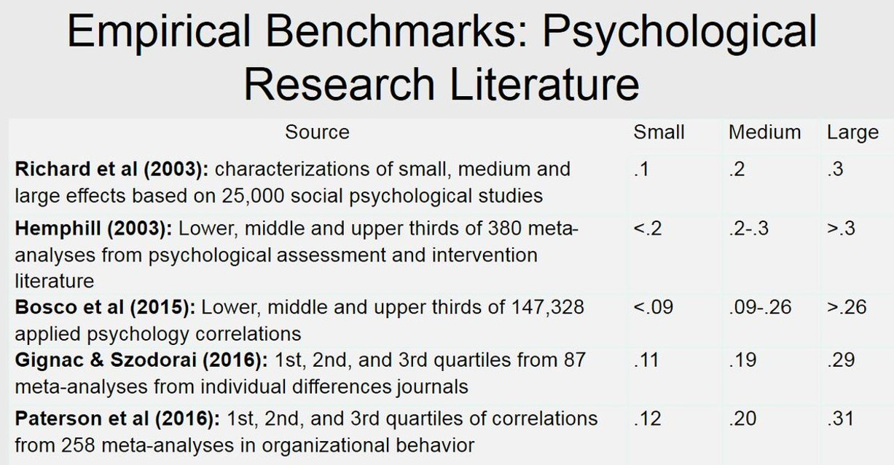
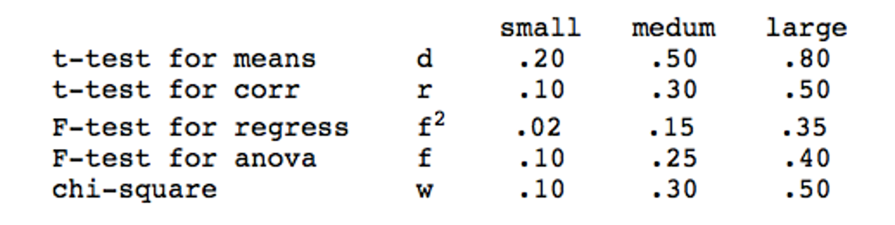
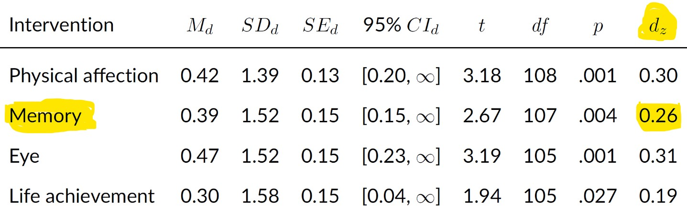

```{r setup, include=FALSE}
options(htmltools.dir.version = FALSE)

library(tidyverse)
library(kableExtra)
library(ggplot2)
library(plotly)
library(htmlwidgets)
library(MASS)
library(ggpubr)
library(xaringanthemer)
library(xaringanExtra)

style_duo_accent(
  primary_color = "#621C37",
  link_color = "#7da5f5",
  secondary_color = "#EE0071",
  background_image = "blank.png"
)

xaringanExtra::use_xaringan_extra(c("tile_view"))

# use_scribble(
#   pen_color = "#EE0071",
#   pen_size = 4
#   )

knitr::opts_chunk$set(
  fig.retina = TRUE,
  warning = FALSE,
  message = FALSE
)
```

name: Title slide
class: middle, left
<br><br><br><br><br><br><br>
# Wissenschaftliches Arbeiten und Forschungsmethoden

### Einheit 6: Stichprobenplanung und Finalisierung Präregistrierung
##### 13.05.2025 | Prof. Dr. Caroline Zygar-Hoffmann

---
class: top, left
name: content

### Heutige Themen

#### [Stichprobenplanung (Sampling plan)](#sampling)

#### [Praxisaufgabe Teil 1](#praxis1)

#### [Finalisierung Präregistrierung](#prereg)

#### [Praxisaufgabe Teil 2](#praxis2)

#### [Weitere Zeitplanung](#deadlines)

#### [Material](#material)

---
class: top, left
name: sampling

### Stichprobenplanung (Sampling plan)

#### Stichprobenplanung im Forschungsprozess

.pull-left[
**Was gehört zur Studienplanung?**

1. Theoriearbeit und Forschungsfrage $\rightarrow$ Einheit 1 und 2, I1 & I2 in Präregistrierung

2. Hypothesen $\rightarrow$ Einheit 2, I3 & I4

3. Studiendesign $\rightarrow$ Einheit 2, M6, M10, M11, M14 & M15 

4. Operationalisierung (Auswahl Messinstrumente)  $\rightarrow$ Einheit 3, M12, M13, AP3 & AP4

5. Statistischer Analyseplan  $\rightarrow$ letzte Sitzung, AP1-AP3, AP5-AP9, M7 & M8

6. Samplingplan (Rekrutierungsplan, Poweranalyse), Infos & Sonstiges $\rightarrow$ heutige Sitzung, M1-M5, M9, T1-T12
]

.pull-right[
```{r eval = TRUE, echo = F, fig.align='center'}
knitr::include_graphics("bilder/Forschungsprozess_Prereg.png")
```
]

---
class: top, left
<div class="footer"><span>Van't Veer, A. E., & Giner-Sorolla, R. (2016). Pre-registration in social psychology—A discussion and suggested template. <i>Journal of Experimental Social Psychology, 67</i>, 2-12.</span></div>

### Stichprobenplanung (Sampling plan)

#### Elemente

**1) Stichprobengröße** (M3 in der Präregistrierung)
  - Rechtfertigung der geplanten Stichprobengröße (i.d.R. über eine Poweranalyse) $\rightarrow$ die Festlegung des Stichprobenumfanges sollte also bereits in der Planungsphase erfolgen
  - Beschreibung der Regel zur Beendigung der Datenerhebung
  
**2) Definition der Zielpopulation und Vorgehen bei Rekrutierung** (M1, M2 und M4 in der Präregistrierung)
  - Beschreibung der Datenerhebung: Wo? Von wem? Wie? Welcher Anreiz? Wann (auch in Hinblick auf die Präregistrierung; oder wird auf bereits erhobenen Daten gearbeitet)?
  - Falls zutreffend: Beschreibung der Regeln zur Vorauswahl von Teilnehmer:innen

**3) Vorgehen nach Beendigung der Datenerhebung / "Nachsorge"** (M5 in der Präregistrierung)
  - ggf. spezieller Umgang mit Personen, die die Studie abgebrochen haben ("drop out")
  - ggf. Wenn-dann-Regeln zum Umgang mit zu kleiner Stichprobe nach Ausschluss, z.B. Nacherhebung

$\rightarrow$ **für 2) und 3) siehe Zusatzmaterial [Z5 "Rekrutierungsplan"](https://studynet.hs-fresenius.de/ilias.php?baseClass=ilrepositorygui&cmd=sendfile&ref_id=43972)**

---
class: top, left
### Stichprobenplanung (Sampling plan)

#### Größe der Stichprobe

.pull-left[
* Angaben zum nötigen Stichprobenumfang nur möglich, wenn eine hypothesenprüfende Untersuchung mit vorgegebener Effektgröße geplant wird: **a priori Poweranalyse**
  - Ziel: Bestimmung einer Stichprobengröße, die bei angenommender Effektgröße eine statistisch signifikantes Ergebnis ermöglicht 
  - Zusammenspiel aus Signifikanzniveau und Power
  - Die a priori Poweranalyse ist die üblichste Poweranalyse, diese haben Sie auch in "Quantitative Methoden" kennengelernt und werden Sie auch nächstes Semester im Forschungspraktikum anwenden
]

.pull-right[
* Falls die Stichprobengröße aus anderen Gründen festgelegt/gedeckelt ist (wie bei den Gruppen mit eigenem Thema in dieser Veranstaltung): **Sensitivitäts-Poweranalyse**
  - Ziel: Abschätzung wie hoch die statistische Power für die Aufdeckung eines angenommenen Effekts mit dieser Stichprobengröße ist 
  - Zusammenspiel aus Signifikanzniveau und gegebener Stichprobengröße
  - Wichtig: eine nachträgliche ("post hoc") Sensitivitätsanalyse auf dem *gefundenen* Effekt aus der eigenen Studie macht keinen Sinn, nur eine auf dem *erwarteten* Effekt
]

* Für die Größe von Stichproben, mit denen keine spezifischen Hypothesen geprüft werden oder keine Effektgröße schätzbar ist, gibt es keine genauen Richtlinien ("more is better, but be mindful of resources")

---
class: top, left
### Stichprobenplanung (Sampling plan)

#### Größe der Stichprobe

* Poweranalyse sollte sich am besten nach dem kleinsten erwarteten Effekt richten

* Für Ihre Projekte auch ok (**aus rein pragmatischen Gründen**): eine Primärhypothese rausgreifen, und dafür die Powerhypothese machen (aber besser wäre es für den kleinsten erwarteten Effekt)

.pull-left[
Relevante Parameter für a priori Poweranalyse:
  * **angenommene Effektstärke** (aus Vorstudien/Literatur oder basierend auf Plausibilitätsannahme) $\rightarrow$ je größer, desto kleineres N benötigt
  * **Signifikanzniveau** (i.d.R. $\alpha$ = .05) $\rightarrow$ je größer, desto kleineres N benötigt
  * **Power** (i.d.R. mindestens 0.8) $\rightarrow$ je kleiner, desto kleineres N benötigt
]

.pull-right[
Relevante Parameter für Sensitivitäts-Poweranalyse:
  * **angenommene Effektstärke** (aus Vorstudien/Literatur oder basierend auf Plausibilitätsannahme) $\rightarrow$ je größer, desto höher die Power
  * **Signifikanzniveau** (i.d.R. $\alpha$ = .05) $\rightarrow$ je größer, desto höher die Power
  * **Stichprobengröße** $\rightarrow$ je größer, desto höher die Power
]

$\rightarrow$ Durchführung einer Poweranalyse z.B. in R oder im freien Programm GPower ([Link zu Erklärvideo für G*Power](https://www.youtube.com/watch?v=7J7ZLp5Q2H8))

---
class: top, left
### Stichprobenplanung (Sampling plan)

#### A priori Poweranalyse in R

...für einen unabhängigen t-Test (auch für andere Hypothesentests möglich):

```{r eval = TRUE, echo = F, out.width = "70%"}
knitr::include_graphics("bilder/power-ttest.png")
```

.pull-left[
* Bei a priori Annahme einer Effektstärke von Cohen's d = 0.5 für den Mittelwertsunterschied (mittlerer bis großer Effekt)

* und einem Signifikanzniveau von alpha = .05

* und einer Power von 0.8 (Chance auf signifikantes Ergebnis, falls es den Effekt gibt)
]

.pull-right[
.center[
<br>
...benötigt man N = 102 Personen (= 51 pro Gruppe), um in einem einseitigen *(alternative = "greater")* unabhängigen t-Test *(type = "two.sample")* einen signifikanten Gruppenunterschied nachzuweisen
]
]

---
class: top, left
### Stichprobenplanung (Sampling plan)

#### Sensitivitäts-Poweranalyse in R

...für einen unabhängigen t-Test (auch für andere Hypothesentests möglich):


```{r eval = TRUE, echo = F, out.width = "60%"}
knitr::include_graphics("bilder/sensitivity-power-ttest.png")
```

.pull-left[
* Bei a priori Annahme einer Effektstärke von Cohen's d = 0.5 für den Mittelwertsunterschied (mittlerer bis großer Effekt)

* und einem Signifikanzniveau von alpha = .05

* und N = 76 Personen (38 Personen pro Gruppe)
]

.pull-right[
.center[
<br>
...erreicht man eine Power von 69% für einen einseitigen, unabhängigen t-Test; d.h. die Wahrscheinlichkeit einen Effekt dieser Höhe zu finden, wenn er da ist, beträgt 69%. 
]
]

*Hinweis: An der Vorlesung nehmen insgesamt 80 Studierende teil. Wenn die eigene Gruppe = 3-5 Personen nicht an der Studie teilnehmen, aber sonst alle, kommen Sie auf 75-77 Versuchspersonen.*


---
class: top, left
### Stichprobenplanung (Sampling plan)

#### Poweranalyse in R: Befehle für gängige Analysen

* **pwr.t.test()** für Einstichproben-t-tests, sowie unabhängige oder abhängige Zweistichproben-t-tests mit gleicher Gruppengröße; Angabe von Effektstärke d (siehe vorherige Folie)

* **pwr.t2n.test()** für t-test bei ungleicher Gruppengröße

* **pwr.r.test()** für Korrelationen

* **pwr.anova.test()** für einfaktorielle ANOVAs; Angabe von Effektstärke f
  * f = $\sqrt{(\omega² / 1 - \omega²)}$
  * Angabe von k = Stufen des Faktors
  
* **pwr.f2.test()** für Regressionen und mehrfaktorielle ANOVAs; Angabe von Effektstärke f²
  * f² = $R² / (1 – R²)$ bzw. $\omega² / 1 - \omega²$ für aufgeklärte Varianz des Gesamtmodells
  * f² = $(R²_{AB} -  R²_A) / (1 – R²_{AB})$ bzw. $\omega²_{partial_B} / 1 - \omega²_{partial_B}$ für aufgeklärte Varianz des Prädiktors B
  * Angabe von u = Anzahl der Prädiktoren/Faktoren ohne Intercept (wenn es um das Gesamtmodell geht) oder = 1 (wenn es um einen einzelnen Prädiktor geht, z.B. die Interaktion)
  * Ausgegeben wird "v", man muss v + u + 1 rechnen um Stichprobengröße n zu erhalten

---
class: top, left

### Stichprobenplanung (Sampling plan)

#### Poweranalyse: Woher weiß ich die erwartete Effektstärke?

.pull-left[
* **Recherche in bestehender Literatur! Diese Effekte dann herunterkorrigieren** (wegen Publication Bias), d.h. erwarteten Effekt für die Poweranalyse kleiner angeben, als das was in der Literatur gefunden wurde.
* Falls nötig, **Transformation der Effektstärke** aus der Literatur in die Effektstärke, die für die Poweranalyse gebraucht wird (z.B. r in d): https://www.psychometrica.de/effect_size.html
* Alternativen: Praktisch bedeutsame Mindestgrößen oder Pilotstudien (sind allerdings ungenau)
* Bei unklarer zu erwartender Effektstärke: Mehrere Poweranalysen rechnen, visualisieren wie sich die nötige Stichprobenzahl abhängig von der Effektstärke verändert ("**Power curves**")
]

.pull-right[
```{r eval = TRUE, echo = F}
knitr::include_graphics("bilder/effectsize_transformation.png")
```
]


---
class: top, left
<div class="footer"><span>Funder, D. C., & Ozer, D. J. (2019). Evaluating Effect Size in Psychological Research: Sense and Nonsense. Advances in Methods and Practices in Psychological Science, 2, 156–168. doi:10.1177/2515245919847202 <br>
Bosco, F. A., Aguinis, H., Singh, K., Field, J. G., & Pierce, C. A. (2015). Correlational effect size benchmarks. Journal of Applied Psychology, 100(2), 431–449. http://doi.org/10.1037/a0038047 <br> Hill, C. J., Bloom, H. S., Black, A. R., & Lipsey, M. W. (2008). Empirical Benchmarks for Interpreting Effect Sizes in Research. Child Development Perspectives, 2, 172–177. doi:10.1111/j.1750-8606.2008.00061.x</span></div>

### Stichprobenplanung (Sampling plan)

#### Poweranalyse: Woher weiß ich die erwartete Effektstärke?

* Durchschnittlicher Effekt in der Psychologie: r ~ .20 (d ~ .40) mit einer Standardabweichung von r ~ .10-.15

* Das ist kleiner als die Einordnung, die Cohen vorgeschlagen hat, wie man im Vergleich folgender Tabellen sieht (bei den Werten in der Tabelle links handelt es sich um Korrelationen, d.h. man muss diese Werte mit dem r in der Tabelle rechts vergleichen):

.pull-left[
```{r eval = TRUE, echo = F, out.width = "450px"}

```
]

.pull-right[
Cohen's Einordnung:
```{r eval = TRUE, echo = F, out.width = "450px"}

```
]

---
class: top, left
<div class="footer"><span>Hróbjartsson, A., & Gøtzsche, P. C. (2004). Is the placebo powerless? Update of a systematic review with 52 new randomized trials comparing placebo
with no treatment. Journal of internal medicine, 256(2), 91-100. <br> Luhmann, M., Hofmann, W., Eid, M., & Lucas, R. E. (2012). Subjective well-being and adaptation to life events: a meta-analysis. Journal of Personality and Social Psychology, 102(3), 592–615. http://doi.org/10.1037/a0025948 <br> https://www.wikidoc.org/index.php/Effect_size</span></div>

### Stichprobenplanung (Sampling plan)

#### Poweranalyse: Woher weiß ich die erwartete Effektstärke?

Vergleich mit gut vorstellbaren Effekten, z.B. 
  
* mittlerer Größenunterschied zwischen Männern und Frauen: d = 1.72
  
* mittlerer Placebo-Effekt: d = 0.24
  
* mittlere Veränderung der Lebenszufriedenheit direkt nach Hochzeit: d = 0.26

* mittlere Veränderung der Lebenszufriedenheit direkt nach einem Trauerfall: d = -0.48
  
* mittlerer Effekt des Schulbesuchs in der ersten Klasse auf die Mathefähigkeit: d = 1.1

---
class: top, left
<div class="footer"><span>Zygar-Hoffmann, C., Cristoforo, L., Wolf, L., & Schönbrodt, F. D. (2022). Eliciting Short-Term Closeness in Couple Relationships With Ecological Momentary Interventions. Collabra: Psychology, 8(1), 38599.</span></div>

### Stichprobenplanung (Sampling plan)

#### Poweranalyse: Woher weiß ich die erwartete Effektstärke?

Beispiel Literatur für Poweranalyse von Interventionsthema: 

.pull-left[
* In Zygar-Hoffmann et al. (2022) wurde u.a. eine "Teilen von Erinnerungen"-Intervention untersucht, diese ergab ein $d_z$ von 0.26 für die dort untersuchte AV

* Um von einem $d_z$ (für einen abhängigen t-test) zu einem $d$ (für einen unabhängigen t-test) zu kommen, muss man folgende Formel anwenden: $d = \frac{d_z}{\sqrt{1 - r}}$ wobei r die Korrelation zwischen den abhängigen Messung ist

* Hier macht es aber kaum einen Unterschied, da hier *r* = -0.02, d.h. $d = \frac{0.26}{\sqrt{1 - (-0.02)}} = 0.257$
]

.pull-right[
```{r eval = TRUE, echo = F, out.width = "450px"}

``` 

Da es meine Publikation ist, weiß ich, dass es keinen publication bias gibt, daher ist ein Herunterkorrigieren nicht unbedingt nötig; jemand anderes könnte das aber nicht wissen, und daher z.B. auf 0.20 korrigieren 
]

---
class: top, left
<div class="footer"><span>Baranger D.A.A., Finsaas M.C., Goldstein B.L., Vize C.E., Lynam D.R., & Olino T.M. (2023). Tutorial: Power analyses for interaction effects in cross-sectional regressions. <i>Advances in Methods and Practices in Psychological Science</i>. doi: 10.1177/25152459231187531</span></div>

### Stichprobenplanung (Sampling plan)

#### Poweranalyse für Interaktionseffekte (Moderationsanalysen)

Für Moderationshypothesen die mit einer Regression geprüft werden ist ein Weg:
* nach Angaben zum inkrementellen R² in der Literatur suchen (d.h. wie viel höher ist das R² in einem Modell mit Interaktion im Vergleich zu einem Modell ohne die Interaktion) 
* oder diese Information anhand der Formel auf Folie 9 selbst auszurechnen 
* und dann in pwr.f2.test einzugeben (u = 1 Prädiktor der uns interessiert = die Interaktion) 
$\rightarrow$ im Zweifelsfall (wenn man nichts findet) von einem kleinen Effekt ausgehen ( $f^2$ = 0.01-0.02) (vgl. Baranger et al., 2023)

Alternative, fortgeschrittene Methode zur Berechnung einer Sensitivitätspoweranalyse für Interaktionseffekte:
* wenn alle Prädiktoren metrisch sind: https://david-baranger.shinyapps.io/InteractionPoweR_analytic/
* wenn es auch dummy-Variablen gibt: https://mfinsaas.shinyapps.io/InteractionPoweR/ 

$\rightarrow$ Fortgeschritten, weil sie nicht nur die Höhe des erwarteten Interaktionseffekts benötigt, sondern auch die erwartete Höhe der Korrelationen zwischen allen anderen Variablen und die Reliabilität der Messinstrumente; dafür ist diese Poweranalyse genauer

$\rightarrow$ auch in R möglich, über das package *InteractionPowerR*

---
class: top, left
<div class="footer"><span>Benjamin, D. J., Berger, J. O., Johannesson, M., Nosek, B. A., Wagenmakers, E. J., Berk, R., ... & Johnson, V. E. (2018). Redefine statistical significance. Nature human behaviour, 2(1), 6-10. <br>
Lakens, D., Adolfi, F. G., Albers, C. J., Anvari, F., Apps, M. A., Argamon, S. E., ... & Zwaan, R. A. (2018). Justify your alpha. Nature human behaviour, 2(3), 168-171. <br> Lakens, D. (2022). Sample size justification. Collabra: Psychology, 8(1), 33267.</span></div>

### Stichprobenplanung (Sampling plan)

#### Poweranalyse: Wie wähle ich mein Alpha-Niveau?

* Standard in der Psychologie: $\alpha$ = 0.05

* Benjamin et al. (2018): Vorschlag, das $\alpha$-Niveau weiter auf 0.005 zu senken, um Replizierbarkeit der Effekte zu erhöhen

* Lakens et al. (2018): Justify your $\alpha$!
  * Für Ihre Arbeit könnte das bedeuten mal verschiedene Werte von Alpha auszuprobieren, um zu sehen wie sich die Power / die benötigte Stichprobengröße dadurch verändert
  * Meine Empfehlung: Für dieses Ausprobieren $\alpha$ maximal so weit erhöhen wie es nicht den $\beta$-Fehler (1-Power) übersteigt
  * Begründung: Im Rahmen dieses Lehrprojekts ist es genauso "schlimm" zu behaupten es gäbe einen Effekt, wenn es keinen gibt, als zu behaupten es gäbe keinen Effekt, wenn es einen gibt.
  * In der Forschung wird der Fehler 1.Art ( $\alpha$-Fehler) zumindest formal konstant niedrig gehalten, während die Höhe des Fehlers 2.Art ( $\beta$-Fehler) maßgeblich von der Größe der Stichprobe abhängt (welche variabel ist)


---
class: top, left
### Stichprobenplanung (Sampling plan)

#### Vorgaben

**Für die Präregistrierung:**
* Ich empfehle den Gruppen mit eigenem Thema eine Sensitivitäts-Poweranalyse.
* Von den Gruppen mit Interventionsthema möchte ich eine A priori-Poweranalyse sehen.

**Für den Bericht:**
* Alle (egal ob eigenes Thema oder Interventionsthema) sollen nach Beendigung der Datenerhebung mit der tatsächlich erzielten Stichprobengröße eine Sensitivitäts-Poweranalyse machen, um ihre tatsächlich erzielte Power für die angenommene Effektstärke auszurechnen. In der nächsten Sitzung gehe ich darauf ein, wie konkret das dann im Bericht aussehen soll.

$\rightarrow$ am Ende werden Sie also zwei Poweranalysen gemacht haben, eine vor und eine nach der Datenerhebung.

---
class: top, left
### Stichprobenplanung (Sampling plan)

#### Hinweise

* Es ist gut möglich, dass Sie entweder ausrechnen, dass Ihre **Power sehr gering** ist (bei einer Sensitivitäts-Poweranalyse) oder dass wir **sehr viele Personen erheben** müssten (beim Interventionsthema): **Beides ist in Ordnung!** Die geringe Power durch eine letztendlich zu gering ausfallende Stichprobengröße sollte später im Bericht als Limitation diskutiert werden.

* Sie sollten also *nicht* die erwartete Effektstärke solange anpassen bis ein "zufriedenstellendes" Ergebnis rauskommt (d.h. hohe Power oder geringe benötigte Stichprobengröße). 

* **Keine Sorge**: Ich weiß, dass Sie aus **pragmatischen Gründen** im Rahmen dieser Vorlesung letztendlich mit der Stichprobengröße arbeiten müssen, die Sie erreichen. Gerade deswegen ist es aber wichtig, das mit dem Idealzustand zu kontrastieren!

* Wie viele Personen für das Interventionsthema pro Student rekrutiert werden sollen entscheiden wir in der nächsten Sitzung (für die Präregistrierung reicht also eine Angabe wie viele man rekrutieren müsste um eine Power von z.B. 80% zu erreichen)

---
class: top, left
### Stichprobenplanung (Sampling plan)

#### Bewertungsschema

.center[
```{r eval = TRUE, echo = F}
knitr::include_graphics("bilder/bewertung_power.png")
```
]


---
class: top, left
### Stichprobenplanung (Sampling plan)

#### Präregistrierung

Beispiel 1 aus einem vorherigen Semester (hier wäre nur noch schön gewesen, die verwendete Literatur auch zu referenzieren):

.center[
```{r eval = TRUE, echo = F, out.width = "45%"}
knitr::include_graphics("bilder/prereg_template_power0.png")
```
]


---
class: top, left
### Stichprobenplanung (Sampling plan)

#### Präregistrierung

Beispiel 2 aus einem vorherigen Semester, bei dem auch das Alpha-Niveau angepasst wurde:

.center[
```{r eval = TRUE, echo = F, out.width = "46%"}
knitr::include_graphics("bilder/prereg_template_power1.png")
```
]

---
class: top, left
### Stichprobenplanung (Sampling plan)

#### Regel zur Beendigung der Datenerhebung

* Es sollte klar sein, wann die Datenerhebung beendet wird um "optional stopping" vorzubeugen (d.h. nicht immer wieder nachzuschauen, ob es bereits ein signifikantes Ergebnis gibt, und solange neue Daten zu erheben bis das Ergebnis signifikant wird) 

* **Im Rahmen dieser Vorlesung ist Ihnen überlassen, wann Sie final mit Analysieren anfangen wollen, Sie sollten es nur in der Präregistrierung festlegen** (Sie können unabhängig davon jederzeit vorher einen Auszug der Daten zum Vorbereiten der Datenanalyse bei mir anfordern)

* Beispiele für Möglichkeiten (je nachdem was Ihre Schreibpläne sind und wie viel Zeit Sie haben wollen um Hilfe von Stephan und/oder mir einzuholen):
  - am 25.06.25 (das ist nach der Einheit dazu wie man Ergebnis- und Diskussionsteil schreibt)
  - am 09.07.25 (nach der vorletzten Sitzung)
  - Falls mindestens 20 Personen erhoben wurden am 25.06.25, ansonsten am 02.07.25 unabhängig von der erreichten Stichprobengröße
  - Sobald in der Vorlesung bekannt gegeben wurde, dass für unser Projekt 40 Personen erhoben wurden oder am 02.07.25, je nachdem was früher eintritt
  - ... (anderes auch möglich, aber ich würde Ihnen nicht den 16.07.25 empfehlen, d.h. nach der letzten Sitzung, da Sie dann kaum mehr Zeit haben Hilfe von Stephan oder mir einzuholen)

---
class: top, left
name: praxis1

### Praxis Teil 1: Stichprobenplanung entwickeln

**Schritt 1:** Präregistrierung um Rekrutierungsplan erweitern
  * Dazu Zusatzmaterial [Z5 "Rekrutierungsplan"](https://studynet.hs-fresenius.de/ilias.php?baseClass=ilrepositorygui&cmd=sendfile&ref_id=43972) anschauen
  * M1 und M5: ggf. übersetzen (Zeitpunkt & Nachsorge)
  * M4: ggf. übersetzen und ergänzen (Welche Ein- und Ausschlusskriterien sind bei Ihnen relevant?)

---
class: top, left

### Praxis Teil 1: Stichprobenplanung entwickeln

**Schritt 2:** Poweranalyse durchführen und Präregistrierung um Poweranalyse erweitern 
  * Entscheidung treffen: Machen Sie die Poweranalyse nur für eine Primärhypothese (wer es einfacher möchte) oder für jede Hypothese (fortgeschritten, optional)?
  * Welche Effektstärke erwarten Sie für diese Hypothese? Hierzu in die Literatur schauen, und nach ähnlichen Effekten und deren Stärke suchen!
  * Welches Alpha-Niveau nutzen Sie? Testen Sie einseitig oder zweiseitig (gerichtete vs. ungerichtete Hypothese)?
  * Eigenes Thema: Empfohlen ist eine **Sensitivitäts-Poweranalyse**, d.h. Wie sieht Ihre Power für Ihre Hypothese(n) bei dem vorgegebenen Samplingplan aus (d.h. bei gesamt maximal 75-77 Versuchspersonen)? Wer mag kann zusätzlich zum Üben auch die theoretisch notwendige Stichprobe mit einer a priori-Poweranalyse ergänzen.
  * Interventionsthema: **A priori-Poweranalyse** machen, d.h. wie viele Personen brauchen Sie für Ihre Hypothese(n) für eine Power von z.B. 80%?
  * Erweitern Sie die Präregistrierung in M3: die durchgeführte Poweranalyse(n) und ihr Ergebnis berichten 
  
**Schritt 3:** Regel zur Beendingung der Datenerhebung auch in M3 der Präregistrierung nach der Poweranalyse ergänzen.
  
---
class: top, left
name: prereg

### Finalisierung Präregistrierung

#### Offene Felder

.center[
```{r eval = TRUE, echo = F, out.width = "50%"}
knitr::include_graphics("bilder/prereg_template_t1-t2.png")
knitr::include_graphics("bilder/prereg_template_t3-t4.png")
```
]

---
class: top, left

### Finalisierung Präregistrierung

#### Offene Felder

.center[
```{r eval = TRUE, echo = F, out.width = "45%"}
knitr::include_graphics("bilder/prereg_template_t5-t6.png")
knitr::include_graphics("bilder/prereg_template_t7-t8.png")
```
]

* Hinweis: Conflict of Interest = Interessenskonflikt (z.B. finanzielle Interessen an den Forschungsergebnissen)

---
class: top, left

### Finalisierung Präregistrierung

#### Offene Felder

.center[
```{r eval = TRUE, echo = F, out.width = "50%"}
knitr::include_graphics("bilder/prereg_template_t9-t10.png")
knitr::include_graphics("bilder/prereg_template_t11-t12.png")
```
]

---
class: top, left

### Finalisierung Präregistrierung

#### Offene Felder

Unter "References" können Sie Quellenangaben einfügen, z.B. wenn Sie sich in der Einleitung auf bestimmte Theorien oder Studien beziehen (Angaben im APA-Format, siehe Zusatzmaterial "Z2 Literaturrecherche, Bewertung von Forschungsfragen & Referenzen": https://studynet.hs-fresenius.de/ilias.php?baseClass=ilrepositorygui&cmd=sendfile&ref_id=41902)

---
class: top, left

### Finalisierung Präregistrierung

#### Präregistrierungsplattformen

* Präregistrierung ist fertig, und jetzt? $\rightarrow$ **als PDF abspeichern und "Einfrieren" der Präregistrierung**

* Beispiele für Plattformen (unterscheiden sich nur in Details):
  * Open Science Framework: https://osf.io
  * PsychArchives: https://pasa.psycharchives.org/
  * As predicted: https://aspredicted.org/ (hier werden Präregistrierungen nicht zwangsläufig irgendwann öffentlich -> Nachteil für Transparenz)
  
$\rightarrow$ Wir nutzen das Open Science Framework

---
class: top, left
name: praxis2

### Praxis Teil 2: Finalisierung Präregistrierung und formr

**Schritt 0: Nicht vergessen, dass es einen Praxis Teil 1 gibt (siehe Folien 22 und 23)**

**Schritt 1: T-Felder ausfüllen**

**Schritt 2: OSF Projekt anlegen**

* Jeder (!) aus der Kleingruppe erstellt sich ein (kostenloses) Konto auf [www.osf.io](www.osf.io)

* Einer (!) aus der Kleingruppe erstellt über "Create new project" ein Projekt (Name des Projekts = Titel der Präregistrierung)

* Unter dem Reiter "Contributors" und dem Button "Add" fügt die Person, die das Projekt erstellt hat, alle anderen Mitglieder der Kleingruppe und mich hinzu (+ ggf. Ihren weiteren Ansprechpartner, d.h. falls ich das nicht bin, dann Stephan Goerigk)

* In der Startseite des Projekts können Sie unter "Files" -> "OSF-Storage" -> "Upload" die PDF-Datei Ihrer Präregistrierung hochladen


---
class: top, left

### Praxis Teil 2: Finalisierung Präregistrierung und formr

**Schritt 3: Präregistrierung bis 19.05. einfrieren**

* Über "Registrations" -> "New Registration" -> "Open Ended Registration" -> "Create Draft" können Sie das Einfrieren der Präregistrierung vorbereiten:
  * Unter "Description" können Sie schreiben: "*Preregistration of a study conducted in the context of the lecture "Empirisch wissenschaftliches Arbeiten" at the Charlotte Fresenius Hochschule München*"
  * Unter "License" können Sie "*CC-By Attribution-ShareAlike 4.0. International*" auswählen
  * Unter "Subjects" können Sie "*Social and Behavioral Sciences*" auswählen
  * Auf der nächsten Seite unter "Summary" können Sie schreiben: "*Please see attached file.*" Auf dieser Seite müssen Sie nun das hochgeladene PDF auswählen (in dem Sie in der Liste der Dateien draufklicken)
  
* Wenn Sie fertig sind, können Sie oben rechts auf den Button "Register" klicken

$\rightarrow$ Entweder alle aus der Kleingruppe bestätigen die Registrierung (falls Sie Administratoren sind), oder automatische Bestätigung nach 48h

**Schritt 4: Implementierung des Fragebogens in formr finalisieren und mir bis 19.05. zuschicken**

---
class: top, left
name: deadlines

### Zusammenfassung Zeitplanung

* **Präregistrierung** sollte idealerweise bis **nächsten Montag 19.05.** eingefroren sein ( $\rightarrow$ falls Sie noch Fragen an Ihre Ansprechpartner haben klären Sie diese bald!)

* Damit Probleme in formr rechtzeitig gelöst werden können melden Sie sich **bis Freitag 16.05. bei mir, wenn Sie konkrete Probleme oder Fragen zu formr haben**

* **Zum Start der Datenerhebung:**
 - **Gruppen mit eigenem Thema**: Können mit der Datenerhebung starten, sobald a) die Präregistrierung eingefroren ist und b) Sie mir Ihren formr Run geschickt haben (wie das geht, siehe Einheit 4, Folie 37!) und ich ihn überprüft habe. Ich schicke Ihnen dann den Erhebungslink.
 - **Gruppen mit Interventionsthema**: Können mit der Datenerhebung starten, sobald a) die Präregistrierung eingefroren ist und b) *alle Interventionsgruppen* mir ihre Überarbeitungen im formr Survey geschickt haben oder mir mitgeteilt haben, dass sie keine Änderungen brauchen. Ich schicke Ihnen dann den Run zum Testen zu, und sobald getestet wurde, auch den Erhebungslink.

$\rightarrow$ **Schicken Sie mir daher Ihre formr Dateien ebenfalls bitte bis Montag, 19.05. zu.** Besonders bei den Gruppen mit Interventionsthema ist ein frühzeitiges Zuschicken hilfreich, da wir alle gemeinsam mit der Datenerhebung starten müssen und ich daher Ihre Änderungen noch zusammenfügen muss.

---
class: top, left
name: material

### Material

* **Bewertungsschema**: https://studynet.hs-fresenius.de/ilias.php?baseClass=ilrepositorygui&cmd=sendfile&ref_id=40709

* **Template formr eigenes Thema**: https://studynet.hs-fresenius.de/goto_STUDYNETHSF_file_41556_download.html

* **Template formr Interventionsthema**: https://studynet.hs-fresenius.de/goto_STUDYNETHSF_file_42775_download.html

* **Link zu formr**: https://workshops.formr.org/ (Login: cfhwaf@gmail.com; PW: 7g6z5mRq!)

* **Folie mit formr-Ressourcen**: Folie 32 in Einheit 4

* **Zusatzmaterial Z5 "Rekrutierungsplan"**: https://studynet.hs-fresenius.de/ilias.php?baseClass=ilrepositorygui&cmd=sendfile&ref_id=43972

* **Website zum Umrechnen von Effektstärken:** https://www.psychometrica.de/effect_size.html

---
class: top, left
### Literaturempfehlung für die heutige Sitzung

.center[
```{r, echo=FALSE,out.width="30%",fig.cap="Kapitel 14 und 15 in Döring, N. & Bortz, J. (2016). Forschungsmethoden und Evaluation in den Sozial- und Humanwissenschaften. Pearson.",fig.show='hold',fig.align='center'}
knitr::include_graphics("bilder/doering.png")
``` 
]

<!-- library(renderthis) -->
<!-- to_pdf("WissArb_06_Stichprobenplanung.Rmd", complex_slides = TRUE) -->
