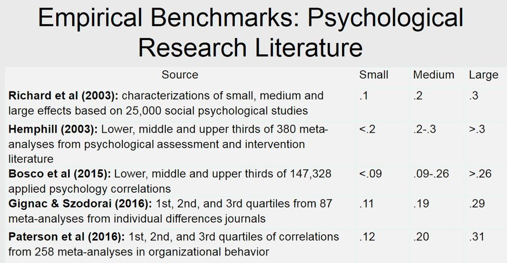

```{r setup, include=FALSE}
options(htmltools.dir.version = FALSE)

library(tidyverse)
library(kableExtra)
library(ggplot2)
library(plotly)
library(htmlwidgets)
library(MASS)
library(ggpubr)
library(xaringanthemer)
library(xaringanExtra)

style_duo_accent(
  primary_color = "#621C37",
  secondary_color = "#EE0071",
  background_image = "blank.png"
)

xaringanExtra::use_xaringan_extra(c("tile_view"))

# use_scribble(
#   pen_color = "#EE0071",
#   pen_size = 4
#   )

knitr::opts_chunk$set(
  fig.retina = TRUE,
  warning = FALSE,
  message = FALSE
)
```

name: Title slide
class: middle, left
<br><br><br><br><br><br><br>
# Wissenschaftliches Arbeiten und Forschungsmethoden

### Einheit 7: Auswertung von Studien - Teil 1: Datenvorbereitung
##### 23.11.2023 | Dr. Caroline Zygar-Hoffmann

---
class: top, left
name: content

### Heutige Themen

#### [Meta-Ebene: Terminplan, Veranstaltungskonzept, Studienleistung](#meta)

#### [Statusabfrage und weiteres Vorgehen](#status)

#### Auswertung von Studien - Teil 1: Datenvorbereitung
* [Ordnerstruktur](#ordner)
* [Dateien zusammenfügen](#merge)
* [Daten bereinigen](#clean)

---
class: top, left
name: meta
### Termine

```{r echo = F}
df = readxl::read_xlsx("Wissenschaftliches Arbeiten und Forschungsmethoden_Termine_neu.xlsx", sheet = "Tabelle1")[, 1:4]
df$Datum = format(as.Date(df$Datum), "%d.%m.%Y")
df %>%
  kbl() %>%
    kable_styling(font_size = 18) %>%
  kable_classic(full_width = T, position = "left") %>%
   column_spec(column = 3, width = "12cm")
```

---
class: top, left
### Wiederholung: Übergeordnetes Konzept dieser Veranstaltung

Sie sollen...
* ...Erfahrungen mit Ihrer ersten Mini-Forschungsarbeit sammeln, indem Sie von sich gegenseitig Daten erheben
* ...**mit jeder Sitzung ein Schritt des Forschungsprozesses bearbeiten**
* ...**im Begleitseminar mit eigenen Daten arbeiten können**
* ...**bewusst "Learning by Doing" praktizieren - Fehler im Prozess helfen zu lernen**

Ihre Note hängt am Ende nicht davon ab, wie komplex Ihre Ideen und/oder Analysen waren, oder wie viele Fehler Sie auf dem Weg gemacht haben, sondern von der transparenten und nachvollziehbaren Beschreibung Ihres Forschungsprozesses in der Präregistrierung und im empirischen Bericht, sowie der wissenschaftlichen Argumentation darin $\rightarrow$ [siehe Bewertungsschema auf studynet](https://studynet.hs-fresenius.de/goto_STUDYNETHSF_file_22288_download.html)

$\rightarrow$ Ihre Studie muss nicht "perfekt" sein, damit Sie eine 1.0 in der Veranstaltung bekommen können.

$\rightarrow$ Sie haben im Studium nicht immer (und m.E. viel zu selten) die Möglichkeit etwas "einfach mal auszuprobieren", ohne dass Ihre Note davon beeinträchtigt wird. Ja, es braucht Vorbereitung, um keinen absoluten Schmarrn zu machen. Aber Sie müssen sich nicht unnötigen Druck machen, und können auch an der einen oder anderen Stelle mit "erstmal good enough" weiterarbeiten. Worauf Sie trotzdem achten sollten? Nächste Folie!

---
class: top, left
### Wiederholung: Übergeordnetes Konzept dieser Veranstaltung

$\rightarrow$ Zum aktuellen Zeitpunkt erachte ich Folgendes als die wichtigsten Voraussetzungen für eine sehr gute Note:

* Sie haben erste wissenschaftlich hochwertige/aktuelle Literatur mit der Sie Ihre Forschungsfrage und Hypothesen begründen können (denn im Bericht später wird die Qualität der Literatur und Herleitung von Forschungsfrage und Hypothese bewertet)

* Sie haben sich Gedanken zur angenommenen Stärke des untersuchten Effekts für die Sensitivitäts-Poweranalyse gemacht (denn im Bericht später wird bewertet, ob die angenommene Effektstärke begründet wird - sobald Sie Daten vorliegen haben, passiert es schnell, dass Sie sich auf die beobachtete Effektstärke stützen und die Erwartungen verwässert werden)

* Sie frieren vor der Datenerhebung eine Präregistrierung ein, in der die besprochenen Felder sinnhaft ausgefüllt sind (Sie dürfen später begründet davon abweichen, d.h. auch hier muss nichts perfekt sein!)

* Sie erheben auswertbare Daten (damit die Daten tatsächlich auswertbar sind mache ich zusätzlich einen Qualitätscheck, weshalb Sie mein "OK" vor der Datenerhebung einholen sollen)

... die weiteren Aspekte für eine sehr gute Note hängen dann von Ihrem konkreten Bericht ab (**der Bericht(!) wird bewertet, nicht die Studie**). Wir werden dazu neben den bereits besprochenen Themen auch noch weitere Inhalte besprechen, was in welchem Teil des Berichts wie aussehen soll.

---
class: top, left
### Tipps

**Generell:** 

* Nutzen Sie, dass Sie eine Kleingruppe sind. Teilen Sie sich Aufgaben auf (auch zeitlich, falls nötig).

* Schauen Sie sich die Folien der Vorlesung an. Ich hatte in den Besprechungen mit den Kleingruppen öfters Fragen, die 1:1 in den Vorlesungsfolien beantwortet werden (besonders was die Inhalte der Präregistrierung angeht).

* **Das heißt nicht, dass Sie zu Themen die auf den Folien stehen keine Fragen stellen dürfen! Lieber erkläre ich etwas doppelt, als dass Sie nicht fragen. Aber nutzen Sie auch die vorhandenen Ressourcen.**

* Ich kann mich während der Vorlesung schlecht aufteilen. Daher mein wiederholtes Angebot mir Fragen per Email zu schicken - das ist asynchron und Sie erhalten schriftliche Antworten - hat also Vorteile. Wenn es Bedarf für einen zusätzlichen mündlichen Austausch gibt, lässt sich auch das realisieren.

$\rightarrow$ **Was nehme ich als Dozentin für zukünftige Vorlesungen mit?** Früher nach dem Fortschritt fragen, Zeitplan zu Beginn etwas entzerren, ggf. pro Sitzung Besprechungstermine für einzelne Kleingruppen planen

---
class: top, left
### Wiederholung: Sensitivitäts-Poweranalyse in R

Sensitivitäts-Poweranalyse für einen unabhängigen t-Test (auch für andere Hypothesentests möglich):

.pull-left[
.center[
```{r eval = TRUE, echo = F}
knitr::include_graphics("bilder/sensitivity-power-ttest.png")
```
]
]
.pull-right[
* Bei a priori Annahme einer Effektstärke von Cohen's d = 0.5 für den Mittelwertsunterschied (mittlerer Effekt)

* und einem Signifikanzniveau von alpha = .05

* und N = 34 Personen (17 Personen pro Gruppe) (*Hinweis: Wir sind insgesamt 37 Studierende + 1 Dozentin. Wenn die eigene Gruppe = 3-5 Personen nicht an der Studie teilnehmen, aber sonst alle, kommen wir auf 33-35 Versuchspersonen.*)

erreicht man eine Power von 41% für einen einseitigen, unabhängigen t-Test; d.h. die Wahrscheinlichkeit einen Effekt zu finden, wenn er da ist, beträgt 41%. 
]

---
class: top, left

### Wiederholung: Poweranalyse: Woher weiß ich die Effektstärke?

.pull-left[
* **Recherche in bestehender Literatur! Diese dann herunterkorrigieren** (wegen Publication Bias), d.h. erwarteten Effekt für die Poweranalyse kleiner angeben, als das was in der Literatur gefunden wurde.

* Falls nötig, **Transformation der Effektstärke** aus der Literatur in die Effektstärke, die für die Poweranalyse gebraucht wird (z.B. r in d): https://www.psychometrica.de/effect_size.html

* Vergleich mit gut vorstellbaren Effekten, z.B. 
  * mittlerer Placebo-Effekt: d = 0.24
  * Veränderung der Lebenszufriedenheit direkt nach Hochzeit: d = 0.26 und direkt nach einem Trauerfall: d = -0.48
  * mittlerer Effekt des Schulbesuchs in der ersten Klasse auf die Mathefähigkeit: d = 1.1
]

.pull-right[
```{r eval = TRUE, echo = F, out.width = "450px"}

```

* Durchschnittlicher Effekt in der Psychologie: r ~ .20 (d ~ .40) mit einer Standardabweichung von r ~ .10-.15
]


---
class: top, left
name: status
<div class="footer"><span>https://www.hogrefe.com/de/index.php?eID=dumpFile&t=p&p=217632&token=8d94879714b735c6f6805b49528e3bdea4562989</span></div>

### Statusabfrage

#### Jetzt zu Ihnen! Wo stehen Sie und woran hakt es?

.center[
```{r eval = TRUE, echo = F, out.width = "65%"}

```
]

---
class: top, left
name: ordner

### Auswertung von Studien

####  Ordnerstruktur

.pull-left[
**Ziel einer guten Ordnerstruktur**: Sie können den Ordner mit allen Unterordnern kopieren, jemandem zukommen lassen, und diese Person versteht was gemacht wurde und wie die Analysen wiederholt werden können

**Englische Ordnernamen bevorzugt**, um breitere Verständlichkeit zu gewährleisten

Readme-Textdatei auf dem obersten Level empfohlen, um alles Nicht-Selbsterklärendes zu erklären

]

.pull-right[
```{r eval = TRUE, echo = F, fig.cap = "Vorschlag für eine gute Ordnerstruktur"}
knitr::include_graphics("bilder/ordnerstruktur.png")
```
]

---
class: top, left

### Auswertung von Studien

####  Ordnerstruktur

* Es wäre praktisch, wenn Sie sich in der Kleingruppe nicht ständig Ordner oder Dateien hin und her schicken müssen, daher macht es Sinn, die Ordnerstruktur in einer geteilten Umgebung ("Cloud") anzulegen, in der alle Personen der Kleingruppe Zugriff haben und immer die neueste Version der Dateien liegt (**aber Achtung: Rohdaten sollten nicht einfach irgendwo im Internet hochgeladen werden, sondern erst wenn Sie gemäß der Datenschutzrichtlinien bearbeitet worden sind (z.B. bei uns: Pseudonym gelöscht)**)

* Idealerweise gibt es eine automatische Synchronisation zwischen der Cloud und lokalen Ordnern (dann muss man nichts manuell hochladen/runterladen), aber Lösungen die sowas anbieten sind meist entweder kostenpflichtig oder benötigen das Know-How um einen eigenen Server zu hosten (z.B. Nextcloud)


---
class: top, left
### Auswertung von Studien

####  Ordnerstruktur

.pull-left[
**Ordner "documentation"**

* Hier können Sie Kontextinformationen zu Ihrer Studie ablegen, z.B. die formr-Exceldateien, die Präregistrierung, verwendete Fragebögen, das Open Notebook, Codebooks zu offenen Daten

]

.pull-right[
**Ordner "literature"**

* Hier können Sie die gesammelte Literatur zu Ihrem Thema abspeichern

]

Für beide Ordner ggf. weitere thematische Unterordner sinnvoll, je nach Menge der Dateien

---
class: top, left
### Auswertung von Studien

####  Ordnerstruktur

**Ordner "manuscript"**

* Hier können Sie die RMarkdown-Datei ablegen, in der Sie den Bericht schreiben (siehe Ordner Übung auf studynet -> "template.Rmd")

* Da jeder aus der Kleingruppe einen eigenen Teil zum Gesamtbericht beiträgt, kann es sinnvoll sein, dass erstmal jeder "seine eigene" RMarkdown-Datei hat und ablegt ("mustermann.Rmd", "musterfrau.Rmd") und diese später in einer neuen Datei "report.Rmd" zusammengefügt werden

---
class: top, left
### Auswertung von Studien

####  Ordnerstruktur

**Ordner "raw_data"**

* Hier sollen die originalen **Rohdaten** abgespeichert werden, so wie sie aus der Fragebogensoftware (bei uns: formr) rauskommen

* Pro "Survey" in formr gibt es einen Datensatz/eine Datendatei

* **Sobald die Rohdaten hier einmal drinliegen, sollen sie nicht mehr verändert werden.**

* Es ist wichtig, die Rohdaten in ihrer Originalform vor jeglicher Bearbeitung zu behalten (z.B. um nicht versehentlicherweise Daten zu überschreiben); zugespitzt gesagt: am besten sie fassen (klicken) den Ordner danach nicht mehr an.

* Achtung: Rohdaten sollten nicht einfach irgendwo im Internet hochgeladen werden, sondern erst wenn Sie gemäß der Datenschutzrichtlinien bearbeitet worden sind (z.B. bei uns: Pseudonym gelöscht)

---
class: top, left
### Auswertung von Studien

####  Ordnerstruktur

**Ordner "preprocessing" und "processed_data"**

* Im "preprocessing" Ordner liegen die R-Skripte drin, mit denen die Daten für die Analyse vorbereitet werden (siehe restliche Einheit)

* Verschiedene Vorverarbeitungsschritte können (müssen aber nicht) in verschiedene R-Skripte aufgeteilt werden, sollten dann aber nummeriert werden in der Reihenfolge in der sie ausgeführt werden müssen (z.B. "1-combine-data.R", "2-code-missings", "3-recode-variables")

* Die resultierende(n) vorverarbeitete(n) Datendatei(en) können mit dem Befehl `save()` im Ordner "processed_data" abgespeichert werden, z.B. 

```{r, eval = FALSE}
save(processed_data, file = "../processed_data/final_data.RData")
```

---
class: top, left
### Auswertung von Studien

####  Ordnerstruktur

**Ordner "analyses"**

* Hier sollen die R-Skripte abgespeichert werden, in denen Sie jegliche Analysen machen (z.B. Deskriptive Statistik, Hypothesen, Explorative Analysen)

* Am Anfang der Analyseskripte in R können Sie die vorverarbeitete(n) Datendatei(en) mit dem Befehl `load()` einlesen, z.B.:

```{r, eval = FALSE}
load(file = "../processed_data/final_data.RData")
```

* Idealerweise für jedes Analyse"thema" ein eigenes R-Skript mit sprechendem Namen (z.B. "Descriptives.R", "Hypothesis_1.R", "Exploration_GenderDifferences.R")

* Diese Analyseskripte können Sie später mit dem Befehl `source()` in Ihrem RMarkdown Skript "einlesen", d.h. die Ergebnisse aus den Skripten liegen dann für die weitere Bearbeitung im RMarkdown vor, z.B.:

```{r, eval = FALSE}
source(file = "../analyses/Descriptives.R")
```

---
class: top, left
### Auswertung von Studien

####  Ordnerstruktur

**Advanced: Projekte in R Studio**

* Sie können in R Studio einen Ordner (d.h. z.B. den Ordner in dem Sie die oben beschrieben Ordnerstruktur angelegt haben) mit all seinen Unterordnern einem Projekt zuordnen, indem sie unter "File -> New Project -> Existing Directory" den gewünschten Ordner auswählen

* Vorteil: Sie müssen das "working directory" nicht immer neu setzen, da es fix der Projektordner ist
  * In den Befehlen auf der Folie wo bei `file = ".."` zwei Punkte und ein Slash `../` vorangestellt waren (um auf die obere Ordnerebene zu wechseln) wären dann überflüssig, weil das working directory des Projekts die obere Ordnerebene ist
  * Im RMarkdown sollten Sie dann auch bei dem Pfeil neben "Knit" (die Wolle) unter "Knit Directory" -> "Project Directory" angeben, damit alle Pfade passen

* Weiterer Vorteil: Es werden beim Öffnen des Projekts alle zuletzt offenen R-Dateien aus dem Projekt geöffnet

* Idealerweise benutzen entweder alle aus der Kleingruppe diese Projekt-Funktion oder gar keiner, weil sonst bei manchen die Pfade funktionieren und bei manchen nicht; mein Tipp: Probieren Sie es mal! Wir werden dazu am Ende des Semesters auch noch eine kleine Einheit haben.

---
class: top, left
name: merge

### Auswertung von Studien

####  Datensätze kombinieren: Schritt 1 - Daten einlesen

* Für den Fall, dass Ihre Studie nicht nur aus einem Survey in formr besteht, ist der erste Vorverarbeitungsschritt, dass Sie Ihre Datensätze in einen einzelnen Datensatz kombinieren

* Dafür müssen Sie zunächst alle Datensätze einlesen: 

```{r, eval = FALSE}
survey1 <- read.csv("../raw_data/survey1.csv")
survey2 <- read.csv("../raw_data/survey2.csv")
```
usw.

---
class: top, left
### Auswertung von Studien

####  Datensätze kombinieren: Schritt 2 - Leere sessions löschen

* In jedem formr Survey gibt es die Spalte "session" die eindeutig eine Zeile im Datensatz einer Durchführung des Fragebogen-Runs zuordnet

* Da jede Zeile eindeutig eine Person sein soll, können wir mit dieser Spalte also die Datensätze richtig zusammenfügen

* Zunächst müssen wir dafür aber alle Zeilen entfernen, in denen in "session" nichts drin steht (das ist i.d.R. der Fall, wenn der Fragebogensurvey nur geladen wurde, aber sonst nichts auf der Seite gemacht wurde):
  
```{r, eval = FALSE}
survey1 <- survey1[survey1$session != "",]
survey2 <- survey2[survey2$session != "",]
```
usw.

(R-Zeile 1 in Worten: Überschreibe das Objekt "survey1" mit den Zeilen vom Objekt "survey1" in denen in der Spalte "session" *nicht* "" (= nichts) drinsteht, und behalte alle Spalten)

---
class: top, left
### Auswertung von Studien

#### Datensätze kombinieren: Schritt 3 - Zusammenfügen

* Für das Zusammenfügen der Daten nutzen wir den Befehl `merge()`. Der Befehl muss wissen, welche Spalte er heranziehen soll, um die verschiedenen Datensätze richtig in einen einzelnen Datensatz zusammenzufügen, das ist in unserem Fall die Spalte "session"

* Für weitere Spalten, die es in jedem Survey gibt (z.B. `created` = der Zeitpunkt zu dem das Survey begonnen wurde, oder `ended` = der Zeitpunkt zu dem das Survey abgeschickt wurde), kann man "suffixes" festlegen, das sind Zeichen, die an die Spaltennamen drangehängt werden, um sie eindeutig einem Survey zuzuordnen 

* Für die Suffixes bietet sich der Name der surveys an, wobei der erste survey-Name erst im letzten merge angegeben werden sollte, damit alle Spalten am Ende eindeutig benannt sind:

```{r, eval = FALSE}
data <- merge(survey1, survey2, by = "session", suffixes = c("", "_survey2"), all = TRUE)
data <- merge(data, survey3, by = "session", suffixes = c("", "_survey3"), all = TRUE)
data <- merge(data, survey4, by = "session", suffixes = c("_survey1", "_survey4"), all = TRUE)
# Geschafft! Alle surveys befinden sich jetzt im Objekt `data`
```

* das Argument `all = TRUE` legt fest, dass alle Zeilen behalten werden sollen, auch wenn es in zwei Surveys keine zusammenpassenden session-IDs gibt. Das ist vor allem für die Studien relevant, in denen es unterschiedliche Bedingungen gab, aber ist auch sonst relevant (z.B. weil der Fragebogen abgebrochen wurde)

---
class: top, left
name: clean

### Auswertung von Studien

#### Datenvorbereitung: Eingabefehler korrigieren

Vor Beginn der Hypothesenprüfung:

1) versuchen, Eingabefehler zu identifizieren (nur relevant, falls Eingabe technisch gesehen fehlerhaft sein kann, z.B. bei offenen Antworten oder Eingabe von Paper-Pencil-Fragebögen in eine Datendatei)

2) Datensatz um Fehler bereinigen

Eingabefehler:

* oft Werte, die außerhalb des zulässigen Wertebereichs einer Variablen liegen

* hat eine Variable nur wenige Stufen (z.B. Geschlecht: 0, 1), lässt man sich mit einem geeigneten Befehl ausgeben, wie oft die Werte der betrachteten Variablen vorkommen 

* Bei Variablen ohne exakt festgelegten Wertebereich (z.B. Alter) ist auf Extremwerte zu achten; so sind Altersangaben größer als 100 z. B. sehr unwahrscheinlich und sollten überprüft werden. 

* Extremwerte springen auch bei graphischen Darstellungen ins Auge (Histogramm, Boxplot)

---
class: top, left
### Auswertung von Studien

#### Datenvorbereitung: Eingabefehler korrigieren

Beispiel: Eingabefehler

* Häufigkeiten Anzeigen lassen (z.B. Geschlecht: 0, 1) mit dem Befehl `table()`, z.B.:

```{r, eval = FALSE}
table(data$Geschlecht)
```

* Erhielte man nun die Angabe, dass der Wert »0« (für männlich) 456-mal vorkommt, der Wert »1« 435-mal und der Wert »9« 3-mal, hat man damit bereits 3 Eingabefehler identifiziert. 

* Nun lässt man sich die Nummern all derjenigen Fälle ausgeben, bei denen »Geschlecht=9« auftaucht mit dem Befehl `which()`, z.B.:

```{r, eval = FALSE}
data[which(data$Geschlecht == 9),]
```

* Bei diesen Personen muss man in den Originalfragebögen nachschauen, welches Geschlecht sie angegeben haben und die entsprechenden Angaben in der Datendatei ändern. 

---
class: top, left
### Auswertung von Studien

#### Datenvorbereitung: Bedingungsvariable berechnen

* In Studien, in denen es unterschiedliche Bedingungen gab, muss eine neue Variable erstellt werden, die anzeigt in welcher Bedingung eine Versuchsperson war

* Die session-ID und entsprechende Einträge in die "created" oder "ended"-Spalten einer Versuchsperson existieren nur in dem Survey, zu dem sie zugeteilt wurde

* Das bedeutet, nachdem die surveys in einen Datensatz zusammengefügt wurden, ist bekannt in welcher Bedingung eine Versuchsperson war anhand der Tatsache in welcher dieser Spalten eines surveys (siehe suffixes!) Werte drin stehen:

.center[
```{r eval = TRUE, echo = F}
knitr::include_graphics("bilder/condition_data.png")
```
]

---
class: top, left
### Auswertung von Studien

#### Datenvorbereitung: Bedingungsvariable berechnen

* Um eine neue Bedingungsvariable zu erstellen, wird erstmal eine leere Variable angelegt, die sprechend benannt wird (z.B. mit dem Variablennamen `condition`):

.pull-left[
```{r, eval = FALSE}
data$condition <- NA
```
]

.pull-right[
```{r eval = TRUE, echo = F}
knitr::include_graphics("bilder/condition_empty.png")
```
]

---
class: top, left
### Auswertung von Studien

#### Datenvorbereitung: Bedingungsvariable berechnen

* Wir überschreiben die leeren Werte dieser Variable nun mit einer `ifelse()`-Funktion, welche 3 Argumente braucht:
  * erstes Argument der Funktion ist eine Bedingung ("if" also "wenn"), zu der ein Befehl ausgeführt werden soll. In unserem Fall wollen wir einen Wert einfügen, "wenn die entsprechende `ended`-Spalte nicht leer ist", d.h. in R-Code "nicht leer" = `!is.na()`
  * zweites Argument der Funktion ist der Befehl, der ausgeführt werden soll, wenn die "if"-Bedingung erfüllt ist. In unserem Fall wollen wir eine bestimmte Zahl vergeben, wenn jemand in der entsprechenden Bedingung war, z.B. `1`
  * drittes Argument der Funktion ist der Befehl, der ausgeführt werden soll, wenn die "if"-Bedingung *nicht* erfüllt ist ("else" also "sonst"). In unserem Fall wollen wir den Wert behalten, der bereits drin stand.
  
```{r, eval = FALSE}
data$condition <- ifelse(!is.na(data$ended_condition1), 1, data$condition)
data$condition <- ifelse(!is.na(data$ended_condition2), 2, data$condition)
data$condition <- ifelse(!is.na(data$ended_condition3), 3, data$condition)
```

* Der Befehl in Worten: "Wenn in einer Zeile des Datensatzes die `ended`-Spalte des Surveys von Bedingung 1 nicht leer ist, dann schreibe bitte in die Variable `condition` den Wert 1 rein, und sonst (wenn sie leer ist) behalte den Wert der vorher drin stand."


---
class: top, left
### Auswertung von Studien

#### Datenvorbereitung: Bedingungsvariable berechnen

.center[
```{r eval = TRUE, echo = F}
knitr::include_graphics("bilder/condition_data.png")
```
]

.center[
```{r eval = TRUE, echo = F}
knitr::include_graphics("bilder/condition_filled.png")
```
]

---
class: top, left
### Auswertung von Studien

#### Datenvorbereitung: Variablen umkodieren und Skalen berechnen

* siehe Einheit zur Operationalisierung

* ggf. einzelne Items in die richtige Richtung umpolen, Beispiel-Code bei einer 7-stufigen Skala:

```{r, eval = FALSE}
data$skala1_item1_r <- (data$skala1_item1-8)*-1
```

* Skalenwerte für Subskalen und Gesamtwerte bilden
  * Prüfen, ob Summenwert mit `rowSums()`, Mittelwert mit `rowMeans()` oder was anderes nötig ist
  * Dabei unbedingt darauf achten, dass bei Personen, bei denen es fehlende Werte für eine Skala gibt gemäß der Präregistrierung vorgegangen wird (z.B. die Skala dann nicht gebildet wird z.B. indem `na.rm = FALSE` als Argument übergeben wird)

```{r, eval = FALSE}
data$skala1 <- rowSums(data[,c("skala1_item1_r", "skala1_item2", "skala1_item3")], na.rm = FALSE)
data$skala2 <- rowMeans(data[,c("skala2_item1", "skala2_item2", "skala2_item3")], na.rm = FALSE)
```

---
class: top, left
### Auswertung von Studien

#### Datenvorbereitung: Variablen umkodieren und Skalen berechnen

* Überprüfung, ob alles geklappt hat (z.b. hinsichtlich Wertebereichen), z.B. mit dem Befehl `describe()` aus dem `psych` package

```{r, eval = FALSE}
library(psych)
describe(data$item1)
describe(data$item1_r)
describe(data$skala1)
```

* Der Befehl bietet sich auch bei nicht selbst-erstellten Variablen zur Überprüfung an, ob alles normal aussieht

---
class: top, left
### Auswertung von Studien

#### Datenvorbereitung: Missing-Data (unvollständige Datensätze)

Probleme:

* kleineres N $\rightarrow$ weniger Power
* größere Standardfehler (d.h. ungenauere Schätzungen)
* Verzerrungen, wenn fehlende Werte mit anderen Merkmalen zusammenhängen
* manche Tests lassen sich nicht rechnen

$\rightarrow$ Je nach statistischem Test muss ggf. ein Datensatz ohne fehlende Werte (auf den Variablen, die in das Modell eingehen) erstellt werden 

```{r, eval = FALSE}
data_all <- data
data_H1 <- data[!is.na(data$skala1),]
```

(R-Zeile 2 in Worten: Erstelle das Objekt "data_H1" und speichere darin vom Objekt "data" alle Zeilen die in der Spalte "skala1" *nicht* leer (= `!is.na()`) sind, und behalte alle Spalten)


---
class: top, left
### Auswertung von Studien

#### Datenvorbereitung: z-Standardisierung

* Variablen ggf. zur besseren Interpretierbarkeit von Modellparametern z-standardisieren

* Konsequenz: Mittelwert der Variable auf 0 verschoben, Standardabweichung auf 1 verschoben ("normiert")

* Ist sinnvoll bei Variablen die keine natürliche 0 haben und/oder bei denen ein Abstand von 1 nicht natürlich ist (z.B. bei den meisten Likert Skalen)

* Beispiel:

```{r, eval = FALSE}
data$skala1_z <- (data$skala1 - mean(data$skala1, na.rm = TRUE))/sd(data$skala1, na.rm = TRUE)
```

---
class: top, left
### Auswertung von Studien

#### Datenvorbereitung: Ausschlusskriterien

* Beispiel: Manipulationscheck nicht erfüllt

```{r, eval = FALSE}
data <- data[data$mc == "Ja, ich habe die Instruktionen befolgt",]
```

(In Worten: Überschreibe das Objekt "data" mit den Zeilen vom Objekt "data" in denen in der Spalte "mc" "Ja, ich habe die Instruktionen befolgt" drinsteht, und behalte alle Spalten)

* In manchen Fällen macht es Sinn die Daten nicht direkt zu überschreiben, sondern zwei (in manchen Fällen auch mehr als zwei) Datensatz-Varianten zu erstellen, z.B. einen Datensatz *mit* den Personen, die den Manipulationscheck nicht erfüllt haben und einen *ohne* diese Personen (diese Datensätze dann sprechend benennen, z.B. `data_all` und `data_mc_passed`)

```{r, eval = FALSE}
data_all <- data
data_mc_passed <- data[data$mc == "Ja, ich habe die Instruktionen befolgt",]
```

---
class: top, left
### Auswertung von Studien

#### Datenvorbereitung

* ggf. sind noch weitere Schritte in der Datenvorbereitung nötig, z.B. Faktorvariablen als solche zu kodieren und ihnen sinnvolle Labels (= Gruppenbezeichnungen) zu vergeben

* Man sollte sich vor Beginn der Analysen einen Überblick darüber gemacht haben, dass möglichst alle Variablen so aussehen wie sie aussehen sollen $\rightarrow$ die Datenvorbereitung sollte abgeschlossen sein, bevor mit den Hypothesenprüfungen begonnen wird
  * Stellt sich erst im Nachhinein heraus, dass noch gravierende Kodierungs- oder Eingabefehler in den Daten stecken, müssen die Analysen wiederholt werden
  * Zudem bestünde die Gefahr, beim Bereinigen der Daten bewusst oder unbewusst im Sinne der eigenen Hypothesen vorzugehen
  * Dies betrifft auch die Frage, welche Fälle wegen fehlender oder fragwürdiger Angaben ggf. ganz aus den Analysen ausgeschlossen werden sollen

$\rightarrow$ Sie stellen bei der Datenvorbereitung fest, dass es total sinnvoll ist, bestimmte Angaben oder Personen auszuschließen, obwohl Sie das nicht präregistriert haben? Kein Problem! Erklären Sie, warum das so ist. 

$\rightarrow$ Bei jeder Abweichung von der Präregistrierung kann man sich überlegen zu berichten, inwiefern sich die Ergebnisse dadurch ändern (z.B. von signifikant zu nicht signifikant, Vorzeichen ändert sich oder bleibt gleich)


---
class: top, left
### Auswertung von Studien

#### Code-Review

* Macht es Sinn, dass nur einer aus Ihrer Gruppe die komplette Datenvorbereitung macht? **Nein.**
  * Erstens, lernt dann nur einer wie Datenvorbereitung funktioniert
  * Zweitens, machen wir alle Fehler (ich auch) 

* **Idee vom Code-Review**: 4-Augen-Prinzip
  * Einer prüft den Code vom anderen
  * Voraussetzung: Code ist gut kommentiert und kann vom anderen nachvollzogen werden
  * mit Hashtags kann man in R Kommentare oder Überschriften schreiben, z.B.
  
```{r, eval = FALSE}
# Summenwert für Skala1 bilden
data$skala1 <- rowSums(data[,c("skala1_item1", "skala1_item2", "skala1_item3")], na.rm = FALSE)
```

---
class: top, left
### Auswertung von Studien

#### Ergebnis-Abgleich

* **Ein Abgleich von Ergebnissen ist noch besser**: Jeder macht die Datenvorbereitung, und am Ende wird verglichen, ob alle zum gleichen Ergebnis kommen, d.h. hier zu den gleichen vorverarbeiteten Datensätzen (der Weg muss nicht gleich sein - Hauptsache es kommt dasselbe raus)
  * Vergleich zweier Datensätze mit dem Befehl `all.equal()`
  * Zuvor müssen beide Datensätze mit `load()` eingelesen werden

```{r, eval = FALSE}
load(file = "../processed_data/final_data_musterfrau.RData")
load(file = "../processed_data/final_data_mustermann.RData")

all.equal(final_data_musterfrau, final_data_mustermann)
```

$\rightarrow$ R gibt Ihnen dann aus, an welchen Stellen sich Ihre Datensätze ggf. unterscheiden

---
class: top, left
name: praxis

### Praxis

**Schritt 1: Ordnerstruktur anlegen**
* Lokal (jeder bei sich auf dem Rechner) und in einer geteilten Umgebung
* Bereits vorhandene Dateien einsortieren

**Schritt 2: Code-Review besprechen**
* 4-Augen-Prinzip, oder jeder separat und dann vergleichen?
* Bei 4-Augen-Prinzip: Wer macht welchen Teil, und wer reviewt welchen Teil? 

<!-- library(renderthis) -->
<!-- to_pdf("WissArb_07_Auswertung1.Rmd", complex_slides = TRUE) -->
