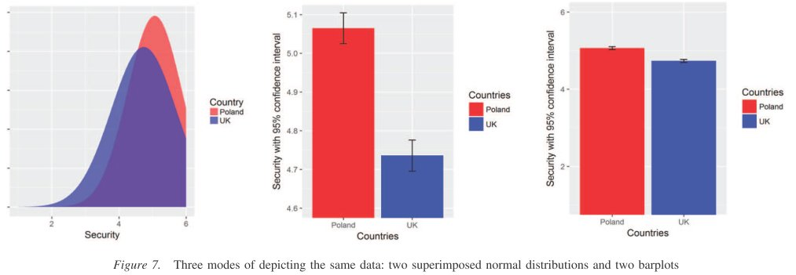
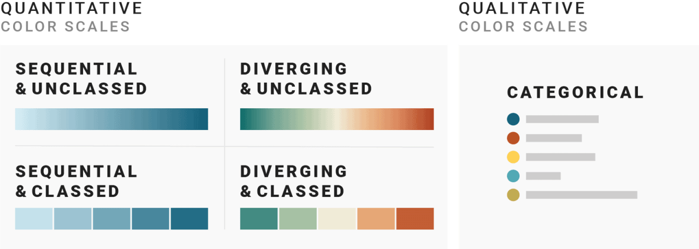
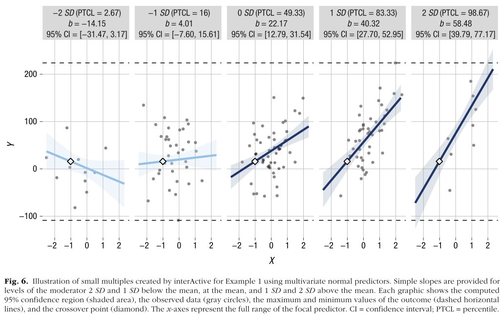
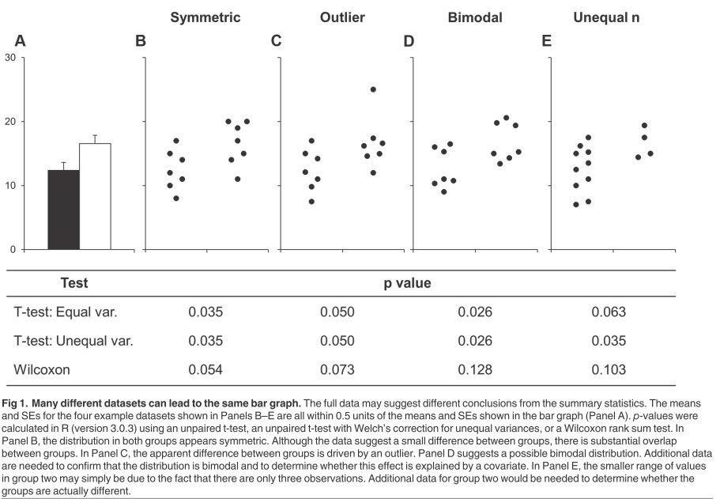
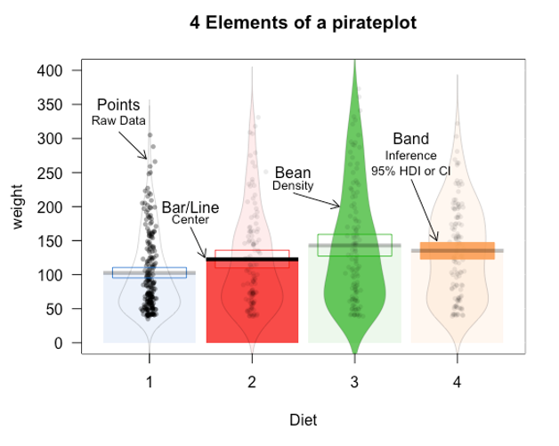
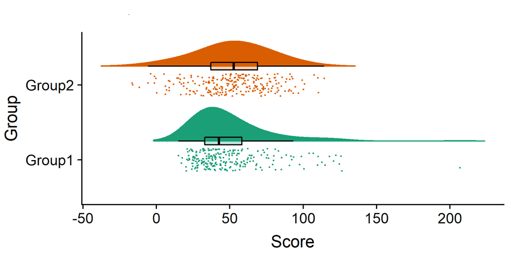
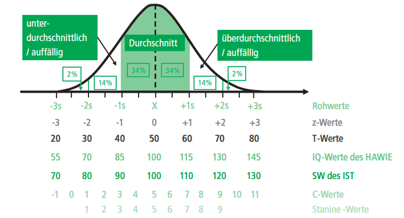
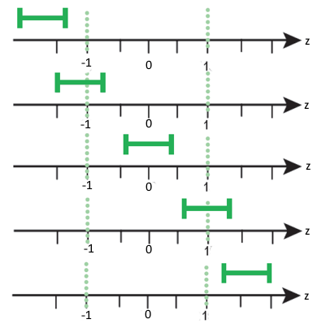
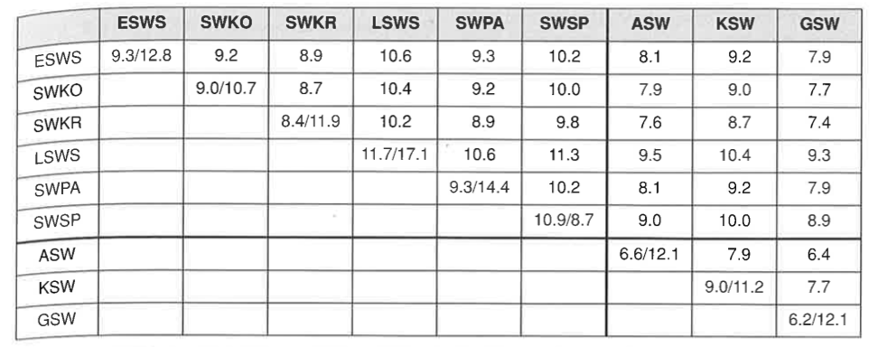

```{r setup, include=FALSE}
options(htmltools.dir.version = FALSE)

library(tidyverse)
library(kableExtra)
library(ggplot2)
library(plotly)
library(htmlwidgets)
library(MASS)
library(ggpubr)
library(xaringanthemer)
library(xaringanExtra)

style_duo_accent(
  primary_color = "#621C37",
  link_color = "#7da5f5",
  secondary_color = "#EE0071",
  background_image = "blank.png"
)

xaringanExtra::use_xaringan_extra(c("tile_view"))

# use_scribble(
#   pen_color = "#EE0071",
#   pen_size = 4
#   )

knitr::opts_chunk$set(
  fig.retina = TRUE,
  warning = FALSE,
  message = FALSE
)
```

name: Title slide
class: middle, left
<br><br><br><br><br><br><br>
# Wissenschaftliches Arbeiten und Forschungsmethoden

### Einheit 9: Auswertung von Studien - Teil 2: Ergebnisse, Datenvisualisierung und Rückmeldung
##### 27.06.2024 | Dr. Caroline Zygar-Hoffmann

---
class: top, left
name: content

### Heutige Themen

#### [Hypothesen und Hypothesentests](#inferenz)

#### [Datenvisualisierung](#visualisierung)

#### [Rückmeldung](#rueckmeldung)

---
class: top, left
name: inferenz

### Hypothesen und Hypothesentests

#### Generell

* Die Auswertung der Daten erfolgt nach den Vorgaben des Analyseplans in der Präregistrierung 

* Im Mittelpunkt der Auswertung hypothesenprüfender Untersuchungen stehen statistische Signifikanztests

* Ausgang der Tests ist die Entscheidungsgrundlage dafür, ob die forschungsleitende Hypothese als bestätigt geltend oder abgelehnt werden soll

* Die inhaltliche Interpretation der Ergebnisse nimmt auf die Theorie Bezug, aus der die Hypothese abgeleitet wurde

---
class: top, left
### Hypothesen und Hypothesentests

#### Prinzip

.pull-left[
1) Austellen von Nullhypothese und Alternativhypothese (Hypothesenpaar)

2) Bestimmung einer zugrundeliegenden Verteilung

3) Festlegung des Annahme- und Ablehnungsbereichs der Nullhypothese (kritischer Wert)

$\rightarrow$ Schritte 1-3 haben Sie bereits in der Präregistrierung abgehandelt, durch die Aufstellung einer (Alternativ-)Hypothese und der Wahl der statistischen Analyse und Inferenzkriterien (z.B. Alpha-Niveau) zur Überprüfung dieser Hypothese 
]

.pull-right[
4) Berechnung Teststatistik (Beobachtungswert auf Wahrscheinlichkeitsverteilung abbilden): z.B. z-Wert, t-Wert, F-Wert, $\chi^2$-Wert, ...

5) Vergleich kritischer Wert und Teststatistik

6) Entscheidung: Test signifikant oder nicht signifikant

$\rightarrow$ Schritte 4-6 werden durch die Analyse in R und Interpretation des Ergebnisses abgehandelt
]

$\rightarrow$ Zwischen Schritt 3 und 4 könnte noch die Prüfung der Voraussetzungen für die Berechnung einer Teststatistik mit einer bestimmten statistischen Analyse eingefügt werden (selbst wenn sie nur diskutiert und keine Konsequenz daraus abgeleitet wird)


---
class: top, left
### Hypothesen und Hypothesentests

#### Prüfung von Voraussetzungen

* Beim t-test z.B. durch `leveneTest()` aus dem package `car`

* Bei der Regression und ANOVA z.B. durch `check_model()` aus dem package `easystats` (oder mit dem R-Code aus der Vorlesung)

Beispiel:

```{r, eval = FALSE}
library(easystats)
check_model(lm(y ~ x, data = data))
```


.pull-left[
```{r eval = TRUE, echo = F, out.width = "90%"}
knitr::include_graphics("bilder/assumpt_variance_homog.png")
```
]

.pull-right[
```{r eval = TRUE, echo = F, out.width = "90%"}
knitr::include_graphics("bilder/assumpt_normality_residuals.png")
```
]

---
class: top, left
### Hypothesen und Hypothesentests

#### Interpretation

* Vorsicht: Immer auch prüfen, ob der Effekt in die richtige Richtung geht, falls die Richtung der Hypothese nicht bereits im Test selbst hinterlegt (Beispiel: Bei Regression muss Richtung überprüft werden, bei t-test wird Richtung im Analysebefehl festgelegt durch das Argument `alternative`)

* Signifikante Ergebnisse (in die richtige Richtung) bestätigen (vorläufig) die Hypothese 

* Nicht-signifikante Ergebnisse schränken ihren Geltungsbereich ein oder können auf geringe statistische Power zurückgeführt werden

* Advanced: Neben dem frequentistischen Nullhypothesentesten, gibt es sogenannte "bayesianische" Analysen mit denen die Evidenz für die Nullhypothese quantifiziert werden kann (durch sogenannte "Bayes Faktoren")

$\rightarrow$ Wir werden uns in Sitzung 10 wie genau Analyse-Ergebnisse in der schriftlichen Arbeit im Fließtext berichtet werden

---
class: top, left
<div class="footer"><span>Stefan, A. M., & Schönbrodt, F. D. (2023). Big little lies: A compendium and simulation of p-hacking strategies. Royal Society Open Science, 10(2), 220346.</span></div>

### Hypothesen und Hypothesentests

#### Konfirmation vs. Exploration

* Die Ergebnisse von Auswertungen, die über die eigentliche Hypothesenprüfung hinausgehen, sind explorativ $\rightarrow$ müssen auch in dieser Weise dargestellt werden (in einem extra Abschnitt im Ergebnisteil)

* Prinzipiell kann in der Exploration jede Analyse gerechnet werden, die einen interessiert

* Vorsicht: Je mehr Analysen man rechnet, desto wahrscheinlicher wird es ein Falsch-Positives Ergebnis zu erwischen $\rightarrow$ p-hacking

* **Illustration p-hacking App**: https://shinyapps.org/apps/p-hacker/ $\rightarrow$ Wenn man genug ausprobiert, schafft man es ein signifikantes Ergebnis zu "generieren", ...
  - ... welches dann aber erstmal nicht vertrauenswürdig ist und in einer separaten Studie konfirmatorisch repliziert werden sollte
  - ... man explorativ aber trotzdem berichten kann
  
* Man kann und sollte aber auch explorative Analysen berichten, bei denen kein signifikantes Ergebnis rauskam, wenn diese Analysen naheliegend sind (man muss aber auch nicht jede explorative Analyse berichten)

---
class: top, left
name: visualisierung

### Datenvisualisierung

**Ausgewählte Ziele der Datenvisualisierung:**
- Ergebnisse veranschaulichen 
- Ausreißer erkennen
- Rückmeldungen erstellen

**Bewertungsschema:**

.center[
```{r eval = TRUE, echo = F}
knitr::include_graphics("bilder/bewertung_visualisierung.png")
```
]

---
class: top, left
<div class="footer"><span>https://www.research.autodesk.com/publications/same-stats-different-graphs/</span></div>

### Datenvisualisierung

Hinter den gleichen Statistiken können sich unterschiedliche Muster verbergen, z.B. bei Anscombe's Quartett:

.center[
```{r eval = TRUE, echo = F, out.width = "80%"}
knitr::include_graphics("bilder/anscombe.png")
```
]

$\rightarrow$ die Datenvisualisierung deckt auf, was für ein Muster hinter den Daten liegt 

---
class: top, left
<div class="footer"><span>https://www.research.autodesk.com/publications/same-stats-different-graphs/</span></div>

### Datenvisualisierung

.center[
```{r eval = TRUE, echo = F, out.width = "70%"}
knitr::include_graphics("bilder/datasaur.png")
```
]

---
class: top, left

### Datenvisualisierung

.pull-left[
**Do's:**
- Verständliche Achsenbeschriftung

- Gesamte Grafik sollte "stand-alone" (d.h. ohne zusätzlichen Text) verstehbar sein (Erklärungen als Anmerkungen unter die Grafik)

- schwarz-weiß kompatible Verständlichkeit (d.h. man sollte die Grafik nicht in Farbe ausdrucken müssen, damit man sie versteht)

- Rohwerte als Punkte in der Grafik aufnehmen

- Interaktionen bei verschiedenen Ausprägungen der Variablen darstellen
]

.pull-right[
**Dont's:**
- Wertebereich der y-Achse einschränken

- rot-grüne Farbpalette wegen Farbenblindheit

- Kreisdiagramme (Flächen werden intuitiv nicht adequat wahrgenommen)
]

---
class: top, left
<div class="footer"><span>Tomaszewski, Białończyk, Ziemła:
https://github.com/MI2-Education/2021Z-DataVisualizationTechniques/blob/master/projects/project1/tomaszewski_bialonczyk_ziemla/tomaszewski_bialonczyk_ziemla.pdf</span></div>

### Datenvisualisierung

**Do: Verständliche Achsenbeschriftung**

.pull-left[
```{r eval = TRUE, echo = F}
knitr::include_graphics("bilder/achsen2.png")
```
]
 
.pull-right[
```{r eval = TRUE, echo = F}
knitr::include_graphics("bilder/achsen4.png")
```
]

---
class: top, left
<div class="footer"><span>https://twitter.com/Paul_hph/status/1230520003155447809?s=09 <br>Tomaszewski, Białończyk, Ziemła:
https://github.com/MI2-Education/2021Z-DataVisualizationTechniques/blob/master/projects/project1/tomaszewski_bialonczyk_ziemla/tomaszewski_bialonczyk_ziemla.pdf</span></div>

### Datenvisualisierung

**Don't: Wertebereich der y-Achse einschränken**

.pull-left[
```{r eval = TRUE, echo = F, fig.align='center'}

```
]
 
.pull-right[
```{r eval = TRUE, echo = F}
knitr::include_graphics("bilder/achsen1.png")
```
]


---
class: top, left
<div class="footer"><span>Tomaszewski, Białończyk, Ziemła:
https://github.com/MI2-Education/2021Z-DataVisualizationTechniques/blob/master/projects/project1/tomaszewski_bialonczyk_ziemla/tomaszewski_bialonczyk_ziemla.pdf</span></div>

### Datenvisualisierung

**Weitere Hinweise zu Achsen**

.pull-left[
```{r eval = TRUE, echo = F}
knitr::include_graphics("bilder/achsen3.png")
```
]

.pull-right[
```{r eval = TRUE, echo = F}
knitr::include_graphics("bilder/achsen5.png")
```
]

---
class: top, left
<div class="footer"><span>Krzyziński, Wojciechowski, Żółkowski:
https://github.com/MI2-Education/2021Z-DataVisualizationTechniques/blob/master/projects/project1/krzyzinski_wojciechowski_zolkowski/krzyzinski_wojciechowski_zolkowski.pdf</span></div>

### Datenvisualisierung

**Farben**

.center[
```{r eval = TRUE, echo = F, out.width = "70%"}
knitr::include_graphics("bilder/colours.png")
```
]

---
class: top, left
<div class="footer"><span>https://blog.datawrapper.de/which-color-scale-to-use-in-data-vis/</span></div>

### Datenvisualisierung

**Farben**

Die gleiche(n) Farbe(n) in unterschiedlicher Intenstität ("quantitative Farbskalen") oder mehrere unterschiedliche Farben ("qualitative Farbskalen")?  

* https://blog.datawrapper.de/quantitative-vs-qualitative-color-scales/

* https://blog.datawrapper.de/diverging-vs-sequential-color-scales/

.center[
```{r eval = TRUE, echo = F, out.width = "75%"}

```
]

---
class: top, left
<div class="footer"><span>McCabe, C. J., Kim, D. S., & King, K. M. (2018). Improving present practices in the visual display of interactions. Advances in Methods and Practices in Psychological Science, 1(2), 147-165.</span></div>

### Datenvisualisierung

**Do: Interaktionen bei verschiedenen Ausprägungen der Variablen darstellen**

.center[
```{r eval = TRUE, echo = F, out.width = "70%"}

```
]

---
class: top, left
<div class="footer"><span>Weissgerber, T. L., Winham, S. J., Heinzen, E. P., Milin-Lazovic, J. S., Garcia-Valencia, O., Bukumiric, Z., ... & Milic, N. M. (2019). Reveal, don’t conceal: transforming data visualization to improve transparency. Circulation, 140(18), 1506-1518.</span></div>

### Datenvisualisierung

**Suboptimal: Balkendiagramme** ***zur Darstellung der Mittelwerte zweier oder mehrerer Gruppen***

Balkendiagramme transportieren keine Information zur Verteilung der Daten innerhalb der Gruppen:

.center[
```{r eval = TRUE, echo = F, out.width = "55%"}

```
]

---
class: top, left
<div class="footer"><span>Allen, M., Poggiali, D., Whitaker, K., Marshall, T. R., van Langen, J., & Kievit, R. A. (2019). Raincloud plots: a multi-platform tool for robust data visualization. Wellcome open research, 4.</span></div>

### Datenvisualisierung

**Bessere Alternative zur Darstellung der Mittelwerte zweier oder mehrerer Gruppen: Violin-Plots (auch "Pirate-Plots", linke Abbildung) oder Raincloud-Plots (rechte Abbildung)**

.pull-left[
```{r eval = TRUE, echo = F, out.width = "80%"}

```
]

.pull-right[
```{r eval = TRUE, echo = F, out.width = "80%", fig.align='center'}

```
]

---
class: top, left
<div class="footer"><span>https://cedricscherer.netlify.app/2019/05/17/the-evolution-of-a-ggplot-ep.-1/</span></div>

### Datenvisualisierung

.center[
```{r eval = TRUE, echo = F, out.width = "70%"}
knitr::include_graphics("bilder/evolution.gif")
```
]


---
class: top, left

### Datenvisualisierung

**Hilfreiche Links für häufige Datenvisualisierungen in R:**
 
* Histogramme, Boxplots, Dichteverteilungen, heatmaps, jitter plots: https://medium.com/@nickmartin812/how-to-r-visualizing-distributions-49ea4141fb32#rstats

* Pirate plots: 
  - https://dmyee.files.wordpress.com/2016/03/pirateplots_workshop.pdf
  - https://indrajeetpatil.github.io/ggstatsplot/articles/web_only/ggbetweenstats.html 
  - https://cedricscherer.netlify.app/2019/05/17/the-evolution-of-a-ggplot-ep.-1/

* Raincloud plots: 
  - https://wellcomeopenresearch.org/articles/4-63
  - https://www.cedricscherer.com/2021/06/06/visualizing-distributions-with-raincloud-plots-and-how-to-create-them-with-ggplot2/

* Scatterplots für Korrelationen / einfache Regressionen: 
  - https://indrajeetpatil.github.io/ggstatsplot/articles/web_only/ggscatterstats.html
  - https://r-graphics.org/chapter-scatter und https://r-graphics.org/recipe-scatter-fitlines

---
class: top, left

### Datenvisualisierung

**Hilfreiche Links für häufige Datenvisualisierungen in R:**
 
* Interaktionen: 
  - https://cran.r-project.org/web/packages/interactions/vignettes/interactions.html
  - https://strengejacke.github.io/sjPlot/articles/plot_interactions.html
  - https://journals.sagepub.com/doi/10.1177/2515245917746792

* Zu allen Themen:
  - https://clauswilke.com/dataviz/index.html
  - https://psyteachr.github.io/msc-data-skills/ggplot.html
  - https://psyteachr.github.io/hack-your-data/quant-data-vis.html

---
class: top, left
name: rueckmeldung

### Rückmeldung

#### Elemente

* Angabe des Messinstruments mit dem gemessen wurde

* Inhaltliche Beschreibung des Maßes

* Ergebnis als verbalisiertes, klassifizierendes Intervall unter Einbeziehung der Normstichprobe 

---
class: top, left

### Rückmeldung

#### Angabe des Messinstruments und Beschreibung des Maßes

Beispiel Selbstwert, gemessen über Multidimensionale Selbstwertskala (MSWS, Schütz, & Rentzsch, 2020), Subskala ESWS - Emotionale Selbstwertschätzung

Personen mit hohen Werten auf dieser Subskala:
* haben eine positive Einstellung zu sich selbst.
* hohe Selbstakzeptanz und Selbstzufriedenheit 
* positive Einstellungen sowie Gefühle gegenüber der eigenen Person

Personen mit niedrigen Werten auf dieser Subskala:  
* sind unzufrieden mit sich
* erleben Selbstzweifel
* haben eine negative Einstellung zu sich selbst 
* leiden unter negativen selbstbezogenen Gefühlen.

---
class: top, left

### Rückmeldung

#### Normierung

* Der einzelne Summenwert (z.B. einer Subskala) steht für starke oder weniger starke Ausprägung

* hohe Werte = hohe Ausprägung

**ABER:**

* Der Wert alleine gibt uns keine Informationen über die **Einordnung** der Ausprägung

* Müssen Wert **im Vergleich** zu Werten von anderen Personen (Normen) interpretieren 

* Dafür nutzen wir möglichst große, vergleichbare **Normstichproben** (Tabellen hinten im Manual eines Tests)

**Beispiel MSWS: **

Empirischer Befund: Männer und Frauen unterscheiden sich signifikant in der Selbstwerteinschätzung
Darum haben die Autor:innen des Fragebogens 2 getrennte Normtabellen erstellt (eine für Männer und eine für Frauen)

---
class: top, left

### Rückmeldung

#### Normierung

* Normwerte erlauben eine **Verortung des Messwertes** innerhalb der Verteilung der Werte der Normstichprobe

* z.B. Wo liegt der ESWS Wert 32 im Vergleich zu anderen Personen gleichen Geschlechts (Berücksichtigung von Mittelwert und Standardabweichung der Verteilung)

* erlaubt eine **Einteilung** in "duchschnittlich" bzw. "unter-/überdurchschnittlich" $\rightarrow$ Wichtig für eingeordnete Rückmeldung an die Testperson

* z.B. **z-Wert:** normiert auf 0 mit Standardabweichung von 1 (es gibt auch andere Normwerte mit anderem Mittelwert und Standardabweichung, z.B. bei MSWS sogenannte T-Werte mit Mittelwert 50 und Standardabweichung 10)

z.B. Eine Person mit Körpergröße 175 (angenommen dies ist der Durchschnitt der Norm) und Wert Körpergewicht 70 kg (angenommen dies ist der Durchschnitt der Norm) haben beide einen z-Wert von 0 und einen T-Wert von 50 (obwohl Variablen in unterschiedlichen Einheiten gemessen).


---
class: top, left

### Rückmeldung

#### Normierung

.center[
```{r eval = TRUE, echo = F, out.width = "80%"}

```
]


---
class: top, left

### Rückmeldung

#### Normierung

Bei uns gibt es zwei Möglichkeiten: 

1) Entweder Sie finden für die Skala, für die Sie eine Rückmeldung anbieten, vorhandene Normen und ziehen diese heran

2) Oder Sie nutzen die Stichprobe der Studie als Normstichprobe, vergleichen also eine Versuchsperson mit den restlichen Versuchspersonen (aus Pragmatismus, empfehle ich Ihnen diese Variante) $\rightarrow$ Dann können Sie einfach den in der Stichprobe berechneten z-Wert zur Interpretation heranziehen (siehe Vorlesungeinheit Auswertung1)

**In der Regel sollte die Normstichprobe in der Rückmeldung detailliert beschrieben werden.** Dies ist bei Variante 2 nur eingeschränkt möglich, da wir aus Anonymitätsgründen wenige Informationen über die Stichprobe erhoben haben.

---
class: top, left

### Rückmeldung

#### Interpretation

* Basis der Interpretation sind Konfidenzintervalle zur Berücksichtigung der Unsicherheit bei der Messung

* 95% Konfidenzintervall für einen einzelnen z-Wert $z$: $z \pm 1.96 * \sqrt{(1-Reliabilität der Skala)}$

* Zur Reliabilität der Skala $\rightarrow$ siehe Vorlesungeinheit Auswertung2 (entweder aus vorheriger Literatur oder selbst auf eigenen Daten berechnen)

* Bei einem einzelnen Item (statt einer Skala, die aus mehreren Items besteht) kann nur eine Retest-Reliabilität berechnet werden (auf Ihren Daten nicht möglich) $\rightarrow$ Rückmeldung von Skalenwerten wünschenswert!

---
class: top, left

### Rückmeldung

#### Interpretation

.small[
.pull-left[
**Unterdurchschnittliche Ausprägung:**
* Beide Grenzen des Konfidenzintervall kleiner als -1 Standardabweichung
* z.B. [-1.8, -1.2] oder [-3.0, -2.0]

**Unterdurchschnittliche bis durchschnittliche Ausprägung:**
* Konfidenzintervall zwischen kleiner als -1 Standardabweichung und unter Mittelwert
* z.B. [-1.2, -0.2] oder [-2.0, -0.8]

**Durchschnittliche Ausprägung:**
* Konfidenzintervall enthält den Mittelwert oder über/unterschreitet 1 Standardabweichung nicht
* z.B. [-0.6, 0.6] oder [-0.6, -0.2] oder [0.2, 0.6]
]
]

.pull-right[
```{r eval = TRUE, echo = F, out.width="80%"}

```
]

---
class: top, left

### Rückmeldung

#### Interpretation

.small[
.pull-left[
**Durchschnittliche bis überdurchschnittliche Ausprägung:**
* Konfidenzintervall zwischen größer als 1 Standardabweichung und über Mittelwert
* z.B. [0.2, 1.2] oder [0.8, 2.0]

**Überdurchschnittliche Ausprägung:**
* Beide Grenzen des Konfidenzintervall größer als 1 Standardabweichung
* z.B. [1.2, 1.8] oder [2.0, 3.0]
]
]

.pull-right[
```{r eval = TRUE, echo = F, out.width="80%"}

```
]

---
class: top, left
name: praxis

### Praxis

**Schritt 1: Rückmeldung vorbereiten**
* Rmarkdown Vorlage zur Rückmeldung  "[template_rueckmeldung.Rmd](https://studynet.hs-fresenius.de/goto_STUDYNETHSF_file_30593_download.html)" von studynet herunterladen
* Ganz oben bei "title" den Titel Ihrer Studie einfügen
* Angabe des Messinstruments und Beschreibung des Maßes anpassen
* R-Code anpassen: 
  - Zeile 7, 10 und 39: Wie heißt Ihr vorverarbeiteter Datensatz, den Sie für die Analysen einlesen werden (im Template ist es `final_data`)?
  - Bei dem Code zum Balkendiagramm, bei den z-Werten, und bei den Konfidenzintervallen: Wie heißt die Spalte mit der z-standardisierten Skala, zu der Sie eine Rückmeldung geben möchten (im Template ist es `skala_z`)?
  - Überall wo `sqrt(1-0.8)` steht (Teil der Bildung des Konfidenzintervalls): Wie ist die Reliabilität Ihrer Skala (im Template ist es 0.8)?

**Schritt 2: Rückmeldung testen**
* In Zeile 10 ein Pseudonym einfügen, das auch wirklich in Ihren Daten existiert
* Rmarkdown knitten, entstandenes html prüfen

---
class: top, left

### Praxis

**Schritt 3: Für alle Versuchspersonen eine Rückmeldung erstellen**
* Entweder manuell in Zeile 10 immer wieder: 1) das Pseudonym austauschen 2) neu knitten 3) erhaltene Datei umbenennen (sonst wird sie überschrieben -> umbenennen in das Pseudonym, z.B. `X1235ufk.html`)
* Oder das R-Skript auf studynet "[template_rueckmeldung_automate.R](https://studynet.hs-fresenius.de/goto_STUDYNETHSF_file_30594_download.html)" ausprobieren (da bei großen Stichproben das manuelle Vorgehen ewig dauern würde)
  - im R-Skript `template_rueckmeldung_automate.R` muss auch der Name für Ihren vorverarbeiteten Datensatz angepasst werden (`final_data`)
  - im Rmarkdown-Skript `template_rueckmeldung.Rmd` muss dann Zeile 10 auskommentiert werden (mit einem `#`), dafür Zeile 11 nicht mehr (das `#` löschen)
  - Beide Skripte müssen im selben Ordner liegen
  
**Schritt 4: Rückmeldungen auf studynet hochladen und Kommiliton:innen informieren**
* Im studynet Ordner "Rückmeldungen" einen Unterordner mit dem Titel der eigenen Studie anlegen und dort die HTML Dateien hochladen
* Komiliton:innen informieren, dass sie sich dort Ihre Rückmeldungsdatei herunterladen können (Identifizierung anhand des Dateinamens = das Pseudonym)

---
class: top, left
### Literaturempfehlung für die heutige Sitzung

.center[
```{r, echo=FALSE,out.width="30%",fig.cap="Kapitel 12.2 in Döring, N. & Bortz, J. (2016). Forschungsmethoden und Evaluation in den Sozial- und Humanwissenschaften. Pearson.",fig.show='hold',fig.align='center'}
knitr::include_graphics("bilder/doering.png")
``` 
]


<!-- --- -->
<!-- class: top, left -->

<!-- ### Operationalisierung - Tests und Fragebögen -->

<!-- #### Beispiel Selbstwert (MSWS) -->

<!-- **Kritische Werte:** -->

<!-- * Kritische Werte erlauben den **verlässlichen** Vergleich eines Testergebnisses mit einem anderen Ergebnis -->

<!-- * Dabei wird auf Basis der Werteverteilung ein Unterschied definiert, der mit einer **Mindestwahrscheinlichkeit** (i.d.R. 5% oder 10%) gegebn sein muss, damit man Werte als "nicht gleich" ansieht -->

<!-- * Dahinter steckt die Frage, ab wann man **unter Berücksichtigung natürlicher Schwankungen und Messfehler** sagen kann, dass 2 Werte unterschiedliche sind (sind 1 und 1,00000001 unterschiedlich? sind 1 und 1000 unterschiedlich, sind 1 und 3 unterschiedlich -- man braucht ein Entscheidungskriterium!) -->

<!-- * **Kritische Werte - Mögliche Vergleiche:** -->
<!--   * Vergleich von 2 Personen auf dem selben Skalenwert (z.B. Max vs. Maria) -->
<!--   * Vergleich von 2 Messzeitpunkten derselben Person auf dem selben Skalenwert (z.B. Max gestern vs. Max heute) -->
<!--   * Vergleich von 2 Skalenwerten der selben Person (z.B. Max Wert auf dem ESWS vs. Max Wert auf dem SWKO) -->

<!-- --- -->
<!-- class: top, left -->

<!-- ### Operationalisierung - Tests und Fragebögen -->

<!-- #### Beispiel Selbstwert (MSWS) -->

<!-- **Kritische Werte (hier 10% Irrtumswahrscheinlichkeit):** -->

<!-- .center[ -->
<!-- ```{r eval = TRUE, echo = F, out.width = "500px"} -->
<!--  -->
<!-- ``` -->
<!-- ] -->

<!-- * Werte beziehen sich auf T-Werte aus Normtabellen -->
<!-- * Diagonale 1. Ziffer: Kritische Differenz für Unterschied zwischen 2 Personen auf dieser Skala -->
<!-- * Diagonale 2. Ziffer: Kritische Differenz für Unterschied zwischen 2 Zeitpunkten auf dieser Skala -->
<!-- * Nicht-Diagonale Ziffern: Kritische Differenz für Unterschiede zwischen 2 Skalen (selbe Person) -->

<!-- **Beispiel: ** -->
<!-- Person 1 hat ESWS T-Wert von 40 und Person 2 hat ESWS T-Wert von 22. Die Differenz ist 40-22=18. 18 ist größer als die kritische Differenz von 9.3 T-Wert Punkten. Wir können mit 90% Sicherheit sagen, dass Person 1 und 2 sich auf dem ESWS unterscheiden. -->


<!-- library(renderthis) -->
<!-- to_pdf("WissArb_09_Auswertung2_Visualisierung_Rueckmeldung.Rmd", complex_slides = TRUE) -->
