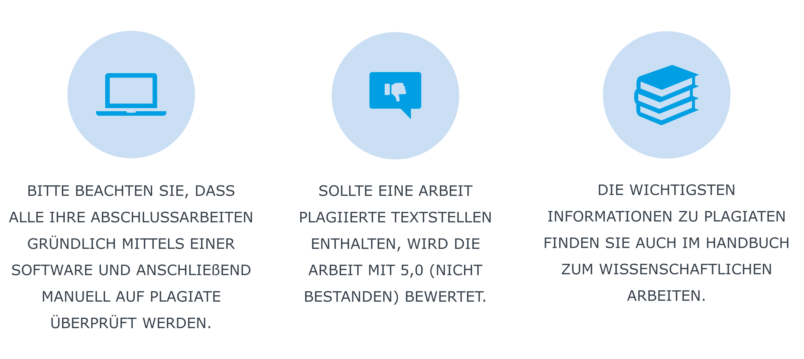
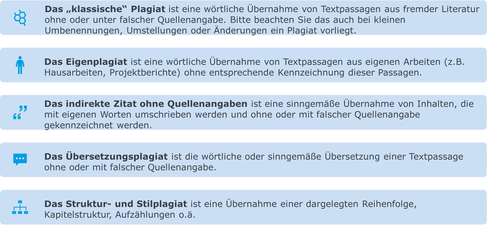
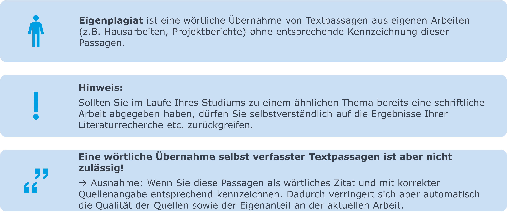
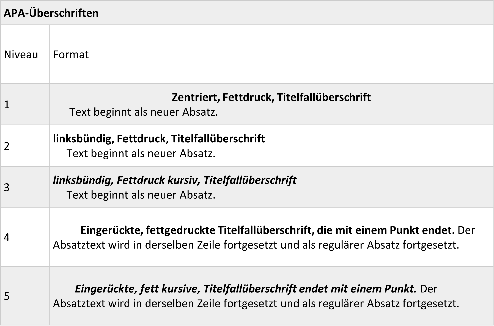
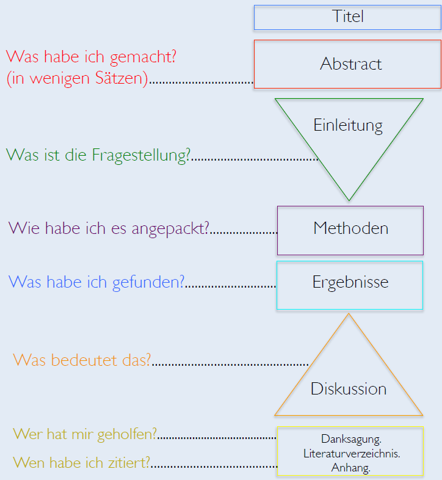
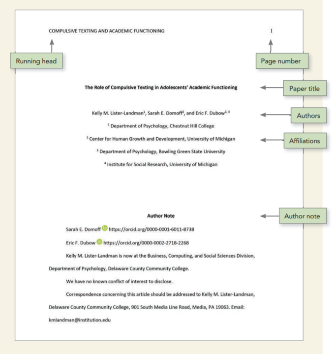
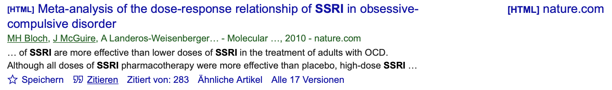
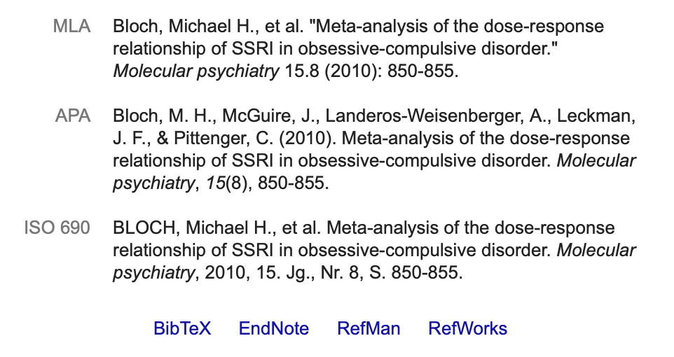
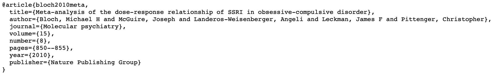
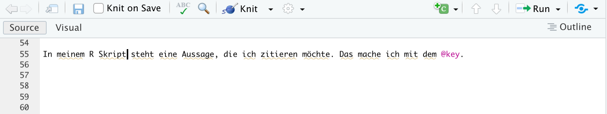

```{r setup, include=FALSE}
options(htmltools.dir.version = FALSE)

library(tidyverse)
library(kableExtra)
library(ggplot2)
library(plotly)
library(htmlwidgets)
library(MASS)
library(ggpubr)
library(xaringanthemer)
library(xaringanExtra)

style_duo_accent(
  primary_color = "#621C37",
  secondary_color = "#EE0071",
  background_image = "blank.png"
)

xaringanExtra::use_xaringan_extra(c("tile_view"))

# use_scribble(
#   pen_color = "#EE0071",
#   pen_size = 4
#   )

knitr::opts_chunk$set(
  fig.retina = TRUE,
  warning = FALSE,
  message = FALSE
)
```

name: Title slide
class: middle, left
<br><br><br><br><br><br><br>
# Wissenschaftliches Arbeiten und Forschungsmethoden

### Einheit 10: Publikation wissenschaftlicher Ergebnisse
##### 22.12.2023 | Dr. Caroline Zygar-Hoffmann

---
class: top, left
name: content

### Heutige Themen

#### [Allgemeine Aspekte](#allgemeines)

#### [Was gehört in die Einleitung?](#einleitung)

#### [Was gehört in den Methodenteil?](#methoden)

#### [Was gehört in den Ergebnisteil?](#ergebnis)

#### [Was gehört in den Diskussionsteil?](#diskussion)

#### [Zitation und Literaturverzeichnis](#references)

#### [Praxis](#praxis)

---
class: top, left
name: allgemeines

###  Allgemeine Aspekte

#### Abgabe

* Upload auf studynet, kein Ausdruck erforderlich

* Konkrete Hinweise folgen zum Semesterende

---
class: top, left
###  Allgemeine Aspekte

#### Plagiat

Ein Hinweis aus Ihrem Prüfungsamt:

.center[
```{r eval = TRUE, echo = F, out.width = "80%"}

```
]


---
class: top, left
###  Allgemeine Aspekte

#### Plagiat

.center[
```{r eval = TRUE, echo = F, out.width = "80%"}

```
]


---
class: top, left
###  Allgemeine Aspekte

#### Plagiat

.center[
```{r eval = TRUE, echo = F, out.width = "80%"}

```
]

---
class: top, left
###  Allgemeine Aspekte

#### Format

**Schriftart:**

* Text: Serif typeface (am besten: Times New Roman, 12-pt)
* Beschriftungen in Abbildungen: Sans serif typeface (z.B. Arial, 8 – 14pt, bitte einheitlich!)

**Seiten- und Text-Formatierung:**

* Doppelter Zeilenabstand durch den gesamten Artikel
* Jeden Absatz um 1/2" einrücken
* Den ganzen Text linksbündig ausrichten

$\rightarrow$ **Das übernimmt die RMarkdown-Vorlage für Sie!**

---
class: top, left
###  Allgemeine Aspekte

#### Format

.center[
```{r eval = TRUE, echo = F, out.width = "60%"}

```
]

$\rightarrow$ **Das übernimmt die RMarkdown-Vorlage für Sie!**

Wie soll es am Ende aussehen? Siehe hier: https://owl.purdue.edu/owl/research_and_citation/apa_style/apa_formatting_and_style_guide/apa_sample_paper.html

---
class: top, left
###  Allgemeine Aspekte

#### Wissenschaftliches Schreiben

.center[
```{r eval = TRUE, echo = F, out.width = "50%"}
knitr::include_graphics("bilder/academic_writing.png")
```
]

Die Akademische Konversation (durch wissenschaftliches Schreiben) …
* … beschäftigt sich detailliert mit anderen (wissenschaftlichen) Perspektiven
* … beteiligt sich am wissenschaftlichen Diskurs (kontext-abhängig, kein Vakuum)
* … ist ein unendlicher Prozess

---
class: top, left
###  Allgemeine Aspekte

#### Wissenschaftliches Schreiben

.center[
```{r eval = TRUE, echo = F, out.width = "50%"}
knitr::include_graphics("bilder/Schreiben.png")
```
]

Ein wissenschaftlicher Artikel ist die Kulmination von
* Forschung
* Kritischem Denken
* Kreativem Schreiben

Der Artikel ist wie ein Lebewesen: Je mehr Information man bekommt (z.B. durch Lesen, Analysen), umso mehr wächst er.

---
class: top, left
###  Allgemeine Aspekte

#### Wissenschaftliches Schreiben

**Argumentation und Sprache** 

* Der wissenschaftliche Artikel ist kein Roman (gilt auch für Seminar-, Haus- u. Abschlussarbeiten): Berichten Sie Ihre Inhalte klar und direkt!

* Trotzdem oder vor allem deshalb wichtig: Lassen Sie einen **"roten Faden"** Ihrer "Forschungsgeschichte" erkennen.

* Zielgruppe: Eine interessierte, intelligente Person…
  - die etwas über Psychologie weiß,
  - aber mit Ihrem speziellen Fachgebiet nicht unbedingt vertraut ist
  - die sehr skeptisch ist $\rightarrow$ Alle Aussagen mit Daten und Fakten belegen

---
class: top, left
###  Allgemeine Aspekte

#### Wissenschaftliches Schreiben

**4 Leitprinzipien:**

1. **Verständlichkeit**: Nachvollziehbarkeit, gute Lesbarkeit
2. **Unmissverständlichkeit**: Vermeidung von mehrdeutigen/missverständlichen Formulierungen
3. **Neutralität**: Unparteiisches/nicht emotionales Argumentieren
4. **Überprüfbarkeit**: Nachprüfbarkeit aller Aussagen

---
class: top, left
###  Allgemeine Aspekte

#### Wissenschaftliches Schreiben

**Verständlichkeit**

* Grundlage: Rechtschreibung, Grammatik, Zeichensetzung
* Struktur/Gliederung (roter Faden)
* Sinnvolle Untergliederung in Absätze (pro Gedanke, Aspekt)
* Logische Folgerichtigkeit
* Klarer Satzbau, Schachtelsätze vermeiden
* Ideale Satzlänge: 12 bis 17 Wörter
* Verben: Aktiv statt passiv
* Präzise und konkret
* Einfache Sprache

$\rightarrow$ Wir können nur verständlich formulieren, was wir selbst verstanden haben

---
class: top, left
###  Allgemeine Aspekte

#### Wissenschaftliches Schreiben

**Unmissverständlichkeit**

* Mehrdeutigkeiten: z.B. nicht eindeutige Bezüge („Vergleicht man Männer mit Frauen, haben diese ein besser ausgeprägtes räumliches Denken.“)
* Falsche Begriffe/unpräzise Formulierung: Fachbegriffe verwenden
* Quantitative Genauigkeit (vage Aussagen wie "großer Effekt" mit Zahlen belegen)

$\rightarrow$ Alles, was missverstanden werden kann, wird missverstanden werden


---
class: top, left
###  Allgemeine Aspekte

#### Wissenschaftliches Schreiben

**Neutralität**

* Fokus auf objektive Erkenntnisse, nicht auf persönliche Meinungen und Präferenzen (z.B. “Kinder sollten frühzeitig Disziplin lernen.”)
* Unvoreingenommen – sachlich und neutral – relevante Informationen berichten (z.B. “zum Glück”, “leider” vermeiden)
* Neutrale Wortwahl: Frei von Werturteilen (z.B. “In der faszinierenden Einzelfallstudie von Schmidt wird das
bedauernswerte Beispiel von H. P. dargestellt.”)
* Verwenden Sie nicht das Wort „beweist“, da statistische Tests nur Wahrscheinlichkeitsaussagen unterstützen

---
class: top, left
###  Allgemeine Aspekte

#### Wissenschaftliches Schreiben

**Überprüfbarkeit**

* Fremde Gedanken kennzeichnen (Quellenangabe)
* Stellen Sie keine Behauptungen auf, die Sie nicht belegen ("Die Social Media Nutzung nimmt immer mehr zu." $\rightarrow$ Klingt plausibel, aber in dem Satz fehlt die Quelle, die das untersucht hat und belegt)
* Genaue Beschreibung von Methodik und Auswertung (Replizierbarkeit)

---
class: top, left
###  Allgemeine Aspekte

#### Wissenschaftliches Schreiben

* Abschnittsweise schreiben, mit Stichpunkten anfangen

* Einfach mal anfangen ("shitty first draft"), dann Text gründlich überarbeiten und Feedback einholen, darauf basierend wieder überarbeiten ("rewriting is the real work of writing")
  - Neue Einsichten während des Schreibens
  - Mut zur Veränderung, Klärung, Restrukturierung
  - Den Mehraufwand nicht scheuen: Denn meist wird ein Text erst durch das „Umschreiben“ richtig gut
  - Daher beim ersten Entwurf keine Perfektion anstreben und nicht zu viel Mühe auf sprachlich-stilistische Aspekte verwenden
  - Üblich: 2-3 Überarbeitungsschleifen

* Für Perfektionisten: 
  - Finden Sie ein Ende, auch wenn Sie noch nicht zu 100% zufrieden sind
  - Ziel sollte ein angemessenes Maß an Sorgfalt sein, aber: Perfektion ist nicht erreichbar!

---
class: top, left
###  Allgemeine Aspekte

#### Wissenschaftliches Schreiben

.pull-left[
Bei Schreibblockade / Prokrastination: 
* Dort Anfangen, wo es am leichtesten fällt
* An einer anderen Stelle des Textes weiterschreiben
* Andere Aufgabe erledigen (z.B. Grafik erstellen statt Diskussion schreiben)
* Einfach drauflos schreiben, ohne es zu lesen (z.B. Monitor ausschalten), das mindert den Erwartungsdruck
* Mit dem Schreiben aufhören, wenn es noch Spaß macht (Schreiben = angenehm)
* Tagespensum realistisch planen (Demotivation vorbeugen) und an einer Stelle an der man gut weitermachen kann, aufhören
* Zu geplanten Zeiten schreiben, nicht auf inspirierte Momente warten
]

.pull-right[
```{r eval = TRUE, echo = F, out.width = "60%"}
knitr::include_graphics("bilder/writing.png")
```
]

---
class: top, left
###  Allgemeine Aspekte

#### Aufbau eines wissenschaftlichen Artikels

.center[
```{r eval = TRUE, echo = F, out.width = "80%"}

```
]

---
class: top, left
###  Allgemeine Aspekte

#### Aufbau eines wissenschaftlichen Artikels

.center[
```{r eval = TRUE, echo = F, out.width = "40%"}

```
]
---
class: top, left
###  Allgemeine Aspekte

#### Wie sieht die Titelseite aus?

.small[
.pull-left[
* Titel: nach dem ersten Drittel der Seite platzieren 
  - nicht länger als 12 Wörter
  - keine Füllwörter bzw. Abkürzungen
  - Titel soll Interesse wecken, selbsterklärend und alleinstehend nachvollziehbar sein

* Namen und Institutszugehörigkeit der Autoren, alles zentriert und mit doppeltem Zeilenabstand

* Kurztitel der Arbeit = "Running head" (der auch auf den folgenden Seiten erscheint) in Großbuchstaben
  - Entweder mit dem Titel identisch oder ein verkürzt Form
  - wird im R-Markdown-File unter dem Titel festgelegt

* Seitennummer (die auch auf den folgenden Seiten angezeigt wird) auf jeder Seite rechtsbündig und oben

$\rightarrow$ **Formatierung übernimmt die RMarkdown-Vorlage für Sie!**

]
]

.pull-right[
```{r eval = TRUE, echo = F, out.width = "80%"}

```
]


---
class: top, left
###  Allgemeine Aspekte

####  Wie sieht der Abstract aus?

* Kommt direkt nach der Titelseite auf einer eigenen Seite

* Kompakte Zusammenfassung der kompletten Studie (macht Sinn zuletzt zu schreiben) $\rightarrow$ soll den Appetit des Lesers auf mehr wecken

Optional unter Abstract: Keywords (kursiv, eingerückt): Erlauben Forschern Ihren Artikel in Datenbanken schneller und einfacher zu finden

---
class: top, left
###  Allgemeine Aspekte

####  Wie sieht der Abstract aus?

Aufbau:
* Ein oder zwei Sätze, die eine **grundlegende Einführung** in das Fachgebiet geben, die für einen Wissenschaftler jeder Disziplin verständlich ist. 
* Zwei bis drei Sätze mit einem **ausführlicheren Hintergrund**, der auch für Wissenschaftler verwandter Disziplinen verständlich ist. 
* Ein Satz, der das **allgemeine Problem/die Forschungsfrage** klar benennt, womit sich diese spezielle Studie befasst. 
* Ein Satz, der das Hauptergebnis zusammenfasst (mit den Worten "**Hier zeigen wir**" oder einer entsprechenden Formulierung). 
* Zwei oder drei Sätze, in denen erklärt wird, was das **Hauptergebnis** im direkten Vergleich zu dem, was vorher angenommen wurde, offenbart oder wie das Hauptergebnis das bisherige Wissen ergänzt. 
* Ein oder zwei Sätze zur Einordnung der Ergebnisse in einen **allgemeinen Kontext**. 
* Zwei oder drei Sätze, um eine **breiter gefasste Perspektive** zu geben, die für einen Wissenschaftler jeder Disziplin leicht verständlich ist.


---
class: top, left
###  Allgemeine Aspekte

#### Anhang

* Enthält Informationen, die die Arbeit unterstützen, aber „langatmig“ sind

* Bsp.: Erweiterte Tabellen oder Diagramme, die die Forschung illustrieren


---
class: top, left
###  Allgemeine Aspekte

#### Bewertungsschema

.center[
```{r eval = TRUE, echo = F, out.width = "80%"}
knitr::include_graphics("bilder/bewertung_form.png")
```
]

---
class: top, left
name: einleitung

###  Was gehört in die Einleitung?

#### Inhalte

* Einleitung beginnt mit Titel des Manuskripts (fett, zentriert) - d.h. keine extra Überschrift "Einleitung"

* Allgemein: Unterüberschriften erlaubt und üblich

* **Kurze Einführung** in das Thema der Arbeit: 
  - Zentrale Frage: Warum ist das Forschungsthema relevant?
  - Den Leser nicht plötzlich ins kalte Wasser der Theorie werfen!
  - Faustregel: Auf der ersten Seite sollte das (grobe) Ziel der Studie das erste Mal deutlich benannt werden ("The goal of the current study is an examination of ...") 

* Ausführliche, verständliche und stringente Erläuterung **zentraler Theorien und Konzepte**
  - Angemessene Beispiele ausdenken, um die Theorie zu veranschaulichen
  - Je abstrakter die Theorie, desto wichtiger sind gute Beispiele

---
class: top, left
###  Was gehört in die Einleitung?

#### Inhalte

* Definition **zentraler Variablen**; das gilt vor allem für die Variablen, die Teil Ihrer Hypothese(n) sind.

* Verwendung konsistenter Variablennamen
  - D.h. nicht verschiedene Labels nutzen, wenn damit das Gleiche gemeint ist (am besten auch: auf die gleiche oder zumindest sehr ähnliche Art gemessen wurde)
  - D.h. verschiedene Labels gezielt dann nutzen, wenn damit nicht das Gleiche gemeint ist (z.B. wenn man Literatur zu verwandten/relevanten anderen Variablen heranzieht)
  - z.B. "Körperbild", "Körperselbstwert", "Körperzufriedenheit" $\rightarrow$ alles dasselbe, oder verschiedene Variablen?

---
class: top, left
###  Was gehört in die Einleitung?

#### Inhalte

* Darstellung **relevanter Forschungsergebnisse** aus wissenschaftlich hochwertiger, möglichst aktueller Literatur zu den zentralen Variablen, Theorien, Konzepten (vereinzelt ist auch ältere Literatur in Ordnung, gerade auch bei Theorien) 
  
  - Besonders hilfreich: Reviews, Meta-Analysen
  
  - Die Literatur sollte alle relevanten Themen abdecken, d.h. auch ausreichend umfangreich sein (eine Einzelstudie als Quelle ist nicht ausreichend! Ein Review oder eine Meta-Analyse ist aber "soviel wert" wie mehrere Einzelstudien; deckt aber meist nur ein Thema ab)
  
  - auch Kritikpunkte an diesen Studien können angesprochen werden (Achtung: Kritisieren Sie die Studie, nicht die Autoren selbst!)


---
class: top, left
###  Was gehört in die Einleitung?

#### Inhalte

* **Logische Herleitung der Forschungsfrage** aus bisherigen Forschungsergebnissen: Welchen Mehrwert hat es diese Forschungsfrage zu untersuchen? 
  - Schließt sie eine Forschungslücke? 
  - Geht es um eine Replikation? 
  - Leistet sie eine Erweiterung bisheriger Forschung in einem anderen Kontext? Oder mit einer anderen Methode?

* Bei der Formulierung der Forschungsfrage macht es manchmal Sinn die Vorgehensweise kurz zu skizzieren (z.B. in einem Satz in welcher Art von Design sie untersucht wird)

* **Logische Herleitung der (eindeutig formulierten) Hypothesen** aus bisherigen Forschungsergebnissen: Warum wird der Effekt so erwartet wie in der Hypothese beschrieben?
  - Wichtig: Hypothese sollte so formuliert werden wie in der Präregistrierung beschrieben. 
  - Ausnahme: Sie stellen fest, dass die Hypothese in der Präregistrierung nicht optimal formuliert war (z.B. nicht eindeutig), um das Abzubilden was Sie untersuchen wollten? Dann nehmen Sie die bessere Formulierung und erklären in einer Fußnote wie die Originalformulierung war, und warum Sie davon abweichen.

---
class: top, left
###  Was gehört in die Einleitung?

#### Bewertungsschema

.center[
```{r eval = TRUE, echo = F, out.width="90%"}
knitr::include_graphics("bilder/bewertung_theorie.png")
```
]

In Hinblick auf die Hypothesen:
.center[
```{r eval = TRUE, echo = F, out.width = "80%"}
knitr::include_graphics("bilder/bewertung_einleitung.png")
```
]

---
class: top, left
name: methode

###  Was gehört in den Methodenteil?

* Allgemein: Unterüberschriften erlaubt und üblich

* **Erklärung über die Zugänglichkeit von Daten/Analyseskripten**: "Anonymisierte Daten, ein Codebuch, reproduzierbare Skripte sowie weitere ergänzende Materialien finden Sie unter [Link zum OSF-Projekt]."

* **Stichprobenbeschreibung**
  - Größe der Stichprobe (N = ...)
  - Rekrutierung der Versuchspersonen (z.B. in Vorlesungen angesprochen, etc.)
  - Geschlechterverteilung (n und %)
  - Altersspanne und Mittelwerte, Standardabweichung
  - ggf. Bildungsniveau
  - andere relevante Aspekte in Bezug auf die Fragestellung

* **Poweranalyse** 
  - Angabe für welche statistische Analyse die Poweranalyse durchgeführt wurde
  - Angabe von $\alpha$, $\beta$ bzw. Power, erwartete Effektstärke inkl. Begründung, Stichprobenumfang
  - Bei Sensitivitäts-Poweranalyse: Ergänzung wie sich die errechnete Power ändert, falls sich der erreichte Stichprobenfang im Vgl. zur Präregistrierung geändert hat

---
class: top, left
###  Was gehört in den Methodenteil?

* **Versuchsdurchführung**
  - Die Untersuchung soll so geschildert werden, dass alle wichtigen Aspekte nachvollziehbar sind und die Methode reproduzierbar ist
  - Das schließt das Studiendesign (z.B. Bedingungen), den Ablauf, verwendete Materialien, Instruktionen etc. ein
  - Es kann auch auf den Anhang verwiesen werden, wenn bestimmte Elemente zu umfangreich sind (d.h. Elemente, die nicht in 1-2 Sätzen beschrieben werden können, z.B. längere Instruktionen)

* **Messinstrumente**
  - Beschreibung der für die Fragestellung relevanten verwendeten Fragebögen (Länge des Fragebogens, was er misst, ob er Subskalen hat, ob Anpassungen vorgenommen wurden, etc.)
  - Angabe der Antwortskala (inkl. numerischer/verbaler Anker)
  - Angabe der Reliabilität für die Skalen (z.B. McDonald's Omega, Cronbach's Alpha)

---
class: top, left
###  Was gehört in den Methodenteil?

**Statistische Analyse**

* Generell: Beschreibung der verwendeten Verfahren, nicht jedoch der Ergebnisse 
  
* Angabe der verwendeten Analysesoftware, inkl. Versionsangabe (+ ggf. packages)
  
* Relevante Vorverarbeitung: 
  - Transformationen der Daten (Rekodierung, Aggregation, Zentrierung (z.B. Standardisierung),...)
  - Umgang mit fehlenden Werten
    
* Analyse:
  - Verwendetes Signifikanzniveau
  - Einordnung: einseitie vs. zweiseitige Tests
  - Nennung und Beschreibung der Hypothesentests (in Spezialfällen auch des Auswahlrationals)
  - Ggf. angewandte Korrektur für multiples Testen
  
---
class: top, left
###  Was gehört in den Methodenteil?

**Detailgrad:**

* Generell wenden wir uns bei der Abfassung eines Forschungsberichtes an einen methodisch und fachlich vorinformierten Leserkreis, d.h. es reicht kurz zu skizzieren wie die erhobenen Daten ausgewertet wurden

* Eine genaue Beschreibung der Methoden wie z.B. die Wiedergabe von Formeln ist hierbei nicht erforderlich

**Bei gängigen Methoden:**
* Im Zweifelsfall genügen für Einzelverfahren Verweise auf einschlägige Statistikbücher/Paper
* Aber: Erläuterung wesentlicher Parameter:
  * Welche Variable hat welche Rolle eingenommen
  * Welche Optionen/Varianten des Verfahrens wurde warum gewählt (z.B. Pearson vs. Spearman Korrelation)

**Bei Eigenentwicklungen oder neuen, wenig bekannten Methoden:**
* nachvollziehbar darstellen
* Genaue Funktionsweise dokumentieren


---
class: top, left
###  Was gehört in den Methodenteil?

#### Bewertungsschema

.center[
```{r eval = TRUE, echo = F, out.width = "80%"}
knitr::include_graphics("bilder/bewertung_methode1.png")
knitr::include_graphics("bilder/bewertung_methode2.png")
```
]


---
class: top, left
### Was gehört in den Ergebnisteil?

* Allgemein: Unterüberschriften erlaubt und üblich

* Deskriptivstatistik und Befunde zu den einzelnen Fragestellungen und Hypothesen berichten. 

* **Konsistenz**: Strukturierung aus dem Theorieteil übernehmen und die einzelnen Fragestellungen in derselben Reihenfolge abarbeiten. 

* Deskriptivstatistische Ergebnisse für Fragestellungen und inferenzstatistische Ergebnisse für Hypothesen werden teils in den **Fließtext** integriert, teils durch **Tabellen und Grafiken** veranschaulicht. 

* Dieselbe Information sollte allerdings nicht sowohl in Fließtext als auch Tabelle wiederholt werden (entweder Fließtext oder Tabelle!)

* Grafiken: lockern den Fließtext auf und sind besonders aufmerksamkeitsträchtig $\rightarrow$ für besonders wichtige Ergebnisse vorsehen

**Ziel:** Balance zwischen präziser Information durch zahlreiche statistische Befunde einerseits und flüssiger Lesbarkeit andererseits.

---
class: top, left
name: ergebnis

### Was gehört in den Ergebnisteil?

* Nach Hypothesen gegliedert: Mit zentralen Ergebnissen anfangen, danach vertiefen (beschreiben Sie zuerst den Wald, dann die Bäume)

* Hypothese nochmal kurz erwähnen

* Ggf. Voraussetzungsprüfungen für die statistischen Verfahren präsentieren

* Ergebnisse nur beschreiben, noch nicht interpretieren

* Die Annahme/Ablehnung der Hypothese unmittelbar berichten (Bottom line / Fazit! Klar und deutlich – Ergebnisse im Einklang mit der Hypothese oder nicht)

**Wichtig:** Ergebnisse von konfirmatorischen und explorativen Analysen klar trennen

---
class: top, left
### Was gehört in den Ergebnisteil?

* Erst sagen, dann belegen: Ergebnis zuerst ankündigen, dann mit Statistiken begründen ("As predicted, the results show that the groups differ significantly, with group X having higher values on variable A ($M = 1.2$, $SD = 0.2$) than group Y ($M = 0.2$, $SD = 0.2$), $t(48) = 2.3$, $p = .026$.

* Angabe der relevanten Kennzahlen: z.B. Mittelwerte bei Gruppenvergleichen, Korrelation bei Zusammenhangshypothesen, etc.
* Angabe der statistischen Kennwerte (z.B. t-Werte: t(df)=...; $\chi^2$(df)=...; etc.)
  * Freiheitsgrade in Klammern
* Angabe der statistischen Signifikanz: z.B. $p = .021$
  * genauen p-Wert angeben (d.h. auf 3 Nachkommastellen)
  * wenn p-Wert den Wert .001 unterschreitet, dann $p < .001$ (die Wahrscheinlichkeit kann nicht 0 betragen!) 
  * Angabe von Effektstärken (z.B. Cohens d)
* Allgemein: Angabe von Ergebnissen (Zahlen) und Variablen:
  * lateinische Variablenbezeichnungen werden kursiv gesetzt 
  * griechische Variablenbezeichnungen jedoch nicht
  * Zahlen nicht kursiv
  * Komma ist ein Punkt, kein Beistrich
  * Bei Zahlen, die nicht größer als 1 werden können, wird die führende Null weggelassen (z.B. $p = .032$; $r = .73$; aber: $t(84) = 0.23$)


---
class: top, left
### Was gehört in den Ergebnisteil?

**Ergebnisse von Hypothesentests**

<small>

Es gibt für die gängingen statistischen Tests APA Richtlinien, welche Kennwerte in Fließtext oder Tabellen enthalten sein sollten: 

* Korrelation

  * $r$ = 0.13, 95% CI [-0.13, 0.38], $p$ = 0.312, $R^2$ = 0.02

* t-Test

  * $\Delta_{M}$ = -51.46, 95% CI [-104.87, 1.95], $t(49.09)$ = -1.94, $p$ = 0.059; Cohen's d = -0.55, 95% CI [-1.12, 0.02]

* $\chi^2$-Test

  * $r_{G1}=41\%$, $r_{G2}=70\%$, $\chi^2_{79}<.001$

* Regressionsparameter

  * $\beta$ = 0.64, 95% CI [-0.62, 1.89], $t(57)$ = 1.02, $p$ = 0.312

* F-Tests (z.B. ANOVAs)

  * Regressionsmodell: $R^2$ = 0.02, F(1, 57) = 1.04, $p$ = 0.312
  * ANOVA: $F(3, 54)$ = 683.77, $p$ < .001, $\eta^2=0.97$, 95% CI [0.96, 1.00]

</small>


---
class: top, left
### Was gehört in den Ergebnisteil?

**Zusammenfassung: Must-haves**

* zentrale Deskriptivstatistiken (z.B. Mittelwerte beim Mittelwertsvergleich)
* Größe des in der Untersuchung ermittelten Effekts (auch als standardisierte Effektstärken (r, Cohens d, $R^2$, $\eta^2$)
* Konfidenzintervall für diesen Effekt
* p-Werte
* Teststatistiken (ggf. mit Freiheitsgraden)

---
class: top, left
### Was gehört in den Ergebnisteil?

**Lesbarkeit**

* umfassende Tabellen, die für das Verständnis des Fließtextes nicht zwingend erforderlich sind, in den Anhang auslagern

* dem APA Style guide folgen: https://apastyle.apa.org/instructional-aids/numbers-statistics-guide.pdf
  - z.B. Prozentzahlen ganzzahlig runden (auch wenn dann in der Summe manchmal 99% oder 101% resultiert)
  - statistische Kennwerte (z. B. Mittelwerte, Standardabweichungen, Korrelationskoeffizienten etc.) mit zwei Nachkommastellen angegeben

* Jede Tabelle und jede Grafik im Fließtext muss fortlaufend nummeriert sein und zudem ohne Kenntnis des Fließtextes verständlich sein. 


---
class: top, left
### Was gehört in den Ergebnisteil?

**Allgemeine Verwendung von Abbildungen und Tabellen**

* Veranschaulichung schriftlicher Inhalte

* Exakte Darstellung größerer Datenmengen

* Allgemein zu beachten: Keine Abbildung/Tabelle ist besser als eine überflüssige Abbildung/Tabelle

* Jede Tabelle/Abbildung muss sequentiell nummeriert werden
  - Tabelle 1, Tabelle 2, …
  - Abbildung 1, Abbildung 2, …
  
* Integration in den Text unter Nennung der Abbildungs-/Tabellen-Nr.: „Wie aus Abbildung 5
ersichtlich wird...“; „Die Daten zur Fernsehnutzung in Tabelle 3 verdeutlichen...“

* Quellenangaben bei Abbildungen und Tabellen im Textteil: Wenn man nicht seine eigene Daten in einer Tabelle oder einer Abbildung veranschaulicht, muss auch hier gekennzeichnet werden, von wem die Daten/ Informationen stammen -> Quellenangabe!

---
class: top, left
### Was gehört in den Ergebnisteil?

**Allgemeine Verwendung von Abbildungen und Tabellen**

* Jede Tabelle/Abbildung muss alleinstehend verständlich sein.
  - Eigener Titel
  - Detaillierte Erklärung (Anmerkung unter Tabelle) schreiben, sodass der Leser ohne Text alles verstehen kann
  - Auf jede Tabelle/Abbildung im Text verweisen
  - Der Lesende soll wissen, worauf sich die Abbildung bezieht

* Abkürzungen und Fachbegriffe müssen für alle Tabellen/Abbildungen konsistent sein. Abkürzungen müssen erklärt werden, auch wenn sie im Text schon einmal erklärt wurden (siehe Regel 1)


---
class: top, left
### Was gehört in den Ergebnisteil?

**Formatierung von Tabellen**

* Jede Tabelle hat einen Titel
  - Der Titel muss kurz aber deutlich sein. $\rightarrow$  Muss muss den Inhalt der Tabelle aus dem Titel erschließen können
  - Beispiel für zu generell: "Zusammenhang zwischen Studenten und Leistung. (unklar, welche Daten präsentiert werden)
  - Beispiel für zu spezifisch: "Mittlere Leistungswerte von Test A, Test B und Test C für Studenten der Psychologie, Physik, Englisch und Maschinenbau
  - Gutes Beispiel: "Mittlere Leistungswerte von Studenten verschiedener Fachrichtungen."

* Formatierung durch APA festgelegt, z.b. gibt es keine vertikalen Linien: https://apastyle.apa.org/style-grammar-guidelines/tables-figures/tables

* Nur wesentliche Informationen sind enthalten (nicht nur Inhalte aus dem Fließtext wiederholen)


---
class: top, left
### Was gehört in den Ergebnisteil?

**Formatierung von Tabellen**

* Leere Zellen
  - Wenn Sie in einer Zelle keine Daten haben $\rightarrow$ leer lassen
  - Wenn Sie die Daten nicht berichten können, schreiben Sie einen Strich und erklären Sie die Gründe in der Anmerkung
  - Schreiben Sie einen Strich auch dann, wenn ein Item mit sich selbst korreliert

* Konfidenzintervalle
  - Wenn möglich berichten Sie Konfidenzintervalle, wo angebracht
  - Am besten in Klammern schreiben

---
class: top, left
### Was gehört in den Ergebnisteil?

**Checkliste Tabellen**

* Ist diese Tabelle notwendig? Trägt Sie zum übersichtlicheren Verständnis bei?
* Muss diese Tabelle in den Paper-Körper oder reicht der Anhang? 
* Sind alle Tabellen im Paper stilistisch konsistent? 
* Ist der Tabellen-Titel kurz und prägnant? 
* Hat jede Spalte eine Überschrift? 
* Sind alle Abkürzungen und Sonder-Formatierungen (kursiv, fett, Symbole) erklärt? 
* Sind alle vertikalen Linien gelöscht? 
* Werden die Daten in angemessener Präzision angegeben (nicht zu wenige/viele Dezimalstellen)? 
* Werden die Konfidenz-Intervalle für die wichtigsten Punktschätzungen angegeben? 
* Sind diese immer gleich groß (z.B. 95%)? 
* Bei Signifikanz-Tests: Ist das Signifikanz-Niveau immer angegeben? 
* Sind alle Tabellen sequentiell durchnummeriert? 
* Wird auf die Tabelle im Paper verwiesen?

---
class: top, left
###  Was gehört in den Ergebnisteil?

#### Bewertungsschema

.center[
```{r eval = TRUE, echo = F, out.width = "90%"}
knitr::include_graphics("bilder/bewertung_ergebnisse.png")
knitr::include_graphics("bilder/bewertung_ergebnisse2.png")
```
]

---
class: top, left
name: diskussion

### Was gehört in den Diskussionsteil?

* Allgemein: Unterüberschriften erlaubt

* Erster Absatz: **Kurze Zusammenfassung** (kürzer als der Abstract!)
  - Wiederholung der Forschungsfrage und was für eine Studie durchgeführt wurde
  - Zusammenfassung/Knapper Bericht zu den Hauptergebnissen (nur in Worten, üblicherweise werden hier keine Zahlen mehr genannt)
  - keine detaillierte Wiederholung des Ergebnisteils!

---
class: top, left

### Was gehört in den Diskussionsteil?

* Dann **Interpretation der Ergebnisse** (dieser Teil soll zusammen mit der Diskussion der Ergebnisse soll größeren Raum in der Diskussion einnehmen): 

  + **Nicht-signifikante Ergebnisse können nicht als Evidenz für die Nullhypothese interpretiert werden**, nur als **keine Evidenz für die Alternativhypothese**

  + Egal ob signifikant oder nicht, die gefundene Effektstärke sollte eingeordnet werden: Richtung des Effekts konsistent mit der Hypothese? Geschätzter Effekt größer/kleiner als erwartet? ggf. Übersetzung in "common language effect sizes" (siehe https://pubmed.ncbi.nlm.nih.gov/34881941/ und R package `compute.es`: https://cran.r-project.org/web/packages/compute.es/compute.es.pdf)
  
  + Achtung: Kausale Sprache nur bei experimentellen Designs angemessen und auch dort ist eine kritische Diskussion über Einschränkungen der Kausalität notwendig! Beispiele für kausale Interpretationen: "X beeinflusst Y", "X verursacht Y", "X verhindert Y", "X wirkt auf Y", "X verbessert/verschlechtert Y", "X erklärt Y" (im Vgl. zu nicht kausaler Interpretation, "X hängt zusammen mit Y", "X ist assoziiert mit Y", "X korreliert mit Y", "X geht mit mehr/weniger Y einher", "X sagt Y vorher")


---
class: top, left

### Was gehört in den Diskussionsteil?

* **Diskussion der Ergebnisse** (dieser Teil soll zusammen mit der Interpretation der Ergebnisse soll größeren Raum in der Diskussion einnehmen): 
  - Einbettung der Ergebnisse in relevante Literatur und bekannte Forschungsergebnisse (die meist schon in der Einleitung angesprochen wurden, aber hier kann durchaus auch neue Literatur auftauchen, z.B. um ein ggf. überraschendes Ergebnis einzuordnen).
  - Kritischer Vergleich mit Ergebnissen aus der Literatur - Übereinstimmung? Diskrepanz? Wenn ja, warum möglicherweise?
  
* **Limitationen**: 
  - Mögliche Einschränkungen Ihrer Studie
  - Methodische Anmerkungen, z.B. experimentelle Verbesserungspotenziale
  - Was könnte man besser oder anders machen?

* **Zukünftige Forschung**: Weiterführende Überlegungen, neue Fragestellungen und Hypothesen

* **Implikationen**: Schlussfolgerungen aus den Ergebnissen für Forschung (z.B. psychologische Theorienbildung) und Praxis (was könnten Ihre Ergebnisse für Praktiker bedeuten)

* Letzter Absatz ("Conclusion" in 2-3 Sätzen): **Fazit und Take-Home Message** Ihrer Arbeit („runder“ Abschluss)  

---
class: top, left
###  Was gehört in die Diskussion?

#### Bewertungsschema

.center[
```{r eval = TRUE, echo = F}
knitr::include_graphics("bilder/bewertung_diskussion.png")
```
]

---
class: top, left
name: references

### Zitation und Literaturverzeichnis

* **Für Hinweise zum Aufbau/Inhalt/Was generell zu Beachten ist, siehe Vorlesungseinheit 2!**

* Zitate und Literaturverzeichnis müssen in einem Word Dokument per Hand oder mit Literaturmanagementsystem (z.B. Zotero, Mendely) erstellt werden

* Dies gilt auch für die Formatierung des Dokuments nach APA Richtlinien

* Wenn Sie die R-Markdown Vorlage nutzen, die Ihnen zur Verfügung gestellt wurde, werden diese Schritte automatisch für Sie erledigt

* Dafür müssen Sie die Quellen nur in die r-references.bib Datei kopieren (BibTex-Format eines Artikels lässt sich bei GoogleScholar herunterladen)

---
class: top, left
### Zitation und Literaturverzeichnis

.center[
```{r eval = TRUE, echo = F, out.width = "1000px"}

```
]

* Beispiel für einen auf Google Scholar angezeigten Artikel

* Zum Zitieren auf **Zitieren** klicken

---
class: top, left
### Zitation und Literaturverzeichnis

.center[
```{r eval = TRUE, echo = F, out.width = "600px"}

```
]

* Es werden direkt mehrere Vorschläge zum Zitieren des Artikels gemacht (u.a. auch APA)

* Wenn wir das Zitat in der R-Markdown-Vorlage benutzen wollen brauchen eine BibTeX Angabe

* Auf **BibTeX** klicken

---
class: top, left
### Zitation und Literaturverzeichnis

.center[
```{r eval = TRUE, echo = F, out.width = "1000px"}

```
]

* Die resultierende Angabe (den Text) kopieren und in die r-references.bib Datei kopieren.

* Nun kann das R Skript auf die Quelle zugreifen und sie direkt im Fließtext und Literaturverzeichnis verlinken

---
class: top, left
### Zitation und Literaturverzeichnis

.center[
```{r eval = TRUE, echo = F, out.width = "1000px"}

```
]

* Elemente können direkt mit der Syntax **@key** zitiert werden, wobei key der Zitierschlüssel **in der ersten Zeile des Bibtex Eintrags** ist, z. B. @bloch2010meta 

* Um Zitate in Klammern zu setzen, verwenden Sie [@key]. 

* Um mehrere Einträge zu zitieren, trennen Sie die Schlüssel durch Semikolons, z. B. [@key-1; @key-2; @key-3]. 

* Um die Nennung des Autors zu unterdrücken, fügen Sie ein Minuszeichen vor dem @ ein, z. B. [-@R-base].

---
class: top, left
name: praxis

### Praxis

**Schritt 1: Bericht untereinander aufteilen**
* Wer kümmert sich primär um welchen Teil?
* Bei 5 Leuten empfehle ich die folgende Aufteilung:
  - 1 Person Einleitung
  - 1 Person Abstract + Methodenteil (inkl. OSF-Projekt zur Bereitstellung von Material/Code/Daten)
  - 1 Person Ergebnisse inkl. Visualisierung
  - 2 Personen Diskussion

**Schritt 2: Auf Bezeichnungen von zentralen Variablen einigen**

<!-- library(renderthis) -->
<!-- to_pdf("WissArb_10_Publikation.Rmd", complex_slides = TRUE) -->
