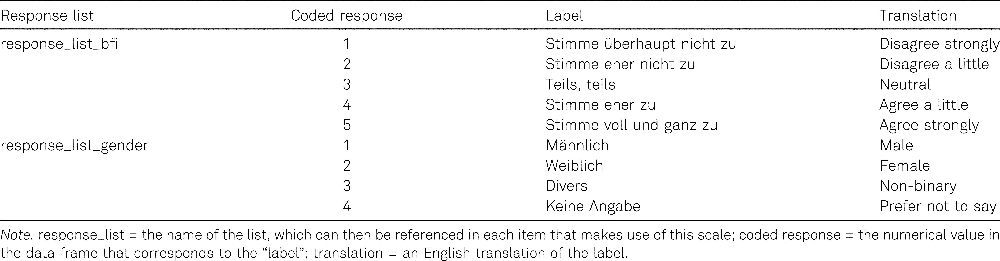

```{r setup, include=FALSE}
options(htmltools.dir.version = FALSE)

library(tidyverse)
library(kableExtra)
library(ggplot2)
library(plotly)
library(htmlwidgets)
library(MASS)
library(ggpubr)
library(xaringanthemer)
library(xaringanExtra)

style_duo_accent(
  primary_color = "#621C37",
  link_color = "#7da5f5",
  secondary_color = "#EE0071",
  background_image = "blank.png"
)

xaringanExtra::use_xaringan_extra(c("tile_view"))

# use_scribble(
#   pen_color = "#EE0071",
#   pen_size = 4
#   )

knitr::opts_chunk$set(
  fig.retina = TRUE,
  warning = FALSE,
  message = FALSE
)
```

name: Title slide
class: middle, left
<br><br><br><br><br><br><br>
# Wissenschaftliches Arbeiten und Forschungsmethoden

### Einheit 11: Publikation wissenschaftlicher Daten
##### 21.01.2025 | Dr. Caroline Zygar-Hoffmann

---
class: top, left
name: content

### Heutige Themen

#### [Hinweise](#hinweise)

#### [Gute wissenschaftliche Praxis](#wissprax)

#### [Open Data und Open Code](#opendata)

#### [Übung: Wann sind die Daten anonymisiert / Wie einfach ist Deanonymisierung](#deanonymisierung)

#### [Anonymisierungs-Möglichkeiten](#anonymisierung)

#### [Praxis](#praxis)

---
class: top, left

### Hinweise

#### Bitte noch an Studien teilnehmen

* Folgende Studien brauche noch dringend Teilnehmer:

https://surveys.osc.lmu.de/siblings

https://surveys.osc.lmu.de/bindungsforscher

* Folgende Studien sind noch offen:

https://surveys.osc.lmu.de/empowerment

https://surveys.osc.lmu.de/jagoda

https://surveys.osc.lmu.de/forever

https://surveys.osc.lmu.de/song

---
class: top, left

### Hinweise

#### Lehrevaluation ist gestartet!

Ich freue mich über Ihr Feedback, besonders in den offenen Antworten:

hsf.click/Eval-CFH


---
class: top, left
name: wissprax
<div class="footer"><span>Kapitel 4.2.1 in Döring, N. & Bortz, J. (2016). Forschungsmethoden und Evaluation in den Sozial- und Humanwissenschaften. Pearson. </span></div>

### Gute wissenschaftliche Praxis

.pull-left[
1) **Arbeiten nach den "Regeln der Wissenschaft" ("lege artis")**
- Anwendung üblicher wissenschaftlicher Methoden, gemäß dem "state of the art" (was Theorien, Methoden und Analysen angeht)
- Einhaltung der wissenschaftlichen Gütekriterien

2) **(Selbst-)kritische Reflexion von Forschungsergebnissen**
- keine Überinterpretation
- Verweis auf Limitationen
- Überprüfung durch peer-review Prozess, als Reviewer keine Gefälligkeitsreviews oder Reviews außerhalb des eigenen Kompetenzbereichs machen
- keine Interessenskonflikte oder transparenter Hinweis, wenn es welche gibt 
]

.pull-right[
3) **Sicherung von Primärdaten für mindestens 10 Jahre unter Wahrung des Datenschutzes**

4) **Kennzeichnung der Beiträge von Kooperationspartnern, Konkurrenten, Vorgängern in der eigenen Arbeit**
- angemessene Autorenschaftsregeln, keine Ehrenautorenschaften, kein Ghostwriting
- Korrekte Zitation, kein Plagiarismus

5) **Keine Sabotage von Forschungsarbeiten**
]

---
class: top, left
<div class="footer"><span>Kapitel 4.2.4 in Döring, N. & Bortz, J. (2016). Forschungsmethoden und Evaluation in den Sozial- und Humanwissenschaften. Pearson. </span></div>

### Gute wissenschaftliche Praxis

**Wissenschaftliche Autorenschaft**

* alle an der jeweiligen Studie sowie dem veröffentlichen Paper **maßgeblich** beteiligten Personen sollten ein Recht auf Autorenschaft haben $\rightarrow$ frühzeitige Absprachen treffen

* "Mitglieder des Forschungsteams, die nur kleine Teilarbeiten im Rahmen der Studie geleistet, aber nicht an der Publikation direkt mitgewirkt haben (z.B. studentische Hilfskräfte, die unter Anleitung die Datenerhebung, die Datenaufbereitung, und/oder die Datenauswertung), sind gemäß APA-Richtlinien keine Mitautoren (APA, 2009)" (Döring & Bortz, S. 136f) $\rightarrow$ **Acknowledgments**

* Abschlussarbeiten **können** bei entsprechender Qualität veröffentlicht werden $\rightarrow$ "Je nach Umfang der Betreuungsleistung einerseits und eigenständigen Arbeit der Studierenden andererseits sowie je nach Arbeitsanteil beim Schreiben des Manuskriptes kann das Spektrum reichen von studentischer Erstautorschaft, Mitautorschaft bis zu keiner Autorschaft (Fine & Kurdek, 1993)." (Döring & Bortz, S. 137)

* Besondere Rolle von Erstautor:in und Letztautor:in
  - Erstautor:innen sind i.d.R. für die Verfassung des Manuskript-Erstentwurfs verantwortlich
  - Erstautor:innen fungieren als Kontaktperson ("corresponding author") gegenüber der Zeitschrift und stellen die Einhaltung der Regeln guter wissenschaflticher Praxis sicher
  - Letztautor:innen sind in der Psychologie i.d.R. in einer betreuenden bzw. supervidierenden Rolle
  
---
class: top, left
<div class="footer"><span>https://credit.niso.org/ </span></div>

### Gute wissenschaftliche Praxis

**Wissenschaftliche Autorenschaft**

CRediT: Taxonomie mit 14 Rollen, die ein:e Autor:in im wissenschaftlichen Publikationsprozess einnehmen kann

.center[
```{r eval = TRUE, echo = F, out.width = "55%"}
knitr::include_graphics("bilder/credit.png")
```
]

---
class: top, left
<div class="footer"><span>Lakens, D. (2014). Performing high-powered studies efficiently with sequential analyses. European Journal of Social Psychology, 44, 701–710. doi:10.1002/ejsp.2023</span></div>

### Gute wissenschaftliche Praxis

**Ethische Prinzipien berücksichtigen** 

* Auswirkungen von Forschung auf Proband:innen und Gesellschaft?

* verantwortungsvoller Umgang mit Forschungsgeldern durch ressourcenschonende, zielführende Forschung (z.B. durch ausreichende Power, sequentielle Designs) 

  - Sequentielle Designs erlauben während der Datenerhebung in die Daten reinzuschauen = "optional stopping", um zu prüfen ob bereits ausreichend Evidenz vorhanden ist um eine Hypothese zu evaluieren (indem z.B. verschiedene Alpha-Niveaus herangezogen werden $\rightarrow$ wenn es richtig gemacht wird, dann keine questionable research practice)

.center[
```{r eval = TRUE, echo = F, out.width = "55%"}
knitr::include_graphics("bilder/sequentielle_designs.png")
```
]

---
class: top, left
name: opendata

### Open Data

#### Wieso offene Daten?

* Kernkriterien für Wissenschaft: Transparenz & Reproduzierbarkeit (Lupia & Elman, 2014; Merton, 1942; Popper, 1959)

* "Quality Check"

* Nachnutzung: Mehr Erkenntnisse aus den Daten möglich!

* Daten als Grundlage für Meta Analysen , v.a. bei nicht publizierten Studien

* Deutsche Forschungsgemeinschaft (DFG): "Sofern die Daten in Projekten erarbeitet wurden, die aus öffentlich rechtlichen Mitteln finanziert wurden, stehen sie im Grundsatz der Öffentlichkeit frei zur Verfügung" $\rightarrow$ Wissenschaftler werden von der Gesellschaft finanziert!

* in gewissem Sinne auch: Backup der Daten

---
class: top, left
<div class="footer"><span>https://fivethirtyeight.com/features/even-psychologists-respond-to-meaningless-rewards/ <br> Kidwell, M. C., Lazarević, L. B., Baranski, E., Hardwicke, T. E., Piechowski, S., Falkenberg, L. S., ... & Nosek, B. A. (2016). Badges to acknowledge open practices: A simple, low-cost, effective method for increasing transparency. PLoS Biology, 14(5), e1002456.</span></div>

### Open Data

#### "Badges" (= Abzeichen) als Hinweis darauf, dass ein Artikel Open Data bereitstellt

.pull-left[
```{r eval = TRUE, echo = F, out.width = "90%"}
knitr::include_graphics("bilder/badges1.png")
knitr::include_graphics("bilder/badges2.png")
```
]

.pull-right[
```{r eval = TRUE, echo = F, out.width = "90%"}
knitr::include_graphics("bilder/badges3.png")
```
]

---
class: top, left
<div class="footer"><span>https://osf.io/gevkf</span></div>

### Open Data

#### "Badges" (= Abzeichen) als Hinweis darauf, dass ein Artikel Open Data bereitstellt

Anzahl der vergebenen Badges im Journal *Psychological Science* 2014-2018:

.center[
```{r eval = TRUE, echo = F, out.width = "90%"}
knitr::include_graphics("bilder/badges4.png")
```
]

---
class: top, left
### Open Data

#### FAIR Prinzipien (Wilkison et al., 2016)

Veröffentlichte Daten sollten folgende Kriterien erfüllen:
* **F**indable: Die Daten sollten für Menschen und Computer leicht zu finden sein (z.B. in entsprechenden Archiven).
*	**A**ccessible: Die Daten müssen offen und frei zugänglich sein.
*	**I**nteroperable: Die Daten müssen technisch nachnutzbar sein (z.B. ein nicht-propritäres Dateiformat aufweisen).
*	**R**eusable: Die Daten müssen so dokumentiert sein, dass sie sinnvoll genutzt werden können.


---
class: top, left
### Open Data

#### Datendokumentation

* Um offene Daten verständlich und dadurch gut nachnutzbar zu machen braucht es eine gute Datendokumentation $\rightarrow$ Codebook

* Im Codebook wird für jede Variable beschrieben ...
  - ... wie sie heißt (idealerweise werden dennoch Variablennamen so selbsterklärend wie möglich gewählt)
  - ... was für einen Variablentyp (kontinuierlich/diskret) sie hat
  - ... welche Instruktion sie hatte
  - ... welche Antwortmöglichkeiten es gab
  - ... wie diese Antwortmöglichkeiten kodiert wurden

---
class: top, left
<div class="footer"><span>Horstmann, K. T., Arslan, R. C., & Greiff, S. (2020). Generating codebooks to ensure the independent use of research data: Some guidelines [Editorial]. European Journal of Psychological Assessment, 36(5), 721–729. https://doi.org/10.1027/1015-5759/a000620 </span></div>

### Open Data

#### Datendokumentation

Weiterführende Informationen sind immer sinnvoll, z.B. Quellenangabe zu den genutzten Fragebögen, oder falls relevant Erklärung zu fehlenden Werten/Werten die nicht Teil der Antwortoption sind:

.center[
```{r eval = TRUE, echo = F, out.width = "55%"}
knitr::include_graphics("bilder/codebook_content.jpeg")
```
]


---
class: top, left
<div class="footer"><span>Horstmann, K. T., Arslan, R. C., & Greiff, S. (2020). Generating codebooks to ensure the independent use of research data: Some guidelines [Editorial]. European Journal of Psychological Assessment, 36(5), 721–729. https://doi.org/10.1027/1015-5759/a000620</span></div>

### Open Data

#### Datendokumentation

Weiterführende Informationen sind immer sinnvoll, z.B. englische Originalformulierungen:

.center[
```{r eval = TRUE, echo = F}

```
]

---
class: top, left

### Open Data

#### Datendokumentation

.pull-left[
```{r eval = TRUE, echo = F}
knitr::include_graphics("bilder/codebook.png")
```
]

.pull-right[
$\rightarrow$ Die formr-Exceldateien decken viel vom Codebook ab (auch wenn Sie nicht unbedingt direkt selbsterklärend sind)

$\rightarrow$ **Für Ihre Studien im Rahmen der Vorlesung reichen die formr-Exceldateien als Codebook**; eine bessere Alternative für zukünftige Projekte ist die formr Datei aufzubereiten und zu ergänzen (z.B. mit dieser Vorlage: https://osf.io/xhaey)
]

---
class: top, left

### Open Data

#### Grenzen von Open Data: Personenbezogene Daten

.pull-left[
** Was sind "personenbezogene Daten"?**

* "Data that directly can identify a person : Name, address , email address , fingerprints , date of birth , genetic data"
* "But also unique combinations of other data that allow to identify a single person"
* "who can be identified, directly or indirectly, by means reasonably likely to be used by [...] any [...] natural or legal person" (aus der DSGVO)
* e.g., wer ist der männliche, 46-jährige Student im ersten Psychologie-Semester an der LMU?
]

.pull-right[
** Was sind "besonders sensible Daten"? $\rightarrow$ § 9 (1) DSGVO** 

* rassische und ethnische Herkunft
* politische Meinungen
* religiöse oder weltanschauliche Überzeugungen
* Gewerkschaftszugehörigkeit,
* genetische Daten
* biometrischen Daten zur eindeutigen Identifizierung einer natürlichen Person
* Gesundheitsdaten
* Daten zum Sexualleben oder der sexuellen Orientierung
$\rightarrow$ Wenn nicht nötig, nicht erheben! Ansonsten besondere Maßnahmen notwendig. 
]

* Wenn Teile der Daten nicht veröffentlicht werden können, heißt das nicht, dass der gesamte Datensatz nicht veröffentlicht werden kann $\rightarrow$ Legitime Datenschutzbedenken und Open Data schließen sich nicht aus!

---
class: top, left

### Open Data

#### Grenzen von Open Data: Personenbezogene Daten

**Do's and Don'ts (Meyer, 2018)**

.pull-left[
* DON’T promise to destroy your data
* DON’T promise not to share data
* DON’T promise that research analyses of the collected data will be limited to certain topics
]

.pull-right[
* DO get consent to retain and share data
* DO incorporate data retention and sharing clauses into IRB templates
* DO be thoughtful when considering risks of re identification
* DO consider working with a data repository
* DO be thoughtful when selecting a data repository
]

---
class: top, left

### Open Data

#### Grenzen von Open Data: Personenbezogene Daten

**Anonymisierung**

* "Anonymisieren ist das Verändern personenbezogener Daten derart, dass die Einzelangaben über persönliche oder sachliche Verhältnisse nicht mehr oder **nur mit einem unverhältnismäßig großen Aufwand an Zeit, Kosten und Arbeitskraft** einer bestimmten oder bestimmbaren natürlichen Person zugeordnet werden können." (Bundesdatenschutzgesetz)

* Was "unverhältnis großer Aufwand" ist, kann von mehreren Faktoren abhängen (wer versucht es? ist es in 10 Jahren einfacher als jetzt?)

* Während es also keine 100% Garantie zur Anonymität gibt, ist das auch nicht nötig, solange man in einer Risikoabschätzung zu dem Schluss kommt, dass es ausreichend unwahrscheinlich ist (unter der Berücksichtigung der Folgen, die eine Deanoymisierung hätte)

---
class: top, left

### Open Data

#### Grenzen von Open Data: Personenbezogene Daten

**Risikoeinschätzung**

* Wer könnte Interesse an einer Deanonymisierung haben? Wer hat zusätzliche Informationen und ein Motiv jemanden zu identifizieren? 

* Vielleicht ist der CIA-Hacker mit dem Supercomputer nicht der wahrscheinlichste Angreifer und wir sollten uns viel mehr um die studentische Hilfskraft sorgen, welche vollen Zugriff auf die Daten hat und die Kommilitonen leicht identifizieren kann 

* Besondere Vorsicht ist bei dyadischen Daten geboten: Romantische Partner haben zum Beispiel viele zusätzliche Informationen (z. B. Metadaten wie "Wann hat mein Partner die Fragebögen ausgefüllt?"), und wahrscheinlich ein gewisses Motiv

* Daten auf keinen Fall bei ChatGPT hochladen!

---
class: top, left
<div class="footer"><span>Schönbrodt, F. D., Gollwitzer, M., & Abele Brehm, A. (2017, March 29). Data Management in Psychological Science: Specification of the DFG Guidelines. https:// doi.org /10.1026/0033 3042/a000341 </span></div>

### Open Data

.center[
```{r eval = TRUE, echo = F, out.width = "60%"}
knitr::include_graphics("bilder/data_sharing.png")
```
]

---
class: top, left

### Open Code

#### Open Code = Reproduzierbarer Code

* Zusammen mit den Daten ist es sinnvoll, den R-Code und/oder das RMarkdown-Dokument zu veröffentlichen: Je nachdem was nötig ist um nachzuvollziehen welche Datenvorbereitung und Datenanalyse auf Code-Ebene durchgeführt wurde

* Jemand Anderes sollte den Code (von oben nach unten) auf den Daten durchführen können, ohne auf Errors zu stoßen $\rightarrow$ Reproduzierbarkeit!

* Auch hier ist wichtig für die Nachnutzbarkeit, dass der Code verständlich ist, was man vor allem durch Kommentare erreicht (z.B. # Skalenbildung, # Z-Standardisierung, # Voraussetzungsprüfung Analyse Hypothese 1, # Analyse Hypothese 1)

* Für Ihren Bericht soll der Code zusammen mit den anonymisierten (!) Daten auf dem OSF hochgeladen werden (in dasselbe Projekt wo auch die Präregistrierung hochgeladen wurde) 

* Falls Sie die Analysen individuell gemacht haben, dann am Besten pro Gruppenmitglied einen neuen Unterordner mit dem eigenen Namen im Projekt anlegen und dort die eigenen Code-Dateien ablegen


---
class: top, left

### Open Data und Open Code

**Bewertungsschema**

.center[
```{r eval = TRUE, echo = F}
knitr::include_graphics("bilder/bewertung_opendata.png")
```
]

---
class: top, left
name: deanonymisierung

### Übung: Wann ist mein Datensatz anonymisiert / Wie einfach ist eine Deanonymisierung?

**Bitte Umfrage ausfüllen: https://surveys.osc.lmu.de/anonymity**

**Bitte hier eintragen falls Umfrage ausgefüllt: https://docs.google.com/document/d/10A_6uA2F2FBJF-hG7AqEFhgj9ma0xt9yS_wc6hZmxE4/edit**

.pull-left[
```{r eval = TRUE, echo = F}
knitr::include_graphics("bilder/anonymity_survey1.png")
```
]

.pull-right[
```{r eval = TRUE, echo = F}
knitr::include_graphics("bilder/anonymity_survey2.png")
```
]


---
class: top, left
name: anonymisierung

### Anonymisierungs-Möglichkeiten

#### Einzigartige Kombinationen erkennen und verhindern

**Erkennen:**

```{r, eval = FALSE}
library(dplyr)

# let's try age and gender (1 = male, 2 = female)
unique_combos <- data %>% 
  group_by(alter, geschlecht) %>%
  summarise(n = n()) %>% 
  arrange((n))

# how many unique combinations do we have with age and gender?
table(unique_combos$n)

# show some of the critical ones
unique_combos[unique_combos$n == 1,]
```


---
class: top, left

### Anonymisierungs-Möglichkeiten

#### Einzigartige Kombinationen erkennen und verhindern

**Verhindern:**

* "binning", z.B. Alter --> Alterskategorien, mehrere seltene Antworten --> in einer Antwortkategorie "andere Antworten" kombinieren $\rightarrow$ Danach überprüfen, ob das ausreichend war, d.h. keine einzigartigen Kombinationen mehr vorhanden sind!

* "fuzzing", z.B. +- 0.5 Standardabweichungen Rauschen hinzufügen (v.a. bei kontinuierlichen Antworten relevant, für Variablen die in Analysen eingehen nicht besonders geeignet)

* "deleting", z.B. Freitextantworten, Datumsangaben, Uhrzeiten, Variablen die für die Analysen nicht relevant sind

$\rightarrow$ **Diese Maßnahmen verändern und reduzieren den Wert eines Datensatzes. Unbedingt dokumentieren und eine gute Balance finden zwischen Anonymität und Nachnutzbarkeit der Daten!**

---
class: top, left

### Anonymisierungs-Möglichkeiten

#### Einzigartige Kombinationen erkennen und verhindern

**Verhindern:**

```{r, eval = FALSE}
# let's make age bins
data$Alterskategorie[data$alter < 20] <- "17-19 Jahre"
data$Alterskategorie[data$alter > 19 & data$alter < 25] <- "20-24 Jahre"
data$Alterskategorie[data$alter > 24 & data$alter < 30] <- "25-29 Jahre"
data$Alterskategorie[data$alter > 29] <- "30-53 Jahre"

table(data$Alterskategorie)

## check whether we did a good job, and repeat until there are no unique entries left

## Done? Good! Save anonymized data in a separate file to share
write.csv(data, file = "raw_anonym/data_anonymized.csv", row.names = FALSE)
```

---
class: top, left
name: praxis

### Praxis

**Schritt 0: An Lehrevaluation teilnehmen: hsf.click/Eval-CFH**

**Schritt 1: Überlegen und prüfen, ob es Variablen gibt, die einzigartige Kombinationen bilden könnten und damit die Anonymität Ihrer Teilnehmer gefährden**

**Schritt 2: Hinreichend anonymen Datensatz erstellen**
- Rohdaten in R einlesen (d.h. nicht die Rohdaten selbst verändern! Diese lokal immer unangetastet behalten.)
- in R ggf. einzigartige Kombinationen durch binning oder deleting verhindern (wenn es hierbei Hilfe in R braucht, bitte melden)
- in R Pseudonym aus den Daten löschen (`data$pseudonym <- NA`)
- Neuen anonymen Datensatz abspeichern

**Schritt 3: Daten mit Codebook veröffentlichen**
- Anonymen Datensatz im OSF-Projekt hochladen (wo auch die Präregistrierung liegt)
- formr Exceldateien im OSF-Projekt hochladen (wo auch die Präregistrierung liegt)

**Schritt 4: Code veröffentlichen**
- Entweder als Gruppe, oder individuell (in nach Name benannten Unterordnern)
  
<!-- library(renderthis) -->
<!-- to_pdf("WissArb_11_OpenData.Rmd", complex_slides = TRUE) -->
