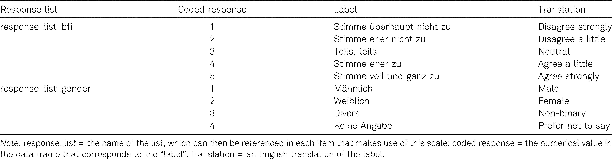

```{r setup, include=FALSE}
options(htmltools.dir.version = FALSE)

library(tidyverse)
library(kableExtra)
library(ggplot2)
library(plotly)
library(htmlwidgets)
library(MASS)
library(ggpubr)
library(xaringanthemer)
library(xaringanExtra)

style_duo_accent(
  primary_color = "#621C37",
  secondary_color = "#EE0071",
  background_image = "blank.png"
)

xaringanExtra::use_xaringan_extra(c("tile_view"))

# use_scribble(
#   pen_color = "#EE0071",
#   pen_size = 4
#   )

knitr::opts_chunk$set(
  fig.retina = TRUE,
  warning = FALSE,
  message = FALSE
)
```

name: Title slide
class: middle, left
<br><br><br><br><br><br><br>
# Wissenschaftliches Arbeiten und Forschungsmethoden

### Einheit 11: Publikation wissenschaftlicher Daten
##### 11.01.2024 | Dr. Caroline Zygar-Hoffmann

---
class: top, left
name: content

### Heutige Themen

#### [Lehrevaluation](#eval)

#### [Open Data](#opendata)

#### [Übung: Wie einfach ist Deanonymisierung](#deanonymisierung)

#### [Anonymisierungs-Möglichkeiten](#anonymisierung)

#### [Praxis](#praxis)

---
class: top, left
name: eval

### Lehrevaluation

.center[
**"Die Studierenden finden die jeweils individuell freigeschalteten Evaluationen im studynet"**

```{r eval = TRUE, echo = F, out.width="80%"}
knitr::include_graphics("bilder/eval.png")
```
]

---
class: top, left
name: opendata

### Open Data

#### Wieso offene Daten?

* Kernkriterien für Wissenschaft: Transparenz & Reproduzierbarkeit (Lupia & Elman, 2014; Merton, 1942; Popper, 1959)

* "Quality Check"

* Nachnutzung: Mehr Erkenntnisse aus den Daten möglich!

* Daten als Grundlage für Meta Analysen , v.a. bei nicht publizierten Studien

* Deutsche Forschungsgemeinschaft (DFG): "Sofern die Daten in Projekten erarbeitet wurden, die aus öffentlich rechtlichen Mitteln finanziert wurden, stehen sie im Grundsatz der Öffentlichkeit frei zur Verfügung" $\rightarrow$ Wissenschaftler werden von der Gesellschaft finanziert!

* in gewissem Sinne auch: Backup der Daten

---
class: top, left
### Open Data

#### Datendokumentation

* Um offene Daten verständlich und dadurch gut nachnutzbar zu machen braucht es eine gute Datendokumentation $\rightarrow$ Codebook

* Im Codebook wird für jede Variable beschrieben ...
  - ... wie sie heißt (idealerweise werden dennoch Variablennamen so selbsterklärend wie möglich gewählt)
  - ... was für einen Variablentyp (kontinuierlich/diskret) sie hat
  - ... welche Instruktion sie hatte
  - ... welche Antwortmöglichkeiten es gab
  - ... wie diese Antwortmöglichkeiten kodiert wurden

---
class: top, left
<div class="footer"><span>Horstmann, K. T., Arslan, R. C., & Greiff, S. (2020). Generating codebooks to ensure the independent use of research data: Some guidelines [Editorial]. European Journal of Psychological Assessment, 36(5), 721–729. https://doi.org/10.1027/1015-5759/a000620 </span></div>

### Open Data

#### Datendokumentation

Weiterführende Informationen sind immer sinnvoll, z.B. Quellenangabe zu den genutzten Fragebögen, oder falls relevant Erklärung zu fehlenden Werten/Werten die nicht Teil der Antwortoption sind:

.center[
```{r eval = TRUE, echo = F, out.width = "55%"}
knitr::include_graphics("bilder/codebook_content.jpeg")
```
]


---
class: top, left
<div class="footer"><span>Horstmann, K. T., Arslan, R. C., & Greiff, S. (2020). Generating codebooks to ensure the independent use of research data: Some guidelines [Editorial]. European Journal of Psychological Assessment, 36(5), 721–729. https://doi.org/10.1027/1015-5759/a000620</span></div>

### Open Data

#### Datendokumentation

Weiterführende Informationen sind immer sinnvoll, z.B. englische Originalformulierungen:

.center[
```{r eval = TRUE, echo = F}

```
]

---
class: top, left

### Open Data

#### Datendokumentation

**Bewertungsschema**

.pull-left[
```{r eval = TRUE, echo = F}
knitr::include_graphics("bilder/codebook.png")
```
]

.pull-right[
$\rightarrow$ Die formr-Exceldateien decken viel vom Codebook ab (auch wenn Sie nicht unbedingt direkt selbsterklärend sind)

$\rightarrow$ Für das Praxisprojekt reichen die formr-Exceldateien als Codebook; eine bessere Alternative für zukünftige Projekte ist die formr Datei aufzubereiten und zu ergänzen (z.B. mit dieser Vorlage: https://osf.io/xhaey)
]


---
class: top, left

### Open Data

#### Datendokumentation

.center[
```{r eval = TRUE, echo = F}
knitr::include_graphics("bilder/bewertung_opendata.png")
```
]

---
class: top, left

### Open Data

#### Grenzen: Personenbezogene Daten

.pull-left[
** Was sind "personenbezogene Daten"?**

* "Data that directly can identify a person : Name, address , email address , fingerprints , date of birth , genetic data"
* "But also unique combinations of other data that allow to identify a single person"
* "who can be identified, directly or indirectly, by means reasonably likely to be used by [...] any [...] natural or legal person" (aus der DSGVO)
* e.g., wer ist der männliche, 46-jährige Student im ersten Psychologie-Semester an der LMU?
]

.pull-right[
** Was sind "besonders sensible Daten"? $\rightarrow$ § 9 (1) DSGVO** 

* rassische und ethnische Herkunft
* politische Meinungen
* religiöse oder weltanschauliche Überzeugungen
* Gewerkschaftszugehörigkeit,
* genetische Daten
* biometrischen Daten zur eindeutigen Identifizierung einer natürlichen Person
* Gesundheitsdaten
* Daten zum Sexualleben oder der sexuellen Orientierung
$\rightarrow$ Wenn nicht nötig, nicht erheben! Ansonsten besondere Maßnahmen notwendig. 
]

* Wenn Teile der Daten nicht veröffentlicht werden können, heißt das nicht, dass der gesamte Datensatz nicht veröffentlicht werden kann $\rightarrow$ Legitime Datenschutzbedenken und Open Data schließen sich nicht aus!

---
class: top, left

### Open Data

#### Grenzen: Personenbezogene Daten

**Do's and Don'ts (Meyer, 2018)**

.pull-left[
* DON’T promise to destroy your data
* DON’T promise not to share data
* DON’T promise that research analyses of the collected data will be limited to certain topics
]

.pull-right[
* DO get consent to retain and share data
* DO incorporate data retention and sharing clauses into IRB templates
* DO be thoughtful when considering risks of re identification
* DO consider working with a data repository
* DO be thoughtful when selecting a data repository
]

---
class: top, left

### Open Data

#### Grenzen: Personenbezogene Daten

**Anonymisierung**

* "Anonymisieren ist das Verändern personenbezogener Daten derart, dass die Einzelangaben über persönliche oder sachliche Verhältnisse nicht mehr oder **nur mit einem unverhältnismäßig großen Aufwand an Zeit, Kosten und Arbeitskraft** einer bestimmten oder bestimmbaren natürlichen Person zugeordnet werden können." (Bundesdatenschutzgesetz)

* Was "unverhältnis großer Aufwand" ist, kann von mehreren Faktoren abhängen (wer versucht es? ist es in 10 Jahren einfacher als jetzt?)

* Während es also keine 100% Garantie zur Anonymität gibt, ist das auch nicht nötig, solange man in einer Risikoabschätzung zu dem Schluss kommt, dass es ausreichend unwahrscheinlich ist (unter der Berücksichtigung der Folgen, die eine Deanoymisierung hätte)

---
class: top, left

### Open Data

#### Grenzen: Personenbezogene Daten

**Risikoeinschätzung**

* Wer könnte Interesse an einer Deanonymisierung haben? Wer hat zusätzliche Informationen und ein Motiv jemanden zu identifizieren? 

* Vielleicht ist der CIA-Hacker mit dem Supercomputer nicht der wahrscheinlichste Angreifer und wir sollten uns viel mehr um die studentische Hilfskraft sorgen, welche vollen Zugriff auf die Daten hat und die Kommilitonen leicht identifizieren kann 

* Besondere Vorsicht ist bei dyadischen Daten geboten: Romantische Partner haben zum Beispiel viele zusätzliche Informationen (z. B. Metadaten wie "Wann hat mein Partner die Fragebögen ausgefüllt?"), und wahrscheinlich ein gewisses Motiv

---
class: top, left
<div class="footer"><span>Schönbrodt, F. D., Gollwitzer, M., & Abele Brehm, A. (2017, March 29). Data Management in Psychological Science: Specification of the DFG Guidelines. https:// doi.org /10.1026/0033 3042/a000341 </span></div>

### Open Data

.center[
```{r eval = TRUE, echo = F, out.width = "60%"}
knitr::include_graphics("bilder/data_sharing.png")
```
]

---
class: top, left
name: deanonymisierung

### Übung: Wie einfach ist eine Deanonymisierung?

**Bitte Umfrage ausfüllen: https://tellmi.psy.lmu.de/formr/anonymity**

.center[
```{r eval = TRUE, echo = F, out.width = "65%"}
knitr::include_graphics("bilder/anonymity_survey.png")
```
]


---
class: top, left
name: anonymisierung

### Anonymisierungs-Möglichkeiten

#### Einzigartige Kombinationen erkennen und verhindern

**Erkennen:**

```{r, eval = FALSE}
library(dplyr)

# let's try age and gender (1 = male, 2 = female)
unique_combos <- data %>% 
  group_by(alter, geschlecht) %>%
  summarise(n = n()) %>% 
  arrange((n))

# how many unique combinations do we have with age and gender?
table(unique_combos$n)

# show some of the critical ones
unique_combos[unique_combos$n == 1,]
```


---
class: top, left

### Anonymisierungs-Möglichkeiten

#### Einzigartige Kombinationen erkennen und verhindern

**Verhindern:**

* "binning", z.B. Alter --> Alterskategorien, mehrere seltene Antworten --> in einer Antwortkategorie "andere Antworten" kombinieren $\rightarrow$ Danach überprüfen, ob das ausreichend war, d.h. keine einzigartigen Kombinationen mehr vorhanden sind!
* "fuzzing", z.B. +- 0.5 Standardabweichungen Rauschen hinzufügen (v.a. bei kontinuierlichen Antworten relevant, für Variablen die in Analysen eingehen nicht besonders geeignet)
* "deleting", z.B. Freitextantworten, Datumsangaben, Uhrzeiten, Variablen die für die Analysen nicht relevant sind

$\rightarrow$ **Diese Maßnahmen verändern und reduzieren den Wert eines Datensatzes. Unbedingt dokumentieren und eine gute Balance finden zwischen Anonymität und Nachnutzbarkeit der Daten!**

---
class: top, left

### Anonymisierungs-Möglichkeiten

#### Einzigartige Kombinationen erkennen und verhindern

**Verhindern:**

```{r, eval = FALSE}
# let's make age bins
data$Alterskategorie[data$alter < 20] <- "17-19 Jahre"
data$Alterskategorie[data$alter > 19 & data$alter < 25] <- "20-24 Jahre"
data$Alterskategorie[data$alter > 24 & data$alter < 30] <- "25-29 Jahre"
data$Alterskategorie[data$alter > 29] <- "30-53 Jahre"

table(data$Alterskategorie)

## check whether we did a good job, and repeat until there are no unique entries left

## Done? Good! Save anonymized data in a separate file to share
write.csv(data, file = "raw_anonym/data_anonymized.csv", row.names = FALSE)
```

---
class: top, left
name: praxis

### Praxis

**Schritt 1: Überlegen und prüfen, ob es Variablen gibt, die einzigartige Kombinationen bilden könnten und damit die Anonymität Ihrer Teilnehmer gefährden**

**Schritt 2: Hinreichend anonymen Datensatz erstellen**
- Rohdaten in R einlesen (d.h. nicht die Rohdaten selbst verändern! Diese lokal immer unangetastet behalten.)
- in R ggf. einzigartige Kombinationen durch binning, fuzzing oder deleting verhindern (wenn es hierbei Hilfe in R braucht, bitte melden)
- in R Pseudonym aus den Daten löschen (`data$pseudonym <- NA`)
- Neuen anonymen Datensatz abspeichern

**Schritt 3: Daten mit Codebook veröffentlichen**
- Anonymen Datensatz im OSF-Projekt hochladen (wo auch die Präregistrierung liegt)
- formr Exceldateien im OSF-Projekt hochladen (wo auch die Präregistrierung liegt)

<!-- library(renderthis) -->
<!-- to_pdf("WissArb_11_OpenData.Rmd", complex_slides = TRUE) -->
