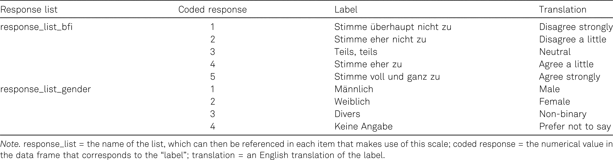

```{r setup, include=FALSE}
options(htmltools.dir.version = FALSE)

library(tidyverse)
library(kableExtra)
library(ggplot2)
library(plotly)
library(htmlwidgets)
library(MASS)
library(ggpubr)
library(xaringanthemer)
library(xaringanExtra)

style_duo_accent(
  primary_color = "#621C37",
  link_color = "#7da5f5",
  secondary_color = "#EE0071",
  background_image = "blank.png"
)

xaringanExtra::use_xaringan_extra(c("tile_view"))

# use_scribble(
#   pen_color = "#EE0071",
#   pen_size = 4
#   )

knitr::opts_chunk$set(
  fig.retina = TRUE,
  warning = FALSE,
  message = FALSE
)
```

name: Title slide
class: middle, left
<br><br><br><br><br><br><br>
# Wissenschaftliches Arbeiten und Forschungsmethoden

### Einheit 11: Publikation wissenschaftlicher Daten + das Wissenschaftssystem
##### 10.07.2024 | Dr. Caroline Zygar-Hoffmann

---
class: top, left
name: content

### Heutige Themen

#### [Gute wissenschaftliche Praxis](#wissprax)

#### [Open Data](#opendata)

#### [Übung: Wie einfach ist Deanonymisierung](#deanonymisierung)

#### [Anonymisierungs-Möglichkeiten](#anonymisierung)

#### [Praxis Teil 1](#praxis1)

#### [Das Wissenschaftssystem](#wisssys)

#### [Praxis Teil 2](#praxis2)

---
class: top, left

### Hinweise

* Auf studynet ist jetzt auch die RMarkdown-Datei zu dem hochgeladenen Beispielbericht aus dem letzten Semester zu finden.

* An Lehrevaluation teilnehmen: [hsf.click/Eval-CFH](https://hsf.click/Eval-CFH)

* Folgende Studien laufen noch:

https://tellmi.psy.lmu.de/formr/Umfragenchecker

https://tellmi.psy.lmu.de/formr/ErkenneDeinenWert

https://tellmi.psy.lmu.de/formr/BindungsstilSelbstwert

https://tellmi.psy.lmu.de/formr/FriendsAndRelationships

https://tellmi.psy.lmu.de/formr/FuenfFragezeichenRunFinal

https://tellmi.psy.lmu.de/formr/IntThema

---
class: top, left
name: wissprax
<div class="footer"><span>Kapitel 4.2.1 in Döring, N. & Bortz, J. (2016). Forschungsmethoden und Evaluation in den Sozial- und Humanwissenschaften. Pearson. </span></div>

### Gute wissenschaftliche Praxis

.pull-left[
1) **Arbeiten nach den "Regeln der Wissenschaft" ("lege artis")**
- Anwendung üblicher wissenschaftlicher Methoden, gemäß dem "state of the art" (was Theorien, Methoden und Analysen angeht)
- Einhaltung der wissenschaftlichen Gütekriterien

2) **(Selbst-)kritische Reflexion von Forschungsergebnissen**
- keine Überinterpretation
- Verweis auf Limitationen
- Überprüfung durch peer-review Prozess, als Reviewer keine Gefälligkeitsreviews oder Reviews außerhalb des eigenen Kompetenzbereichs machen
- keine Interessenskonflikte oder transparenter Hinweis, wenn es welche gibt 
]

.pull-right[
3) **Sicherung von Primärdaten für mindestens 10 Jahre unter Wahrung des Datenschutzes**

4) **Kennzeichnung der Beiträge von Kooperationspartnern, Konkurrenten, Vorgängern in der eigenen Arbeit**
- angemessene Autorenschaftsregeln, keine Ehrenautorenschaften, kein Ghostwriting
- Korrekte Zitation, kein Plagiarismus

5) **Keine Sabotage von Forschungsarbeiten**
]

---
class: top, left
<div class="footer"><span>Kapitel 4.2.4 in Döring, N. & Bortz, J. (2016). Forschungsmethoden und Evaluation in den Sozial- und Humanwissenschaften. Pearson. </span></div>

### Gute wissenschaftliche Praxis

**Wissenschaftliche Autorenschaft**

* alle an der jeweiligen Studie sowie dem veröffentlichen Paper **maßgeblich** beteiligten Personen sollten ein Recht auf Autorenschaft haben $\rightarrow$ frühzeitige Absprachen treffen

* "Mitglieder des Forschungsteams, die nur kleine Teilarbeiten im Rahmen der Studie geleistet, aber nicht an der Publikation direkt mitgewirkt haben (z.B. studentische Hilfskräfte, die unter Anleitung die Datenerhebung, die Datenaufbereitung, und/oder die Datenauswertung), sind gemäß APA-Richtlinien keine Mitautoren (APA, 2009)" (Döring & Bortz, S. 136f) $\rightarrow$ **Acknowledgments**

* Abschlussarbeiten **können** bei entsprechender Qualität veröffentlicht werden $\rightarrow$ "Je nach Umfang der Betreuungsleistung einerseits und eigenständigen Arbeit der Studierenden andererseits sowie je nach Arbeitsanteil beim Schreiben des Manuskriptes kann das Spektrum reichen von studentischer Erstautorschaft, Mitautorschaft bis zu keiner Autorschaft (Fine & Kurdek, 1993)." (Döring & Bortz, S. 137)

* Besondere Rolle von Erstautor:in und Letztautor:in
  - Erstautor:innen sind i.d.R. für die Verfassung des Manuskript-Erstentwurfs verantwortlich
  - Erstautor:innen fungieren als Kontaktperson ("corresponding author") gegenüber der Zeitschrift und stellen die Einhaltung der Regeln guter wissenschaflticher Praxis sicher
  - Letztautor:innen sind in der Psychologie i.d.R. in einer betreuenden bzw. supervidierenden Rolle
  
---
class: top, left
<div class="footer"><span>https://credit.niso.org/ </span></div>

### Gute wissenschaftliche Praxis

**Wissenschaftliche Autorenschaft**

CRediT: Taxonomie mit 14 Rollen, die ein:e Autor:in im wissenschaftlichen Publikationsprozess einnehmen kann

.center[
```{r eval = TRUE, echo = F, out.width = "55%"}
knitr::include_graphics("bilder/credit.png")
```
]

---
class: top, left
<div class="footer"><span>Lakens, D. (2014). Performing high-powered studies efficiently with sequential analyses. European Journal of Social Psychology, 44, 701–710. doi:10.1002/ejsp.2023</span></div>

### Gute wissenschaftliche Praxis

**Ethische Prinzipien berücksichtigen** 

* Auswirkungen von Forschung auf Proband:innen und Gesellschaft?

* verantwortungsvoller Umgang mit Forschungsgeldern durch ressourcenschonende, zielführende Forschung (z.B. durch ausreichende Power, sequentielle Designs) 

  - Sequentielle Designs erlauben während der Datenerhebung in die Daten reinzuschauen = "optional stopping", um zu prüfen ob bereits ausreichend Evidenz vorhanden ist um eine Hypothese zu evaluieren (indem z.B. verschiedene Alpha-Niveaus herangezogen werden $\rightarrow$ wenn es richtig gemacht wird, dann keine questionable research practice)

.center[
```{r eval = TRUE, echo = F, out.width = "55%"}
knitr::include_graphics("bilder/sequentielle_designs.png")
```
]
---
class: top, left
name: opendata

### Open Data

#### Wieso offene Daten?

* Kernkriterien für Wissenschaft: Transparenz & Reproduzierbarkeit (Lupia & Elman, 2014; Merton, 1942; Popper, 1959)

* "Quality Check"

* Nachnutzung: Mehr Erkenntnisse aus den Daten möglich!

* Daten als Grundlage für Meta Analysen , v.a. bei nicht publizierten Studien

* Deutsche Forschungsgemeinschaft (DFG): "Sofern die Daten in Projekten erarbeitet wurden, die aus öffentlich rechtlichen Mitteln finanziert wurden, stehen sie im Grundsatz der Öffentlichkeit frei zur Verfügung" $\rightarrow$ Wissenschaftler werden von der Gesellschaft finanziert!

* in gewissem Sinne auch: Backup der Daten

---
class: top, left
### Open Data

#### Datendokumentation

* Um offene Daten verständlich und dadurch gut nachnutzbar zu machen braucht es eine gute Datendokumentation $\rightarrow$ Codebook

* Im Codebook wird für jede Variable beschrieben ...
  - ... wie sie heißt (idealerweise werden dennoch Variablennamen so selbsterklärend wie möglich gewählt)
  - ... was für einen Variablentyp (kontinuierlich/diskret) sie hat
  - ... welche Instruktion sie hatte
  - ... welche Antwortmöglichkeiten es gab
  - ... wie diese Antwortmöglichkeiten kodiert wurden

---
class: top, left
<div class="footer"><span>Horstmann, K. T., Arslan, R. C., & Greiff, S. (2020). Generating codebooks to ensure the independent use of research data: Some guidelines [Editorial]. European Journal of Psychological Assessment, 36(5), 721–729. https://doi.org/10.1027/1015-5759/a000620 </span></div>

### Open Data

#### Datendokumentation

Weiterführende Informationen sind immer sinnvoll, z.B. Quellenangabe zu den genutzten Fragebögen, oder falls relevant Erklärung zu fehlenden Werten/Werten die nicht Teil der Antwortoption sind:

.center[
```{r eval = TRUE, echo = F, out.width = "55%"}
knitr::include_graphics("bilder/codebook_content.jpeg")
```
]


---
class: top, left
<div class="footer"><span>Horstmann, K. T., Arslan, R. C., & Greiff, S. (2020). Generating codebooks to ensure the independent use of research data: Some guidelines [Editorial]. European Journal of Psychological Assessment, 36(5), 721–729. https://doi.org/10.1027/1015-5759/a000620</span></div>

### Open Data

#### Datendokumentation

Weiterführende Informationen sind immer sinnvoll, z.B. englische Originalformulierungen:

.center[
```{r eval = TRUE, echo = F}

```
]

---
class: top, left

### Open Data

#### Datendokumentation

.pull-left[
```{r eval = TRUE, echo = F}
knitr::include_graphics("bilder/codebook.png")
```
]

.pull-right[
$\rightarrow$ Die formr-Exceldateien decken viel vom Codebook ab (auch wenn Sie nicht unbedingt direkt selbsterklärend sind)

$\rightarrow$ **Für Ihre Studien im Rahmen der Vorlesung reichen die formr-Exceldateien als Codebook**; eine bessere Alternative für zukünftige Projekte ist die formr Datei aufzubereiten und zu ergänzen (z.B. mit dieser Vorlage: https://osf.io/xhaey)
]


---
class: top, left

### Open Data

#### Datendokumentation

**Bewertungsschema**

.center[
```{r eval = TRUE, echo = F}
knitr::include_graphics("bilder/bewertung_opendata.png")
```
]

---
class: top, left

### Open Data

#### Grenzen: Personenbezogene Daten

.pull-left[
** Was sind "personenbezogene Daten"?**

* "Data that directly can identify a person : Name, address , email address , fingerprints , date of birth , genetic data"
* "But also unique combinations of other data that allow to identify a single person"
* "who can be identified, directly or indirectly, by means reasonably likely to be used by [...] any [...] natural or legal person" (aus der DSGVO)
* e.g., wer ist der männliche, 46-jährige Student im ersten Psychologie-Semester an der LMU?
]

.pull-right[
** Was sind "besonders sensible Daten"? $\rightarrow$ § 9 (1) DSGVO** 

* rassische und ethnische Herkunft
* politische Meinungen
* religiöse oder weltanschauliche Überzeugungen
* Gewerkschaftszugehörigkeit,
* genetische Daten
* biometrischen Daten zur eindeutigen Identifizierung einer natürlichen Person
* Gesundheitsdaten
* Daten zum Sexualleben oder der sexuellen Orientierung
$\rightarrow$ Wenn nicht nötig, nicht erheben! Ansonsten besondere Maßnahmen notwendig. 
]

* Wenn Teile der Daten nicht veröffentlicht werden können, heißt das nicht, dass der gesamte Datensatz nicht veröffentlicht werden kann $\rightarrow$ Legitime Datenschutzbedenken und Open Data schließen sich nicht aus!

---
class: top, left

### Open Data

#### Grenzen: Personenbezogene Daten

**Do's and Don'ts (Meyer, 2018)**

.pull-left[
* DON’T promise to destroy your data
* DON’T promise not to share data
* DON’T promise that research analyses of the collected data will be limited to certain topics
]

.pull-right[
* DO get consent to retain and share data
* DO incorporate data retention and sharing clauses into IRB templates
* DO be thoughtful when considering risks of re identification
* DO consider working with a data repository
* DO be thoughtful when selecting a data repository
]

---
class: top, left

### Open Data

#### Grenzen: Personenbezogene Daten

**Anonymisierung**

* "Anonymisieren ist das Verändern personenbezogener Daten derart, dass die Einzelangaben über persönliche oder sachliche Verhältnisse nicht mehr oder **nur mit einem unverhältnismäßig großen Aufwand an Zeit, Kosten und Arbeitskraft** einer bestimmten oder bestimmbaren natürlichen Person zugeordnet werden können." (Bundesdatenschutzgesetz)

* Was "unverhältnis großer Aufwand" ist, kann von mehreren Faktoren abhängen (wer versucht es? ist es in 10 Jahren einfacher als jetzt?)

* Während es also keine 100% Garantie zur Anonymität gibt, ist das auch nicht nötig, solange man in einer Risikoabschätzung zu dem Schluss kommt, dass es ausreichend unwahrscheinlich ist (unter der Berücksichtigung der Folgen, die eine Deanoymisierung hätte)

---
class: top, left

### Open Data

#### Grenzen: Personenbezogene Daten

**Risikoeinschätzung**

* Wer könnte Interesse an einer Deanonymisierung haben? Wer hat zusätzliche Informationen und ein Motiv jemanden zu identifizieren? 

* Vielleicht ist der CIA-Hacker mit dem Supercomputer nicht der wahrscheinlichste Angreifer und wir sollten uns viel mehr um die studentische Hilfskraft sorgen, welche vollen Zugriff auf die Daten hat und die Kommilitonen leicht identifizieren kann 

* Besondere Vorsicht ist bei dyadischen Daten geboten: Romantische Partner haben zum Beispiel viele zusätzliche Informationen (z. B. Metadaten wie "Wann hat mein Partner die Fragebögen ausgefüllt?"), und wahrscheinlich ein gewisses Motiv

---
class: top, left
<div class="footer"><span>Schönbrodt, F. D., Gollwitzer, M., & Abele Brehm, A. (2017, March 29). Data Management in Psychological Science: Specification of the DFG Guidelines. https:// doi.org /10.1026/0033 3042/a000341 </span></div>

### Open Data

.center[
```{r eval = TRUE, echo = F, out.width = "60%"}
knitr::include_graphics("bilder/data_sharing.png")
```
]

---
class: top, left
name: deanonymisierung

### Übung: Wie einfach ist eine Deanonymisierung?

**Bitte Umfrage ausfüllen: https://tellmi.psy.lmu.de/formr/anonymity**

**Bitte hier eintragen falls Umfrage ausgefüllt: https://docs.google.com/document/d/10A_6uA2F2FBJF-hG7AqEFhgj9ma0xt9yS_wc6hZmxE4/edit**

.center[
```{r eval = TRUE, echo = F, out.width = "50%"}
knitr::include_graphics("bilder/anonymity_survey.png")
```
]


---
class: top, left
name: anonymisierung

### Anonymisierungs-Möglichkeiten

#### Einzigartige Kombinationen erkennen und verhindern

**Erkennen:**

```{r, eval = FALSE}
library(dplyr)

# let's try age and gender (1 = male, 2 = female)
unique_combos <- data %>% 
  group_by(alter, geschlecht) %>%
  summarise(n = n()) %>% 
  arrange((n))

# how many unique combinations do we have with age and gender?
table(unique_combos$n)

# show some of the critical ones
unique_combos[unique_combos$n == 1,]
```


---
class: top, left

### Anonymisierungs-Möglichkeiten

#### Einzigartige Kombinationen erkennen und verhindern

**Verhindern:**

* "binning", z.B. Alter --> Alterskategorien, mehrere seltene Antworten --> in einer Antwortkategorie "andere Antworten" kombinieren $\rightarrow$ Danach überprüfen, ob das ausreichend war, d.h. keine einzigartigen Kombinationen mehr vorhanden sind!

* "fuzzing", z.B. +- 0.5 Standardabweichungen Rauschen hinzufügen (v.a. bei kontinuierlichen Antworten relevant, für Variablen die in Analysen eingehen nicht besonders geeignet)

* "deleting", z.B. Freitextantworten, Datumsangaben, Uhrzeiten, Variablen die für die Analysen nicht relevant sind

$\rightarrow$ **Diese Maßnahmen verändern und reduzieren den Wert eines Datensatzes. Unbedingt dokumentieren und eine gute Balance finden zwischen Anonymität und Nachnutzbarkeit der Daten!**

---
class: top, left

### Anonymisierungs-Möglichkeiten

#### Einzigartige Kombinationen erkennen und verhindern

**Verhindern:**

```{r, eval = FALSE}
# let's make age bins
data$Alterskategorie[data$alter < 20] <- "17-19 Jahre"
data$Alterskategorie[data$alter > 19 & data$alter < 25] <- "20-24 Jahre"
data$Alterskategorie[data$alter > 24 & data$alter < 30] <- "25-29 Jahre"
data$Alterskategorie[data$alter > 29] <- "30-53 Jahre"

table(data$Alterskategorie)

## check whether we did a good job, and repeat until there are no unique entries left

## Done? Good! Save anonymized data in a separate file to share
write.csv(data, file = "raw_anonym/data_anonymized.csv", row.names = FALSE)
```

---
class: top, left
name: praxis1

### Praxis Teil 1

**Schritt 1: Überlegen und prüfen, ob es Variablen gibt, die einzigartige Kombinationen bilden könnten und damit die Anonymität Ihrer Teilnehmer gefährden**

**Schritt 2: Hinreichend anonymen Datensatz erstellen**
- Rohdaten in R einlesen (d.h. nicht die Rohdaten selbst verändern! Diese lokal immer unangetastet behalten.)
- in R ggf. einzigartige Kombinationen durch binning oder deleting verhindern (wenn es hierbei Hilfe in R braucht, bitte melden)
- in R Pseudonym aus den Daten löschen (`data$pseudonym <- NA`)
- Neuen anonymen Datensatz abspeichern

**Schritt 3: Daten mit Codebook veröffentlichen**
- Anonymen Datensatz im OSF-Projekt hochladen (wo auch die Präregistrierung liegt)
- formr Exceldateien im OSF-Projekt hochladen (wo auch die Präregistrierung liegt)


---
class: top, left
name: wisssys

### Das Wissenschaftssystem

**Der Weg zur Publikation** 

.pull-left[
1) **Auswahl eines Journals** nach thematischer Passung, Länge des Artikels, Qualität des Journals (auch: Unterstützung von Open Science), Augen offen halten für "Call for Papers" zu spezifischem Themen ( $\rightarrow$ "Special Issues" der Journals zu bestimmtem Thema)

2) **Sichtung und Umsetzung der "Author Guidelines"**: Hinweise zu Artikelformaten, geforderten Elementen, Formatierung, Länge, ggf. Verblindung gegenüber Reviewern (d.h. dass im Manuskript nicht kenntlich ist, wer der/die Autor:innen des Artikels sind)

3) **Aufsetzen des "Cover Letters"**: Anschreiben an den Editor mit kurzer Vorstellung des Manuskripts und ggf. ergänzenden Hinweisen
]

.pull-right[
4) **Einreichung im Journal Submission Portal**: Eingabe von Informationen zu Autor:innen, Bestätigung guter wissenschaftlicher Praxis, Hochladen von Dateien, ggf. Vorschlag von Reviewern

5) **Auf die Entscheidung warten (kann sehr unterschiedlich lange dauern)**: 
  * "desk-reject" (direkte Ablehnung durch den Editor, meist innerhalb weniger Tage) oder 
  * "under (peer-)review" (Anzahl an Reviewern unterschiedlich, häufig 2, + meist separates Review durch den Editor, meist innerhalb von mehreren Wochen bis Monaten) 
  * Nach Einreichung / während man auf eine Entscheidung wartet, darf das Manuskript bei keinem anderen Journal zur Begutachtung vorliegen
]

---
class: top, left

### Das Wissenschaftssystem

**Peer-Review**

* Beim peer-review begutachten Wissenschaftler mit Expertise zu der Forschungsarbeit (inhaltlich oder methodisch) das Manuskript

* Entscheidungen nach dem Peer-Review: 
  - Rejection
  - Revise and resubmit: Major revision
  - Revise and resubmit: Minor revision
  - Acceptance pending minor revisions
  - Acceptance

---
class: top, left

### Das Wissenschaftssystem

**Peer-Review**

* Wenn es keine Rejection ist: 
  - Innerhalb einer bestimmten Frist Überarbeitung des Manuskripts $\rightarrow$ Verlängerung der Frist kann beim Editor beantragt werden
  - Darlegung wie auf die Reviews eingegangen wurde im "response letter" (Reviewer-Kommentare Punkt-für-Punkt aufführen und beantworten, d.h. Änderungen darlegen und nachvollziehbar im Manuskript kennzeichnen) 
  - Nach resubmission wird es ggf. nochmal an (meist dieselben) Reviewer geschickt, manchmal entscheidet auch der Editor direkt (eher nur bei minor revisions)

* Bei Annahme des Artikels, ist der Artikel "in press" (d.h. wird für die Veröffentlichung vorbereitet) $\rightarrow$ Korrespondenz mit den "copy editors" des Journals (welche das Manuskript layouten und ggf. sprachlich checken) zur Abstimmung der "Druck"freigabe


---
class: top, left
<div class="footer"><span>Brembs, B., Button, K., & Munafò, M. (2013). Deep impact: unintended consequences of journal rank. Frontiers in human Neuroscience, 291. <br>Fraley, R. C., & Vazire, S. (2014). The N-pact factor: Evaluating the quality of empirical journals with respect to sample size and statistical power. PloS one, 9(10), e109019. <br>Lariviere, V., Kiermer, V., MacCallum, C. J., McNutt, M., Patterson, M., Pulverer, B., Swaminathan, S., u.a. (2016). A simple proposal for the publication of journal citation distributions. bioRxiv, 062109. doi:10.1101/062109 <br>Szucs, D., & Ioannidis, J. P. (2017). Empirical assessment of published effect sizes and power in the recent cognitive neuroscience and psychology literature. PLoS biology, 15(3), e2000797.
</span></div>

### Das Wissenschaftssystem

**Impact Factor und seine Probleme**

.pull-left[
* Impact Factor = jährliche mittlere Anzahl der Zitationen von Aritkeln, die in den letzten 2 Jahren in einem Journal publiziert wurden

* Fraley & Vazire (2014); Szucs & Ioannidis (2017): Höherer JIF hängt mit geringerer statistischer Power/Stichprobengröße der dort publizierten Studien zusammen

* Brembs, Button, & Munafò (2013): Höherer JIF hängt mit einer höheren Rate an Retractions (Zurückziehen eines Artikels) zusammen
]

.pull-right[
```{r eval = TRUE, echo = F}
knitr::include_graphics("bilder/JIF.png")
```
]


---
class: top, left

### Das Wissenschaftssystem

**Konferenzen in der Psychologie**

* Vernetzung unter Kolleg:innen und Austausch zu wissenschaftlichen Ergebnissen

* Häufig mehrere parallele "Sessions", d.h. mehrere parallele Vorträge in unterschiedlichen Räumen

* Häufige Beitragsformen:
  - **Einzel-Vorträge** (meist ca. 10-20 Minuten), d.h. ein alleinstehender Vortrag zu einem Forschungsthema
  - **Beitrag in einem Symposium** (meist ca. 10-20 Minuten), d.h. ein Vortrag der inhaltlich zu anderen Vorträgen passt mit ggf. abschließendem Diskussion der Vorträge durch einen Diskutanten
  - **Keynote-Vortrag** (meist ca. 60 Minuten), d.h. ein zentraler Vortrag während der Konferenz während dem keine anderen Vorträge stattfinden; hierfür wird man angefragt/eingeladen
  - **Poster-Präsentation** (meist ca. 30-60 Minuten), d.h. Ausdruck eines Posters auf DinA0 oder DinA1 auf dem Forschungsergebnisse visualisiert und beschrieben sind, während einem extra Zeitslot während der Konferenz unterhält man sich darüber mit einzelnen Konferenzteilnehmer:innen (die das Poster aufgesucht haben)
  
* Beitragseinreichung in Form eines Abstracts (in anderen Disziplinen sind tlws. ganze Manuskripte üblich)

* Zu inhaltlichen Hinweisen zur Vorbereitung auf eine Konferenz vgl. Kapitel 13.2 in Döring & Bortz (2016)

---
class: top, left
name: wisssys
<div class="footer"><span>https://www.uni-due.de/gcplus/de/doc_karrierewege.php</span></div>

### Das Wissenschaftssystem

**Karrierepfade**

.center[
```{r eval = TRUE, echo = F, out.width="80%"}
knitr::include_graphics("bilder/karrierewege.jpg")
```
]

---
class: top, left
<div class="footer"><span>https://www.bmbf.de/bmbf/de/forschung/wissenschaftlicher-nachwuchs/das-tenure-track-programm/das-tenure-track-programm.html</span></div>

### Das Wissenschaftssystem

**Karrierepfade**

.center[
```{r eval = TRUE, echo = F, out.width="75%"}
knitr::include_graphics("bilder/tenure-track.jpg")
```
]

---
class: top, left
name: praxis2

### Praxis Teil 2

Sie sollen sich ähnlich dem Peer-Review innerhalb Ihrer Kleingruppe gegenseitig Feedback zu Ihren Texten geben (zumindest zu der Gruppenarbeit).

**Formal**: Korrekte Rechtschreibung, Grammatik, Zeichensetzung? Korrekt zitiert? Statistische Darstellung korrekt? Literaturverzeichnis korrekt?

**Sprachlich-stilistisch**: Ist der Satzbau verständlich? Ist die Formulierung präzise? Ist die Zeitform korrekt? Gibt es unnötige Füllwörter?

**Inhaltlich - unspezifisch**: Ist der rote Faden zu erkennen? Gibt es Überflüssiges? Ist die Darstellung sachlich neutral? Werden Begriffe korrekt eingeführt und erläutert? Ist die Argumentation logisch und nachvollziehbar? Werden Behauptungen belegt? Kann auf Links zum OSF zugegriffen werden? Ist dort alles Geforderte vorhanden? **Verstehen Sie, was Ihr:e Kommilitone:in Ihnen sagen möchte?**

**Inhaltlich - spezifisch**: Nehmen Sie sich den Bewertungsbogen vor: Sind die bewerteten Elemente entsprechend der Beschreibung im Bewertungsbogen vorhanden? 

---
class: top, left

### Praxis Teil 2

Wie geben Sie das Feedback:

* Sie können das RMarkdown als Word-Dokument "knitten", und dann darin Feedback geben $\rightarrow$ **manueller Übertrag ins RMarkdown nötig** (eine alternative technische Lösung wäre das package *trackdown*: https://cran.r-project.org/web/packages/trackdown/vignettes/trackdown-workflow.html)

* **Geben Sie Ihr Feedback konkret auf einen Absatz/Satz bezogen, mit einem konstruktiven (Alternativ-)Vorschlag**
* **Erklären Sie** warum Sie denken, dass eine Alternative besser wäre / etwas fehlt (z.B. an welcher Stelle Sie als Leser verwirrt wurden, oder Fragen offen blieben, oder warum es missverständlich sein könnte, o.ä.)
* **Bleiben Sie im Ton wertschätzend!** Selbst wenn Ihnen der Text nicht gefällt, steckt Arbeit dahinter. Helfen Sie dabei, wie es Ihr:e Kommilitone:in Ihrer Ansicht nach besser machen kann.

* **Arbeiten Sie vorwiegend mit der Kommentar-Funktion**, und nutzen Sie die Überarbeiten-Funktion von Word direkt im Text z.B. nur für formale Fehler $\rightarrow$ Es ist nicht Ihr Text, sondern der Ihres:r Kommilitonen:in! 

* Wenn Sie als Autor:in des Textes den Vorschlag eines:r Kommilitonen:in nicht annehmen möchten, sprechen Sie das an. **Finden Sie gemeinsam eine Lösung, mit der alle einverstanden sind.**

* Wenn es zu einem Konflikt kommen sollte, melden Sie sich bei mir, und ich helfe.

---
class: top, left

### Studierende als Testleitungen für die PISA-Studie und andere Erhebungen gesucht

Für den Herbst/Winter 2024 und darüber hinaus suchen wir wieder zuverlässige Studierende, die als Testleitung (m/w/d) in Schulen für uns Erhebungen durchführen. Konkret geht es zunächst um die Studie NEPS (Nationales Bildungspanel), einen groß angelegten Längsschnitt des Leibniz-Instituts für Bildungsverläufe (LifBi), sowie im kommenden Frühjahr um die PISA-Haupterhebung 2025. 

Wir möchten Sie sehr herzlich bitten, vor Beginn der vorlesungsfreien Zeit in Ihren Lehrveranstaltungen und/oder in Ihrem Fachbereich auf die Möglichkeit zur aktiven Teilnahme an der Durchführung unserer Studien aufmerksam zu machen. Auch wenn die ersten Testsitzungen erst im Oktober starten, wählen wir über den Sommer die Bewerberinnen und Bewerber aus, bieten erste Informationsveranstaltungen und Schulungen an und beginnen mit der Einsatzplanung und Terminvergabe. Daher sollten sich Interessierte schnellstmöglich, spätestens jedoch bis Ende Juli 2024 mit einer Kurzbewerbung bei uns melden.

Aufgrund der flexiblen Einsatztage ist die Tätigkeit für Studierende besonders gut geeignet. Die Materialien für die Einsätze erhalten die Testleitungen nach Hause und reisen von dort zu den Testsitzungen, die wir nach Möglichkeit wohnortnah vergeben. Weitere Informationen enthält die Stellenausschreibung: https://www.iea.nl/Testleiter_24
  
<!-- library(renderthis) -->
<!-- to_pdf("WissArb_11_OpenData_Wissenschaftssystem.Rmd", complex_slides = TRUE) -->
