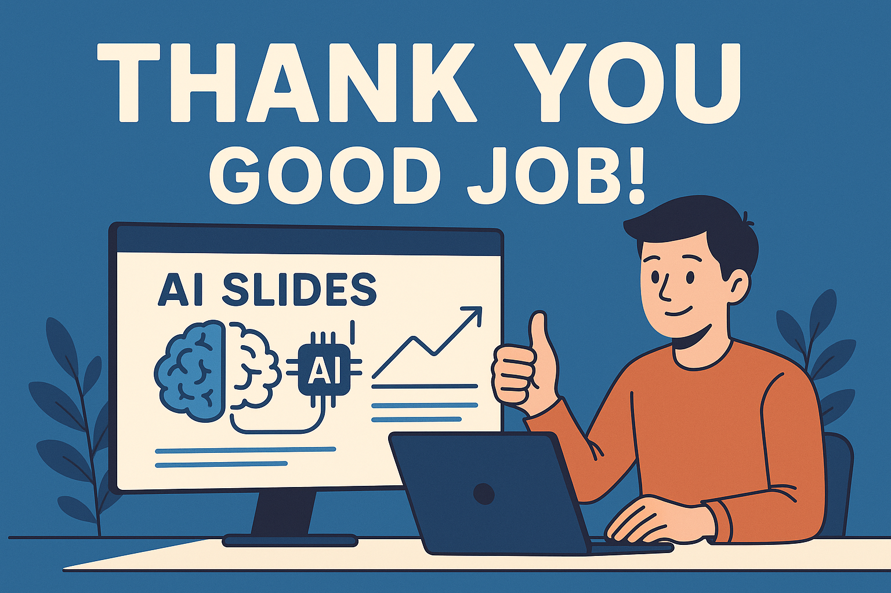
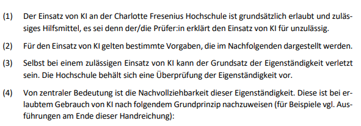
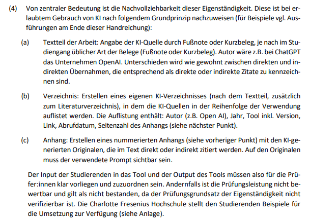
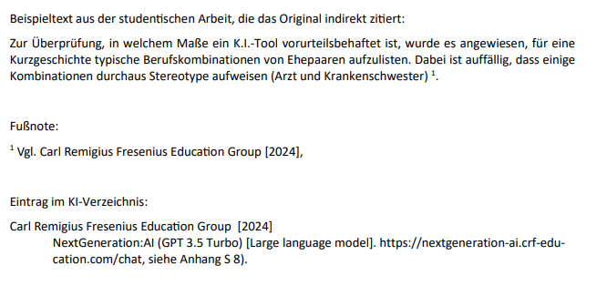
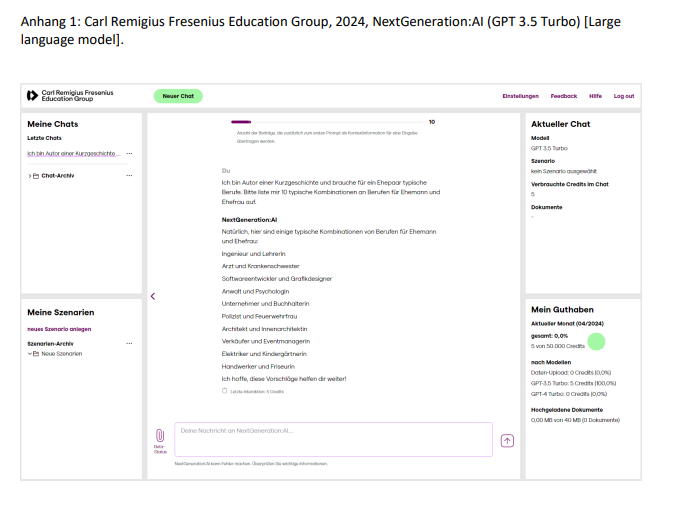

```{r setup, include=FALSE}
options(htmltools.dir.version = FALSE)

library(tidyverse)
library(kableExtra)
library(ggplot2)
library(plotly)
library(htmlwidgets)
library(MASS)
library(ggpubr)
library(xaringanthemer)
library(xaringanExtra)

style_duo_accent(
  primary_color = "#621C37",
  secondary_color = "#EE0071",
  link_color = "#7da5f5",
  background_image = "blank.png"
)

xaringanExtra::use_xaringan_extra(c("tile_view"))

knitr::opts_chunk$set(
  fig.retina = TRUE,
  warning = FALSE,
  message = FALSE
)
```

name: Title slide
class: middle, left
<br><br><br><br><br><br><br>
# Wissenschaftliches Arbeiten und Forschungsmethoden

### Einheit 12: Einsatz von künstlicher Intelligenz beim wissenschaftlichen Arbeiten
##### 08.07.2025 | Prof. Dr. Caroline Zygar-Hoffmann

---
class: top, left
<div class="footer"><span>Buck, I. (2025). Wissenschaftliches Schreiben mit KI (No. PUBDB-2025-01438). UVK Verlag. <br> Image created with ChatGPT (prompt: "I need a "thank you, good job"-image for my hilfskraft that created ai slides". OpenAI. (2025). ChatGPT (July 07 version) [Large language model]. chat.openai.com </span></div>

### Acknowledgement

.large[
.center[
**Vielen herzlichen Dank an Franziska Salzberger, die diesen Foliensatz entworfen hat!**

```{r eval = TRUE, echo = F, out.width = "60%"}

```
]
]
---
class: top, left
name: content
### Heutige Themen

#### [Künstliche Intelligenz: Relevanz und Begriffsklärung](#Relevanz) 

#### Herausforderungen im Umgang mit KI-Tools
* [Praktische Herausforderungen: Halluzinationen, Deskilling, Black-Box-Problem](#Herausforderungen1)
* [Ethische Herausforderungen: Biases, Ressourcenverbrauch](#Herausforderungen2)
* [Rechtliche Herausforderungen: Datenschutz, Urheberrecht](#Herausforderungen3)

#### [Gute wissenschaftliche Praxis beim Einsatz von KI-Tools](#BestPractice)

#### [Einsatzbereiche von KI-Tools beim wissenschaftlichen Arbeiten](#Einsatz)

#### [Praxisaufgabe](#Praxis)


---
class: top, left
name: Relevanz
<div class="footer"><span>Long, D., & Magerko, B. (2020, April). What is AI literacy? Competencies and design considerations. In Proceedings of the 2020 CHI conference on human factors in computing systems (pp. 1-16). <br> Mütterlein, J., Ranner, T., & Müller, M. (2024). Artificial Intelligence at Universities: Impact on Grades, Student Experience, and Teaching. München: Macromedia University of Applied Sciences. https://doi.org/10.56843/jm001tr002</span></div>

### Relevanz von KI-Kompetenz

**Studienbefund**  (Müttlerlein et al., 2024): Der erlaubte Einsatz von KI-Tools bei Hausarbeiten führt nicht automatisch zu besseren Noten oder höheren Bestehensquoten

**KI-Kompetenz umfasst (Long & Magerko, 2020):** 
* kritische Reflexion über Grenzen & Risiken von KI 
* effektive Interaktion & Zusammenarbeit mit KI

KI-Tools können beim wissenschaftlichen Arbeiten Denkprozesse **entlasten, unterstützen oder erweitern - aber nicht ersetzen**.


---
class: top, left

### Was ist Künstliche Intelligenz?

.pull-left[

**Künstliche Intelligenz**  

= Fähigkeit von Maschinen, menschenähnliche kognitive Funktionen (z.B. Sprache, Lernen) nachzuahmen

<br>
**KI-Systeme**  

= Algorithmen, die durch maschinelles Lernen Muster erkennen, aus Daten lernen und flexibel reagieren – aber ohne Bewusstsein

]

.pull-right[

**Generative KI**

erzeugt neue Inhalte (Text, Bild, Musik) auf Basis gelernter Wahrscheinlichkeiten
<br><br><br>
**Große Sprachmodelle (LLMs)**  
* erzeugen neue Texte durch Wahrscheinlichkeitsberechnungen  
* verarbeiten Sprache als Token, nicht als Bedeutung → semantisch blind  
* die meisten KI-Tools (ChatGPT, Poe, Claude, Copilot, Mistral etc.) basieren auf LLMs und sind direkt nutzbar ohne Programmierkenntnisse

]


---
class: top, left
name: Herausforderungen1

### Herausforderungen im Umgang mit LLMs

#### Praktische Herausforderungen: Zuverlässigkeit und Transparenz

**Halluzinationen** (Fehlinformationen) 
* LMM "erfindet" falsche Inhalte, wenn Muster nicht richtig vorhergesagt werden können
* Häufiger bei spezialisierten Themen ohne starke Basis im Trainingsmaterial des LMM
* Aber: kein Fehler im klassischen Sinne, LLMs funktionieren durch Mustererkennung, nicht durch Verstehen


**Black-Box-Problem**
* LLMs sind oft intransparent – selbst EntwicklerInnen verstehen die Prozesse nicht vollständig
* Je komplexer das Modell, desto geringer meist die Erklärbarkeit (Accuracy vs. Explainability)

---
class: top, left
<div class="footer"><span>Gerlich, M. (2025). AI Tools in Society: Impacts on Cognitive Offloading and the Future of Critical Thinking. <i>Societies</i>, 15(1), 6. https://doi.org/10.3390/soc15010006 
<br> Kosmyna, N., Hauptmann, E., Yuan, Y. T., Situ, J., Liao, X. H., Beresnitzky, A. V., Braunstein, I., & Maes, P. (2025). Your Brain on ChatGPT: Accumulation of Cognitive Debt when Using an AI Assistant for Essay Writing Task. arXiv preprint arXiv:2506.08872.<br> Zhang, S., Zhao, X., Zhou, T., & Kim, J. H. (2024). Do you have AI dependency? The roles of academic self efficacy, academic stress, and performance expectations on problematic AI usage behavior. International Journal of Educational Technology in Higher Education, 21, Article 34. https://doi.org/10.1186/s41239-024-00467-0  </span></div>


### Herausforderungen im Umgang mit LLMs

#### Praktische Herausforderungen: Kompetenzverlust

**Deskilling** 

Weniger Schreibpraxis → mögliche Abnahme sprachlicher & kognitiver Fähigkeiten, von kritischem Denken und Auseinandersetzung mit Fachinhalten

.pull-left[
* EEG-Studie: Vergleich von KI-Nutzung ja vs. nein für Essays (Kosmyna et al., 2025):
  - Texte mit KI-Unterstützung sind sich insgesamt ähnlicher (Inhalt, Struktur, Stil)
  - Neuronale Aktivierung und Konnektivität nimmt mit KI-Unterstützung systematisch ab (v.a. für semantische Verarbeitung und Monitoring-Prozesse)
  - Erinnerungsleistung und Subjektive Ownership an Texten mit KI-Unterstützung signifikant geringer
]

.pull-right[
.small[
_"AI tools, while valuable for supporting performance, may unintentionally hinder deep cognitive processing, retention, and authentic engagement with written material. If users rely heavily on AI tools, they may achieve superficial fluency but fail to internalize the knowledge or feel a sense of ownership over it"_ (Kosmyna et al., 2025, p. 138).
]
* Gefahr der Abhängigkeit, v.a. bei geringer Selbstwirksamkeit (Zhang et al., 2024)
* Negativer Zusammenhang von KI-Nutzung und Kritischem Denken (Gerlich, 2025)
]

---
class: top, left
name: Herausforderungen2
<div class="footer"><span> Bastian, M. (2024). KI-Boom in den USA könnte Kohleausstieg verzögern. https://the-decoder.de/ki-boom-in-den-usa-koennte-kohleausstieg-verzoegern/ <br> Crawford, K. (2024). Generative AI’s environmental costs are soaring – And mostly secret. <i>Nature</i>, 626(8000), 693–693. https://doi.org/10.1038/d41586-024-00478-x </span></div>

### Herausforderungen im Umgang mit LLMs

#### Ethische Fragen

**Bias** (Verzerrungen)
* LLMs reproduzieren Stereotype & Vorurteile aus ihren Trainingsdaten
* Trainingsbasis oft von „WEIRD“-Perspektiven dominiert → eingeschränkte Repräsentation 
*	Inhalte können diskriminierend oder problematisch sein → Verantwortung für Inhalte liegt stets bei uns Menschen, nicht bei der KI


**Ressourcenverbrauch**
*	Hoher Energie- & Wasserverbrauch, besonders beim Training & Betrieb großer Modelle
*	Einsatz ressourcenintensiver Hardware → problematische Rohstoffgewinnung
*	Teilweise verzögern Staaten (z.B. USA) Energiewende wegen KI-Strombedarf
*	Positivbeispiele: 
  - KI zur Klimafolgenprognose oder Prozessoptimierung
  - Maßnahmen: energieeffizientere Modelle, grüne Rechenzentren

---
class: top, left
name: Herausforderungen3

### Herausforderungen im Umgang mit LLMs

#### Rechtliche Fragen

**Datenschutz**
*	Nutzung von KI-Tools (z.B. via SSO) kann zu umfassendem Datenprofiling führen.
*	Tipps: 
  - Datenschutzrichtlinien prüfen
  - Chatverlauf deaktivieren
  - Keine personenbezogenen oder vertraulichen Daten eingeben
  - falls möglich: lokal gehostete Tools nutzen (siehe [NextGen:AI in studynet](https://studynet.hs-fresenius.de/goto_STUDYNETHSF_lti_25984.html))

**Urheberrecht**
*	Verwendung von Literaturanalyse-tools (z.B. ChatPDF): Nutzungsrechte an hochgeladenen PDFs werden z.B. zu Trainingszwecken übertragen 
* Tipps:
  - Rechtssicher: lokale Modelle (z.B. LM Studio) oder Tools wie MS Edge Copilot ohne Cloudbindung nutzen
  - PDF-Upload nur mit Nutzungsrechten und ohne vertrauliche Inhalte

---
class: top, left
name: Einsatz

### Einsatzbereiche von KI-Tools beim wissenschaftlichen Arbeiten

#### Szenario 1: Vollständige Aufgabenübernahme

Kann ich für meine Hausarbeit einen Abstract generieren lassen und diesen direkt übernehmen?

Beispiele: 
* Paraphrasieren von Texten ohne Lektüre
* Übernahme ungeprüfter KI-Ausgaben als eigene Argumente
* Übernahme von KI-generierten Rechercheergebnissen

.pull-left[
**Pro:** größtmögliche Zeitersparnis
]

.pull-right[
**Risiko:** Verlust von kritischem Denken, Fachsozialisation, eigenem Wissensaufbau, Verlust der Eigenständigkeit an der Prüfungsleistung
]


**Fazit:** Kein Erkenntnisgewinn → Verfehlt Zweck wissenschaftlichen Arbeitens

---
class: top, left

### Einsatzbereiche von KI-Tools beim wissenschaftlichen Arbeiten

#### Szenario 1: Vollständige Aufgabenübernahme

siehe [Handreichung der CFH](https://studynet.hs-fresenius.de/ilias.php?baseClass=ilLinkResourceHandlerGUI&ref_id=36244&cmd=calldirectlink):

.pull-left[
```{r eval = TRUE, echo = F}

```
]

.pull-right[
```{r eval = TRUE, echo = F}
knitr::include_graphics("bilder/chatgpt1.PNG")
```
]
---
class: top, left
name: Einsatzmöglichkeiten2

### Einsatzbereiche von KI-Tools beim wissenschaftlichen Arbeiten

#### Szenario 2: Auslagerung wenig anspruchsvoller Teilaufgaben

Beispiele: 
* Sprachliche Korrekturen & Stilüberarbeitung
* Vereinheitlichung von Zitation & Formatierungen
* Erstellen von Tabellen oder Gliederungen nach Vorlage

#### Szenario 3: Unterstützung bei anspruchsvollen Aufgaben

Beispiele: 
* Ideenfindung & Überwindung von Schreibblockaden
* Textfeedback & Überprüfung auf Argumentationslücken
* Einstieg in Literaturrecherche 
* Hilfe beim Verständnis / Interpretation von statistischen Modellen (kritisch hinterfragt mit dem eigenen Wissen!)
* Aufdecken von Fehlern

---
class: top, left
<div class="footer"><span> DFG. (2023). Stellungnahme des Präsidiums der Deutschen Forschungsgemeinschaft (DFG) zum Einfluss generativer Modelle für die Text- und Bilderstellung auf die Wissenschaften und das Förderhandeln der DFG. https://www.dfg.de/resource/blob/289674/ff57cf46c5ca109cb18533b21fba49bd/230921-stellungnahme-praesidium-ki-ai-data.pdf </span></div>

### Was gibt es für eine gute wissenschaftliche Praxis zu beachten?

#### Wissenschaftsethische Grundhaltung von Transparenz und Verantwortung

Stellungnahme der Deutschen Forschungsgesellschaft (DFG, 2023)
* Forschende tragen volle Verantwortung, auch bei KI-Unterstützung
*	Verantwortung = kritische Distanz, Offenlegung der Quellen & Methoden
*	Täuschung durch „verschleierten“ KI-Einsatz widerspricht wissenschaftlicher Redlichkeit
*	KI darf nicht als (Ko-)Autor genannt werden

---
class: top, left
name: BestPractice2

### Was gibt es für eine gute wissenschaftliche Praxis zu beachten?

#### Transparenz, Dokumentation, und Zitation

* 1:1 Nutzung und daher direkte Zitation von KI-Textausgaben ist umstritten (prinzipiell an der CFH erlaubt)
* Indirekte Zitation (d.h. sinngemäße Wiedergabe) ist weniger umstritten

.pull-left[
Generell gilt:
* Einsatz dokumentieren, Transparenz im Methodenkapitel oder in Fußnoten herstellen ("KI-Tool XXX wurde im Rahmen dieser ARbeit benutzt, um YYY")
*	Eigenleistung muss überwiegen – KI als Hilfsmittel, nicht als Textgenerator
* Vor Beginn einer wissenschaftlichen Arbeit abklären, ob Regelungen der Institution / der Betreuungsperson vorliegen (siehe [Handreichung der CFH](https://studynet.hs-fresenius.de/ilias.php?baseClass=ilLinkResourceHandlerGUI&ref_id=36244&cmd=calldirectlink))
]

.pull-right[
```{r eval = TRUE, echo = F}

```
]


---
class: top, left

### Was gibt es für eine gute wissenschaftliche Praxis zu beachten?

#### Kann ich KI im Sinne eines transparenten Umgangs zitieren?

.pull-left[
```{r eval = TRUE, echo = F}

```
]

.pull-right[
```{r eval = TRUE, echo = F}

```
]

---
class: top, left
name: Einsatzmöglichkeiten1

### Welche Tools kann ich wann beim wissenschaftlichen Arbeiten einsetzen?

Disclaimer: Die folgenden Tools sind überwiegend nicht durch mich getestet, und manche kostenpflichtig (selbst wenn ich es nicht explizit gekennzeichnet habe)

#### 1. Vor Beginn des wissenschaftlichen Arbeitens 

.pull-left[
**Selbstreflexion über KI-Einsatz**
* Steigert KI meine Produktivität – oder erhöht sie die Komplexität unnötig?
*	In welchem Verhältnis stehen Kosten und Nutzen der KI-Nutzung?
*	Unterstützt mich KI beim Denken – oder behindert sie kreatives, eigenständiges Arbeiten?

**Planung & Zeitmanagement**
* [Reclaim](https://reclaim.ai/)
* [BeforeSunset AI](https://www.beforesunset.ai/) (kostenpflichtig)
]

.pull-right[
**Tool-Suchmaschinen**
* [Futurepedia](https://www.futurepedia.io/ai-tools) oder [There's an AI for that](https://theresanaiforthat.com/) 
*	Die Auswahl sollte immer auf Basis des konkreten Bedarfs und Arbeitsziels erfolgen
* Besprochene Herausfoderungen im Kopf behalten!
<br><br>

**Forschungsfrage hinterfragen und präzisieren**
* Sparring mit Chatbots wie ChatGPT oder Claude
]

---
class: top, left
name: Einsatzmöglichkeiten1

### Welche Tools kann ich wann beim wissenschaftlichen Arbeiten einsetzen?

#### Forschungsfrage hinterfragen und präzisieren

**Beispielprompt**
„Du sollst mir dabei helfen, meine Forschungsfrage zu hinterfragen und zu präzisieren. Ich möchte die Arbeit gerne zum Thema [THEMA] schreiben. Folgende Ideen habe ich dazu schon: [IDEEN]. Erstelle mir nun eine thematisch sortierte Mind Map, die meine Ideen grafisch strukturiert darstellt. Führe außerdem nicht nur die Facetten des Themas an, die ich aufgezeigt habe, sondern ergänze um weitere Facetten. Was könnte ich präzisieren? Wie finde ich heraus bei welcher Frage es noch Forschungsbedarf gibt? Folgende Einschränkungen habe ich bei der Durchführung der Studie: ...“

**Arbeit mit einem auf Mind Maps spezialisierten GPT**
z.B. GPT Mind Map Maker als Applikation in ChatGPT

---
class: top, left

### Welche Tools kann ich wann beim wissenschaftlichen Arbeiten einsetzen?

####2. Literaturarbeit

.pull-left[
**Literatursuche und -analyse**
* [Elicit](https://elicit.com/)
* [Consensus](https://consensus.app/)
* [ORKG Ask](https://ask.orkg.org/de/search)

**Übersicht über Themenkomplexe und Artikelvorschläge**
* [Keenious](https://keenious.com/landing)
* [STORM](https://storm.genie.stanford.edu/)
]

.pull-right[
**Visualisierung von Zitationsnetzwerken**
* [ResearchRabbit](https://www.researchrabbit.ai/)
* [Open Knowledge Maps](https://openknowledgemaps.org/)
* [Litmaps](https://www.litmaps.com/)

**Kontextualisierte Recherchen mit Prompting**
* [Undermind](https://www.undermind.ai/)
* [GoogleNotebookLM](https://notebooklm.google/) -> ermöglicht auch die Erstellung von PodCasts zu Papern
]

---
class: top, left

### Welche Tools kann ich wann beim wissenschaftlichen Arbeiten einsetzen?

####2. Literaturarbeit

**!! ABER: Grenzen der KI-gestützten Literaturarbeit beachten !!** 
* Begrenzter Zugang zu Datenquellen
* Fehlende Qualitätsprüfung
* Intransparente Auswahlmechanismen
* Illusion von Vollständigkeit
* Falsche Wiedergabe von Studien
* Falsche Quellen

→ **IMMER vorgeschlagene Artikel selbst recherchieren und lesen, bevor sie Eingang in die Arbeit finden**

---
class: top, left

### Welche Tools kann ich wann beim wissenschaftlichen Arbeiten einsetzen?

####3. Datenauswertung und Analyse

**Transkription von Interviewmaterial**
* [MAXQDA AI Assist](https://www.maxqda.com/de/produkte/ai-assist) (kostenpflichtig)
* [Atlas.ti](https://atlasti.com/de) (kostenpflichtig)
* z.T. auch für qualitative Analyse, darf es allerdings auch hier nicht die eigene Analyse ersetzen

**Datenbereinigung**
* es gibt Tools wie [DataSquirrel](https://datasquirrel.ai/), aber da Nachvollziehbarkeit in Gefahr → nicht nutzen! Datenvorverarbeitung muss komplett in R reproduzierbar sein. 

**Code-Generierung für R, SPSS, STATA etc.**
* z.B. ChatGPT, GitHub Copilot 
* **erfordert Fachwissen zur Validierung!**

**Nochmal der Hinweis: Roh-Daten (insbesondere nicht-anonymisierte) auf keinen Fall bei einer AI hochladen (Datenschutz)!**

---
class: top, left

### Welche Tools kann ich wann beim wissenschaftlichen Arbeiten einsetzen?

####4. Schreiben und Überarbeiten von Rohfassungen

**Rohtext-Erstellung mit KI-Tools als Grundlage – nicht als Endfassung!**
*	Generierung von Stichpunkten
*	Strukturieren von Materialsammlungen 

**Inhaltliche Überarbeitung**
*	Geeignet für: Identifikation von Redundanzen, logischen Widersprüchen, irrelevanten Passagen
* Ungeeignet für: Identifikation von Informationslücken, Prüfung fachlicher Korrektheit

**Stilistische Überarbeitung**
*	Erkennung von Rechtschreib-, Grammatik- und Stilfehlern
*	Vorschläge zur Kürzung, Umformulierung, Präzisierung
* KI-Tools wie [DeepL Write](https://www.deepl.com/de/write) oder [LanguageTool](https://languagetool.org/de)

---
class: top, left

### Welche Tools kann ich wann beim wissenschaftlichen Arbeiten einsetzen?

#### Worauf sollte ich beim Prompting achten?

**Iteratives Vorgehen: Prompten – prüfen – nachbessern**
*	So viel Kontext wie möglich: Rolle, Textsorte, Stil, Zielgruppe, Ziel, Format (z.B. "Ich schreibe eine wissenschaftliche Arbeit über eine durchgeführte Studie im Rahmen meines Psychologie-Studiums.")

| **Prüfungsrechtlich problematisch / Ethisch bedenklich**                                   | **Prüfungsrechtlich / Ethisch unbedenklich**                                                                 |
|----------------------------------------------------------|-----------------------------------------------------------------------------------------------------------|
| „Schreibe mir meine Einleitung für eine Studie zum Thema Social Media Konsum und Selbstbild.“                         | „Welche psychologischen Theorien könnte ich in der Einleitung zum Thema Social Media Konsum und Selbstbild behandeln?“                                                  |
| „Schreibe mir die komplette Diskussion.“                 | „Ich habe folgende Studie durchgeführt und mir folgende Limitationen überlegt. Welche weiteren wichtigen Limitationen habe ich übersehen?“                             |
| „Schreibe mir meinen Abstract.“                        | „Welche Elemente sollte mein Abstract beinhalten?“                                     |

---
class: top, left

### Welche Tools kann ich wann beim wissenschaftlichen Arbeiten einsetzen?

#### Worauf sollte ich beim Prompting achten?

| **Prüfungsrechtlich problematisch / Ethisch bedenklich**                                   | **Prüfungsrechtlich / Ethisch unbedenklich**  
|----------------------------------------------------------|-----------------------------------------------------------------------------------------------------------|
| „Fasse diesen Fachtext komplett für mich zusammen.“      | „Ich verstehe folgenden Absatz in dem Paper nicht. Kannst du ihn mir erklären, und dabei nah am Text bleiben, so dass ich Deine Erklärung überprüfen kann?“                   |
| „Belege mir das.“                                        | „Mit welchen Schlagwörtern könnte ich nach Literatur zu diesem Thema suchen?“                            |
| „Generiere mir ein vollständiges Literaturverzeichnis.“  | „Hier mein Literaturverzeichnis. Fallen die Fehler nach APA Zitationsregeln auf? Bitte erkläre mir was fehlt/falsch ist, und wo ich die fehlende Information finde/wie ich den Fehler verbessere. Ich kümmere mich selbst um die Ergänzung/Verbesserung.“                                        |

---
class: top, left

### Welche Tools kann ich wann beim wissenschaftlichen Arbeiten einsetzen?

#### Worauf sollte ich beim Prompting achten?

| **Prüfungsrechtlich problematisch / Ethisch bedenklich**                                   | **Prüfungsrechtlich / Ethisch unbedenklich**  
|----------------------------------------------------------|-----------------------------------------------------------------------------------------------------------|
| „Erstelle mir einen Code zur Datenbereinigung & führ ihn auf den angehängten Daten aus.“ | „Ich habe folgendes präregistriert: Auch unvollständige Daten werden genutzt, wenn alle Daten vorliegen um eine Analyse zu rechnen. Für meine Analyse brauche ich vollständige Daten auf den Variablen X, Y und Z: Welcher R-Code reduziert mir meinen Datensatz auf diese Bedingung? Bitte erkläre mir jede Code-Zeile und nenne mir auch eine Möglichkeit mit der ich verifizieren kann, dass Dein Code richtig funktioniert.“           |
| „Analysiere mir die Daten und gib mir das Ergebnis.“     | „Ich habe einen Datensatz mit den Variablen X, Y und z Kannst du mir in R zeigen, wie ich eine Korrelationsmatrix berechne und diese visuell darstelle? Bitte erkläre mir die Schritte, damit ich sie nachvollziehen und prüfen kann.“|
| „Visualisiere mir mein Regressionsergebnis.“     | „Ich nutze folgenden Code zur Visualisierung, aber die y-Achse ist nicht richtig skaliert. Wie kann ich sie bei 0 beginnen lassen?“|

---
class: top, left
name: Praxis

### Praxisaufgabe

**Schritt 1: Besprechen Sie inwiefern Sie in der Gruppe bereits KI genutzt haben, und wie Sie dies kennzeichnen können/müssen**

**Schritt 2: Suchen Sie sich einen Bereich raus, für den Sie KI nutzen können, um effektiver zu arbeiten** 
* Diskutieren Sie in Ihrer Kleingruppe wo die Grenze bei dieser Nutzung zwischen ethischer Unbedenklichkeit und prüfungsrechtlicher Problematik besteht (im Zweifel bei mir nachfragen)
* Tauschen Sie sich über Ihre Erfahrungen im Umgang mit KI in diesem Bereich aus

**Schritt 3: Suchen Sie sich ein Tool raus, das Sie noch nicht kennen und probieren Sie es aus**
* Ich empfehle GoogleNotebookLM

<!-- library(renderthis)  -->
<!-- to_pdf("WissArb_12_KI.Rmd", complex_slides = TRUE) -->
