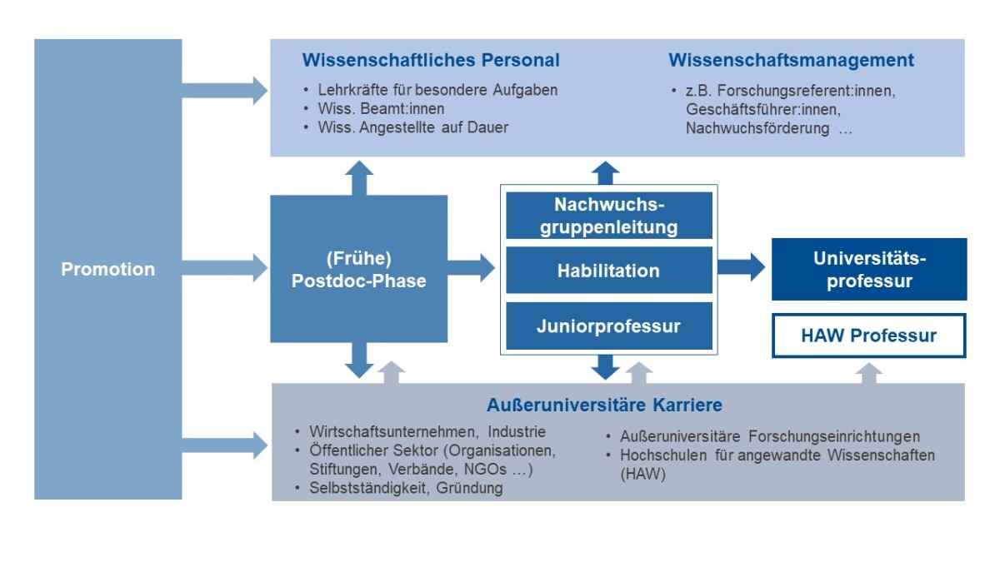
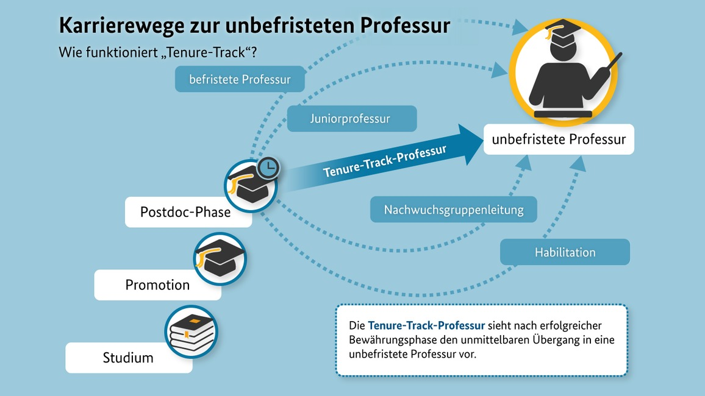

```{r setup, include=FALSE}
options(htmltools.dir.version = FALSE)

library(tidyverse)
library(kableExtra)
library(ggplot2)
library(plotly)
library(htmlwidgets)
library(MASS)
library(ggpubr)
library(xaringanthemer)
library(xaringanExtra)

style_duo_accent(
  primary_color = "#621C37",
  secondary_color = "#EE0071",
  background_image = "blank.png"
)

xaringanExtra::use_xaringan_extra(c("tile_view"))

# use_scribble(
#   pen_color = "#EE0071",
#   pen_size = 4
#   )

knitr::opts_chunk$set(
  fig.retina = TRUE,
  warning = FALSE,
  message = FALSE
)
```

name: Title slide
class: middle, left
<br><br><br><br><br><br><br>
# Wissenschaftliches Arbeiten und Forschungsmethoden

### Einheit 12: Das Wissenschaftssystem und gute wissenschaftliche Praxis
##### 18.01.2024 | Dr. Caroline Zygar-Hoffmann

---
class: top, left
name: content

### Heutige Themen

#### [Lehrevaluation](#eval)

#### [Gute wissenschaftliche Praxis](#wissprax)

#### [Das Wissenschaftssystem](#wisssys)

#### [Praxis](#praxis)

#### [Feedback-Übung](#uebung)

---
class: top, left
name: eval

### Lehrevaluation

.center[
**"Die Studierenden finden die jeweils individuell freigeschalteten Evaluationen im studynet"**

```{r eval = TRUE, echo = F, out.width="80%"}
knitr::include_graphics("bilder/eval.png")
```
]

---
class: top, left
name: wissprax
<div class="footer"><span>Kapitel 4.2.1 in Döring, N. & Bortz, J. (2016). Forschungsmethoden und Evaluation in den Sozial- und Humanwissenschaften. Pearson. </span></div>

### Gute wissenschaftliche Praxis

.pull-left[
1) **Arbeiten nach den "Regeln der Wissenschaft" ("lege artis")**
- Anwendung üblicher wissenschaftlicher Methoden, gemäß dem "state of the art" (was Theorien, Methoden und Analysen angeht)
- Einhaltung der wissenschaftlichen Gütekriterien

2) **(Selbst-)kritische Reflexion von Forschungsergebnissen**
- keine Überinterpretation
- Verweis auf Limitationen
- Überprüfung durch peer-review Prozess, als Reviewer keine Gefälligkeitsreviews oder Reviews außerhalb des eigenen Kompetenzbereichs machen
- keine Interessenskonflikte oder transparenter Hinweis, wenn es welche gibt 
]

.pull-right[
3) **Sicherung von Primärdaten für mindestens 10 Jahre unter Wahrung des Datenschutzes**

4) **Kennzeichnung der Beiträge von Kooperationspartnern, Konkurrenten, Vorgängern in der eigenen Arbeit**
- angemessene Autorenschaftsregeln, keine Ehrenautorenschaften, kein Ghostwriting
- Korrekte Zitation, kein Plagiarismus

5) **Keine Sabotage von Forschungsarbeiten**
]

---
class: top, left
<div class="footer"><span>Kapitel 4.2.4 in Döring, N. & Bortz, J. (2016). Forschungsmethoden und Evaluation in den Sozial- und Humanwissenschaften. Pearson. </span></div>

### Gute wissenschaftliche Praxis

**Wissenschaftliche Autorenschaft**

* alle an der jeweiligen Studie sowie dem veröffentlichen Paper **maßgeblich** beteiligten Personen sollten ein Recht auf Autorenschaft haben $\rightarrow$ frühzeitige Absprachen treffen

* "Mitglieder des Forschungsteams, die nur kleine Teilarbeiten im Rahmen der Studie geleistet, aber nicht an der Publikation direkt mitgewirkt haben (z.B. studentische Hilfskräfte, die unter Anleitung die Datenerhebung, die Datenaufbereitung, und/oder die Datenauswertung), sind gemäß APA-Richtlinien keine Mitautoren (APA, 2009)" (Döring & Bortz, S. 136f) $\rightarrow$ **Acknowledgments**

* Abschlussarbeiten **können** bei entsprechender Qualität veröffentlicht werden $\rightarrow$ "Je nach Umfang der Betreuungsleistung einerseits und eigenständigen Arbeit der Studierenden andererseits sowie je nach Arbeitsanteil beim Schreiben des Manuskriptes kann das Spektrum reichen von studentischer Erstautorschaft, Mitautorschaft bis zu keiner Autorschaft (Fine & Kurdek, 1993)." (Döring & Bortz, S. 137)

* Besondere Rolle von Erstautor:in und Letztautor:in
  - Erstautor:innen sind i.d.R. für die Verfassung des Manuskript-Erstentwurfs verantwortlich
  - Erstautor:innen fungieren als Kontaktperson ("corresponding author") gegenüber der Zeitschrift und stellen die Einhaltung der Regeln guter wissenschaflticher Praxis sicher
  - Letztautor:innen sind in der Psychologie i.d.R. in einer betreuenden bzw. supervidierenden Rolle
  
---
class: top, left
<div class="footer"><span>https://credit.niso.org/ </span></div>

### Gute wissenschaftliche Praxis

**Wissenschaftliche Autorenschaft**

CRediT: Taxonomie mit 14 Rollen, die ein:e Autor:in im wissenschaftlichen Publikationsprozess einnehmen kann

.center[
```{r eval = TRUE, echo = F, out.width = "55%"}
knitr::include_graphics("bilder/credit.png")
```
]

---
class: top, left
<div class="footer"><span>Lakens, D. (2014). Performing high-powered studies efficiently with sequential analyses. European Journal of Social Psychology, 44, 701–710. doi:10.1002/ejsp.2023</span></div>

### Gute wissenschaftliche Praxis

**Ethische Prinzipien berücksichtigen** 

* Auswirkungen von Forschung auf Proband:innen und Gesellschaft?

* verantwortungsvoller Umgang mit Forschungsgeldern durch ressourcenschonende, zielführende Forschung (z.B. durch ausreichende Power, sequentielle Designs) 

  - Sequentielle Designs erlauben während der Datenerhebung in die Daten reinzuschauen = "optional stopping", um zu prüfen ob bereits ausreichend Evidenz vorhanden ist um eine Hypothese zu evaluieren (indem z.B. verschiedene Alpha-Niveaus herangezogen werden $\rightarrow$ wenn es richtig gemacht wird, dann keine questionable research practice)

.center[
```{r eval = TRUE, echo = F, out.width = "55%"}
knitr::include_graphics("bilder/sequentielle_designs.png")
```
]


---
class: top, left
name: wisssys

### Das Wissenschaftssystem

**Der Weg zur Publikation** 

.pull-left[
1) **Auswahl eines Journals** nach thematischer Passung, Länge des Artikels, Qualität des Journals (auch: Unterstützung von Open Science), Augen offen halten für "Call for Papers" zu spezifischem Themen ( $\rightarrow$ "Special Issues" der Journals zu bestimmtem Thema)

2) **Sichtung und Umsetzung der "Author Guidelines"**: Hinweise zu Artikelformaten, geforderten Elementen, Formatierung, Länge, ggf. Verblindung gegenüber Reviewern (d.h. dass im Manuskript nicht kenntlich ist, wer der/die Autor:innen des Artikels sind)

3) **Aufsetzen des "Cover Letters"**: Anschreiben an den Editor mit kurzer Vorstellung des Manuskripts und ggf. ergänzenden Hinweisen
]

.pull-right[
4) **Einreichung im Journal Submission Portal**: Eingabe von Informationen zu Autor:innen, Bestätigung guter wissenschaftlicher Praxis, Hochladen von Dateien, ggf. Vorschlag von Reviewern

5) **Auf die Entscheidung warten (kann sehr unterschiedlich lange dauern)**: 
  * "desk-reject" (direkte Ablehnung durch den Editor, meist innerhalb weniger Tage) oder 
  * "under (peer-)review" (Anzahl an Reviewern unterschiedlich, häufig 2, + meist separates Review durch den Editor, meist innerhalb von mehreren Wochen bis Monaten) 
  * Nach Einreichung / während man auf eine Entscheidung wartet, darf das Manuskript bei keinem anderen Journal zur Begutachtung vorliegen
]

---
class: top, left

### Das Wissenschaftssystem

**Peer-Review**

* Beim peer-review begutachten Wissenschaftler mit Expertise zu der Forschungsarbeit (inhaltlich oder methodisch) das Manuskript

* Entscheidungen nach dem Peer-Review: 
  - Rejection
  - Revise and resubmit: Major revision
  - Revise and resubmit: Minor revision
  - Acceptance pending minor revisions
  - Acceptance

---
class: top, left

### Das Wissenschaftssystem

**Peer-Review**

* Wenn es keine Rejection ist: 
  - Innerhalb einer bestimmten Frist Überarbeitung des Manuskripts $\rightarrow$ Verlängerung der Frist kann beim Editor beantragt werden
  - Darlegung wie auf die Reviews eingegangen wurde im "response letter" (Reviewer-Kommentare Punkt-für-Punkt aufführen und beantworten, d.h. Änderungen darlegen und nachvollziehbar im Manuskript kennzeichnen) 
  - Nach resubmission wird es ggf. nochmal an (meist dieselben) Reviewer geschickt, manchmal entscheidet auch der Editor direkt (eher nur bei minor revisions)

* Bei Annahme des Artikels, ist der Artikel "in press" (d.h. wird für die Veröffentlichung vorbereitet) $\rightarrow$ Korrespondenz mit den "copy editors" des Journals (welche das Manuskript layouten und ggf. sprachlich checken) zur Abstimmung der "Druck"freigabe


---
class: top, left
<div class="footer"><span>Brembs, B., Button, K., & Munafò, M. (2013). Deep impact: unintended consequences of journal rank. Frontiers in human Neuroscience, 291. <br>Fraley, R. C., & Vazire, S. (2014). The N-pact factor: Evaluating the quality of empirical journals with respect to sample size and statistical power. PloS one, 9(10), e109019. <br>Lariviere, V., Kiermer, V., MacCallum, C. J., McNutt, M., Patterson, M., Pulverer, B., Swaminathan, S., u.a. (2016). A simple proposal for the publication of journal citation distributions. bioRxiv, 062109. doi:10.1101/062109 <br>Szucs, D., & Ioannidis, J. P. (2017). Empirical assessment of published effect sizes and power in the recent cognitive neuroscience and psychology literature. PLoS biology, 15(3), e2000797.
</span></div>

### Das Wissenschaftssystem

**Impact Factor und seine Probleme**

.pull-left[
* Impact Factor = jährliche mittlere Anzahl der Zitationen von Aritkeln, die in den letzten 2 Jahren in einem Journal publiziert wurden

* Fraley & Vazire (2014); Szucs & Ioannidis (2017): Höherer JIF hängt mit geringerer statistischer Power/Stichprobengröße der dort publizierten Studien zusammen

* Brembs, Button, & Munafò (2013): Höherer JIF hängt mit einer höheren Rate an Retractions (Zurückziehen eines Artikels) zusammen
]

.pull-right[
```{r eval = TRUE, echo = F}
knitr::include_graphics("bilder/JIF.png")
```
]


---
class: top, left

### Das Wissenschaftssystem

**Konferenzen in der Psychologie**

* Vernetzung unter Kolleg:innen und Austausch zu wissenschaftlichen Ergebnissen

* Häufig mehrere parallele "Sessions", d.h. mehrere parallele Vorträge in unterschiedlichen Räumen

* Häufige Beitragsformen:
  - **Einzel-Vorträge** (meist ca. 10-20 Minuten), d.h. ein alleinstehender Vortrag zu einem Forschungsthema
  - **Beitrag in einem Symposium** (meist ca. 10-20 Minuten), d.h. ein Vortrag der inhaltlich zu anderen Vorträgen passt mit ggf. abschließendem Diskussion der Vorträge durch einen Diskutanten
  - **Keynote-Vortrag** (meist ca. 60 Minuten), d.h. ein zentraler Vortrag während der Konferenz während dem keine anderen Vorträge stattfinden; hierfür wird man angefragt/eingeladen
  - **Poster-Präsentation** (meist ca. 30-60 Minuten), d.h. Ausdruck eines Posters auf DinA0 oder DinA1 auf dem Forschungsergebnisse visualisiert und beschrieben sind, während einem extra Zeitslot während der Konferenz unterhält man sich darüber mit einzelnen Konferenzteilnehmer:innen (die das Poster aufgesucht haben)
  
* Beitragseinreichung in Form eines Abstracts (in anderen Disziplinen sind tlws. ganze Manuskripte üblich)

* Zu inhaltlichen Hinweisen zur Vorbereitung auf eine Konferenz vgl. Kapitel 13.2 in Döring & Bortz (2016)

---
class: top, left
name: wisssys
<div class="footer"><span>https://www.uni-due.de/gcplus/de/doc_karrierewege.php</span></div>

### Das Wissenschaftssystem

**Karrierepfade**

.center[
```{r eval = TRUE, echo = F, out.width="80%"}

```
]

---
class: top, left
<div class="footer"><span>https://www.bmbf.de/bmbf/de/forschung/wissenschaftlicher-nachwuchs/das-tenure-track-programm/das-tenure-track-programm.html</span></div>

### Das Wissenschaftssystem

**Karrierepfade**

.center[
```{r eval = TRUE, echo = F, out.width="75%"}

```
]

---
class: top, left
name: praxis

### Praxis

Sie sollen sich ähnlich dem Peer-Review innerhalb Ihrer Kleingruppe gegenseitig Feedback zu Ihren Texten geben.

**Formal**: Korrekte Rechtschreibung, Grammatik, Zeichensetzung? Korrekt zitiert? Statistische Darstellung korrekt? Literaturverzeichnis korrekt?

**Sprachlich-stilistisch**: Ist der Satzbau verständlich? Ist die Formulierung präzise? Ist die Zeitform korrekt? Gibt es unnötige Füllwörter?

**Inhaltlich - unspezifisch**: Ist der rote Faden zu erkennen? Gibt es Überflüssiges? Ist die Darstellung sachlich neutral? Werden Begriffe korrekt eingeführt und erläutert? Ist die Argumentation logisch und nachvollziehbar? Werden Behauptungen belegt? Kann auf Links zum OSF zugegriffen werden? Ist dort alles Geforderte vorhanden? **Verstehen Sie, was Ihr:e Kommilitone:in Ihnen sagen möchte?**

**Inhaltlich - spezifisch**: Nehmen Sie sich den Bewertungsbogen vor: Sind die bewerteten Elemente entsprechend der Beschreibung im Bewertungsbogen vorhanden? 

$\rightarrow$ **Am Ende sollen alle mit der abzugebenden Version einverstanden sein!**

---
class: top, left

### Praxis

Wie geben Sie das Feedback:

* Sie können das RMarkdown als Word-Dokument "knitten", und dann darin Feedback geben $\rightarrow$ manueller Übertrag ins RMarkdown nötig (eine alternative technische Lösung wäre das package *trackdown*: https://cran.r-project.org/web/packages/trackdown/vignettes/trackdown-workflow.html)

* **Geben Sie Ihr Feedback konkret auf einen Absatz/Satz bezogen, mit einem konstruktiven (Alternativ-)Vorschlag**
* **Erklären Sie** warum Sie denken, dass eine Alternative besser wäre / etwas fehlt (z.B. an welcher Stelle Sie als Leser verwirrt wurden, oder Fragen offen blieben, oder warum es missverständlich sein könnte, o.ä.)
* **Bleiben Sie im Ton wertschätzend!** Selbst wenn Ihnen der Text nicht gefällt, steckt Arbeit dahinter. Helfen Sie dabei, wie es Ihr:e Kommilitone:in Ihrer Ansicht nach besser machen kann.

* Arbeiten Sie vorwiegend mit der Kommentar-Funktion, und nutzen Sie die Überarbeiten-Funktion von Word direkt im Text z.B. nur für formale Fehler $\rightarrow$ Es ist nicht Ihr Text, sondern der Ihres:r Kommilitonen:in! 

* Wenn Sie als Autor:in des Textes den Vorschlag eines:r Kommilitonen:in nicht annehmen möchten, sprechen Sie das an. **Finden Sie gemeinsam eine Lösung, mit der alle einverstanden sind.**

* Wenn es zu einem Konflikt kommen sollte, melden Sie sich bei mir, und ich helfe.

---
class: top, left

### Feedback-Übung (über Gruppen hinweg)

* Die meisten von Ihnen haben (hoffentlich) an den Studien Ihrer Kommiliton:innen teilgenommen

* Die Erfahrung die Sie als Proband:in gemacht haben, ist wertvoll für Ihre Komiliton:innen

* In Kleingruppen: Jede/r erklärt kurz die eigene Studie (Forschungsfrage, Analyse, 2-3 Minuten), danach geben die anderen Feedback:
  - Wie haben Sie die Teilnahme an der Studie erlebt?
  - War etwas unklar? z.B. Instruktionen
  - Gab es Fragen/Items, die schwer beantwortbar waren? 
  - Welche Limitationen am Studiendesign, der Analyse fallen Ihnen auf? Was sind Einflussfaktoren/Störfaktoren, die ggf. unberücksichtigt bleiben, die die Aussagekraft der Ergebnisse schmälert?
  - Kennen Sie ggf. Literatur, Theorien, o.ä. die zur Forschungsfrage passen?


<!-- library(renderthis) -->
<!-- to_pdf("WissArb_12_Wissenschaftssystem.Rmd", complex_slides = TRUE) -->
