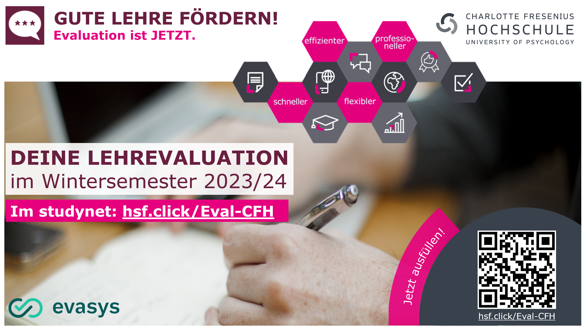

```{r setup, include=FALSE}
options(htmltools.dir.version = FALSE)

library(tidyverse)
library(kableExtra)
library(ggplot2)
library(plotly)
library(htmlwidgets)
library(MASS)
library(ggpubr)
library(xaringanthemer)
library(xaringanExtra)

style_duo_accent(
  primary_color = "#621C37",
  secondary_color = "#EE0071",
  background_image = "blank.png"
)

xaringanExtra::use_xaringan_extra(c("tile_view"))

# use_scribble(
#   pen_color = "#EE0071",
#   pen_size = 4
#   )

knitr::opts_chunk$set(
  fig.retina = TRUE,
  warning = FALSE,
  message = FALSE
)
```

name: Title slide
class: middle, left
<br><br><br><br><br><br><br>
# Wissenschaftliches Arbeiten und Forschungsmethoden

### Einheit 14: Freie Spitze und Fragen
##### 01.02.2024 | Dr. Caroline Zygar-Hoffmann

---
class: top, left
name: content

### Heutige Themen

#### [Lehrevaluation](#eval)

#### [Stellenausschreibungen](#stellen)

#### [Abschlussbericht: Letzte Hinweise](#reminder)

#### [Feedback](#feedback)

#### [Fragen](#fragen)

---
class: top, left
name: eval

### Lehrevaluation

.center[
**"Die Studierenden finden die jeweils individuell freigeschalteten Evaluationen im studynet"**

```{r eval = TRUE, echo = F, out.width="80%"}

```
]


---
class: top, left
name: stellen

### Stellenausschreibungen

.pull-left[
```{r eval = TRUE, echo = F, out.width="75%"}
knitr::include_graphics("bilder/hiwi1.png")
```
]

.pull-right[
```{r eval = TRUE, echo = F, out.width="78%"}
knitr::include_graphics("bilder/hiwi2.png")
```
]

---
class: top, left
name: reminder

### Abschlussbericht: Letzte Hinweise

* **Präregistrierung nochmal durchgehen** -- alles so gemacht wie beschrieben bzw. Abweichungen gekennzeichnet? Gerade bei übernommenen Textvorlagen von mir bzw. so Themen wie Umgang mit fehlenden Werten, Voraussetzungen, Skalenbildung, Alpha-Niveau
$\rightarrow$ **Präregistrierung ist kein Gefängnis! Sie macht Änderungen nur transparent.**

* **Poweranalyse**: Wurde die geplante Stichprobengröße erreicht? Wenn nicht: Im Bericht kontrastieren, wie die Power für die erreichte Stichprobengröße ist (für die *in der Präregistrierung angenommene* Effektstärke, *nicht* für die Effektstärke der Ergebnisse)

* **Reliabilität**: Nur aus anderen Studien heranzuziehen, wenn Fragebogen unverändert (ggf. übersetzt) verwendet wurde; ansonsten selber errechnen

* **OSF Projekt**: Auf "public" stellen, damit Link erreichbar ist

* **APA-Zitationsregeln** (Einheit 2) beachten

* **Kausale Sprache** im gesamten Bericht nur dann nutzen, wenn ein experimentelles Design vorliegt (vgl. Einheit 10, Folie 49)

* **Rückmeldungen** nicht vergessen! (Einheit 9)

---
class: top, left

### Abschlussbericht: Letzte Hinweise

**Abgabe: Info kommt per studynet**

**Alle müssen mit der abgegebenen Version einverstanden sein**


---
class: top, left

### Feedback

#### Vermittelte Inhalte
*	Methoden und wissenschaftliche Konzepte für die Erforschung menschlichen Verhaltens und Erlebens
*	Planung und Durchführung wissenschaftlicher Studien 
*	Gütekriterien zur Bewertung von Forschungsdesigns
*	Sicherstellung guter wissenschaftlicher Praxis und Open Science
*	Datenerhebung und Datenanalyse unter Nutzung digitaler Technologien

#### Vermittelte Kompetenzen
*	Anwendung von Begriffen, Methoden und Ergebnissen der qualitativen und quantitativen Forschung in der psychologischen Grundlagen- und Anwendungsforschung
*	Beurteilung von Auswirkungen von Forschungsmethoden auf Untersuchungspopulationen und Anwendung deskriptiver und inferenzstatistischer Methoden sowie weitere statistischer Verfahren zur Auswertung von Ergebnissen
* Planung, Durchführung und Auswertung wissenschaftlicher Untersuchungen
* Einfluss von Projekterfahrungen in die Planung und Durchführung von wissenschaftlichen Studien sowie in die Auswertung und Darstellung von eigenen Forschungsergebnissen

---
class: top, left
name: feedback

### Feedback

* Etwas gerne früher gewusst?

* Deadline Präregistrierung

*	Zusammenspiel mit Seminar

* Zusammenarbeit in Gruppen

* Bewertung Gruppenleistung

*	Versionierung / Websites interessant?

---
class: top, left
name: fragen

### Fragen

Wie kann ich noch helfen? :)

<!-- library(renderthis) -->
<!-- to_pdf("WissArb_14_FreieSpitze.Rmd", complex_slides = TRUE) -->
