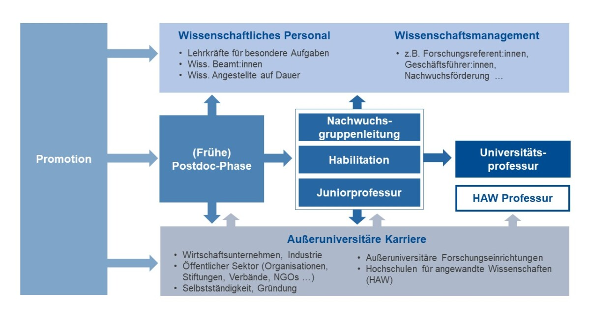
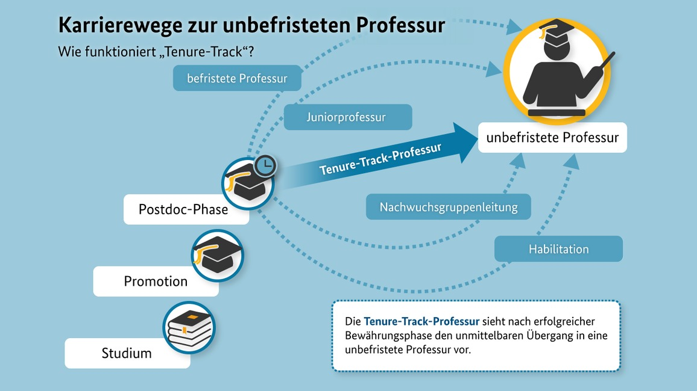

```{r setup, include=FALSE}
options(htmltools.dir.version = FALSE)

library(tidyverse)
library(kableExtra)
library(ggplot2)
library(plotly)
library(htmlwidgets)
library(MASS)
library(ggpubr)
library(xaringanthemer)
library(xaringanExtra)

style_duo_accent(
  primary_color = "#621C37",
    link_color = "#7da5f5",
  secondary_color = "#EE0071",
  background_image = "blank.png"
)

xaringanExtra::use_xaringan_extra(c("tile_view"))

# use_scribble(
#   pen_color = "#EE0071",
#   pen_size = 4
#   )

knitr::opts_chunk$set(
  fig.retina = TRUE,
  warning = FALSE,
  message = FALSE
)
```

name: Title slide
class: middle, left
<br><br><br><br><br><br><br>
# Wissenschaftliches Arbeiten und Forschungsmethoden

### Einheit 12: Das Wissenschaftssystem
##### 28.01.2025 | Dr. Caroline Zygar-Hoffmann

---
class: top, left
name: content

### Heutige Themen

#### [Das Wissenschaftssystem](#wisssys)

#### [Praxis](#praxis)

#### [Lehrevaluation](#eval)

#### [Bericht: Letzte Hinweise](#reminder)

#### [Feedback](#feedback)

#### [Fragen](#fragen)

---
class: top, left
name: wisssys

### Das Wissenschaftssystem

**Der Weg zur Publikation** 

.pull-left[
1) **Auswahl eines Journals** nach thematischer Passung, Länge des Artikels, Qualität des Journals (auch: Unterstützung von Open Science), Augen offen halten für "Call for Papers" zu spezifischem Themen ( $\rightarrow$ "Special Issues" der Journals zu bestimmtem Thema)

2) **Sichtung und Umsetzung der "Author Guidelines"**: Hinweise zu Artikelformaten, geforderten Elementen, Formatierung, Länge, ggf. Verblindung gegenüber Reviewern (d.h. dass im Manuskript nicht kenntlich ist, wer der/die Autor:innen des Artikels sind)

3) **Aufsetzen des "Cover Letters"**: Anschreiben an den Editor mit kurzer Vorstellung des Manuskripts und ggf. ergänzenden Hinweisen
]

.pull-right[
4) **Einreichung im Journal Submission Portal**: Eingabe von Informationen zu Autor:innen, Bestätigung guter wissenschaftlicher Praxis, Hochladen von Dateien, ggf. Vorschlag von Reviewern

5) **Auf die Entscheidung warten (kann sehr unterschiedlich lange dauern)**: 
  * "desk-reject" (direkte Ablehnung durch den Editor, meist innerhalb weniger Tage) oder 
  * "under (peer-)review" (Anzahl an Reviewern unterschiedlich, häufig 2, + meist separates Review durch den Editor, meist innerhalb von mehreren Wochen bis Monaten) 
  * Nach Einreichung / während man auf eine Entscheidung wartet, darf das Manuskript bei keinem anderen Journal zur Begutachtung vorliegen
]

---
class: top, left

### Das Wissenschaftssystem

**Peer-Review**

* Beim peer-review begutachten Wissenschaftler mit Expertise zu der Forschungsarbeit (inhaltlich oder methodisch) das Manuskript

* Entscheidungen nach dem Peer-Review: 
  - Rejection
  - Revise and resubmit: Major revision
  - Revise and resubmit: Minor revision
  - Acceptance pending minor revisions
  - Acceptance

---
class: top, left

### Das Wissenschaftssystem

**Peer-Review**

* Wenn es keine Rejection ist: 
  - Innerhalb einer bestimmten Frist Überarbeitung des Manuskripts $\rightarrow$ Verlängerung der Frist kann beim Editor beantragt werden
  - Darlegung wie auf die Reviews eingegangen wurde im "response letter" (Reviewer-Kommentare Punkt-für-Punkt aufführen und beantworten, d.h. Änderungen darlegen und nachvollziehbar im Manuskript kennzeichnen) 
  - Nach resubmission wird es ggf. nochmal an (meist dieselben) Reviewer geschickt, manchmal entscheidet auch der Editor direkt (eher nur bei minor revisions)

* Bei Annahme des Artikels, ist der Artikel "in press" (d.h. wird für die Veröffentlichung vorbereitet) $\rightarrow$ Korrespondenz mit den "copy editors" des Journals (welche das Manuskript layouten und ggf. sprachlich checken) zur Abstimmung der "Druck"freigabe


---
class: top, left
<div class="footer"><span>Brembs, B., Button, K., & Munafò, M. (2013). Deep impact: unintended consequences of journal rank. Frontiers in human Neuroscience, 291. <br>Fraley, R. C., & Vazire, S. (2014). The N-pact factor: Evaluating the quality of empirical journals with respect to sample size and statistical power. PloS one, 9(10), e109019. <br>Lariviere, V., Kiermer, V., MacCallum, C. J., McNutt, M., Patterson, M., Pulverer, B., Swaminathan, S., u.a. (2016). A simple proposal for the publication of journal citation distributions. bioRxiv, 062109. doi:10.1101/062109 <br>Szucs, D., & Ioannidis, J. P. (2017). Empirical assessment of published effect sizes and power in the recent cognitive neuroscience and psychology literature. PLoS biology, 15(3), e2000797.
</span></div>

### Das Wissenschaftssystem

**Impact Factor und seine Probleme**

.pull-left[
* Impact Factor = jährliche mittlere Anzahl der Zitationen von Aritkeln, die in den letzten 2 Jahren in einem Journal publiziert wurden

* Fraley & Vazire (2014); Szucs & Ioannidis (2017): Höherer JIF hängt mit geringerer statistischer Power/Stichprobengröße der dort publizierten Studien zusammen

* Brembs, Button, & Munafò (2013): Höherer JIF hängt mit einer höheren Rate an Retractions (Zurückziehen eines Artikels) zusammen
]

.pull-right[
```{r eval = TRUE, echo = F}
knitr::include_graphics("bilder/JIF.png")
```
]


---
class: top, left

### Das Wissenschaftssystem

**Konferenzen in der Psychologie**

* Vernetzung unter Kolleg:innen und Austausch zu wissenschaftlichen Ergebnissen

* Häufig mehrere parallele "Sessions", d.h. mehrere parallele Vorträge in unterschiedlichen Räumen

* Häufige Beitragsformen:
  - **Einzel-Vorträge** (meist ca. 10-20 Minuten), d.h. ein alleinstehender Vortrag zu einem Forschungsthema
  - **Beitrag in einem Symposium** (meist ca. 10-20 Minuten), d.h. ein Vortrag der inhaltlich zu anderen Vorträgen passt mit ggf. abschließendem Diskussion der Vorträge durch einen Diskutanten
  - **Keynote-Vortrag** (meist ca. 60 Minuten), d.h. ein zentraler Vortrag während der Konferenz während dem keine anderen Vorträge stattfinden; hierfür wird man angefragt/eingeladen
  - **Poster-Präsentation** (meist ca. 30-60 Minuten), d.h. Ausdruck eines Posters auf DinA0 oder DinA1 auf dem Forschungsergebnisse visualisiert und beschrieben sind, während einem extra Zeitslot während der Konferenz unterhält man sich darüber mit einzelnen Konferenzteilnehmer:innen (die das Poster aufgesucht haben)
  
* Beitragseinreichung in Form eines Abstracts (in anderen Disziplinen sind tlws. ganze Manuskripte üblich)

* Zu inhaltlichen Hinweisen zur Vorbereitung auf eine Konferenz vgl. Kapitel 13.2 in Döring & Bortz (2016)

---
class: top, left
name: wisssys
<div class="footer"><span>https://www.uni-due.de/gcplus/de/doc_karrierewege.php</span></div>

### Das Wissenschaftssystem

**Karrierepfade**

.center[
```{r eval = TRUE, echo = F, out.width="80%"}

```
]

---
class: top, left
<div class="footer"><span>https://www.bmbf.de/bmbf/de/forschung/wissenschaftlicher-nachwuchs/das-tenure-track-programm/das-tenure-track-programm.html</span></div>

### Das Wissenschaftssystem

**Karrierepfade**

.center[
```{r eval = TRUE, echo = F, out.width="75%"}

```
]

---
class: top, left
name: praxis2

### Praxis Teil 2

Sie sollen sich ähnlich dem Peer-Review innerhalb Ihrer Kleingruppe gegenseitig Feedback zu Ihren Texten geben (zumindest zu der Gruppenarbeit).

**Formal**: Korrekte Rechtschreibung, Grammatik, Zeichensetzung? Korrekt zitiert? Statistische Darstellung korrekt? Literaturverzeichnis korrekt?

**Sprachlich-stilistisch**: Ist der Satzbau verständlich? Ist die Formulierung präzise? Ist die Zeitform korrekt? Gibt es unnötige Füllwörter?

**Inhaltlich - unspezifisch**: Ist der rote Faden zu erkennen? Gibt es Überflüssiges? Ist die Darstellung sachlich neutral? Werden Begriffe korrekt eingeführt und erläutert? Ist die Argumentation logisch und nachvollziehbar? Werden Behauptungen belegt? Kann auf Links zum OSF zugegriffen werden? Ist dort alles Geforderte vorhanden? **Verstehen Sie, was Ihr:e Kommilitone:in Ihnen sagen möchte?**

**Inhaltlich - spezifisch**: Nehmen Sie sich den Bewertungsbogen vor: Sind die bewerteten Elemente entsprechend der Beschreibung im Bewertungsbogen vorhanden? 

---
class: top, left
name: praxis

### Praxis

Wie geben Sie das Feedback:

* Sie können das RMarkdown als Word-Dokument "knitten", und dann darin Feedback geben $\rightarrow$ **manueller Übertrag ins RMarkdown nötig** (eine alternative technische Lösung wäre das package *trackdown*: https://cran.r-project.org/web/packages/trackdown/vignettes/trackdown-workflow.html)

* **Geben Sie Ihr Feedback konkret auf einen Absatz/Satz bezogen, mit einem konstruktiven (Alternativ-)Vorschlag**
* **Erklären Sie** warum Sie denken, dass eine Alternative besser wäre / etwas fehlt (z.B. an welcher Stelle Sie als Leser verwirrt wurden, oder Fragen offen blieben, oder warum es missverständlich sein könnte, o.ä.)
* **Bleiben Sie im Ton wertschätzend!** Selbst wenn Ihnen der Text nicht gefällt, steckt Arbeit dahinter. Helfen Sie dabei, wie es Ihr:e Kommilitone:in Ihrer Ansicht nach besser machen kann.

* **Arbeiten Sie vorwiegend mit der Kommentar-Funktion**, und nutzen Sie die Überarbeiten-Funktion von Word direkt im Text z.B. nur für formale Fehler $\rightarrow$ Es ist nicht Ihr Text, sondern der Ihres:r Kommilitonen:in! 

* Wenn Sie als Autor:in des Textes den Vorschlag eines:r Kommilitonen:in nicht annehmen möchten, sprechen Sie das an. **Finden Sie gemeinsam eine Lösung, mit der alle einverstanden sind.**

* Wenn es zu einem Konflikt kommen sollte, melden Sie sich bei mir, und ich helfe.

---
class: top, left
name: eval

### Lehrevaluation

.big[
.center[
**Die Studierenden finden die jeweils individuell freigeschalteten Evaluationen im studynet https://hsf.click/Eval-CFH**
]
]

.center[
```{r eval = TRUE, echo = F, out.width = "80%"}

```
]


---
class: top, left
name: reminder

### Bericht: Letzte Hinweise

* **APA-Zitationsregeln** (Einheit 2, Zusatzmaterial) beachten - sind alle Behauptungen formgerecht belegt? **Literaturverzeichnis manuell durchgehen** und ggf. bibtex anpassen, wo Informationen fehlen!

* **Gruppen mit Interventionsthema**: Nicht vergessen herzuleiten, warum (z.B. durch welchen Mechanismus) anzunehmen ist, dass das gewählte Lied die AV verändert!

* **Präregistrierung nochmal durchgehen** -- alles so gemacht wie beschrieben bzw. Abweichungen gekennzeichnet? Gerade bei übernommenen Textvorlagen von mir bzw. so Themen wie Umgang mit fehlenden Werten, Voraussetzungen, Skalenbildung, Alpha-Niveau;
Aber: **Präregistrierung ist kein Gefängnis! Sie macht Änderungen nur transparent. Ihnen müssen also Änderungen bewusst sein, und Sie müssen diese als Fußnote kommentieren.**

* **Sind alle Variablen, die in irgendeine Analyse eingehen im Methodenteil vollständig beschrieben und (wo passend) in den Deskriptivstatistiken aufgeführt?**

* Sind alle **Tabellen und Abbildungen** beschriftet und im Text referenziert?

* Gibt es im Diskussion **Empfehlungen für zukünftige Forschung**, die über die Beseitigung der Limitationen hinaus gehen? (z.B. weiterführende Forschungsideen)

* **Kausale Sprache** im gesamten Bericht nur dann nutzen, wenn ein experimentelles Design vorliegt (vgl. Einheit 10, Folie 21)

---
class: top, left

### Bericht: Letzte Hinweise

* Zur Erinnerug: Sie müssen im Bericht zwei **Poweranalysen** berichten und gegenüberstellen:

1) Die in der Präregistrierung berichtete Poweranalyse (bei eigenem Thema: Sensitvititäspoweranalyse mit theoretisch erreichbarer Stichprobengröße, Ergebnis: Power; bei Interventionsthema: Poweranalyse zur Stichprobenplanung mit vorgegebener Power, benötigte Ergebnis: Stichprobengröße)

2) Eine Sensitivitätspoweranalyse für tatsächlich erreichte Stichprobengröße für die **in der Präregistrierung angenommene Effektstärke,** ***nicht*** **für die Effektstärke der eigenen Ergebnisse**

* **OSF Projekt** checken:
  - Ansprechpartner hinzugefügt?
  - Präregistrierung als PDF enthalten?
  - Anonymisierte Daten enthalten?
  - Formr Excel-Datei enthalten?
  - Analyse-Skripte enthalten (ggf. pro Person ein Ordner mit eigenen Skripten, falls nicht gemeinsames Skript für alle)?
  - optional für Gruppen mit eigenem Thema: Projekt auf public stellen (Button oben rechts)

* **Inhaltliche und technische Nachvollziehbarkeit der R-Skripte sicherstellen**: Verstehe ich was ich von vorne bis hinten machen muss, um die Ergebnisse zu reproduzieren und wirft R auf dem Weg dorthin keine Fehler?

---
class: top, left

### Bericht: Letzte Hinweise

* **Bewertungsschema vornehmen** und Punkt für Punkt durchgehen

* **Lesen Sie sich die Folien durch!**

* **Rückmeldungen** nicht vergessen! (Einheit 9)

---
class: top, left

### Bericht: Letzte Hinweise

**Abgabe auf studynet (Inhalt -> Mission/Challenges)**

* Abgabetermin ist der **16.08.2024** (23:55)

* Abgabe von:
- Bericht als Word-Dokument mit Link zum OSF-Projekt für anonymisierte Daten und formr-Codebook, Präregistrierung, R-Skripte,
- Rohdaten (nicht-anonymisiert)

* Auf der letzten Seite Ihrer Arbeit:
  - Kennzeichnung, welches Gruppennmitglied welchen Teil der Gruppenarbeit (d.h. von Einleitung und/oder Methode) hauptsächlich übernommen hat.
  - Bestätigung (mit Unterschrift), dass alle Gruppenmitglieder mit dem finalen Ergebnis der Gruppenarbeit einverstanden sind.

---
class: top, left

### Feedback

#### Vermittelte Inhalte
*	Methoden und wissenschaftliche Konzepte für die Erforschung menschlichen Verhaltens und Erlebens
*	Planung und Durchführung wissenschaftlicher Studien 
*	Gütekriterien zur Bewertung von Forschungsdesigns
*	Sicherstellung guter wissenschaftlicher Praxis und Open Science
*	Datenerhebung und Datenanalyse unter Nutzung digitaler Technologien

#### Vermittelte Kompetenzen
*	Anwendung von Begriffen, Methoden und Ergebnissen der qualitativen und quantitativen Forschung in der psychologischen Grundlagen- und Anwendungsforschung
*	Beurteilung von Auswirkungen von Forschungsmethoden auf Untersuchungspopulationen und Anwendung deskriptiver und inferenzstatistischer Methoden sowie weitere statistischer Verfahren zur Auswertung von Ergebnissen
* Planung, Durchführung und Auswertung wissenschaftlicher Untersuchungen
* Einfluss von Projekterfahrungen in die Planung und Durchführung von wissenschaftlichen Studien sowie in die Auswertung und Darstellung von eigenen Forschungsergebnissen

---
class: top, left
name: feedback

### Feedback

* Etwas gerne früher gewusst?

* Deadline Präregistrierung

*	Zusammenspiel mit Seminar

* Zusammenarbeit in Gruppen

* Bewertung Gruppenleistung/Einzelleistung

---
class: top, left
name: fragen

### Fragen

Wie kann ich noch helfen? :)

<!-- library(renderthis) -->
<!-- to_pdf("WissArb_12_FreieSpitze.Rmd", complex_slides = TRUE) -->
