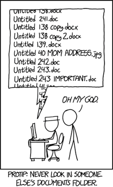
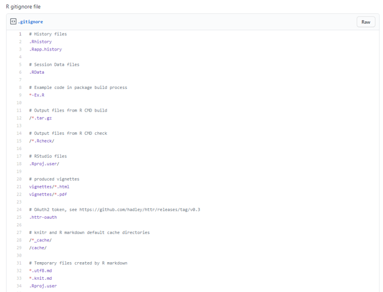

```{r setup, include=FALSE}
options(htmltools.dir.version = FALSE)

library(tidyverse)
library(kableExtra)
library(ggplot2)
library(plotly)
library(htmlwidgets)
library(MASS)
library(ggpubr)
library(xaringanthemer)
library(xaringanExtra)

style_duo_accent(
  primary_color = "#621C37",
  secondary_color = "#EE0071",
  background_image = "blank.png"
)

xaringanExtra::use_xaringan_extra(c("tile_view"))

# use_scribble(
#   pen_color = "#EE0071",
#   pen_size = 4
#   )

knitr::opts_chunk$set(
  fig.retina = TRUE,
  warning = FALSE,
  message = FALSE
)
```

name: Title slide
class: middle, left
<br><br><br><br><br><br><br>
# Wissenschaftliches Arbeiten und Forschungsmethoden

### Einheit 13: Fortgeschrittenes reproduzierbares Arbeiten
##### 25.01.2024 | Dr. Caroline Zygar-Hoffmann

---
class: top, left
name: content

### Heutige Themen

#### [Lehrevaluation](#eval)

#### [Versionierung](#versioning)

#### [Rmarkdown und Websites](#websites)

#### [Praxis](#praxis)

---
class: top, left
name: eval

### Lehrevaluation

.center[
**"Die Studierenden finden die jeweils individuell freigeschalteten Evaluationen im studynet"**

```{r eval = TRUE, echo = F, out.width="80%"}
knitr::include_graphics("bilder/eval.png")
```
]

---
class: top, left
name: versioning
<div class="footer"><span>https://xkcd.com/1459/</span></div>

### Versionierung

**Ziele:**

.pull-left[
* Änderungen nachvollziehen

* flexibel zu früheren Versionen zurückkehren
]

.pull-right[
```{r eval = TRUE, echo = F, out.width = "55%"}

```
]
  
---
class: top, left

### Versionierung

**Git:** 

* kostenlose open source software für (lokale) Versionskontrolle: https://git-scm.com/
* Git kann "alleinstehend" in einem Terminal / Kommandozeile ausgeführt werden, dann hat man aber kein benutzerfreundliches "front-end" bzw. "user interface"
* Git kann auch in R integriert werden, sofern es vorher installiert wurde (Tools -> Global Options -> Git/SVN -> Enable version control)

**GitHub oder GitLab**:

* Bieten Repositorien (bei denen Dateien gespeichert werden können), mit einem front-end, erlauben Kollaboration, beinhalten z.B. auch issue tracker
* GitHub (https://github.com/) gehört zu Microsoft, und ist kommerziell (auch wenn es kostenlose Nutzungsmöglichkeiten gibt)
* GitLab (https://about.gitlab.com/) ist kostenlos und open source, kann auf eigenen Servern gehostet werden (kostenpflichtige Nutzungsmöglichkeit über fremde Server)

**GitHub Desktop**:

* Software die eine Benutzeroberfläche bietet, um Git einfach lokal *oder* mit einem Repositorium zu nutzen

---
class: top, left

### Versionierung

**Grundlegende Befehle in Git**

**Commit**:

* die aktuelle Version ("snapshot") von ausgewählten ("staged") Dateien speichern
* enthält eine "commit message", die beschreibt, welche Änderungen seit dem letzten commit gemacht wurden
* commit-Funktion ist für einfache lokale Versionskontrolle ausreichend: ersetzt manuelles Kopieren und Umbenennen von Dateien um ältere Versionen zu speichern

**Push**: 

* Änderungen auf ein Repositorium hochladen
* Nach einem push kann jeder die Änderungen sehen, der Zugriff auf das Repositorium hat (d.h. z.B. Sie selbst auf einem anderen Computer, Gruppenkolleg:innen, die Welt wenn es ein öffentliches Repositorium ist)
* Kann auch als Backup Maßnahme dienen

**Pull**: 

* die aktuelle Version des Repositoriums herunterladen, um Änderungen von einem anderen Computer oder von Gruppenkolleg:innen lokal zu haben
* wenn eigene lokale Änderungen noch nicht gepusht wurden, erhält man von Git eine Aufforderung das zu tun

Fortgeschrittenere Git-Befehle: **merge**, **pull request**, **branch**

---
class: top, left

### Versionierung

**Git Ignore**

.pull-left[
Git-Projekte beinhalten häufig eine .gitignore Datei, welche Dateien und/oder Ordner spezifiziert, die nicht versionisiert werden sollen.

Beispiele: 
- irrelevante Dateien (z.B. temporäre Dateien in R)
- sensitive Daten (z.B. Zuordnungslisten) 
- große Dateien, die sich normalerweise nicht ändern (z.B. Rohdaten)

Dokumentation: https://git-scm.com/docs/gitignore 
]

.pull-right[
```{r eval = TRUE, echo = F}

```
]

---
class: top, left

### Versionierung

**Sich bei Git identifizieren**

1) Git installieren (https://git-scm.com/)

2) RStudio und Git verbinden über Tools -> Global Options -> Git/SVN

3) Terminal von Rstudio mit Git verbinden über Tools -> Global Options -> Terminal

4) im Terminal von R eintippen: 
  - git config --global user.name "WUNSCHNAME" 
  - git config --global user.email "EMAILADRESSE"

---
class: top, left

### Versionierung

**Git und GitHub verbinden**

* GitHub Konto anlegen
* In RStudio ein "SSH RSA Key" (= ein Passwort) anlegen über Tools -> Global Options -> Git/SVN -> create SSH RSA Key
* In GitHub (im Browser) unter Settings -> SSH Key den Key aus RStudio hinterlegen (Kopieren des Keys über Tools -> Global Options -> Git/SVN -> copy SSH RSA Key)

**GitHub und GitHub Desktop verbinden**

* Einloggen/Sign in (ggf. mit SSH Key)
* Anlegen eines neuen (lokalen) Repositoriums über File -> New repository, dann Option "publish repository" auswählen
* Oder: Ein Repositorium aus dem Internet kopieren ("clone": File -> Clone repository)

---
class: top, left

### Versionierung

**Demo**

* Git in R

* GitHub Desktop

---
class: top, left
name: websites

### Quarto, RMarkdown und Websites

* **Quarto**: aktuelle Weiterentwicklung von RMarkdown, sehr ähnliche Syntax

* Dateiendung .qmd statt .rmd

* Ermöglicht die Erstellung von Websites, auch im Kontext von R
  - Beispiel: https://psycaroly.github.io/prereg1/
  - Generelle Dokumentation: https://quarto.org/docs/websites/

* Wichtige Bestandteile einer Quarto-Website
  - _quarto.yml: Übersicht über den Aufbau der Website ("config file")
  - einzelne qmd- (oder auch rmd-) Dateien mit Inhalten der Website; index.qmd als Startseite

* Schritt 1: Quarto installieren: https://quarto.org/docs/get-started/
* Schritt 2: In RStudio Projekt mit Quarto Website aufrufen über File -> New Project -> Quarto Website

---
class: top, left

### Quarto, RMarkdown und Websites

**Config file**

.pull-left[
* Ausgabeordner "out-dir" festlegen
* Navigation auf der Website festlegen
* Anzuzeigende Seiten festlegen     
  - wenn man eine RMarkdown-Seite statt einer Quarto-Seite anzeigen will, muss man html angeben (siehe test.html im Screenshot) und die geknittete html in den Ausgabeordner kopieren (klassischerweise _docs oder _site)
* "Themes" zur Gestaltung der Website festlegen
* Man kann auch Tools einbinden, z.B. Verlinkungen zu anderen Plattformen wie Twitter/X
* Dokumentation: https://quarto.org/docs/websites/website-navigation.html
]

.pull-right[
```{r eval = TRUE, echo = F, out.width = "55%"}
knitr::include_graphics("bilder/quarto_config.png")
```
]
  
---
class: top, left

### Quarto, RMarkdown und Websites

**Tabs**

`::: panel-tabset :::` in einer Quarto-Datei um Überschriften herum, erstellt "klickbare" Tabs

.pull-left[
```{r eval = TRUE, echo = F}
knitr::include_graphics("bilder/quarto_tabset.png")
```
]

.pull-right[
```{r eval = TRUE, echo = F}
knitr::include_graphics("bilder/quarto_tabset_result.png")
```
]

---
class: top, left

### Quarto, RMarkdown und Websites

**Website betrachten**

* Lokal: In R im "Terminal" folgendes eintippen: `quarto preview` (innerhalb von R ansehen) oder `quarto render` (außerhalb von R ansehen -> im Ausgabeordner die "index.html" öffnen)

* Im Internet:
  - Verschiedene Möglichkeiten: https://quarto.org/docs/publishing/
  - Beispiel GitHub: 
  
  1) Ausgabeordner im config-file auf "docs" festlegen
  
  2) Im RStudio Terminal vom Quarto-Projekt "copy NUL .nojekyll" eintippen
  
  3) Git installieren, sich bei Git über R identifizieren, Git im Projekt aktivieren über Tools -> Project Options -> Version Control, GitHub Konto anlegen
  
  4) Im RStudio Terminal vom Quarto-Projekt erst `quarto render` dann `git push` eintippen
  
  5) Im Browser in GitHub das Repositorium aufrufen, auf "public" stellen und in den Settings -> Pages -> Branch den Ordner "master -> /docs" auswählen
  
---
class: top, left
name: praxis

### Praxis

Die ersten Schritte durchführen, um diese Tools nutzen zu können

**1) Schritt 1:** Git installieren (https://git-scm.com/), mit R verknüpfen und sich identifizieren (siehe Screenshots auf studynet und Folie 8)

**2) Schritt 2:** Auswahl:

**a) GitHub Desktop** herunterladen, lokalen Ordner versionieren, eine Datei ändern, committen, und history anschauen

**b) R-Projekt mit Git** anlegen/verknüpfen, eine R-Datei anlegen, committen, etwas ändern, nochmal comitten und history anschauen

**c) Quarto-Tutorial-Projekt** anlegen und entweder die Tutorial-Website gestalten, oder eine eigene Quarto-Seite (ggf. mit Studiendaten?) anlegen

---
class: top, left

### Einladung zur Podiumsdiskussion an der Bayerischen Akademie der Wissenschaften

Podiumsdiskussion: "Wie robust kann/muss Wissenschaft sein?"

Wann: 06.02.2024 um 18:30
Wo: Bayerische Akademie der Wissenschaften, Alfons-Goppel-Str. 11 (Residenz), 80539 München 

Informationen/Flyer: https://badw.de/veranstaltungen.html?tx_badwdb_events%5Baction%5D=show&tx_badwdb_events%5Bcontroller%5D=Events&tx_badwdb_events%5Bevent_id%5D=889&cHash=9ddaa7eb837e52efafb7c208e8073f5c

Anmeldung: https://meta-rep.de/badw/ 
Live-Stream: https://badw.de

---
class: top, left

### Einladung zur Podiumsdiskussion an der Bayerischen Akademie der Wissenschaften

Podiumsdiskussion: "Wie robust kann/muss Wissenschaft sein?"

Die Sozial-, Verhaltens-, Lebens- und Kognitionswissenschaften sind seit einiger Zeit mit dem Problem konfrontiert, dass wissenschaftliche Ergebnisse häufig wenig robust und wiederholbar sind. Die Auswirkungen von Unsicherheit und Wiederholbarkeit von Forschungsergebnissen auf Fragen der Wissenschaft, Gesellschaft und Öffentlichkeit werden Hauptgegenstand der Diskussion sein: Wie robust können wissenschaftliche Befunde unter den aktuellen Voraussetzungen sein? Wie verlässlich müssen oder sollen Ergebnisse sein, um sie öffentlich zu kommunizieren und gegebenenfalls zum Anlass für gesellschaftliche oder politische Maßnahmen zu machen? Diskutieren werden Vertreterinnen und Vertreter der Wissenschaft, der Forschungsförderung (Deutsche Forschungsgemeinschaft) und der Medien (Süddeutsche Zeitung).

Die Veranstaltung ist öffentlich und richtet sich an Interessierte mit und ohne wissenschaftlichen Hintergrund. Veranstalter sind das junge Kolleg der Bayerischen Akademie der Wissenschaften und das von der Deutschen Forschungsgemeinschaft geförderte Schwerpunktprogramm „META-REP“. Veranstaltungsort ist die Bibliothek der Bayerischen Akademie der Wissenschaften in München (Anmeldung über: https://meta-rep.de/badw). Falls Sie nicht vor Ort sein können, bieten wir einen Live-Stream an, Informationen hierzu finden Sie unter https://badw.de (zum Live-Stream ist keine Anmeldung erforderlich).

<!-- library(renderthis) -->
<!-- to_pdf("WissArb_13_Repro.Rmd", complex_slides = TRUE) -->
