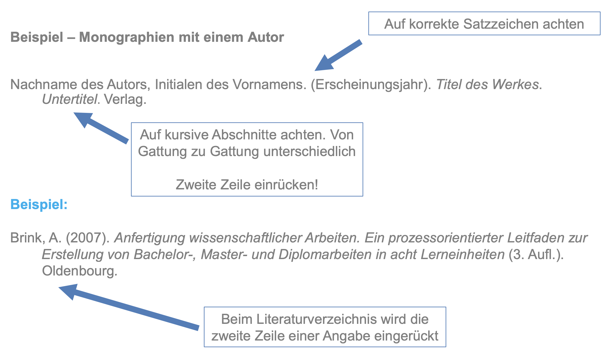
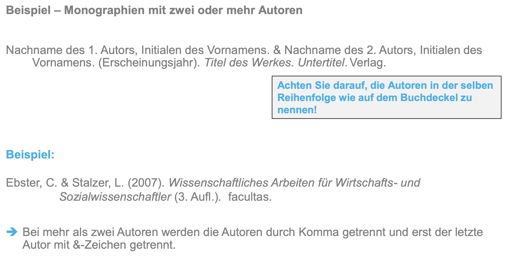
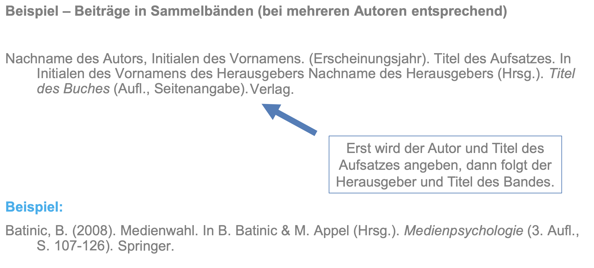
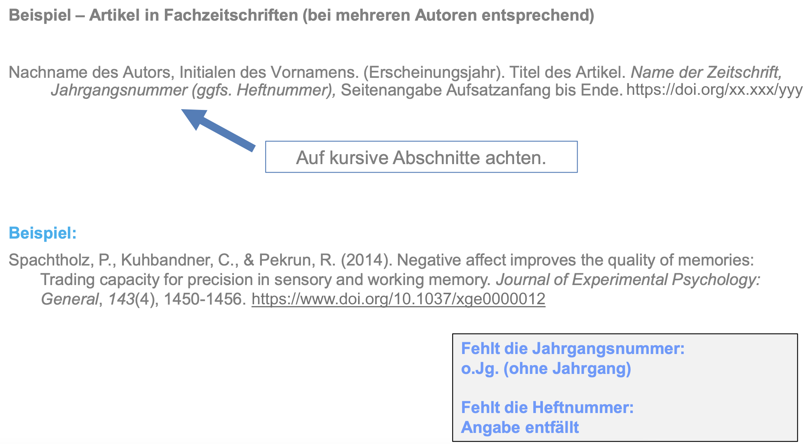

```{r setup, include=FALSE}
options(htmltools.dir.version = FALSE)

library(tidyverse)
library(kableExtra)
library(ggplot2)
library(plotly)
library(htmlwidgets)
library(MASS)
library(ggpubr)
library(xaringanthemer)
library(xaringanExtra)

style_duo_accent(
  primary_color = "#621C37",
  secondary_color = "#EE0071",
  link_color = "#7da5f5",
  background_image = "blank.png"
)

xaringanExtra::use_xaringan_extra(c("tile_view"))

# use_scribble(
#   pen_color = "#EE0071",
#   pen_size = 4
#   )

knitr::opts_chunk$set(
  fig.retina = TRUE,
  warning = FALSE,
  message = FALSE
)
```

name: Title slide
class: middle, left
<br><br><br><br><br><br><br>
# Wissenschaftliches Arbeiten und Forschungsmethoden

### Zusatzmaterial: Zitieren
##### Prof. Dr. Caroline Zygar-Hoffmann

---
class: top, left
name: content

### Inhalt

#### Quellen & Referenzen
* [Funktion und Zitationssysteme](#zit-start)
* [Indrekte vs. direkte Zitate](#zitate)
* [Mehrere Quellen](#mehrere-quellen)
* [Literaturverzeichnis](#lit-verzeichnis)

#### [Take-Aways und Literaturempfehlung](#take-away)

---
class: top, left
name: zit-start

### Quellen & Referenzen

#### Zitationssysteme

In Ihrem Studium ist die in der Psychologie übliche Zitierweise der Deutschen Gesellschaft für Psychologie (DGPs) und der American Psychological Association (APA) verpflichtend:

.center[
```{r eval = TRUE, echo = F, out.width = "18%"}

```
]

Zum vollständigen APA-Style guide: https://apastyle.apa.org

Zum kostenfreien Nachlesen vom APA-Style guide der Purdue University: .small[https://owl.purdue.edu/owl/research_and_citation/apa_style/apa_formatting_and_style_guide/in_text_citations_author_authors.html]

---
class: top, left

### Quellen & Referenzen

#### Zitationssysteme

* Gekürzte Quellenangaben im Haupttext:
  * „Direkte Zitate“: Autorenname(n), Erscheinungsjahr, Seitenangabe 
  * Indirekte Zitate: Autorenname(n), Erscheinungsjahr

* Zitationen können, müssen aber nicht im Fließtext eingebettet werden:
  * Im Fließtext: 
      - 2 Autoren: Wie Müller und Huber (2000) zeigen ...
      - Mehr als 2 Autoren: Wie Müller et al. (2000) zeigen ...
  * Nicht im Fließtext: 
      - 2 Autoren: Folgendes konnte gezeigt werden ... (Müller & Huber, 2000).
      - Mehr als 2 Autoren: Folgendes konnte gezeigt werden ... (Müller et al., 2000).
  * **Man entscheidet sich für eine der beiden Varianten!**
  
* Ausnahme zur "et al."-Regel: Führt dies zu Mehrdeutigkeit (z.B. zwei Quellen mit dem-/derselben ErstautorIn aus demselben Jahr), werden so viele Namen aufgelistet, wie zur Unterscheidung beider Quellen erforderlich ist.

---
class: top, left
name: zitate

### Quellen & Referenzen

#### Indirekte vs. Direkte Zitate

Indirekte Zitate (in Wissenschaft mit Abstand am häufigsten verwendet)

* Gedankengänge anderer Autoren werden sinngemäß übernommen

* Werden regelmäßig eingesetzt

* Stehen ohne Anführungszeichen

* Inhalte bleiben trotz Umformulierung identisch

* Wenn mehrere zusammenhängede Sätze durch dieselbe Quellenangabe belegt werden (so dass man theoretisch hinter jeden Satz die Referenz angeben könnte), reicht es die Quelle einmal am Ende all dieser Sätze anzugeben, solange kein Absatz dazwischen ist (oder eine andere Behauptung mit anderer Quellenangabe) - es muss dann aber semantisch klar werden, dass diese Sätze zusammengehören, d.h. es sollten nicht zuviele verschiedene Themen angesprochen werden; im Zweifelsfall die Quelle wiederholen, wenn es semantisch unklar sein sollte.

* Quellenbeleg: Autor und Erscheinungsjahr

---
class: top, left
### Quellen & Referenzen

#### Indirekte vs. Direkte Zitate

Indirekte Zitate – Beispiel:

Im Alltag müssen wir oft überprüfen, ob beispielsweise ein bestimmtes Objekt einer bestimmten Gruppe zugeordnet werden kann **(Daschmann, 2001)**. Um dieses Urteil fällen zu können, vergleichen wir das Objekt mit dem Prototyp einer Kategorie, mit welchem es die meiste Ähnlichkeit aufweist. Andere validere Informationen werden dabei vernachlässigt **(Werth & Mayer, 2008)**. Dadurch kann es zu Fehlurteilen kommen. Hierzu gehören, dass die summarische Realitätsbeschreibung ignoriert wird, Stichprobengrößen nicht zur Kenntnis genommen und Zufallsverteilungen falsch eingeschätzt werden **(Daschmann, 2001)**. **Kahneman und Tversky (1973)** konnten diese Phänomene nachweisen, während die Studie von **Müller et al. (1980)** gegenteilige Ergebnisse zeigte.

---
class: top, left
### Quellen & Referenzen

#### Indirekte vs. Direkte Zitate

Direkte Zitate

* Wortwörtliche Übernahme

* Sparsame Verwendung (sonst ist es nur abschreiben)

* Stehen (meist) in Anführungszeichen

* Quellenbeleg: Autor, Erscheinungsjahr **und Seitenzahl** der übernommen Stelle

---
class: top, left
### Quellen & Referenzen

#### Indirekte vs. Direkte Zitate

Direkte Zitate - Beispiel 

* Ein Satz

„Ein Experiment beginnt – wie andere wissenschaftliche Untersuchungen auch – im Allgemeinen mit einer Fragestellung“ **(Beck, 2009, S. 81)**.

* Einleitung durch einen Doppelpunkt

**Beck (2009)** meint dazu: „Ein Experiment beginnt – wie andere wissenschaftliche
Untersuchungen auch – im allgemeinen mit einer Fragestellung“ **(S. 81)**. 

* Syntaktische Verschmelzung mit einem Satz

Bezüglich eines Experiments stellt **Beck (2009)** fest, dass es „(...) im allgemeinen mit einer Fragestellung [beginnt]“ **(S. 81)**.

* Auf englisch "p." (für *page*) statt "S."

---
class: top, left
name: mehrere-quellen

### Quellen & Referenzen

#### Mehrere Quellen für die selbe Aussage

* Mehrere Quellen werden durch Strichpunkt getrennt (für jede Quelle muss ein Eintrag im Literaturverzeichnis vorhanden sein!)

* Z.B. wenn man zum Ausdruck bringen möchte, dass ein Befund gut belegt ist:

Conscientiousness was also found to be inversely associated with impulsiveness **(Mowen, 2000; Rocas, Sagiv, Schwartz, & Knafo, 2002)**


#### Mehrere Quellen des selben Autors

* Hat ein Autor mehrere Quellen in einem Jahr veröffentlicht, unterscheidet man die Quellen durch den Zusatz von „a“, „b“, ...bei der Jahresangabe

**(Müller, 2000a, S. 5.; Müller, 2000b, S. 25)**.

* Gilt sowohl bei direkten als auch bei indirekten Zitaten

* Die Reihenfolge der Nummerierung richten sich alphabetisch nach dem Titel der Quelle.

---
class: top, left
name: mehrere-quellen

### Quellen & Referenzen

#### Autoren mit dem gleichen Familiennamen

Der Anfangsbuchstabe des Vornamen wird vorangestellt: 

In einigen Studien **(J. Müller, 2010; K. Müller, 2009)** ...

#### Weitere Besonderheiten (z.B. sehr lange direkte Zitate)

Im Zweifelsfall im APA-Manual nachschauen!

---
class: top, left
name: lit-verzeichnis

### Quellen & Referenzen

#### Literaturverzeichnis

Das Literaturverzeichnis....
* Folgt in der Regel unmittelbar auf den Textteil einer Arbeit

* **Alle im Fließtext verwendeten Quellen müssen hier lückenlos dokumentiert werden (und auch nur diese!)**

* Reihenfolge: Alphabetisch nach Nachname des (Erst-) Autors, dann nach Jahreszahl (frühere Artikel desselben Autors vor späteren Artikeln, aber "nothing precedes something", d.h. Artikel mit weniger Co-Autoren vor Artikeln mit mehr Co-Autoren)

* Arten von Quellen werden im Literaturverzeichnis *nicht* anhand unterschiedlicher Abschnitte differenziert (also nicht alle Journalartikel aufführen, dann alle Internetquellen, dann alle Fachbücher)

* Akademische Grade und berufliche Titel der Autoren werden nicht angegeben

* "hängend" formatieren (Einrückung in der zweiten Zeile)

---
class: top, left
### Quellen & Referenzen

#### Literaturverzeichnis

Allgemeine Inhalte der Quellenangabe im Literaturverzeichnis

* Vorname (Initiale) und Zuname des Autors / der Autoren (i.d.R. werden hier alle angegeben, außer es sind mehr als 20)

* Erscheinungsjahr

* Titel der Quelle

* Ggf. Auflage (erst ab der 2. Auflage!): in runden Klammern hinter dem Titel (nicht kursiv)

* Angaben zur eindeutigen Identifikation der Quelle je nach Art der Quelle (Zeitschriftenname / URL / ...) $\rightarrow$ Hier unterscheiden sich die Angaben je nach Literaturgattung (also Paper, Monographien, Sammelbänder, etc.)

* ggf. doi falls vorhanden (prüfen!), als letzte Angabe: https://doi.org/xx.xxx/yyy

---
class: top, left
### Quellen & Referenzen

#### Literaturverzeichnis

.center[
```{r eval = TRUE, echo = F, out.width = "800px"}

```
]

---
class: top, left
### Quellen & Referenzen

#### Literaturverzeichnis

.center[
```{r eval = TRUE, echo = F, out.width = "900px"}

```
]

---
class: top, left
### Quellen & Referenzen

#### Literaturverzeichnis

.center[
```{r eval = TRUE, echo = F, out.width = "900px"}

```
]

---
class: top, left
### Quellen & Referenzen

#### Literaturverzeichnis

.center[
```{r eval = TRUE, echo = F, out.width = "800px"}

```
]

---
class: top, left
name: take-away

### Take-Aways

.full-width[.content-box-gray[

* Konsequentes Zitieren ist essentiell und folgt bestimmten Formatierungsregeln

* Man unterscheidet indirekte und direkte Zitate

* Man baut die Quellenangabe entweder direkt in den Fließtext ein **oder** stellt sie komplett in Klammern an das Ende des betroffenen Fließtext

* Quellenangaben für direkte Zitate im Text benötigen zusätzlich zu Autor(en) und Erscheinungsjahr die Angabe der Seitenzahl

* Alle im Haupttext genannten Quellen müssen im Literaturverzeichnis vorkommen

* Die Angaben im Literaturverzeichnis müssen nach den APA-Richtlinien vollständig sein. Es reicht nie Autor + Jahr + Titel
  - das mindeste ist noch eine URL (bei einer reinen Internetquelle) oder die Angabe das Publikationsformats (z.B. *Dissertation* bei einer Doktorarbeit)
  - das häufigste ist noch Journaltitel, ggf. Heftnummer, Seitenangaben und ggf. doi (bei einem Paper)

]
]

**[zurück zum Inhalt $\rightarrow$](#content)** 

---
class: top, left
### Literaturempfehlung

.center[
```{r, echo=FALSE,out.width="30%",fig.cap="Kapitel 1.2, 5 und 6 in Döring, N. & Bortz, J. (2016). Forschungsmethoden und Evaluation in den Sozial- und Humanwissenschaften. Pearson.",fig.show='hold',fig.align='center'}
knitr::include_graphics("bilder/doering.png")
``` 
]

<!-- library(renderthis) -->
<!-- to_pdf("WissArb_Z3_Zitieren.Rmd", complex_slides = TRUE) -->
