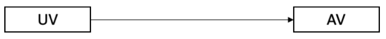
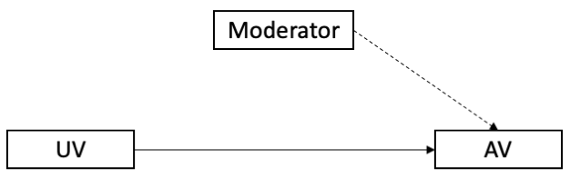
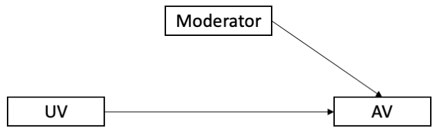
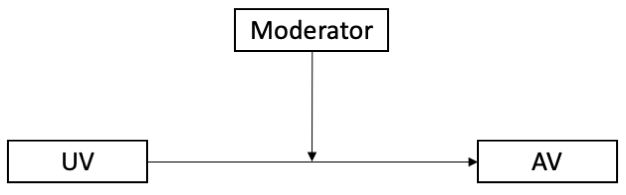
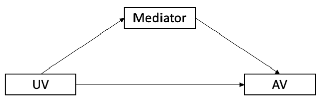

```{r setup, include=FALSE}
options(htmltools.dir.version = FALSE)

library(tidyverse)
library(kableExtra)
library(ggplot2)
library(plotly)
library(htmlwidgets)
library(MASS)
library(ggpubr)
library(xaringanthemer)
library(xaringanExtra)

style_duo_accent(
  primary_color = "#621C37",
  secondary_color = "#EE0071",
  link_color = "#7da5f5",
  background_image = "blank.png"
)

xaringanExtra::use_xaringan_extra(c("tile_view"))

# use_scribble(
#   pen_color = "#EE0071",
#   pen_size = 4
#   )

knitr::opts_chunk$set(
  fig.retina = TRUE,
  warning = FALSE,
  message = FALSE
)
```

name: Title slide
class: middle, left
<br><br><br><br><br><br><br>
# Wissenschaftliches Arbeiten und Forschungsmethoden

### Zusatzmaterial: Variablen
##### Prof. Dr. Caroline Zygar-Hoffmann

---
class: top, left
### Variablen

#### Abhängige & unabhängige Variable (AV & UV)

Die Veränderung einer AV soll durch den Einfluss der UV erklärt werden.

**Beispiel:**

.center[

Dosis des Schlafmittel (**UV**) $\rightarrow$ Schlafdauer (**AV**) 

$\downarrow$

**UV** gehört zum „Wenn-Teil“ bzw. dem „Je-Teil“ einer Hypothese

**AV** gehört zum „Dann-Teil“ bzw. „Desto-Teil“

$\downarrow$

Wenn man mehr Schlafmittel nimmt, schläft man länger.
]

.center[
```{r eval = TRUE, echo = F, out.width = "500px"}

```
]

---
class: top, left
### Variablen

#### Kriterium/Outcome & Prädiktor

* Analog zu AV (Kriterium/Outcome) und UV (Prädiktor), nur dass die Begriffe im Rahmen von korrelativen Designs üblicher sind

* Kriterien/Outcomes stehen links in der Regressionsgleichung, Prädiktoren rechts, z.B. 

* als Gleichung: $y = x_1 + x_2$

* in R: 
```{r include = TRUE, eval = FALSE}
lm(Outcome ~ Prädiktor1 + Prädiktor2)
```

**Beispiel:**

Vorhersage von Schlafdauer (Kriterium oder Outcome) durch andere (nicht manipulierte, sondern nur gemessene) Variable(n) (Prädiktor(en)), wie Schlafmittel, Stress und/oder Anzahl an Kindern im Haushalt.

---
class: top, left
### Variablen

#### Störvariable

* alle Einflussgrößen auf die AV, die in einer Untersuchung nicht erfasst werden 

* egal ob nicht bekannt oder vergessen

* in der Präregistrierung werden nur die Störvariablen aufgeführt, für die man statistisch kontrollieren möchte ("Kontrollvariable / Kovariate", siehe nächste Folie)

.center[
```{r eval = TRUE, echo = F, out.width = "500px"}

```
]
---
class: top, left
### Variablen

#### Kontrollvariable / Kovariate

* Störvariable deren Ausprägungen erhoben (gemessen) wurde 

* Einfluss kann kontrolliert wird (z.B. mittels statistischer Methoden, z.B. Aufnahme in Regression) 

* Inhaltliche Begründung (Literatur!) zur Aufnahme einer Kovariate

* Im Regressionsmodell mit inhaltlichem Prädiktor X1 und Kontrollvariable X2: Schätzung des Effekts von X1 auf Y bei Konstanthaltung des Effekts von X2 ("Kontrolle für den Einfluss von X2")

.center[
```{r eval = TRUE, echo = F, out.width = "500px"}

```
]
---
class: top, left
### Variablen

#### Moderatorvariable

* **Moderator** verändert den Einfluss der UV auf die AV

* Moderationsanalyse prüft Interaktionen

* Frage: Variiert der Effekt von UV auf AV in Abhängigkeit einer weiteren Variable

**Beispiel:**

Schlafmitteldosis (**UV**) erhöht die Schlafdauer (**AV**); Straßenlärm (**Moderator**) verringert den Effekt der Dosis auf die **AV**

.center[
```{r eval = TRUE, echo = F, out.width = "500px"}

```
]
---
class: top, left
### Variablen

#### Mediatorvariable

.pull-left[
Ein **Mediator** vermittelt (**mediiert**) den Einfluss der **UV** auf die **AV**

**Beispiel:** Schulnote (**UV**) beeinflusst Selbstwertgefühl (**Mediator**); Selbstwertgefühl (**Mediator**) beeinflusst Lebenszufriedenheit (**AV**)
]

.pull-right[
```{r eval = TRUE, echo = F, out.width = "500px"}

```
]

* Wenn Sie in dem Projekt zu dieser Vorlesung nicht explizit eine statistische Mediation überprüfen wollen (was Sie mit Ihrem Ansprechpartner absprechen sollten), dann sind Mediatorvariablen für Sie vmtl. nicht relevant

* Ausblick: Wichtige Begriffe im Rahmen einer statistischen Mediation
  * **Indirekter Effekt:**  **UV ** beeinflusst  **Mediator**, dies führt zur einem Effekt des  **Mediators ** auf **AV **
  * **Direkter Effekt:** Effekt von **UV** auf **AV** (in Anwesenheit des Mediators)
  * **Keine Mediation:** indirekter Effekt nicht signifikant
  * **Partielle Mediation:** indirekter Effekt signifikant und direkter Effekt auch signifikant
  * **Totale Mediation:** indirekter Effekt signifikant und direkter Effekt nicht mehr signifikant


<!-- library(renderthis) -->
<!-- to_pdf("WissArb_Z4_Variablen.Rmd", complex_slides = TRUE) -->
